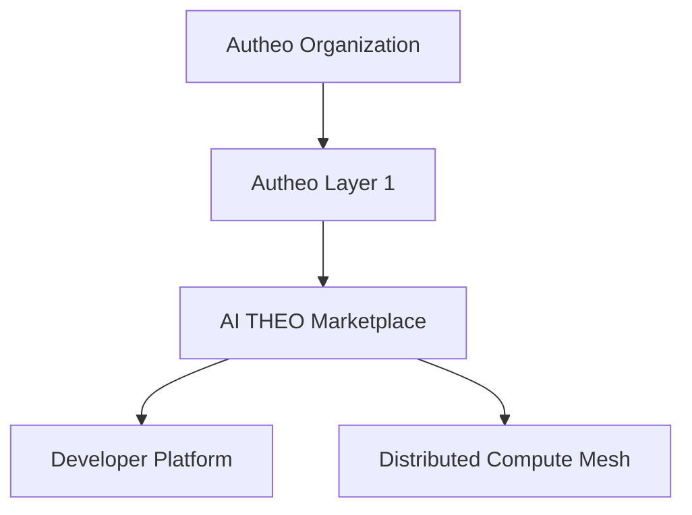

# Platform Overview

This shouldn't be a technical document.

It should answer

> **"What exactly is AI THEO?"**

This is almost like the front page of AWS documentation.

---

# AI THEO Platform

## Building the Internet's Distributed Cloud

---

# Overview

Traditional cloud platforms are built around centralized infrastructure.

Organizations rent compute, storage, networking, databases, and AI services from large hyperscale data centers operated by a handful of providers.

AI THEO takes a fundamentally different approach.

Rather than concentrating infrastructure into massive facilities, AI THEO enables anyone—from individuals and startups to enterprises and cloud providers—to contribute computing resources into a secure global marketplace. Those independently operated resources form a unified distributed cloud capable of running applications, AI workloads, storage services, networking, and edge infrastructure.

The result is a platform that combines the flexibility of public cloud computing with the resilience, ownership, and locality of decentralized infrastructure.

---

# Platform Philosophy

```text
                 Traditional Cloud

Applications

        │

Hyperscaler

        │

Massive Datacenter

        │

Thousands of Servers

──────────────────────────────────────

              AI THEO

Applications

        │

Developer Platform

        │

Marketplace

        │

Distributed Compute Mesh

        │

Millions of Independent Nodes
```

Instead of asking:

> *Where is the nearest cloud region?*

AI THEO asks:

> *What resources already exist nearby?*

Every office server.

Every GPU workstation.

Every enterprise datacenter.

Every edge gateway.

Every university cluster.

Every home lab.

Can become part of the distributed cloud.

---

# Four Independent Products

The platform is intentionally divided into four independent systems.

Each solves a different problem.



Each product evolves independently while interoperating through stable interfaces.

---

# 1. Autheo Organization

The organization stewards the ecosystem.

Responsibilities include:

* Protocol stewardship
* Long-term roadmap
* Ecosystem grants
* Standards
* Governance
* Community development
* Treasury oversight
* Strategic partnerships

Importantly:

The organization does **not** operate customer infrastructure.

Instead, it develops and maintains the protocols that enable an open ecosystem.

---

# 2. Autheo Layer 1

The blockchain provides trust.

Not compute.

Its responsibilities include:

* Identity
* Smart contracts
* Settlement
* Staking
* Governance
* Auditing
* Payments
* Asset ownership
* Reputation anchoring

Applications are generally **not executed directly on-chain**. Instead, the blockchain acts as the cryptographic trust layer that coordinates economic activity across the platform.

---

# 3. AI THEO Compute Marketplace

The marketplace serves as the platform's global control plane.

Its responsibilities include:

* Resource discovery
* Workload scheduling
* Marketplace matching
* Capacity planning
* Pricing
* Billing
* Reputation
* Service-level policies
* Monitoring
* Multi-region orchestration

The marketplace determines **where workloads should execute**, but does not execute them itself.

---

# 4. Distributed Compute Mesh

The compute mesh is the execution layer.

It consists of independently operated nodes contributing:

* CPU compute
* GPU compute
* Storage
* Networking
* AI inference
* Serverless functions
* Containers
* Databases
* Object storage
* Content delivery

Rather than relying on a handful of hyperscale regions, workloads execute wherever resources are available and appropriate.

---

# 5. Developer Platform

Developers interact with AI THEO through a modern cloud-native experience.

Capabilities include:

* CLI
* SDKs
* REST APIs
* Templates
* Deployment pipelines
* Marketplace publishing
* Monitoring
* Logs
* Metrics
* Billing dashboards

From the developer's perspective, deploying to AI THEO should feel as simple as deploying to Vercel, Fly.io, or AWS—while the platform transparently handles decentralized scheduling and execution.

---

# How Everything Fits Together

```mermaid
flowchart LR

Developer

-->

Developer Platform

-->

Marketplace

-->

Compute Mesh

-->

Users

Marketplace

<-->

Layer 1

Layer 1

<-->

Organization
```

Each layer has a distinct responsibility:

* **Organization** governs the ecosystem.
* **Layer 1** establishes trust and economic coordination.
* **Marketplace** coordinates workloads and resources.
* **Compute Mesh** executes workloads.
* **Developer Platform** provides the user experience.

This separation of concerns allows each component to evolve independently while maintaining a cohesive platform.

---

# Why This Architecture Matters

Most decentralized platforms begin with a blockchain and attempt to build applications around it.

AI THEO begins with the applications developers want to build—web services, AI inference, storage, databases, multiplayer games, APIs, and enterprise software—and uses decentralized technologies only where they provide clear value.

This architecture offers several advantages:

| Traditional Model                         | AI THEO Model                                                     |
| ----------------------------------------- | ----------------------------------------------------------------- |
| Centralized infrastructure                | Distributed resource marketplace                                  |
| Fixed cloud regions                       | Global edge-first compute mesh                                    |
| Cloud provider owns infrastructure        | Infrastructure owned by participants                              |
| Applications tied to one provider         | Portable across heterogeneous nodes                               |
| Limited hardware diversity                | CPUs, GPUs, edge devices, servers, home labs, enterprise clusters |
| Blockchain used for application execution | Blockchain used for trust, settlement, and governance             |

---

## One recommendation I'd make

I actually think **"AI THEO" is becoming the flagship product**, while **Autheo** becomes the ecosystem brand.

So in the docs, the hierarchy naturally reads as:

* **Autheo** → Ecosystem

  * **Autheo Layer 1**
  * **AUTHEO Compute Marketplace**
  * **AUTHEO Developer Platform**
  * **AUTHEO Distributed Mesh**
  * Future products...

That branding mirrors successful ecosystems like:

* Amazon → AWS → EC2 / S3 / Lambda
* Google → Google Cloud → GKE / BigQuery / Cloud Run
* Microsoft → Azure → AKS / Cosmos DB / Functions

It gives you room to expand the platform over time while keeping the product family coherent.
