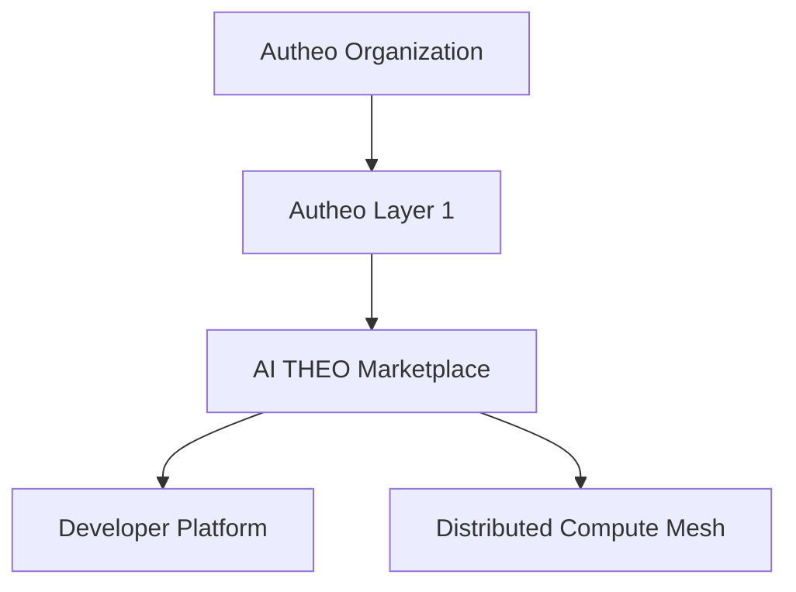
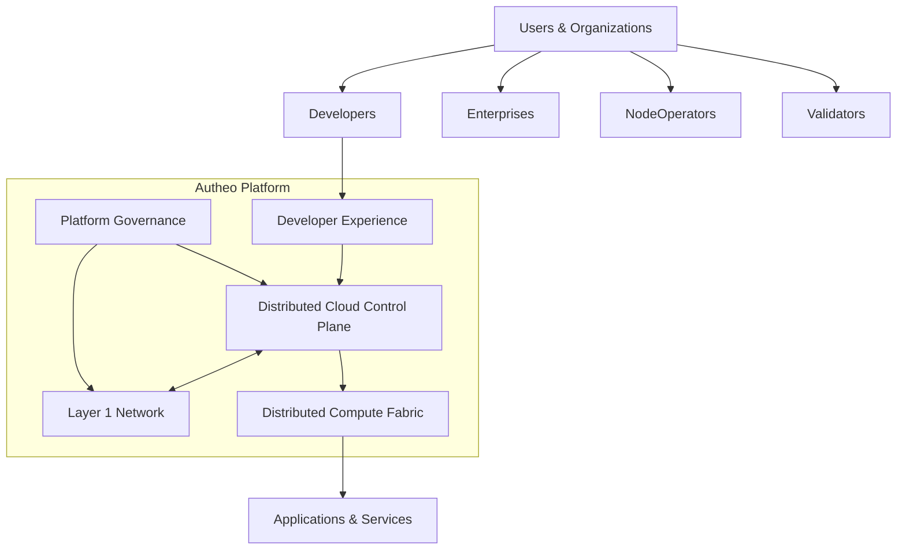

# Platform Overview

This shouldn't be a technical document.

It should answer

> **"What exactly is AI THEO?"**

This is almost like the front page of AWS documentation.

---

# AI THEO Platform

## Building the Internet's Distributed Cloud

---

# Overview

Traditional cloud platforms are built around centralized infrastructure.

Organizations rent compute, storage, networking, databases, and AI services from large hyperscale data centers operated by a handful of providers.

AI THEO takes a fundamentally different approach.

Rather than concentrating infrastructure into massive facilities, AI THEO enables anyone—from individuals and startups to enterprises and cloud providers—to contribute computing resources into a secure global marketplace. Those independently operated resources form a unified distributed cloud capable of running applications, AI workloads, storage services, networking, and edge infrastructure.

The result is a platform that combines the flexibility of public cloud computing with the resilience, ownership, and locality of decentralized infrastructure.

---

# Platform Philosophy

```text
                 Traditional Cloud

Applications

        │

Hyperscaler

        │

Massive Datacenter

        │

Thousands of Servers

──────────────────────────────────────

              AI THEO

Applications

        │

Developer Platform

        │

Marketplace

        │

Distributed Compute Mesh

        │

Millions of Independent Nodes
```

Instead of asking:

> *Where is the nearest cloud region?*

AI THEO asks:

> *What resources already exist nearby?*

Every office server.

Every GPU workstation.

Every enterprise datacenter.

Every edge gateway.

Every university cluster.

Every home lab.

Can become part of the distributed cloud.

---

# Four Independent Products

The platform is intentionally divided into four independent systems.

Each solves a different problem.



Each product evolves independently while interoperating through stable interfaces.

---

# 1. Autheo Organization

The organization stewards the ecosystem.

Responsibilities include:

* Protocol stewardship
* Long-term roadmap
* Ecosystem grants
* Standards
* Governance
* Community development
* Treasury oversight
* Strategic partnerships

Importantly:

The organization does **not** operate customer infrastructure.

Instead, it develops and maintains the protocols that enable an open ecosystem.

---

# 2. Autheo Layer 1

The blockchain provides trust.

Not compute.

Its responsibilities include:

* Identity
* Smart contracts
* Settlement
* Staking
* Governance
* Auditing
* Payments
* Asset ownership
* Reputation anchoring

Applications are generally **not executed directly on-chain**. Instead, the blockchain acts as the cryptographic trust layer that coordinates economic activity across the platform.

---

# 3. AI THEO Compute Marketplace

The marketplace serves as the platform's global control plane.

Its responsibilities include:

* Resource discovery
* Workload scheduling
* Marketplace matching
* Capacity planning
* Pricing
* Billing
* Reputation
* Service-level policies
* Monitoring
* Multi-region orchestration

The marketplace determines **where workloads should execute**, but does not execute them itself.

---

# 4. Distributed Compute Mesh

The compute mesh is the execution layer.

It consists of independently operated nodes contributing:

* CPU compute
* GPU compute
* Storage
* Networking
* AI inference
* Serverless functions
* Containers
* Databases
* Object storage
* Content delivery

Rather than relying on a handful of hyperscale regions, workloads execute wherever resources are available and appropriate.

---

# 5. Developer Platform

Developers interact with AI THEO through a modern cloud-native experience.

Capabilities include:

* CLI
* SDKs
* REST APIs
* Templates
* Deployment pipelines
* Marketplace publishing
* Monitoring
* Logs
* Metrics
* Billing dashboards

From the developer's perspective, deploying to AI THEO should feel as simple as deploying to Vercel, Fly.io, or AWS—while the platform transparently handles decentralized scheduling and execution.

---

# How Everything Fits Together

```mermaid
flowchart LR

Developer

-->

Developer Platform

-->

Marketplace

-->

Compute Mesh

-->

Users

Marketplace

<-->

Layer 1

Layer 1

<-->

Organization
```

Each layer has a distinct responsibility:

* **Organization** governs the ecosystem.
* **Layer 1** establishes trust and economic coordination.
* **Marketplace** coordinates workloads and resources.
* **Compute Mesh** executes workloads.
* **Developer Platform** provides the user experience.

This separation of concerns allows each component to evolve independently while maintaining a cohesive platform.

---

# Why This Architecture Matters

Most decentralized platforms begin with a blockchain and attempt to build applications around it.

AI THEO begins with the applications developers want to build—web services, AI inference, storage, databases, multiplayer games, APIs, and enterprise software—and uses decentralized technologies only where they provide clear value.

This architecture offers several advantages:

| Traditional Model                         | AI THEO Model                                                     |
| ----------------------------------------- | ----------------------------------------------------------------- |
| Centralized infrastructure                | Distributed resource marketplace                                  |
| Fixed cloud regions                       | Global edge-first compute mesh                                    |
| Cloud provider owns infrastructure        | Infrastructure owned by participants                              |
| Applications tied to one provider         | Portable across heterogeneous nodes                               |
| Limited hardware diversity                | CPUs, GPUs, edge devices, servers, home labs, enterprise clusters |
| Blockchain used for application execution | Blockchain used for trust, settlement, and governance             |

---

## One recommendation I'd make

I actually think **"AI THEO" is becoming the flagship product**, while **Autheo** becomes the ecosystem brand.

So in the docs, the hierarchy naturally reads as:

* **Autheo** → Ecosystem

  * **Autheo Layer 1**
  * **AUTHEO Compute Marketplace**
  * **AUTHEO Developer Platform**
  * **AUTHEO Distributed Mesh**
  * Future products...

That branding mirrors successful ecosystems like:

* Amazon → AWS → EC2 / S3 / Lambda
* Google → Google Cloud → GKE / BigQuery / Cloud Run
* Microsoft → Azure → AKS / Cosmos DB / Functions

It gives you room to expand the platform over time while keeping the product family coherent.


I actually think **that's the stronger branding decision.**

Keeping **Autheo** as the umbrella platform makes it feel much more like **AWS**, **Azure**, **Google Cloud**, or **Cloudflare** rather than a collection of unrelated products.

I would stop thinking of them as "products" and instead think of them as **platform pillars**.

AWS doesn't market EC2, S3, and Lambda as separate companies—they're services within one cloud platform. I think Autheo should follow that same philosophy.

---

# Autheo Platform Architecture

## Platform Overview

---

# Building the Distributed Internet Cloud

Autheo is a distributed cloud platform that enables developers, enterprises, infrastructure providers, and communities to collectively build and operate the next generation of Internet infrastructure.

Unlike traditional hyperscalers, which centralize compute into massive regional data centers, Autheo coordinates independently owned infrastructure through open protocols, cryptographic trust, and intelligent workload scheduling.

The result is a cloud platform that combines the scalability of hyperscale computing with the locality, resilience, and ownership benefits of decentralized infrastructure.

The platform is organized into four core platform pillars, each responsible for a distinct aspect of the ecosystem.

---

# Platform Architecture



One platform.

Clearly separated responsibilities.

Loosely coupled systems.

---

# Platform Design Principles

Autheo is designed around a small number of architectural principles that influence every component of the ecosystem.

## Separation of Responsibility

Every subsystem has a clearly defined purpose.

The blockchain establishes trust.

The marketplace coordinates infrastructure.

The mesh executes workloads.

The developer platform provides the deployment experience.

No subsystem attempts to perform every function.

This separation allows each component to evolve independently without disrupting the rest of the platform.

---

## Open Infrastructure

Autheo does not own the Internet.

It enables others to contribute to it.

Infrastructure can be contributed by:

* Enterprises
* Universities
* Cloud providers
* Independent operators
* Home laboratories
* Telecommunications providers
* Edge infrastructure providers
* GPU farms
* Hosting companies

The platform grows by expanding participation rather than constructing centralized infrastructure.

---

## Edge-First Architecture

Applications should execute as close to users as practical.

Instead of routing every request through a distant cloud region, Autheo attempts to utilize nearby resources whenever possible.

```text
Traditional Cloud

User

↓

Regional Datacenter

↓

Application


Autheo

User

↓

Local Edge Cluster

↓

Regional Mesh

↓

Global Mesh (only if needed)
```

Locality improves:

* Latency
* Reliability
* Bandwidth efficiency
* Privacy
* Infrastructure utilization

---

# The Four Platform Pillars

---

# 1. Platform Governance

Platform Governance is responsible for the long-term stewardship of the Autheo ecosystem.

Unlike operational infrastructure, governance does not participate in application execution.

Instead, it defines the policies and standards that enable long-term platform stability.

Responsibilities include:

* Protocol evolution
* Technical standards
* Ecosystem funding
* Community governance
* Strategic partnerships
* Treasury management
* Reference implementations
* Long-term roadmap

Governance establishes direction.

It does not operate customer workloads.

---

# 2. Layer 1 Network

The Layer 1 blockchain provides the platform's cryptographic trust layer.

Rather than functioning as the primary execution environment, the blockchain establishes shared trust between otherwise independent infrastructure providers.

Core responsibilities include:

* Decentralized identity
* Validator consensus
* Smart contracts
* Settlement
* Staking
* Governance voting
* Marketplace payments
* Immutable audit trails
* Resource ownership

The Layer 1 network is intentionally isolated from application execution.

Its purpose is to establish trust—not to become another hyperscaler.

---

# 3. Distributed Cloud Platform

The Distributed Cloud Platform serves as Autheo's operational control plane.

It continuously evaluates available infrastructure across the network and determines where workloads should execute.

Core capabilities include:

* Resource discovery
* Capacity management
* Intelligent scheduling
* Geographic optimization
* Pricing
* Billing
* Marketplace matching
* Reputation
* Enterprise policy enforcement
* Health monitoring

The control plane coordinates infrastructure without becoming part of the application's data path.

---

# 4. Distributed Compute Fabric

The Compute Fabric represents the actual cloud.

It consists of millions of independently owned resources operating together through common protocols.

```mermaid
flowchart LR

Office

---

Factory

---

GPU Cluster

---

Home Lab

---

University

---

Datacenter

---

Cloud VM
```

Every node contributes capabilities.

Some provide:

* CPU compute

Others provide:

* GPUs

Others provide:

* Object storage

Others provide:

* AI inference

Others provide:

* Networking

Together they form one logical cloud.

---

# Developer Experience

Developers should never need to understand the complexity of the underlying infrastructure.

From their perspective deployment should feel familiar.

```text
autheo deploy

↓

Application Built

↓

Resources Selected

↓

Secure Deployment

↓

Global Endpoint Available
```

The complexity remains inside the platform.

Developers interact with a straightforward cloud-native workflow.

---

# Service-Oriented Platform

Rather than exposing infrastructure directly, Autheo exposes services.

Future platform services may include:

```text
Autheo Compute

Autheo Storage

Autheo Databases

Autheo AI

Autheo Functions

Autheo Networking

Autheo Identity

Autheo Secrets

Autheo Messaging

Autheo Containers

Autheo Kubernetes

Autheo CDN

Autheo Edge

Autheo Observability
```

Each service builds upon the common distributed infrastructure while presenting a consistent developer experience.

---

# Platform Dependency Model

One of the defining characteristics of the platform is that dependencies flow in only one direction.

```mermaid
flowchart TD

Governance

↓

Layer 1

↓

Platform Services

↓

Developer Platform

↓

Applications

↓

Users
```

Higher-level services depend on lower layers.

Lower layers remain independent of application logic.

This minimizes coupling and improves maintainability.

---

# A Cloud Platform, Not a Blockchain

One of the most important distinctions is that Autheo is not positioned as a blockchain with additional features.

Instead, it is a distributed cloud platform that incorporates blockchain where cryptographic trust provides value.

```text
Traditional Blockchain

Consensus

↓

Smart Contracts

↓

Applications


Autheo

Trust Layer

↓

Cloud Platform

↓

Marketplace

↓

Compute Fabric

↓

Applications
```

Applications execute on distributed infrastructure.

The blockchain establishes trust between participants.

---

# Long-Term Vision

The long-term objective of Autheo is not simply to create another decentralized network.

It is to establish an open, programmable cloud platform where infrastructure ownership is distributed, application deployment is frictionless, and compute resources can be securely discovered, scheduled, and utilized regardless of physical location or ownership.

Over time, the platform should evolve into a complete distributed alternative to traditional hyperscale cloud providers, supporting compute, storage, networking, artificial intelligence, edge services, identity, and application deployment through a unified developer experience built upon open protocols and cryptographic trust.

---

## One thing I'd recommend going forward

At this point, I would stop modeling the documentation after blockchain projects and instead study **cloud architecture documentation**. The writing style used by AWS, Google Cloud, Microsoft Azure, Cloudflare, HashiCorp, Kubernetes, and Red Hat is remarkably consistent:

* Start with architecture before implementation.
* Separate concepts from products.
* Explain responsibilities before protocols.
* Use layered diagrams instead of dense network graphs.
* Focus on "what this service does" and "how it interacts with adjacent services."

That style makes the platform feel like a mature cloud ecosystem rather than a collection of decentralized technologies, which aligns well with the vision you've been developing.

