# QUIC

> **QUIC is a modern encrypted transport protocol built on UDP that provides reliable, multiplexed, low-latency communication between endpoints.**

QUIC is one of the foundational transport technologies behind the modern Internet stack.

Originally developed at Google and standardized by the IETF, QUIC provides many of the capabilities traditionally associated with TCP — reliable delivery, congestion control, retransmission, connection management, and ordered streams — while redesigning them for modern encrypted, multiplexed applications.

QUIC is the transport protocol underlying **HTTP/3**, but its architecture is intentionally general-purpose. It can also support protocols for DNS, tunneling, streaming, storage, RPC, peer-to-peer networking, and distributed systems.

For a distributed infrastructure platform, QUIC is particularly important because it provides a transport layer that works well across:

* Internet edge networks
* mobile networks
* NATs
* unreliable links
* distributed compute nodes
* edge devices
* cloud infrastructure
* peer-to-peer systems
* service meshes
* encrypted application protocols

---

# 1. Where QUIC Fits

QUIC operates primarily at the **transport layer**, between IP networking and application protocols.

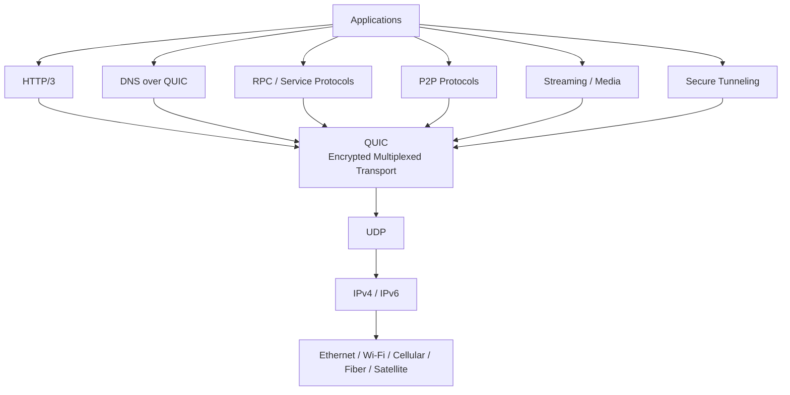

The important distinction is:

```text
Application
    │
    ▼
QUIC
    │
    ▼
UDP
    │
    ▼
IP
    │
    ▼
Network
```

QUIC does **not** replace IP.

It does not replace UDP.

Instead, QUIC uses UDP as a minimal packet-delivery substrate and implements a sophisticated transport system above it.

---

# 2. QUIC vs Traditional TCP

A traditional web connection historically looked approximately like:

```text
Application
     │
     ▼
HTTP
     │
     ▼
TLS
     │
     ▼
TCP
     │
     ▼
IP
```

Modern HTTP/3 changes this to:

```text
Application
     │
     ▼
HTTP/3
     │
     ▼
QUIC + TLS 1.3
     │
     ▼
UDP
     │
     ▼
IP
```

The major architectural difference is that QUIC combines functionality that previously lived across multiple layers.

### Traditional model

```text
HTTP
 │
TLS
 │
TCP
 │
IP
```

### QUIC model

```text
HTTP/3
 │
QUIC
 ├── Reliability
 ├── Congestion Control
 ├── Multiplexing
 ├── Connection Management
 ├── Stream Management
 ├── Encryption
 ├── Authentication
 └── Loss Recovery
 │
UDP
 │
IP
```

This allows QUIC to evolve much more rapidly than a transport protocol that must be implemented inside every operating-system kernel.

---

# 3. The Core Idea

The simplest way to understand QUIC is:

> **QUIC provides TCP-like reliability and congestion control while using UDP packets and integrating TLS directly into the transport connection.**

UDP itself provides very little:

```text
UDP

    Packet delivery
    Port numbers
    Checksum

    No:
    ├── Reliable delivery
    ├── Retransmission
    ├── Ordering
    ├── Congestion control
    ├── Connection management
    └── Stream multiplexing
```

QUIC adds those capabilities.

```text
UDP
 │
 └── QUIC
      ├── Connection IDs
      ├── Reliable streams
      ├── Datagram support
      ├── Packet loss detection
      ├── Retransmission
      ├── Congestion control
      ├── Flow control
      ├── Multiplexing
      ├── TLS 1.3 security
      └── NAT / network migration support
```

---

# 4. QUIC Connection Architecture

A QUIC connection exists between two endpoints.

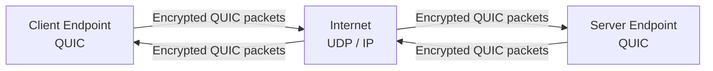

Unlike a traditional TCP connection, QUIC identifies connections using **Connection IDs**.

This is extremely important for mobile and distributed systems.

A connection can continue to exist even when the network path changes.

---

# 5. Connection IDs

Traditional TCP connections are strongly associated with a tuple such as:

```text
Source IP
Source Port
Destination IP
Destination Port
```

If the client's network changes:

```text
Wi-Fi
  │
  ▼
Cellular
```

the client's IP address may change.

A TCP connection may therefore need to be rebuilt.

QUIC introduces Connection IDs.

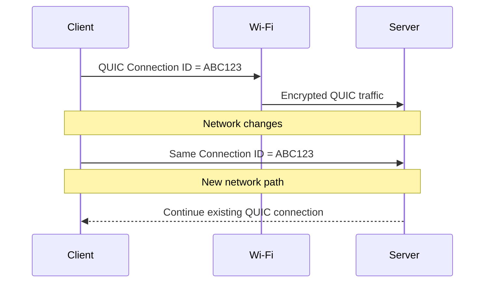

This makes QUIC particularly useful for:

* smartphones
* laptops
* vehicles
* roaming devices
* edge nodes
* mobile applications
* distributed workers
* intermittently connected systems

---

# 6. QUIC Handshake

One of QUIC's major advantages is that connection establishment and cryptographic negotiation are integrated.

QUIC uses **TLS 1.3** for its security handshake.

A simplified connection looks like:

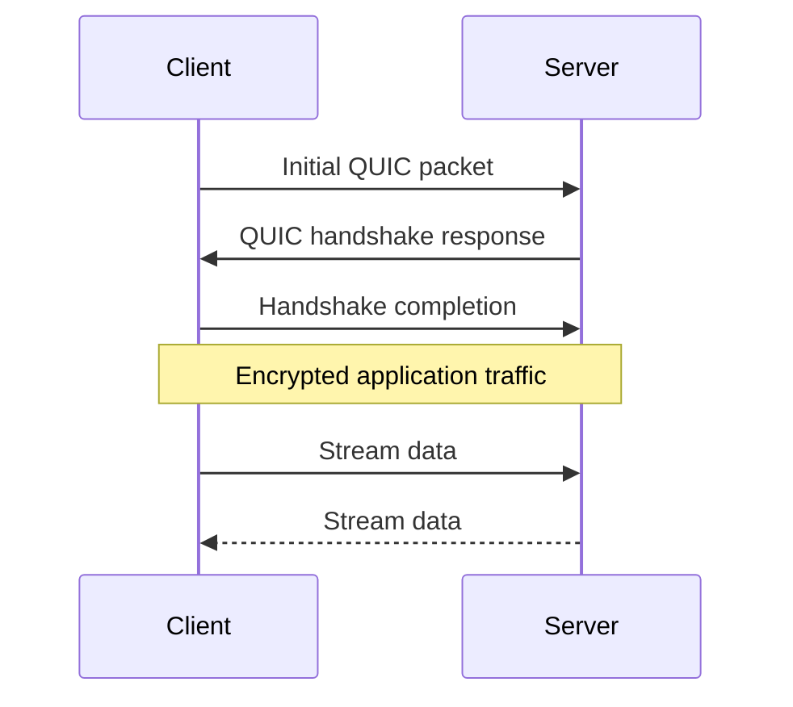

Instead of treating transport establishment and encryption as completely separate protocols, QUIC integrates them into the connection establishment process.

This reduces setup overhead.

---

# 7. QUIC Encryption

QUIC requires modern TLS.

The standardized protocol uses **TLS 1.3**.

Conceptually:

```text
QUIC
 │
 ├── Packet protection
 ├── Authentication
 ├── Key negotiation
 └── TLS 1.3
```

QUIC packets are therefore designed around encrypted communication.

This also makes the protocol harder for middleboxes to modify based on transport-layer metadata.

That is intentional.

QUIC was designed to resist **protocol ossification**.

---

# 8. Multiplexed Streams

One of QUIC's most important features is native stream multiplexing.

A single QUIC connection can contain many independent streams.

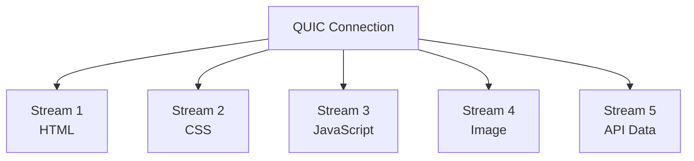

Each stream can be independently flow-controlled.

This is a major improvement over TCP's single ordered byte stream.

---

# 9. Head-of-Line Blocking

Consider a connection carrying several pieces of data:

```text
TCP

Packet 1 ────────►
Packet 2 ── LOST
Packet 3 ────────►
Packet 4 ────────►

             WAIT
              │
              ▼
        Packet 2 retransmitted
```

Because TCP provides one ordered byte stream, later bytes cannot be delivered to the application until the missing bytes are recovered.

With QUIC:

```text
QUIC Connection

Stream A
Packet ────────►
Packet ── LOST ──► retransmit

Stream B
Packet ────────►
Packet ────────►
Packet ────────►

Stream C
Packet ────────►
Packet ────────►
```

Loss affecting one stream does not inherently block delivery of data belonging to other streams.

This is particularly useful for:

* HTTP/3
* RPC
* distributed applications
* interactive applications
* multiplexed APIs
* edge services

---

# 10. HTTP/3

HTTP/3 maps HTTP semantics onto QUIC.

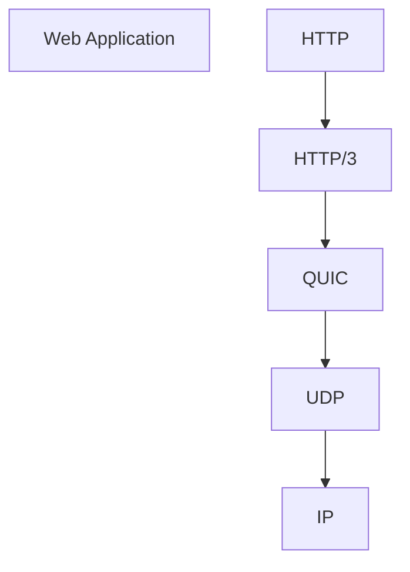

The resulting stack is:

```text
HTTP/3
   │
   ▼
 QUIC
   │
   ▼
 UDP
   │
   ▼
 IP
```

HTTP/3 can therefore use QUIC's:

* multiplexed streams
* connection migration
* loss recovery
* congestion control
* encryption
* low-latency connection establishment

---

# 11. HTTP/2 vs HTTP/3

A simplified comparison:

```text
HTTP/2

HTTP
 │
 ▼
HTTP/2
 │
 ▼
TLS
 │
 ▼
TCP
 │
 ▼
IP
```

versus:

```text
HTTP/3

HTTP
 │
 ▼
HTTP/3
 │
 ▼
QUIC + TLS 1.3
 │
 ▼
UDP
 │
 ▼
IP
```

The major architectural improvement is not simply "UDP is faster."

UDP is only the substrate.

The performance improvements come from QUIC's redesigned transport semantics.

---

# 12. Reliability

UDP does not guarantee delivery.

QUIC does.

QUIC implements reliability above UDP.

```text
Application data
       │
       ▼
QUIC streams
       │
       ▼
QUIC packets
       │
       ▼
UDP datagrams
       │
       ▼
IP network
```

If packets are lost:

```text
Sender
   │
   ├── Packet A ───────────────►
   ├── Packet B ───── X
   └── Packet C ───────────────►

Receiver
   │
   └── Detects missing data

Sender
   │
   └── Retransmits required data
```

The application therefore gets reliable streams without requiring TCP.

---

# 13. Congestion Control

QUIC also implements congestion control.

The transport continuously observes the network and adjusts transmission behavior.

Conceptually:

```text
Send
 │
 ▼
Observe ACKs
 │
 ├── RTT
 ├── Packet loss
 ├── Delivery rate
 └── Congestion signals
       │
       ▼
Adjust sending rate
       │
       ▼
Send more data
```

This allows QUIC implementations to evolve congestion-control algorithms in user space.

---

# 14. Flow Control

QUIC supports both connection-level and stream-level flow control.

```text
QUIC Connection
│
├── Connection Flow Control
│
├── Stream 1
│    └── Stream Flow Control
│
├── Stream 2
│    └── Stream Flow Control
│
└── Stream 3
     └── Stream Flow Control
```

This prevents one sender from overwhelming a receiver.

It is particularly useful when a single connection carries many independent workloads.

---

# 15. QUIC Packets

A QUIC connection is composed of packets.

Packets contain encrypted protocol information and application data.

Conceptually:

```text
QUIC Packet
│
├── Header
│    ├── Connection ID
│    ├── Packet Number
│    └── Packet Type
│
└── Encrypted Payload
     ├── Frames
     ├── Stream Data
     ├── ACKs
     ├── Flow Control
     └── Connection Control
```

QUIC uses frames inside packets to carry different kinds of transport information.

---

# 16. Streams vs Datagrams

QUIC supports both reliable streams and unreliable datagrams.

### Streams

```text
Reliable
Ordered
Flow controlled
Retransmitted
```

Useful for:

* HTTP
* RPC
* file transfer
* database operations
* application protocols

### QUIC Datagrams

```text
Unreliable
Low overhead
No retransmission requirement
```

Useful for:

* real-time data
* telemetry
* gaming
* media
* protocols where stale packets are useless

This makes QUIC more flexible than a transport designed exclusively around a reliable byte stream.

---

# 17. NAT Traversal

NAT is one of the biggest realities of the modern Internet.

A large number of devices are not directly reachable from the public Internet.

```text
Private Network

Device
  │
  ▼
NAT Router
  │
  ▼
ISP
  │
  ▼
Internet
```

Two endpoints may therefore need to discover how they can communicate.

QUIC can operate with UDP-based NAT traversal mechanisms.

This is one reason QUIC is particularly relevant to:

* P2P systems
* edge compute
* decentralized infrastructure
* remote devices
* mesh networks

---

# 18. QUIC + NAT Traversal + Relay

A distributed system can combine direct connectivity with relay fallback.

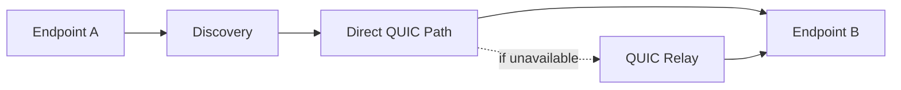

The preferred path is generally:

```text
Endpoint A
      │
      ▼
Direct connection
      │
      ▼
Endpoint B
```

If direct connectivity cannot be established:

```text
Endpoint A
      │
      ▼
Relay
      │
      ▼
Endpoint B
```

This architecture is extremely important for distributed networking.

---

# 19. QUIC and Iroh

This is where QUIC becomes especially interesting for your infrastructure architecture.

Iroh uses QUIC as its underlying transport.

Conceptually:

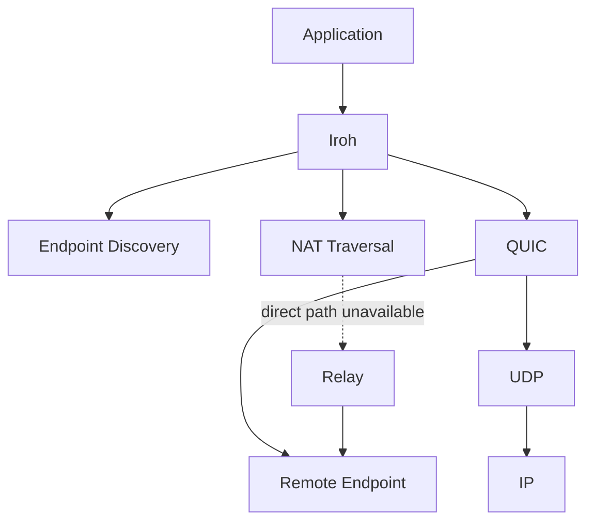

Iroh therefore combines several technologies:

```text
Application
      │
      ▼
Iroh
      │
      ├── Endpoint Identity
      ├── Discovery
      ├── NAT Traversal
      ├── Direct Connectivity
      ├── Relay Fallback
      │
      ▼
QUIC
      │
      ▼
UDP
      │
      ▼
IP
```

QUIC provides the transport machinery.

Iroh builds a higher-level endpoint-to-endpoint networking system around it.

---

# 20. QUIC in a Distributed Compute Network

For a distributed cloud or compute mesh, QUIC can serve as a common transport substrate between nodes.

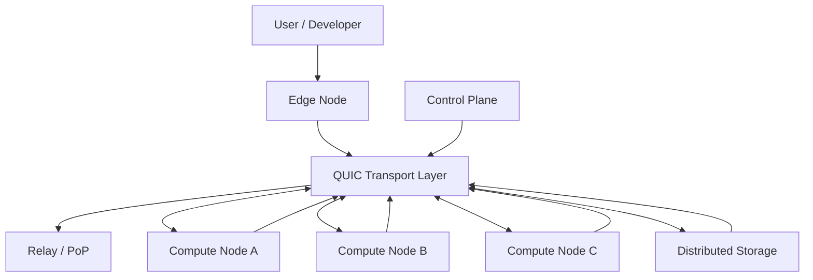

The key idea is that QUIC does not need to know what the application is.

The same transport can carry:

```text
HTTP/3
RPC
Control traffic
Storage transfers
Service-to-service traffic
Telemetry
P2P protocols
Streaming
```

---

# 21. QUIC as a Mesh Transport

A mesh architecture can therefore look like:

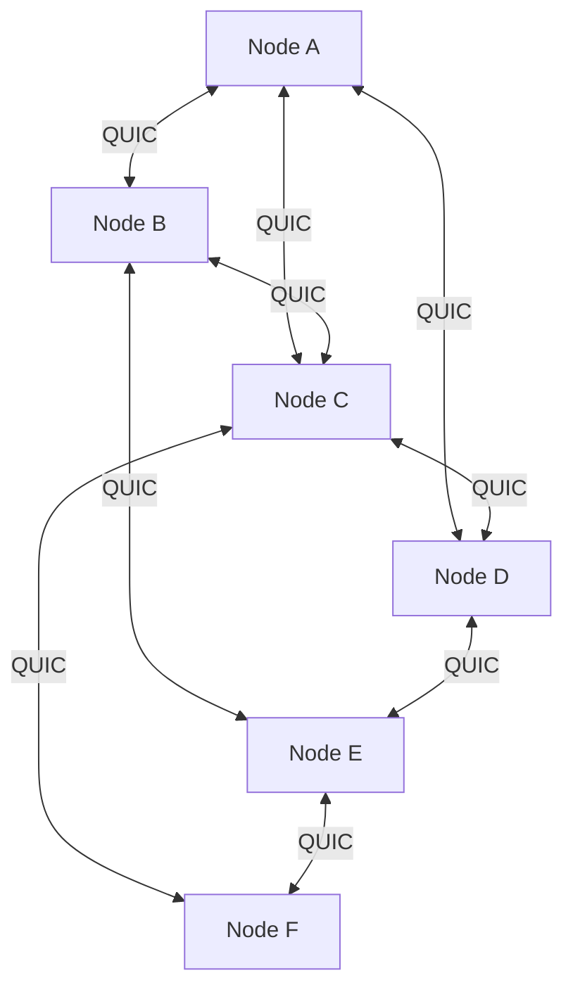

QUIC does not itself create the mesh topology.

Instead:

```text
Mesh Control Plane
        │
        ▼
Chooses peers / routes / identities
        │
        ▼
QUIC
        │
        ▼
Network paths
```

This separation is important.

The mesh system determines **who should communicate**.

QUIC determines **how the transport connection behaves**.

---

# 22. QUIC and Edge Computing

QUIC is well suited to edge environments because connections can be long-lived while network paths can change.

Example:

```text
User
 │
 ▼
Wi-Fi
 │
 ▼
Edge PoP
 │
 ▼
QUIC
 │
 ▼
Compute Worker
```

The user moves:

```text
Wi-Fi
  │
  ▼
5G
  │
  ▼
Different network path
```

A QUIC connection can potentially migrate without forcing the application to recreate its logical session.

This is useful for:

* mobile clients
* autonomous systems
* edge devices
* vehicles
* remote workers
* IoT
* distributed compute

---

# 23. QUIC and CDN / Edge Infrastructure

A modern edge stack can use QUIC at multiple boundaries.


A platform can therefore terminate QUIC close to the user and then use another transport internally.

For example:

```text
Client
  │
  │ HTTP/3
  ▼
Edge
  │
  │ Internal RPC
  ▼
Service
  │
  ▼
Database
```

QUIC does not require every internal service to use QUIC.

It is a transport choice.

---

# 24. QUIC and Service Meshes

Traditional service-to-service architectures frequently use:

```text
HTTP
  │
TLS
  │
TCP
  │
IP
```

A QUIC-based service architecture can instead use:

```text
RPC / HTTP
    │
    ▼
QUIC
    │
    ▼
UDP
    │
    ▼
IP
```

This can provide:

* multiplexing
* connection migration
* encryption
* stream-level flow control
* lower connection setup latency
* datagrams
* user-space transport implementations

---

# 25. QUIC and RPC

QUIC is a natural substrate for modern RPC frameworks.

```text
Service A
   │
   ▼
RPC
   │
   ▼
QUIC Stream
   │
   ▼
Network
   │
   ▼
QUIC Stream
   │
   ▼
RPC
   │
   ▼
Service B
```

Multiple RPC requests can share one connection:

```text
QUIC Connection
│
├── RPC Request 1
├── RPC Request 2
├── RPC Request 3
├── RPC Request 4
└── RPC Request 5
```

This avoids creating a separate TCP connection for every operation.

---

# 26. QUIC and Distributed Storage

QUIC can also carry large data transfers.

For example:

```text
Storage Node A
      │
      ▼
QUIC
      │
      ├── Stream 1 → Chunk A
      ├── Stream 2 → Chunk B
      ├── Stream 3 → Chunk C
      └── Stream 4 → Chunk D
      │
      ▼
Storage Node B
```

This is useful for distributed systems where a connection may simultaneously carry:

* metadata
* control messages
* chunk transfers
* replication
* synchronization

---

# 27. QUIC and Content-Addressed Systems

A content-addressed storage system can use QUIC as its transport.

```text
Content ID
    │
    ▼
Discover Node
    │
    ▼
Establish QUIC
    │
    ▼
Request Content
    │
    ▼
Transfer Data
    │
    ▼
Verify Content Hash
```

The responsibilities remain separate:

```text
Content Addressing
    = WHAT data is requested

Discovery
    = WHERE a provider can be found

QUIC
    = HOW data is transported
```

This separation is valuable for decentralized architectures.

---

# 28. QUIC and Observability

QUIC introduces an important observability challenge.

Because much of the transport metadata is encrypted, traditional network monitoring cannot assume that it can inspect transport headers the same way it could with TCP.

Therefore a QUIC-aware platform should collect telemetry at endpoints.

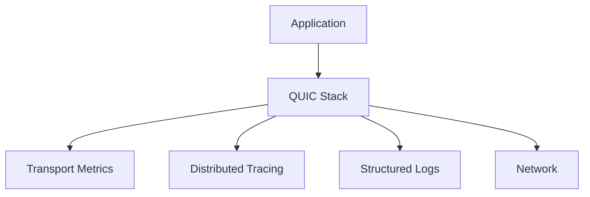

Useful metrics include:

* RTT
* packet loss
* congestion state
* retransmissions
* stream utilization
* connection duration
* handshake latency
* throughput
* path changes
* connection migration
* bytes sent
* bytes received

---

# 29. QUIC and Network Path Measurement

A distributed platform can continuously measure available network paths.

```text
Endpoint
   │
   ├── Path A
   │     ├── RTT
   │     ├── Loss
   │     └── Throughput
   │
   ├── Path B
   │     ├── RTT
   │     ├── Loss
   │     └── Throughput
   │
   └── Path C
         ├── RTT
         ├── Loss
         └── Throughput
```

The platform can then prefer the most appropriate path.

This is especially powerful when QUIC is combined with:

* endpoint discovery
* NAT traversal
* relays
* Anycast
* GeoDNS
* PoPs
* mesh routing
* network telemetry

---

# 30. QUIC + Anycast + Edge

QUIC can operate alongside conventional Internet routing systems.

For example:

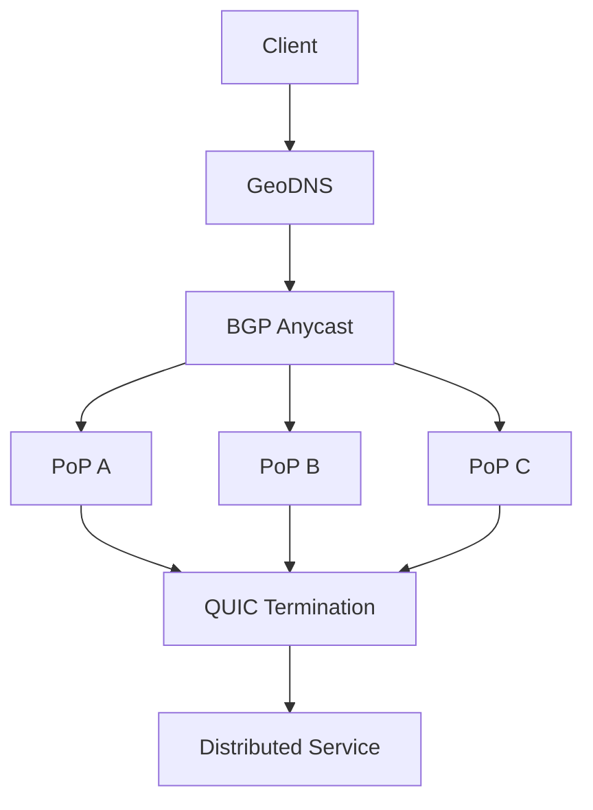

GeoDNS and Anycast determine **where traffic enters the network**.

QUIC determines **how the transport behaves after the endpoint connection is established**.

These are complementary technologies.

---

# 31. QUIC + Relay Networks

QUIC also works well with relay architectures.

```text
                    ┌──────────────┐
                    │ Relay / PoP  │
                    └──────┬───────┘
                           │
             ┌─────────────┴─────────────┐
             │                           │
          Endpoint A                 Endpoint B
```

The relay does not necessarily need to understand the application protocol.

It can function as a transport intermediary.

This is particularly useful when:

* NAT traversal fails
* inbound connections are blocked
* endpoints are behind restrictive networks
* direct paths are unavailable
* geographic routing is required

---

# 32. QUIC vs TCP

| Capability                |               TCP |                       QUIC |
| ------------------------- | ----------------: | -------------------------: |
| Reliable delivery         |               Yes |                        Yes |
| Ordered byte stream       |               Yes |                    Streams |
| Multiplexed streams       | External protocol |                     Native |
| Encryption built in       |                No |                        Yes |
| TLS integration           |    Separate layer |                 Integrated |
| Uses UDP                  |                No |                        Yes |
| Congestion control        |               Yes |                        Yes |
| Connection migration      |           Limited |            Designed for it |
| User-space implementation |          Possible |                     Common |
| Datagram support          |                No |                        Yes |
| HTTP/3                    |                No |                        Yes |
| Head-of-line behavior     |   Connection-wide |            Stream-oriented |
| Protocol evolution        |  More constrained | Designed for extensibility |

---

# 33. QUIC vs UDP

QUIC should not be thought of as simply "faster UDP."

UDP:

```text
UDP
 │
 └── Datagram delivery
```

QUIC:

```text
QUIC
├── UDP
├── Reliability
├── Congestion Control
├── Flow Control
├── Streams
├── Connection IDs
├── Encryption
├── Authentication
├── Loss Recovery
├── Connection Migration
└── Datagram Support
```

UDP is the foundation.

QUIC is the transport system built above it.

---

# 34. QUIC vs TCP + TLS

The architectural comparison is:

```text
TCP + TLS

Application
    │
    ▼
TLS
    │
    ▼
TCP
    │
    ▼
IP
```

versus:

```text
QUIC

Application
    │
    ▼
QUIC
 ├── TLS 1.3
 ├── Reliability
 ├── Streams
 ├── Congestion Control
 ├── Flow Control
 └── Connection Management
    │
    ▼
UDP
    │
    ▼
IP
```

QUIC therefore collapses several traditionally separate transport/security interactions into one protocol architecture.

---

# 35. Protocol Evolution

One of QUIC's major design goals is avoiding **protocol ossification**.

Traditional network protocols expose substantial metadata to middleboxes.

Middleboxes can then develop assumptions about how the protocol behaves.

Over time:

```text
Protocol
   │
   ▼
Middleboxes assume behavior
   │
   ▼
New extension introduced
   │
   ▼
Middlebox breaks it
   │
   ▼
Protocol becomes difficult to evolve
```

QUIC intentionally encrypts and minimizes parts of its wire image to make this problem less severe.

The goal is:

```text
QUIC
 │
 ├── Encrypted protocol metadata
 ├── Extensible frames
 ├── Version negotiation
 ├── Reserved values
 └── Explicit invariants
```

This makes transport evolution more practical.

---

# 36. IETF QUIC vs Google gQUIC

The original Google protocol was commonly called **gQUIC**.

The standardized protocol is **IETF QUIC**.

They should not be treated as identical protocols.

```text
Google gQUIC
      │
      ▼
IETF standardization
      │
      ▼
IETF QUIC
      │
      ├── RFC 8999
      ├── RFC 9000
      ├── RFC 9001
      └── RFC 9002
```

Modern systems should generally mean **IETF QUIC** when referring to standardized QUIC.

---

# 37. Important Standards

The core QUIC specifications include:

### RFC 8999

**Version-Independent Properties of QUIC**

Defines properties intended to remain consistent across QUIC versions.

### RFC 9000

**QUIC: A UDP-Based Multiplexed and Secure Transport**

Defines the core QUIC transport protocol.

### RFC 9001

**Using TLS to Secure QUIC**

Defines how TLS is integrated with QUIC.

### RFC 9002

**QUIC Loss Detection and Congestion Control**

Defines loss recovery and congestion-control behavior.

Together:

```text
RFC 8999
   │
   ├── QUIC invariants
   │
   ▼
RFC 9000
   │
   ├── Core transport
   │
   ├── Streams
   ├── Packets
   ├── Connections
   │
   ▼
RFC 9001
   │
   └── TLS security
   │
   ▼
RFC 9002
   │
   └── Loss recovery + congestion control
```

---

# 38. Major QUIC Implementations

QUIC is implemented by many projects and organizations.

Examples include:

* **MsQuic** — Microsoft's cross-platform QUIC implementation
* **quiche** — Cloudflare's Rust QUIC implementation
* **quic-go** — Go implementation
* **Quinn** — Rust async QUIC implementation
* **ngtcp2** — C implementation
* **mvfst** — Meta's QUIC implementation
* **s2n-quic** — AWS's Rust implementation
* **lsquic** — LiteSpeed QUIC implementation
* **neqo** — Mozilla's QUIC implementation
* **aioquic** — Python implementation
* **picoquic** — lightweight C implementation

The existence of implementations across C, C++, Rust, Go, Python, Java, Swift, and other environments makes QUIC useful as a general transport building block.

---

# 39. QUIC in the Internet Dependency Graph

For a global infrastructure map, QUIC should be represented as a transport dependency rather than as a single service.

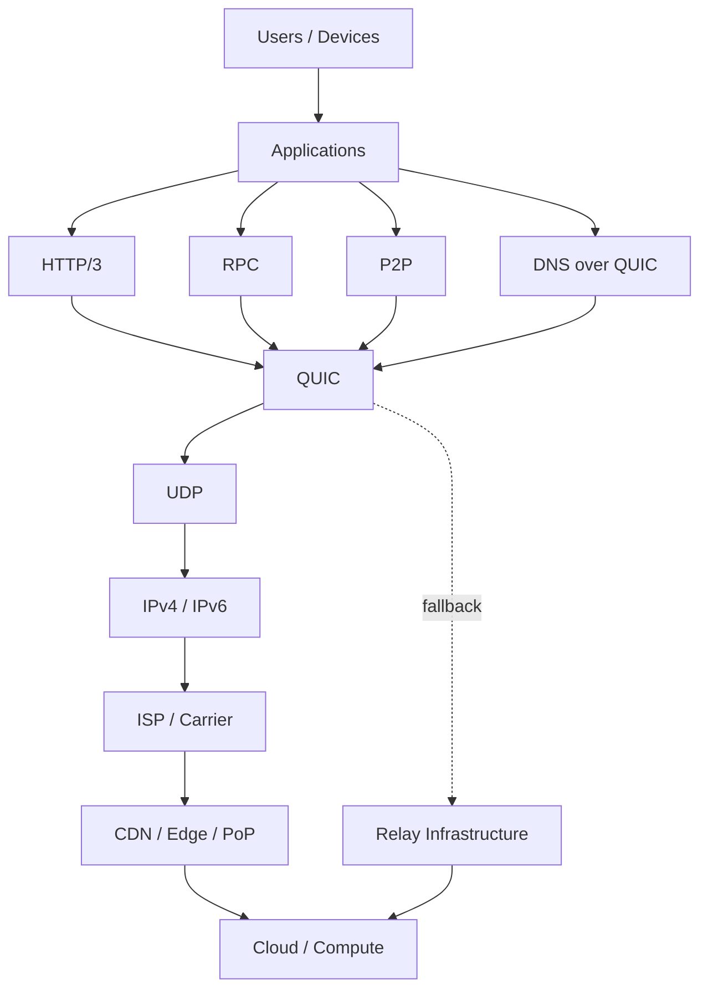

This makes QUIC a **horizontal dependency** across many infrastructure layers.

---

# 40. QUIC in the Modern Internet Stack

A simplified modern Internet request can therefore look like:

```text
USER DEVICE
     │
     ▼
Application
     │
     ▼
HTTP/3
     │
     ▼
QUIC
     │
     ▼
UDP
     │
     ▼
IPv4 / IPv6
     │
     ▼
Wi-Fi / Ethernet / Cellular
     │
     ▼
Access Network
     │
     ▼
ISP / Carrier
     │
     ▼
Internet Backbone
     │
     ▼
IXP / Transit / Peering
     │
     ▼
CDN / Edge / PoP
     │
     ▼
Load Balancer
     │
     ▼
Application Service
     │
     ▼
Database / Storage / Compute
```

QUIC sits near the center of this stack:

```text
APPLICATION
     │
     ▼
HTTP / RPC / P2P / DNS
     │
     ▼
    QUIC
     │
     ▼
    UDP
     │
     ▼
     IP
     │
     ▼
PHYSICAL + ACCESS NETWORK
```

---

# 41. Why QUIC Matters for Distributed Infrastructure

QUIC becomes particularly powerful when combined with the other technologies in a distributed infrastructure architecture.

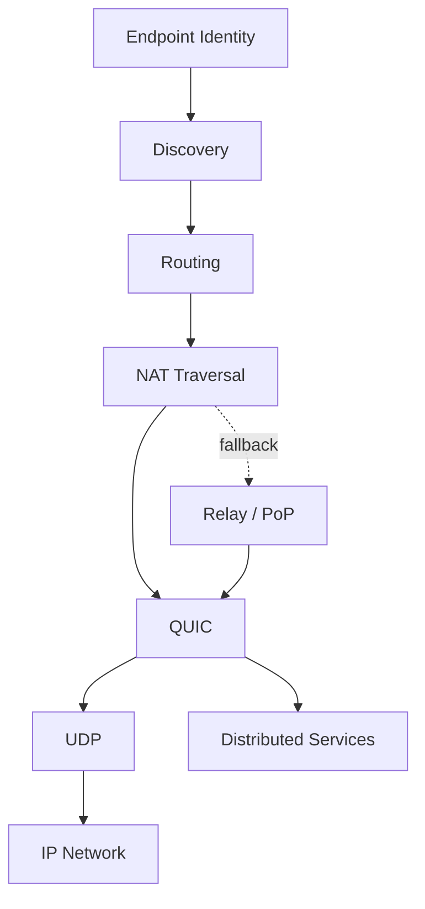

Each layer has a different responsibility:

| Layer            | Responsibility                               |
| ---------------- | -------------------------------------------- |
| Identity         | Who is this endpoint?                        |
| Discovery        | Where can it be reached?                     |
| Routing          | Which path should be used?                   |
| NAT Traversal    | Can endpoints connect directly?              |
| Relay            | What happens when direct connectivity fails? |
| QUIC             | How is the connection transported?           |
| UDP              | Datagram substrate                           |
| IP               | Network addressing and routing               |
| Physical Network | Actual packet transmission                   |

This separation is fundamental to building a scalable distributed network.

---

# 42. QUIC's Role in the Platform Architecture

For a distributed compute platform, QUIC should be thought of as a **transport primitive**, not the entire networking system.

```text
                 DISTRIBUTED PLATFORM
                         │
        ┌────────────────┼────────────────┐
        │                │                │
     Identity        Discovery         Routing
        │                │                │
        └────────────────┼────────────────┘
                         │
                    Connectivity
                         │
              ┌──────────┴──────────┐
              │                     │
           Direct                 Relay
              │                     │
              └──────────┬──────────┘
                         │
                        QUIC
                         │
                        UDP
                         │
                         IP
```

This distinction is important.

QUIC does not replace:

* DNS
* BGP
* GeoDNS
* Anycast
* NAT traversal
* service discovery
* identity
* routing
* relays
* CDNs
* cloud infrastructure

Instead, it provides a powerful transport layer that these systems can build around.

---

# 43. The Big Picture

The modern networking model can ultimately be understood as several independent systems cooperating:

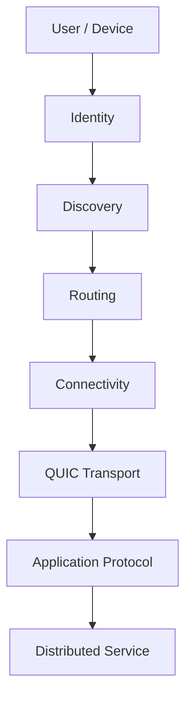

Each solves a different problem:

```text
Identity
    ↓
Who are you?

Discovery
    ↓
Where are you?

Routing
    ↓
Which network path should be used?

Connectivity
    ↓
Can these endpoints communicate directly?

QUIC
    ↓
How should the connection transport data?

Application Protocol
    ↓
What does the data mean?

Service
    ↓
What does the application actually do?
```

That separation is one of the most important concepts when designing distributed infrastructure.

---

# 44. Key Takeaways

QUIC is:

* A modern transport protocol
* Built over UDP
* Standardized by the IETF
* Secured using TLS 1.3
* Multiplexed
* Reliable
* Congestion controlled
* Stream-oriented
* Datagram-capable
* Designed for low-latency connection establishment
* Designed for connection migration
* Designed to resist protocol ossification
* The transport foundation for HTTP/3

Its architecture enables applications to obtain many of the benefits traditionally associated with TCP while gaining capabilities that are difficult to achieve cleanly with TCP's architecture.

The most important mental model is:

```text
              APPLICATION
                   │
        ┌──────────┼──────────┐
        │          │          │
      HTTP/3      RPC        P2P
        │          │          │
        └──────────┼──────────┘
                   │
                  QUIC
                   │
        ┌──────────┼──────────┐
        │          │          │
    Reliability  Streams   Encryption
        │          │          │
        ├── Loss Recovery
        ├── Congestion Control
        ├── Flow Control
        ├── Connection IDs
        ├── Migration
        └── Datagrams
                   │
                  UDP
                   │
                   IP
                   │
             NETWORK
```

And for a distributed compute/mesh architecture:

```text
                 GLOBAL NETWORK
                       │
        ┌──────────────┼──────────────┐
        │              │              │
      Identity      Discovery       Routing
        │              │              │
        └──────────────┼──────────────┘
                       │
                 Connectivity
                       │
             ┌─────────┴─────────┐
             │                   │
        Direct QUIC          QUIC Relay
             │                   │
             └─────────┬─────────┘
                       │
                      UDP
                       │
                       IP
                       │
          ┌────────────┼────────────┐
          │            │            │
        Edge         Cloud        Mesh
          │            │            │
          └────────────┼────────────┘
                       │
              Distributed Services
```

**QUIC is therefore best understood as the modern encrypted transport foundation connecting applications, edge infrastructure, cloud services, and distributed endpoints across the existing IP Internet.**
