## AUTHEO $THEO Distributed Compute Marketplace

### Turning Independent Devices Into A Unified Global Cloud


1. [Platform Overview](#1-platform-overview)
2. [Platform Organization & System Boundaries](#2-platform-organization--system-boundaries)

---

# Vision

Traditional cloud providers build massive centralized datacenters.

AI THEO takes the opposite approach:

**Turn existing computers, servers, offices, homes, edge devices, and datacenters into a unified decentralized cloud.**

The marketplace acts as the trusted coordination layer while the actual compute happens across thousands of independently operated nodes.

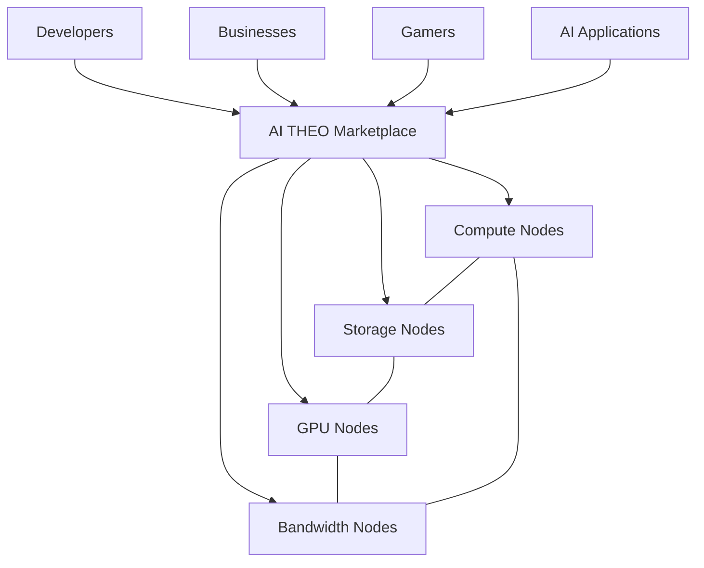

The marketplace does **not** become a bottleneck.

Instead it acts as:

* Resource registry
* Discovery service
* Reputation system
* Billing layer
* Security authority
* Economic coordination layer

Actual workloads move directly between nodes.

---

# The Two Layer Model

One of the most important concepts is separating:

### Control Plane

The marketplace.

### Data Plane

The mesh itself.

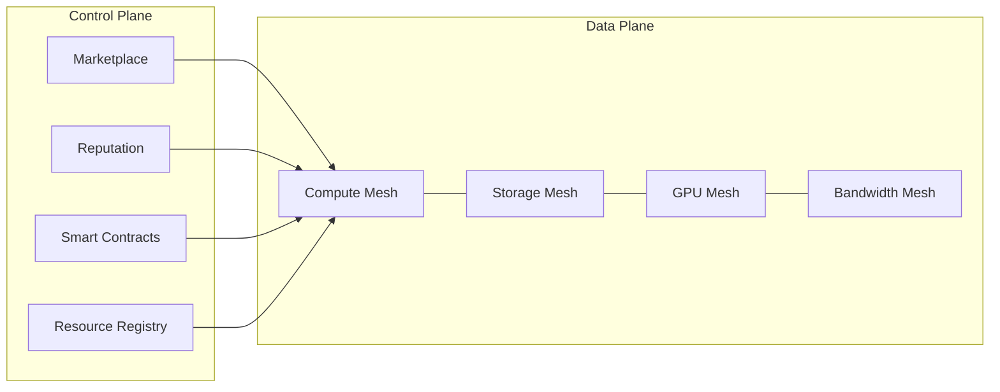

This creates a powerful property:

Even if the marketplace goes offline temporarily:

* Running workloads continue
* Storage remains accessible
* Applications stay online
* Existing mesh connections remain active

---

# Real World Mesh Formation

Nodes naturally cluster together.

Nearby resources become regional mini-clouds.

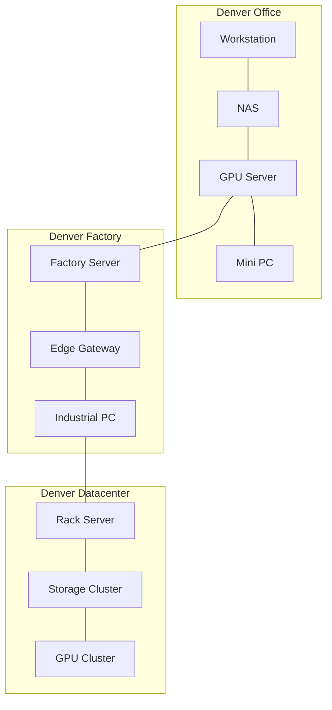

Instead of immediately sending workloads across the world:

AI THEO attempts to keep workloads local whenever possible.

---

# Edge-First Scheduling

Traditional cloud:

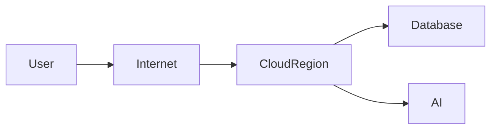

Every request travels to a distant region.

---

AI THEO:

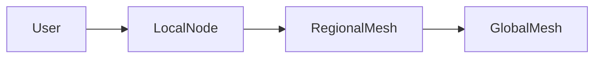

The scheduler always prefers:

1. Local node
2. Nearby node
3. Regional mesh
4. Global mesh

This minimizes:

* Latency
* Transit costs
* Bandwidth consumption

---

# Example: Minecraft Server

A practical example.

A group of friends wants a Minecraft server.

Traditional approach:

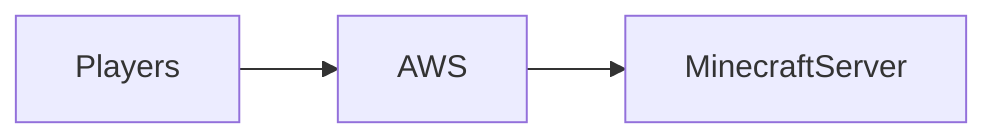

The server may be hundreds or thousands of miles away.

---

AI THEO approach:

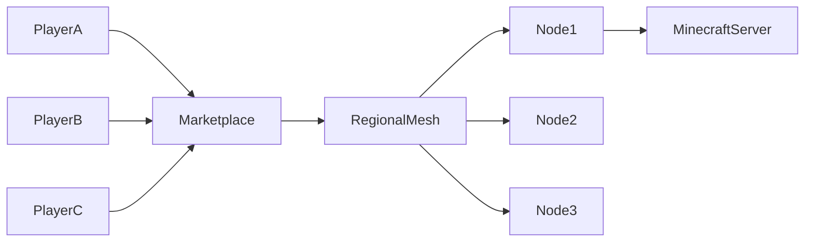

Marketplace selects:

* Lowest latency nodes
* Available compute
* Good reputation
* Competitive pricing

The result:

* Lower latency
* Lower hosting cost
* Revenue for node operators

---

# How Nodes Connect Securely

Discovery is multi-layered.

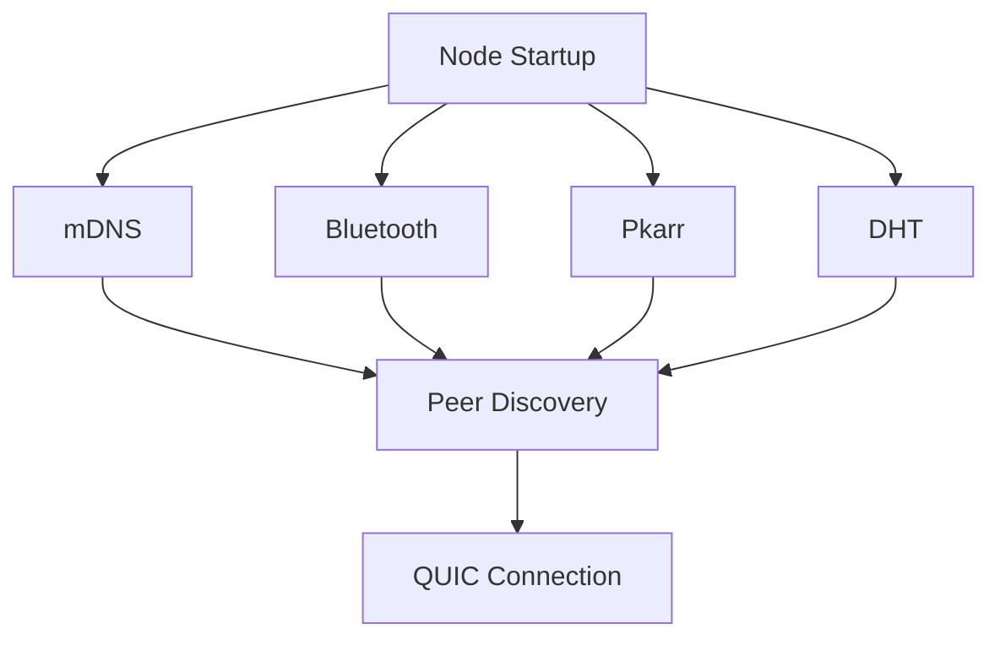

Each mechanism solves a different problem.

| Technology | Purpose                   |
| ---------- | ------------------------- |
| Bluetooth  | Nearby devices            |
| mDNS       | Local networks            |
| Pkarr      | Decentralized addressing  |
| DHT        | Global fallback discovery |

---

# Secure Connection Establishment

Every connection is encrypted before workload execution.

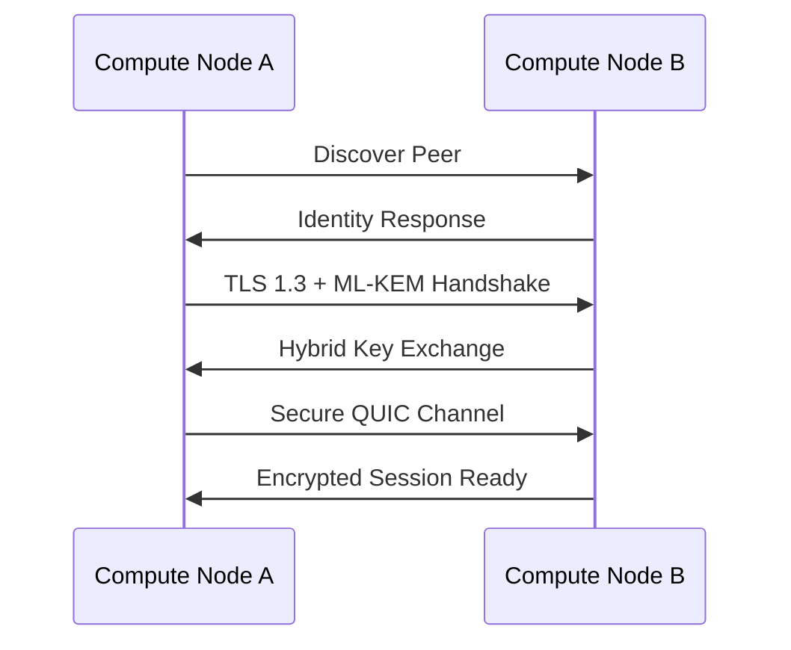

Benefits:

* Post-quantum migration path
* Forward secrecy
* Mutual authentication
* Encrypted transport

---

# Workload Execution Lifecycle

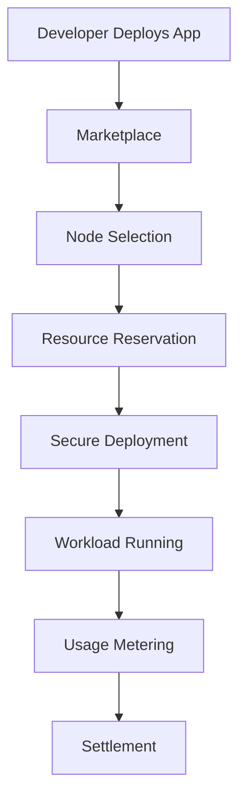

The marketplace never executes workloads.

It only coordinates placement.

---

# Distributed Storage Mesh

Storage behaves similarly.

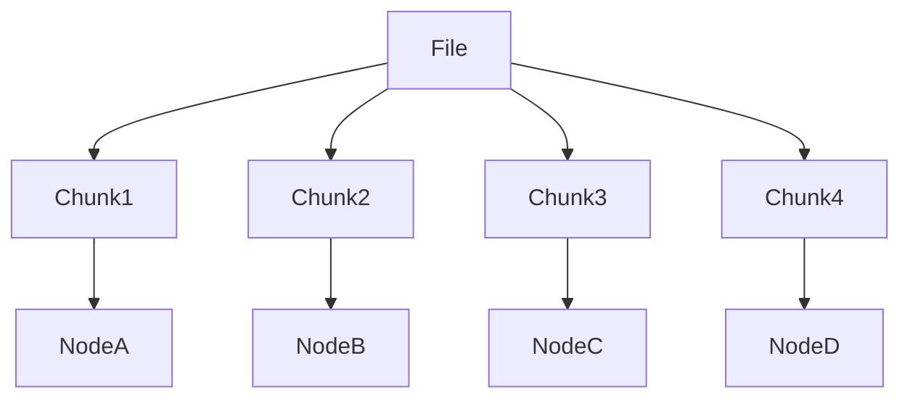

Advantages:

* No single point of failure
* Geographic redundancy
* Lower storage cost
* High availability

---

# AI Inference Mesh

AI workloads benefit enormously from edge placement.

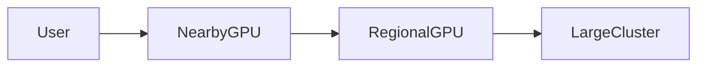

Scheduling preference:

1. Closest GPU
2. Lowest latency GPU
3. Lowest cost GPU
4. Available fallback GPU

This allows:

* Faster inference
* Reduced cloud spend
* Better privacy
* Lower bandwidth costs

---

# Trust & Reputation Layer

A decentralized marketplace still requires trust.

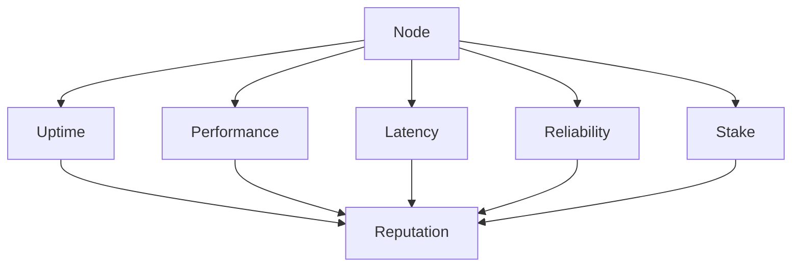

High quality providers receive:

* More workloads
* Higher earnings
* Premium services
* Enterprise contracts

---

# Security Architecture

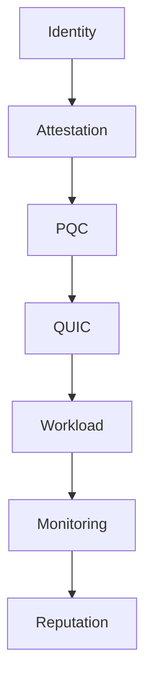

Layers include:

### Identity

Cryptographic node identity.

### Attestation

Verify trusted software and hardware.

### PQC

ML-KEM based key exchange.

### QUIC

Encrypted transport.

### Monitoring

Detect abuse and failures.

### Reputation

Economic incentives encourage good behavior.

---

# The End State

Instead of this:

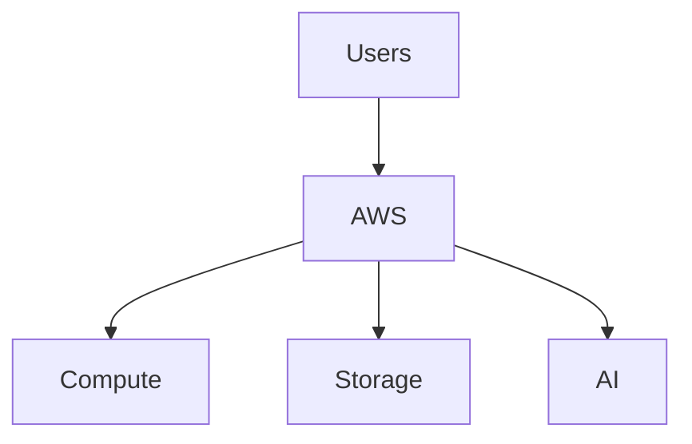

The future looks like:

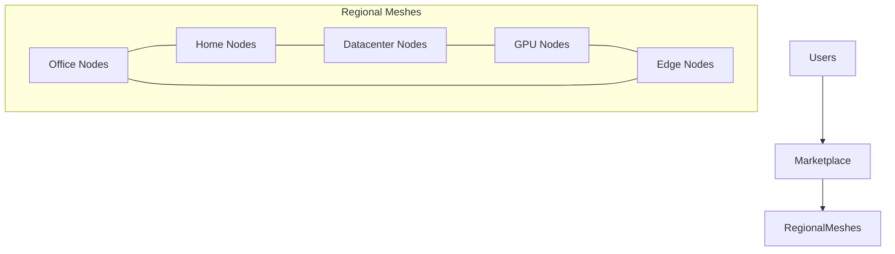

The marketplace becomes the economic and trust layer.

The mesh becomes the execution layer.

Together they create a decentralized cloud where anyone can contribute resources, developers can deploy globally with a single click, enterprises can build local hyperscalers, and users benefit from lower costs, lower latency, greater resilience, and a post-quantum-ready security architecture.


# Platform Organization & System Boundaries

---

# The AI THEO Ecosystem

The platform is not a single monolithic application.

It is a collection of independent systems that communicate through well-defined APIs, cryptographic identities, and on-chain trust.

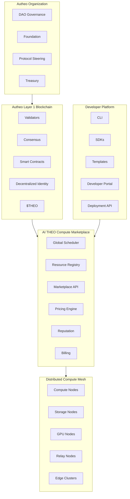

Notice something important:

**The blockchain is NOT the compute platform.**

It provides trust.

The marketplace coordinates resources.

The mesh performs execution.

The developer platform builds applications.

Governance evolves the protocol.

---

# Control Plane vs Data Plane vs Trust Plane

This becomes one of the most important concepts.

```text
                     USERS

                        │

────────────────────────────────────────────

              Developer Platform

      CLI • SDK • Dashboard • APIs

────────────────────────────────────────────

             CONTROL PLANE

Marketplace
Scheduling
Resource Discovery
Deployment
Pricing
Reputation
Monitoring

────────────────────────────────────────────

              TRUST PLANE

Identity
Validators
Blockchain
Smart Contracts
Payments
Governance
Audit

────────────────────────────────────────────

              DATA PLANE

Compute
Storage
Networking
AI
Containers
WASM
Databases

────────────────────────────────────────────

              PHYSICAL NODES

Office PCs
Servers
GPU Clusters
Factories
Edge Devices
Home Labs
Cloud VMs
```

Notice how each plane has a completely different responsibility.

---

# The Marketplace Doesn't Run Applications

This misconception should be addressed immediately.

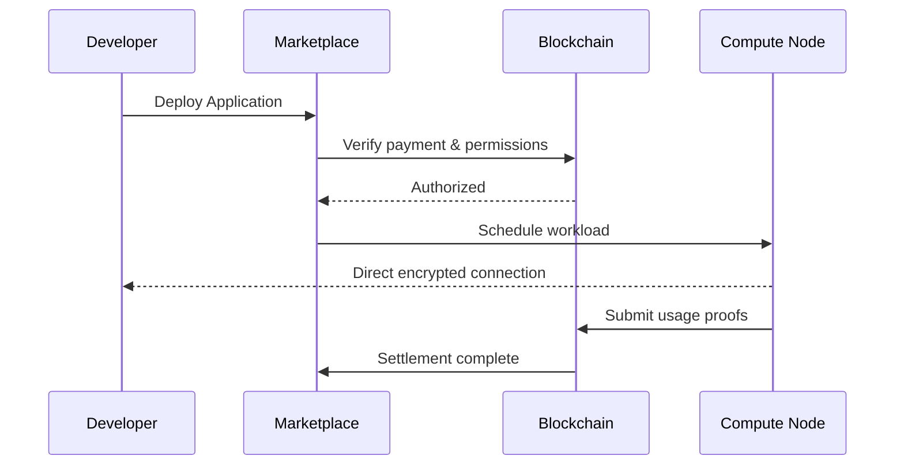

The marketplace is an orchestrator.

Not a hypervisor.

---

# Regional Meshes

Instead of imagining one global mesh...

Imagine thousands of local clouds.

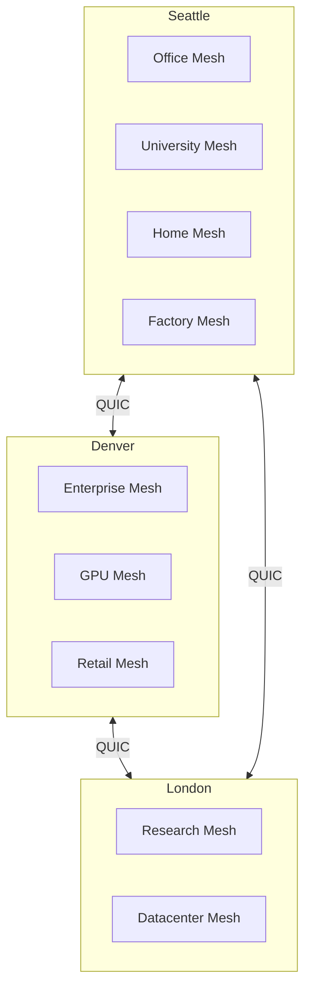

Every city naturally forms its own cloud.

Those clouds become part of the worldwide network.

---

# Enterprise Local Hyperscaler

One of the strongest differentiators deserves its own section.

```text
                     Enterprise

────────────────────────────────────────────

Employees

AI Agents

Applications

IoT Devices

Robots

────────────────────────────────────────────

Enterprise Marketplace Gateway

────────────────────────────────────────────

Office Mesh

Factory Mesh

Warehouse Mesh

Retail Mesh

Datacenter Mesh

────────────────────────────────────────────

Enterprise Resource Pool

Compute

Storage

AI

Networking

Databases

────────────────────────────────────────────

Optional Federation

↓

Global Marketplace
```

Notice:

The enterprise owns everything.

AI THEO simply connects it.

---

# Internal Mesh Hierarchy

Rather than every computer talking to every other computer, use a hierarchical topology.

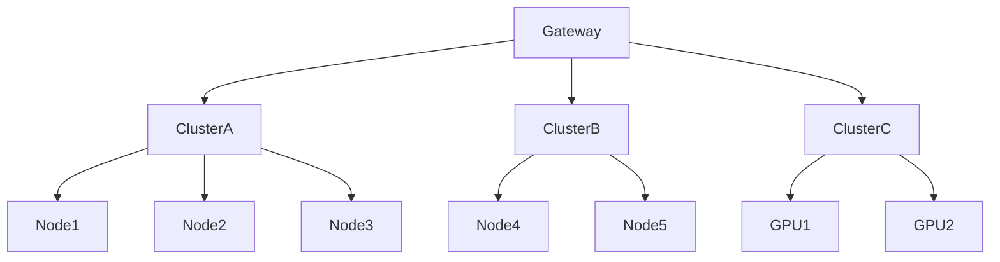

Benefits:

* Less routing overhead
* Better scalability
* Better scheduling
* Easier monitoring
* Reduced bandwidth

This is much closer to how real distributed systems such as Kubernetes, Borg, and Nomad are organized.

---

# Developer Deployment Pipeline

```mermaid
flowchart LR

Code

-->

Build

-->

Container/WASM

-->

Marketplace

-->

Scheduler

-->

Regional Cluster

-->

Node

-->

Running Service

-->

Global Endpoint
```

One deployment.

Thousands of execution locations.

---

# The Marketplace Internals

Instead of showing it as one box, expand it.

```text
                   Marketplace

┌────────────────────────────────────┐

Deployment API

Marketplace API

Authentication

Identity

────────────────────────────────────

Scheduler

Resource Discovery

Placement Engine

Capacity Planner

Load Balancer

────────────────────────────────────

Billing

Pricing Engine

Escrow

Payments

Reputation

────────────────────────────────────

Monitoring

Logging

Metrics

Auditing

────────────────────────────────────

Policy Engine

Compliance

Enterprise Controls

SLAs

────────────────────────────────────┘
```

This makes it look like a genuine cloud platform rather than a crypto marketplace.

---

# The Long-Term Vision

This is the diagram I'd end the chapter with because it clearly communicates the platform's ambition.

```text
                  Internet

                     │

        ┌────────────┼────────────┐

      Developers

     Enterprises

         Individuals

            Governments

──────────────────────────────────────

         AI THEO Platform

Developer Hub

Compute Marketplace

Identity

Deployment

Scheduling

Billing

Observability

──────────────────────────────────────

      Global Compute Fabric

Regional Meshes

Enterprise Meshes

University Meshes

Home Labs

Cloud Providers

GPU Farms

IoT Networks

──────────────────────────────────────

        Unified Distributed Cloud

Compute

Storage

AI

Networking

Applications

Streaming

Databases

Hosting

Inference

──────────────────────────────────────

     Millions of Independently Owned Nodes
```

## One architectural refinement I would strongly recommend

Based on everything we've built over the past few weeks, I think the platform should consistently be described as **four independent products** that together form the ecosystem:

1. **Autheo Layer 1** – Trust, identity, payments, governance, staking, settlement, and programmable assets.
2. **AI THEO Compute Marketplace** – Resource discovery, scheduling, reputation, pricing, billing, and workload placement.
3. **Developer Platform** – CLI, SDKs, APIs, templates, CI/CD integration, observability, and one-click deployment.
4. **Distributed Compute Mesh** – The actual execution environment that provides compute, storage, networking, AI inference, and edge services.

That separation mirrors how major cloud platforms are organized: governance and trust, control plane, developer experience, and execution infrastructure each have distinct responsibilities, making the overall architecture easier for enterprises and developers to understand.

