## AUTHEO THEO Distributed Compute Marketplace

### Turning Independent Devices Into A Unified Global Cloud

---

# Vision

Traditional cloud providers build massive centralized datacenters.

AI THEO takes the opposite approach:

**Turn existing computers, servers, offices, homes, edge devices, and datacenters into a unified decentralized cloud.**

The marketplace acts as the trusted coordination layer while the actual compute happens across thousands of independently operated nodes.

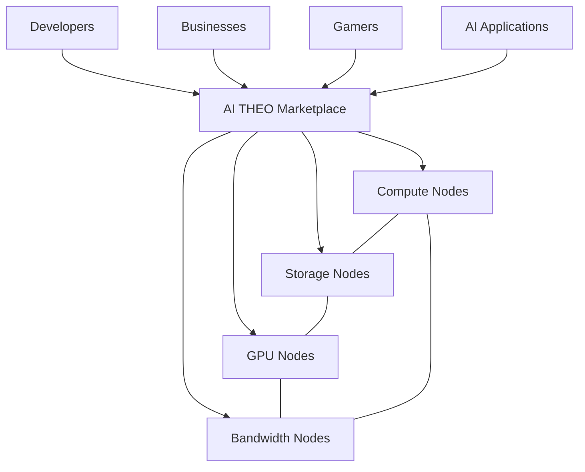

The marketplace does **not** become a bottleneck.

Instead it acts as:

* Resource registry
* Discovery service
* Reputation system
* Billing layer
* Security authority
* Economic coordination layer

Actual workloads move directly between nodes.

---

# The Two Layer Model

One of the most important concepts is separating:

### Control Plane

The marketplace.

### Data Plane

The mesh itself.

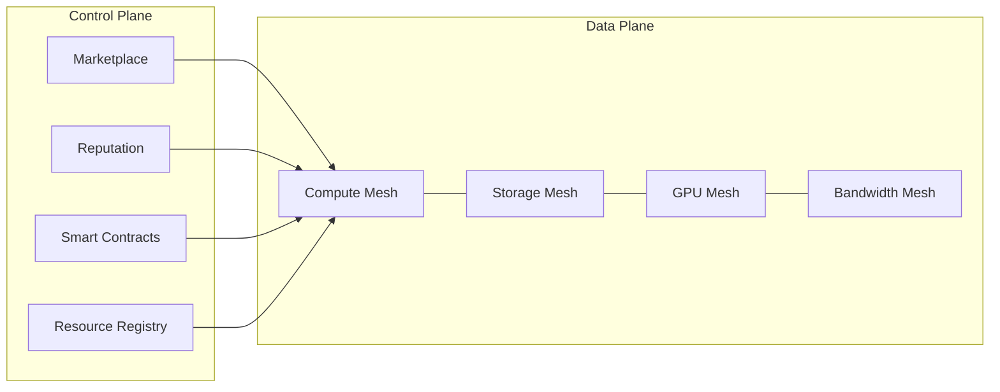

This creates a powerful property:

Even if the marketplace goes offline temporarily:

* Running workloads continue
* Storage remains accessible
* Applications stay online
* Existing mesh connections remain active

---

# Real World Mesh Formation

Nodes naturally cluster together.

Nearby resources become regional mini-clouds.

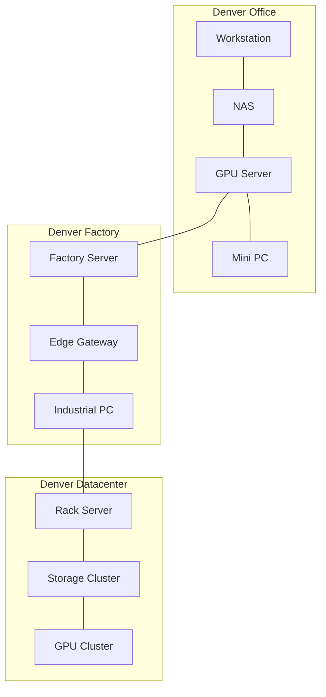

Instead of immediately sending workloads across the world:

AI THEO attempts to keep workloads local whenever possible.

---

# Edge-First Scheduling

Traditional cloud:

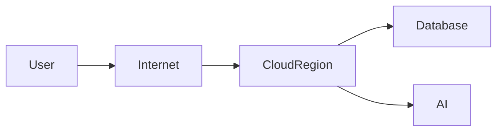

Every request travels to a distant region.

---

AI THEO:

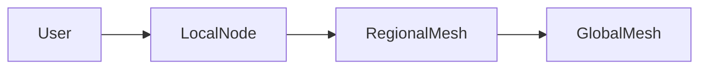

The scheduler always prefers:

1. Local node
2. Nearby node
3. Regional mesh
4. Global mesh

This minimizes:

* Latency
* Transit costs
* Bandwidth consumption

---

# Example: Minecraft Server

A practical example.

A group of friends wants a Minecraft server.

Traditional approach:

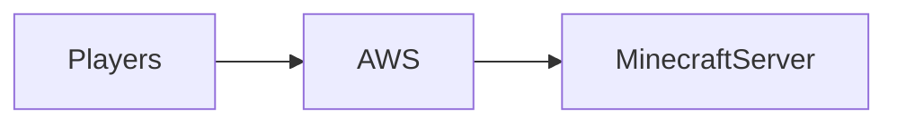

The server may be hundreds or thousands of miles away.

---

AI THEO approach:

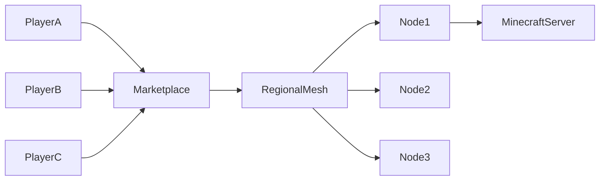

Marketplace selects:

* Lowest latency nodes
* Available compute
* Good reputation
* Competitive pricing

The result:

* Lower latency
* Lower hosting cost
* Revenue for node operators

---

# How Nodes Connect Securely

Discovery is multi-layered.

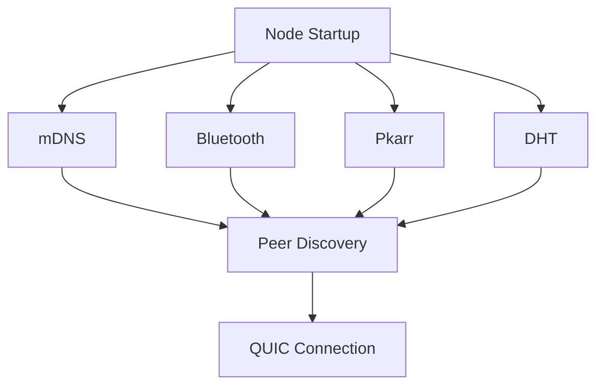

Each mechanism solves a different problem.

| Technology | Purpose                   |
| ---------- | ------------------------- |
| Bluetooth  | Nearby devices            |
| mDNS       | Local networks            |
| Pkarr      | Decentralized addressing  |
| DHT        | Global fallback discovery |

---

# Secure Connection Establishment

Every connection is encrypted before workload execution.

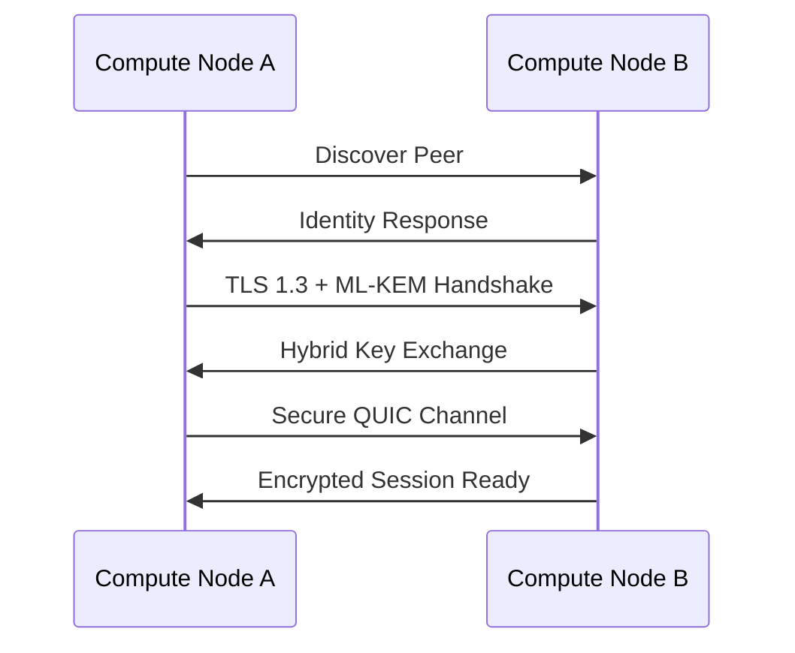

Benefits:

* Post-quantum migration path
* Forward secrecy
* Mutual authentication
* Encrypted transport

---

# Workload Execution Lifecycle

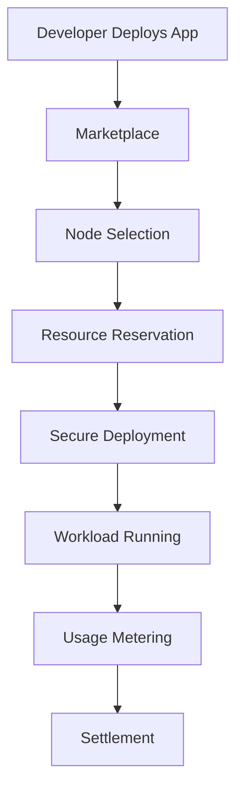

The marketplace never executes workloads.

It only coordinates placement.

---

# Distributed Storage Mesh

Storage behaves similarly.

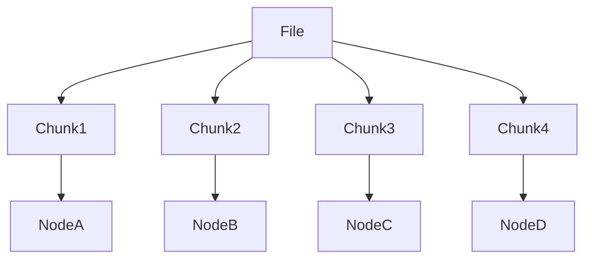

Advantages:

* No single point of failure
* Geographic redundancy
* Lower storage cost
* High availability

---

# AI Inference Mesh

AI workloads benefit enormously from edge placement.

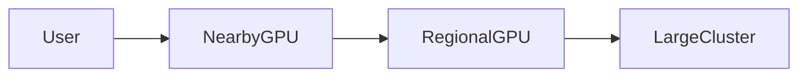

Scheduling preference:

1. Closest GPU
2. Lowest latency GPU
3. Lowest cost GPU
4. Available fallback GPU

This allows:

* Faster inference
* Reduced cloud spend
* Better privacy
* Lower bandwidth costs

---

# Trust & Reputation Layer

A decentralized marketplace still requires trust.

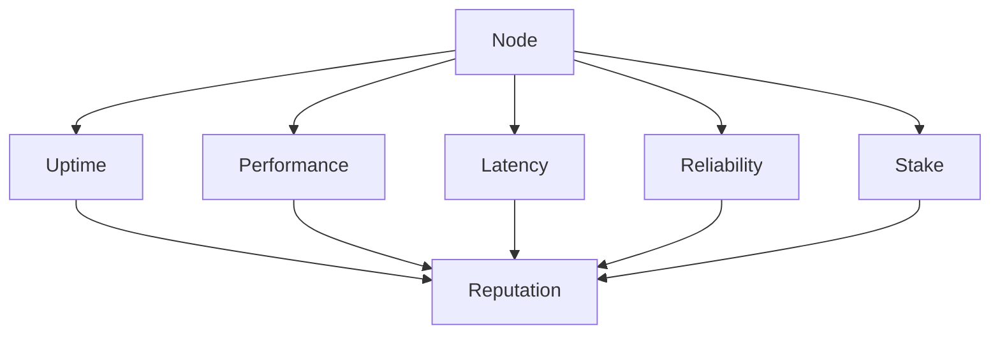

High quality providers receive:

* More workloads
* Higher earnings
* Premium services
* Enterprise contracts

---

# Security Architecture

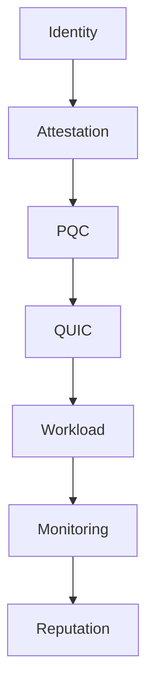

Layers include:

### Identity

Cryptographic node identity.

### Attestation

Verify trusted software and hardware.

### PQC

ML-KEM based key exchange.

### QUIC

Encrypted transport.

### Monitoring

Detect abuse and failures.

### Reputation

Economic incentives encourage good behavior.

---

# The End State

Instead of this:

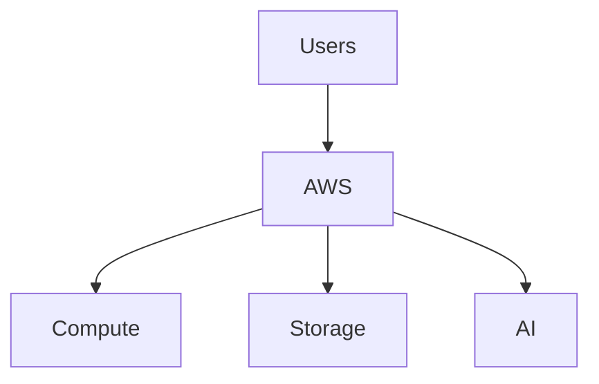

The future looks like:

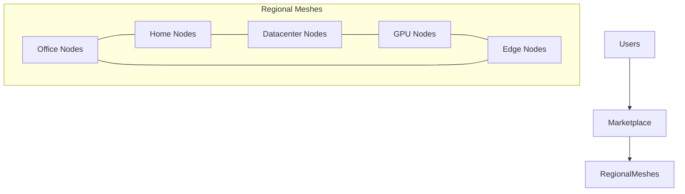

The marketplace becomes the economic and trust layer.

The mesh becomes the execution layer.

Together they create a decentralized cloud where anyone can contribute resources, developers can deploy globally with a single click, enterprises can build local hyperscalers, and users benefit from lower costs, lower latency, greater resilience, and a post-quantum-ready security architecture.
