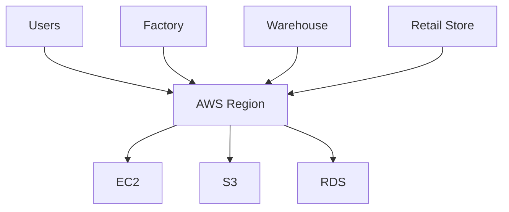
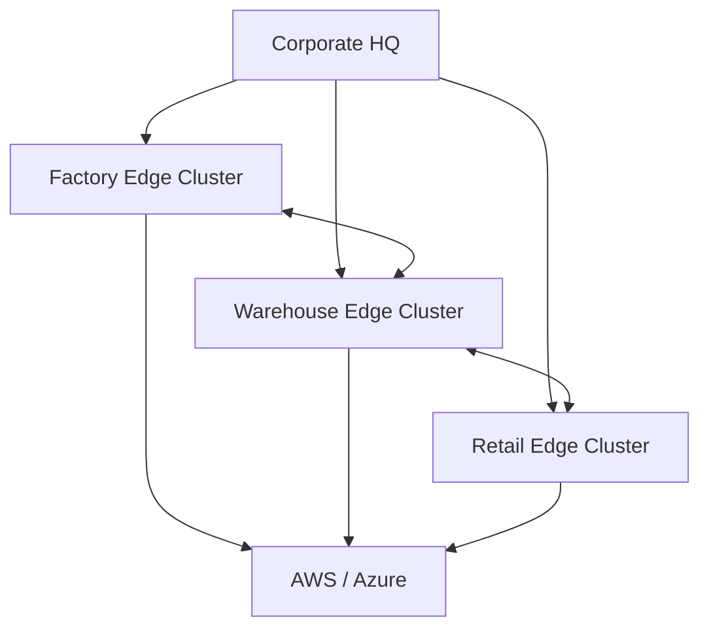
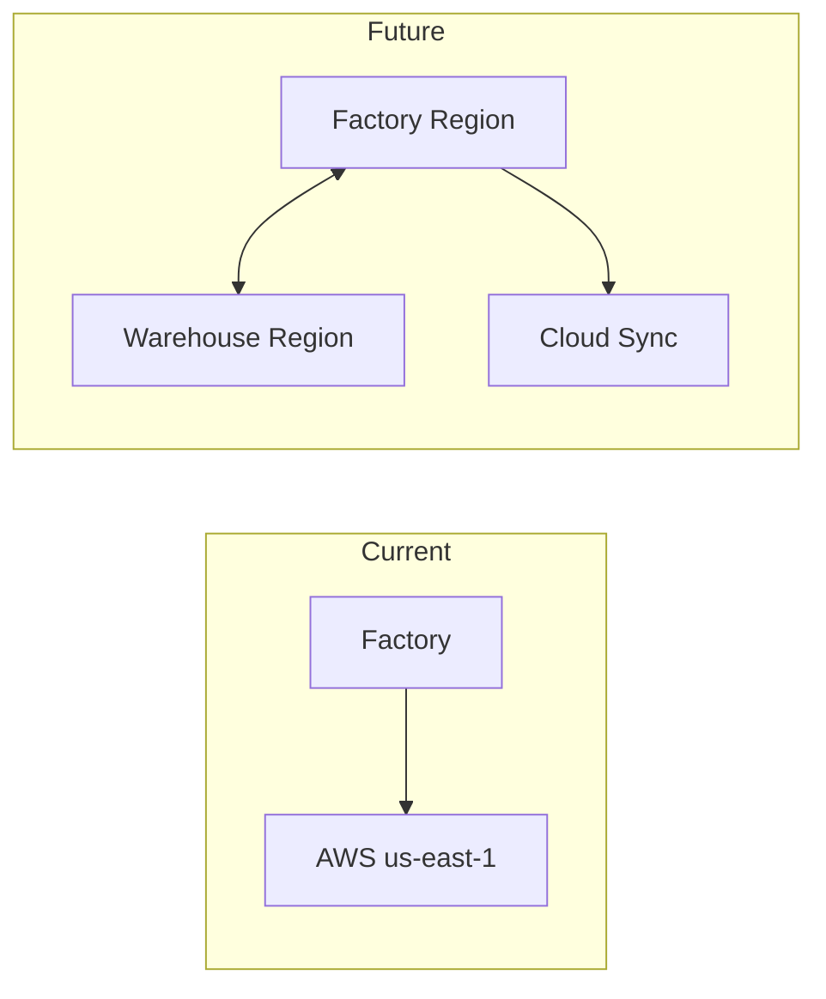
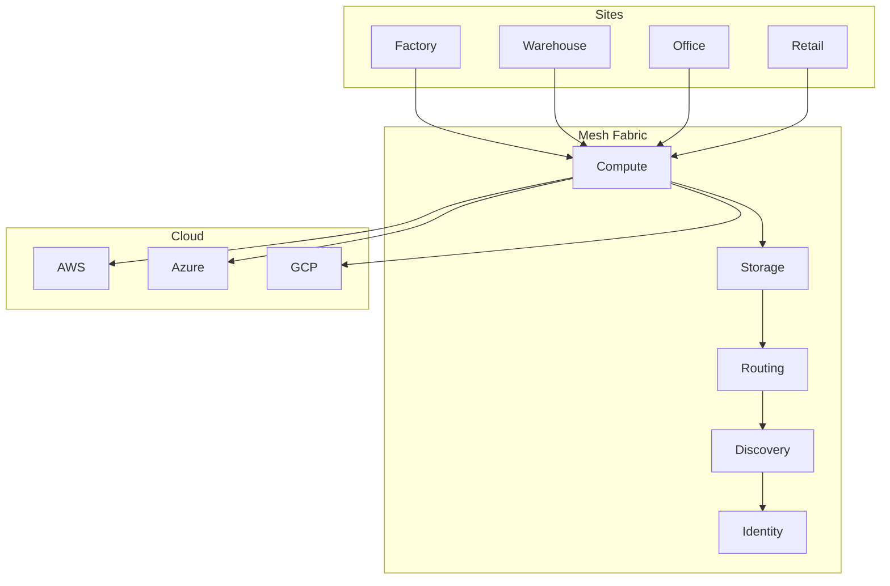
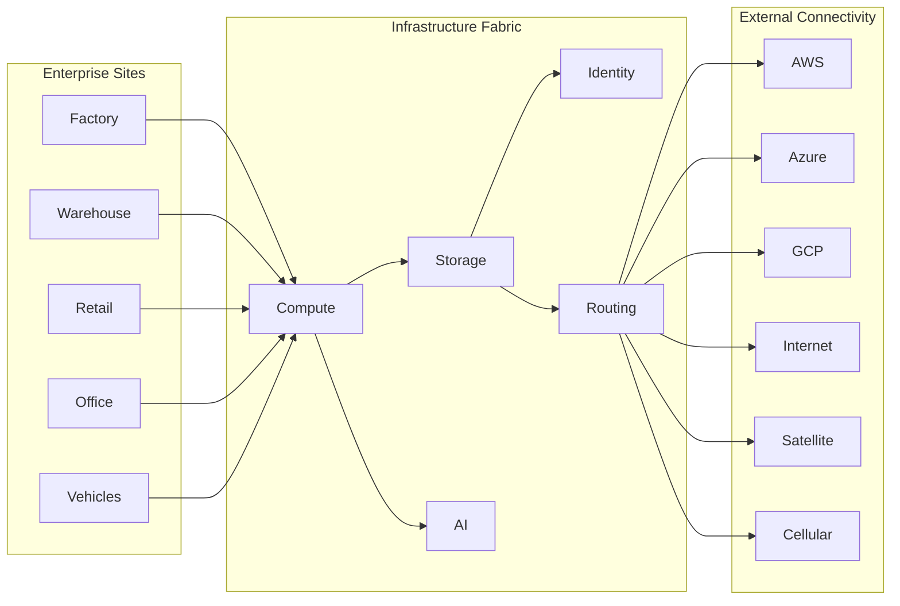

An enterprise CTO does not wake up thinking:

```text
I need a decentralized mesh.
```

They wake up thinking:

```text
AWS bill is too high.
Edge locations are expensive.
Latency is too high.
Remote sites lose connectivity.
Data sovereignty is difficult.
Cloud lock-in is risky.
```

The mesh is the mechanism.

Those are the products.

---

# Better Framing: The Enterprise Edge Cloud

Instead of:

```text
Global Mesh Network
```

Market:

```text
Enterprise Edge Cloud
```

Because that's immediately understandable.

---

# How AWS Works Today

A Fortune 500 company typically looks like this:



Problem:

Every site depends on the cloud.

Even if the compute is needed locally.

---

# Enterprise Edge Cloud Model

Instead of sending everything to AWS:



Now cloud becomes:

```text
Control Plane
Backup
Overflow Capacity
```

not:

```text
Everything
```

This is a much easier sale.

---

# The "Local AWS Region" Concept

This is probably your strongest enterprise product.

Imagine every customer location gets:

```text
Mini Region
```

A factory:

```text
Factory
├─ Compute
├─ Storage
├─ AI Models
├─ Identity
├─ Messaging
├─ Monitoring
└─ Sync
```

A warehouse:

```text
Warehouse
├─ Compute
├─ Storage
├─ AI Models
├─ Identity
├─ Messaging
├─ Monitoring
└─ Sync
```

All managed as one platform.

---

# Diagram: AWS Region vs Local Region



Notice:

Cloud still exists.

It just isn't the center anymore.

---

# Enterprise Mesh Architecture

This is closer to what I'd put on a website.



This starts to look like a platform.

---

# The Killer Use Cases

Instead of saying:

```text
We replace AWS.
```

Say:

### Manufacturing

```text
Factory AI continues running
even if WAN connectivity fails.
```

### Retail

```text
Stores continue operating
even during cloud outages.
```

### Defense

```text
Compute follows deployed units.
```

### Energy

```text
Substations process data locally.
```

### Logistics

```text
Warehouses synchronize directly.
```

Those are things AWS cannot easily do.

---

# Cloud Replacement Is The Wrong Story

I would avoid:

```text
AWS Replacement
```

and instead push:

```text
Cloud Extension
```

Phase 1:

```text
Cloud + Mesh
```

Phase 2:

```text
Cloud Optional
```

Phase 3:

```text
Cloud Independent
```

That is much easier for enterprises to adopt.

---

# The Diagram I Would Put On The Homepage

One large, clean diagram:



The message underneath would be:

> **Turn every site into a cloud region.**
>
> Run applications, storage, AI, and networking locally while remaining connected to existing cloud providers. Reduce latency, improve resilience, and eliminate dependence on centralized infrastructure.

That's a much stronger enterprise pitch than "decentralized mesh," because it translates the technology into something a CIO can immediately understand: **a local cloud region at every location they already operate.**
