# `marketplace/overview.md` — Part 1 of 2

This document should sit above the more technical marketplace documents. It explains **what the Autheo marketplace is, what problems it solves, who participates, and how the major components interact** without getting too deep into scheduling algorithms or settlement mechanics yet.

````markdown
# Autheo Compute Marketplace

> **Status:** Architecture Overview  
> **Audience:** Developers, infrastructure providers, enterprises, platform architects, and ecosystem participants
>
> This document provides a high-level architectural overview of the Autheo Compute Marketplace. It explains how infrastructure supply and application demand are brought together, how workloads move from deployment request to execution, and how the marketplace interacts with the Autheo distributed compute fabric and Layer 1 trust infrastructure.

---

# Table of Contents

- [Overview](#overview)
- [What the Marketplace Is](#what-the-marketplace-is)
- [What the Marketplace Is Not](#what-the-marketplace-is-not)
- [The Marketplace Model](#the-marketplace-model)
- [Participants](#participants)
- [Infrastructure Supply](#infrastructure-supply)
- [Application Demand](#application-demand)
- [Marketplace Architecture](#marketplace-architecture)
- [Control Plane and Execution Plane](#control-plane-and-execution-plane)
- [Resource Discovery](#resource-discovery)
- [Workload Placement](#workload-placement)
- [Locality and Edge Computing](#locality-and-edge-computing)
- [Enterprise Resource Pools](#enterprise-resource-pools)
- [Marketplace Lifecycle](#marketplace-lifecycle)
- [Node Operator Lifecycle](#node-operator-lifecycle)
- [Developer Deployment Lifecycle](#developer-deployment-lifecycle)
- [Marketplace Economics](#marketplace-economics)
- [Trust and Reputation](#trust-and-reputation)
- [Resilience](#resilience)
- [Platform Boundaries](#platform-boundaries)

---

# Overview

The Autheo Compute Marketplace is the coordination layer connecting application developers and infrastructure providers across the Autheo distributed compute network.

Traditional cloud providers operate centralized infrastructure and sell access to resources they own or control.

Autheo enables a different model.

Independent infrastructure providers can contribute available resources to a common marketplace:

- CPU
- GPU
- Memory
- Storage
- Bandwidth
- Edge compute
- Specialized hardware
- AI accelerators

Developers can then deploy applications against this distributed resource pool without needing to individually discover, negotiate with, or manage the underlying machines.

The marketplace coordinates the relationship between **resource supply** and **application demand**.

```mermaid
flowchart LR

    Providers["Infrastructure Providers"]

    Marketplace["Autheo Compute Marketplace"]

    Developers["Developers & Applications"]

    Providers -->|"Resource Supply"| Marketplace
    Developers -->|"Resource Demand"| Marketplace

    Marketplace -->|"Placement & Deployment"| Developers
    Marketplace -->|"Workload Allocation"| Providers
````

The marketplace therefore acts as the bridge between the economic and operational sides of the distributed cloud.

---

# What the Marketplace Is

The marketplace is a distributed cloud control system responsible for coordinating infrastructure.

Its responsibilities include:

* Resource discovery
* Resource registration
* Capacity management
* Workload placement
* Scheduling
* Pricing
* Service policies
* Usage measurement
* Provider reputation
* Billing
* Settlement coordination
* Infrastructure health
* Enterprise policy enforcement

The marketplace does not need to own the physical infrastructure.

Instead, it provides the protocols and services necessary to coordinate infrastructure owned by many independent parties.

---

# What the Marketplace Is Not

The marketplace is not:

* The blockchain
* The physical compute network
* A single datacenter
* A hypervisor
* A container runtime
* A centralized application server
* A replacement for every existing cloud provider

The distinction between these systems is fundamental.

```text
Autheo Layer 1
        │
        │ Trust / Settlement
        ▼
Marketplace
        │
        │ Scheduling / Coordination
        ▼
Distributed Compute Fabric
        │
        │ Execution
        ▼
Applications
```

The marketplace determines **where and under what conditions a workload should run**.

The compute fabric actually runs it.

---

# The Marketplace Model

The marketplace operates around two fundamental sides:

```text
                    MARKETPLACE

          ┌───────────────────────────┐
          │                           │
          │       RESOURCE SUPPLY     │
          │                           │
          │  Servers                  │
          │  GPUs                     │
          │  Storage                  │
          │  Edge Nodes               │
          │  Bandwidth                │
          │                           │
          └─────────────┬─────────────┘
                        │
                        ▼
              ┌──────────────────┐
              │     MATCHING     │
              │                  │
              │ Scheduling       │
              │ Pricing          │
              │ Policy           │
              │ Reputation       │
              └────────┬─────────┘
                       │
                       ▼
          ┌───────────────────────────┐
          │                           │
          │       RESOURCE DEMAND     │
          │                           │
          │  Web Applications        │
          │  AI Workloads            │
          │  Game Servers            │
          │  Databases               │
          │  APIs                    │
          │  Enterprise Services     │
          │                           │
          └───────────────────────────┘
```

The marketplace continuously matches available resources with workloads that require them.

---

# Participants

The marketplace supports several classes of participants.

## Developers

Developers publish and deploy applications.

They may require:

* CPU
* Memory
* GPU
* Storage
* Networking
* Databases
* AI inference
* Regional execution

Developers interact primarily through the Autheo Developer Platform.

---

## Infrastructure Providers

Infrastructure providers contribute resources.

A provider could be:

* An individual
* A small business
* A hosting provider
* A datacenter
* An enterprise
* A university
* A telecommunications operator
* A GPU operator

A provider decides which resources are available to the marketplace.

---

## Enterprises

Enterprises can operate private infrastructure while optionally participating in the public marketplace.

They may use the marketplace for:

* Internal scheduling
* Hybrid cloud
* Cloud bursting
* Disaster recovery
* Regional infrastructure
* Specialized compute
* External capacity

---

## Application Users

Application users do not necessarily interact with the marketplace directly.

They interact with applications deployed through the marketplace.

For example:

```text
Player
   │
   ▼
Minecraft Server
   │
   ▼
Autheo Compute Node
```

The user experiences an application.

The marketplace handles the infrastructure underneath it.

---

# Infrastructure Supply

Every participating node contributes a defined set of resources.

A node may advertise:

```text
CPU
 ├── Architecture
 ├── Core count
 └── Available capacity

Memory
 └── Available RAM

GPU
 ├── Vendor
 ├── Model
 ├── VRAM
 └── Available capacity

Storage
 ├── Capacity
 ├── Type
 └── Performance

Network
 ├── Bandwidth
 ├── Latency
 └── Connectivity

Location
 ├── Geographic region
 └── Network region

Runtime
 ├── Containers
 ├── WASM
 └── Other supported runtimes
```

The marketplace uses these attributes to determine which workloads a node can satisfy.

---

# Resource Providers Form the Supply Side

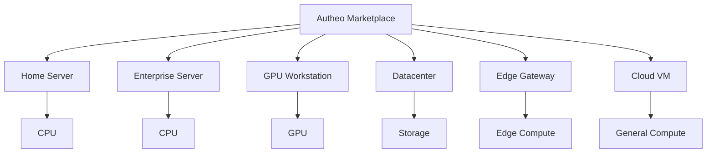

These resources do not need to be physically located together.

The marketplace creates a logical resource pool across them.

---

# Application Demand

Applications consume resources according to their requirements.

A workload might specify:

```text
CPU:
    4 cores

Memory:
    16 GB

GPU:
    Optional

Storage:
    100 GB

Region:
    North America

Network:
    Low latency

Availability:
    Multi-node

Runtime:
    Container
```

The marketplace transforms these requirements into a placement request.

---

# Marketplace Architecture

The marketplace itself consists of several logical services.

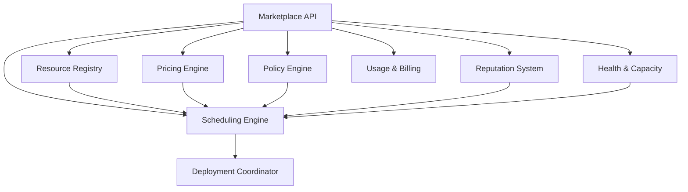

These components can evolve independently.

The marketplace does not need to be implemented as one monolithic service.

---

# Resource Registry

The Resource Registry maintains information about participating infrastructure.

It tracks information such as:

* Node identity
* Available resources
* Hardware capabilities
* Network characteristics
* Geographic location
* Runtime support
* Availability
* Policy restrictions
* Service status

The registry answers:

> **"What resources exist?"**

It does not answer:

> **"Which resource should run this workload?"**

That is the scheduler's responsibility.

---

# Scheduling Engine

The Scheduling Engine determines where workloads should execute.

It considers:

* Resource availability
* Workload requirements
* Location
* Network latency
* Cost
* Reliability
* Provider reputation
* Enterprise policies
* Data locality
* Security requirements

The scheduler answers:

> **"Which resources are the best match for this workload?"**

---

# Pricing Engine

The Pricing Engine determines the economic cost of resource usage.

Pricing can consider:

* Supply
* Demand
* Resource type
* Duration
* Location
* Availability
* Performance
* Provider policies
* Contract terms

A GPU in one region does not necessarily need to cost the same as an equivalent GPU in another region.

The marketplace can therefore support geographically and technically differentiated resource markets.

---

# Policy Engine

The Policy Engine applies placement and infrastructure rules.

Examples:

```text
Enterprise A:

Sensitive workloads
→ Enterprise infrastructure only

Customer data
→ United States only

AI workloads
→ Approved GPU providers

Production workloads
→ Minimum reliability requirement

Development workloads
→ Public marketplace permitted
```

Policy is evaluated before workload placement.

---

# Trust and Reputation

A distributed marketplace cannot rely solely on price.

Infrastructure quality matters.

The marketplace therefore maintains provider performance information.

Possible measurements include:

* Uptime
* Availability
* Performance
* Network quality
* Successful workload completion
* Historical reliability
* Resource accuracy
* SLA compliance

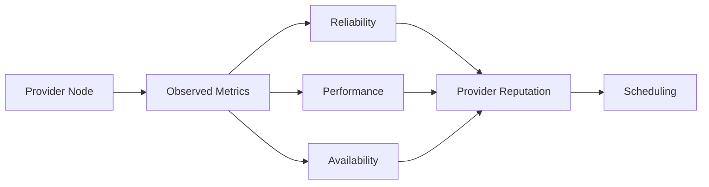

Reputation becomes an input to placement decisions.

---

# Control Plane and Execution Plane

The marketplace is the control plane.

Nodes are the execution plane.

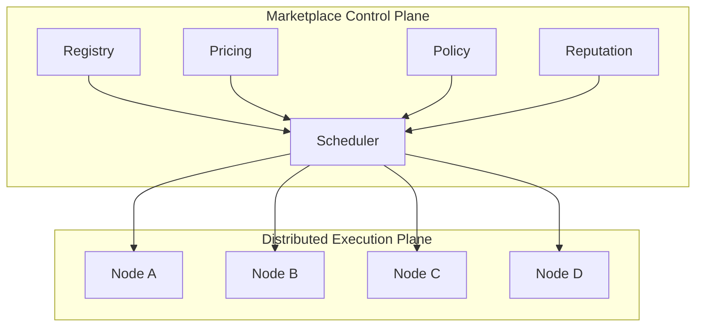

This separation allows the execution network to continue operating independently of individual marketplace services.

---

# Resource Discovery

Resource discovery occurs continuously.

A node joining the network does not simply announce:

> "I am a server."

It announces what it can actually provide.

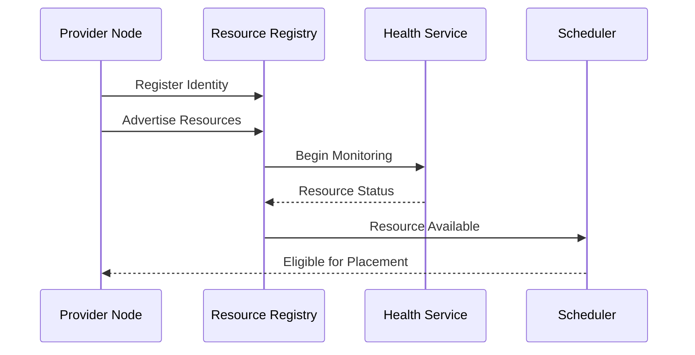

Resources can subsequently change.

For example:

```text
Node has:

32 CPU cores

        ↓

Workload begins

        ↓

20 cores consumed

        ↓

12 cores available
```

The marketplace updates capacity accordingly.

---

# Workload Placement

A deployment request enters the marketplace as a set of requirements.

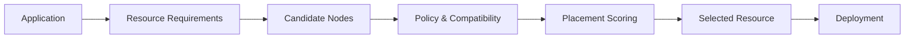

The marketplace should eliminate unsuitable resources before attempting placement.

---

# Locality and Edge Computing

Location is one of the marketplace's most important optimization variables.

Consider three nodes:

```text
User
 │
 ├── Node A → 5 ms
 │
 ├── Node B → 35 ms
 │
 └── Node C → 140 ms
```

If all three nodes provide equivalent resources, Node A is usually the preferable placement.

This can reduce:

* Network latency
* Bandwidth consumption
* Transit costs
* Application response time

---

# Regional Compute

Nearby nodes naturally form regional compute pools.

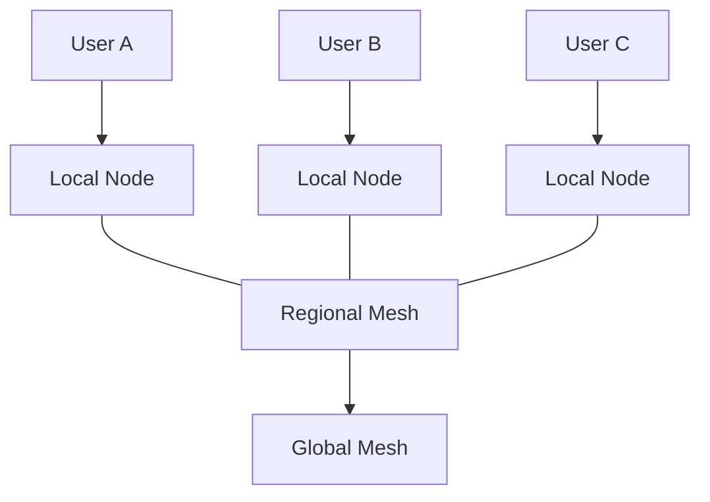

The global network becomes a fallback and coordination layer rather than the mandatory path for every request.

---

# Example: Multiplayer Game

Consider a group of players located in the same city.

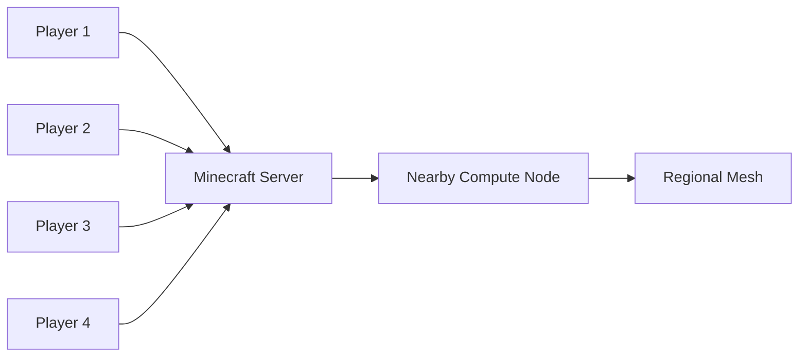

The marketplace can identify available compute close to the players and deploy the game server there.

If that node fails, the workload can be rescheduled to another suitable resource.

---

# Enterprise Resource Pools

The same marketplace model applies inside enterprises.

An enterprise can create a resource domain containing:

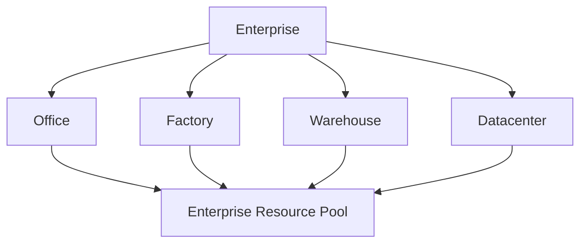

The enterprise can then apply policies to determine which workloads can consume those resources.

---

# Public and Private Markets

The marketplace can support multiple resource domains.

```text
                    Autheo Marketplace

          ┌──────────────┬──────────────┐
          │              │              │

     Public Market   Enterprise A   Enterprise B

          │              │              │

     Open Nodes      Private Nodes   Private Nodes

          │              │              │

          └──────────────┼──────────────┘
                         │
                  Distributed Cloud
```

This allows Autheo to support:

* Public workloads
* Private workloads
* Permissioned workloads
* Enterprise workloads
* Hybrid workloads

without requiring separate infrastructure platforms.

---

# Marketplace Lifecycle

The marketplace follows a continuous lifecycle.

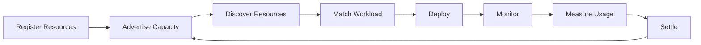

This lifecycle repeats continuously as infrastructure and workloads change.

---

# Node Operator Lifecycle

A provider follows a separate lifecycle.

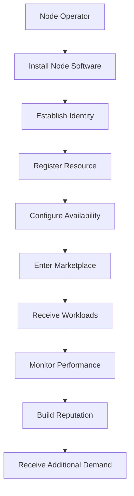

A successful provider can increase participation by adding more capacity.

---

# Developer Deployment Lifecycle

Developers experience a much simpler process.

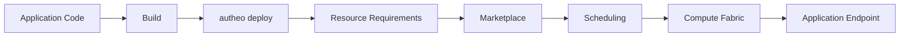

The infrastructure complexity remains behind the platform interface.

---

# Marketplace Economics

The marketplace creates a two-sided economic system.

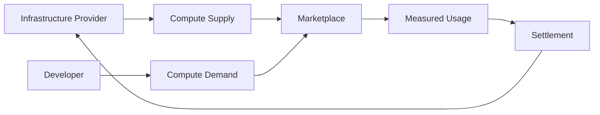

Providers monetize unused capacity.

Developers purchase access to infrastructure.

The marketplace coordinates the exchange.

---

# Why This Model Can Be Efficient

Traditional infrastructure is often provisioned around peak demand.

```text
Capacity

100% ┤                    █
     │                    █
 80% ┤          █         █
     │          █         █
 60% ┤ █        █         █
     │ █        █         █
 40% ┤ █        █         █
     │ █        █         █
 20% ┤ █        █         █
     │ █        █         █
  0% └────────────────────────
       Time
```

Large amounts of infrastructure may remain underutilized.

A distributed marketplace can aggregate unused capacity from many independent systems.

```text
Provider A → 40% unused

Provider B → 30% unused

Provider C → 60% unused

Provider D → 20% unused

              ↓

        Marketplace

              ↓

      Available Capacity
```

The marketplace turns fragmented unused resources into a coordinated resource pool.

---

# Resource Specialization

The marketplace does not need every node to be identical.

Different providers can specialize.

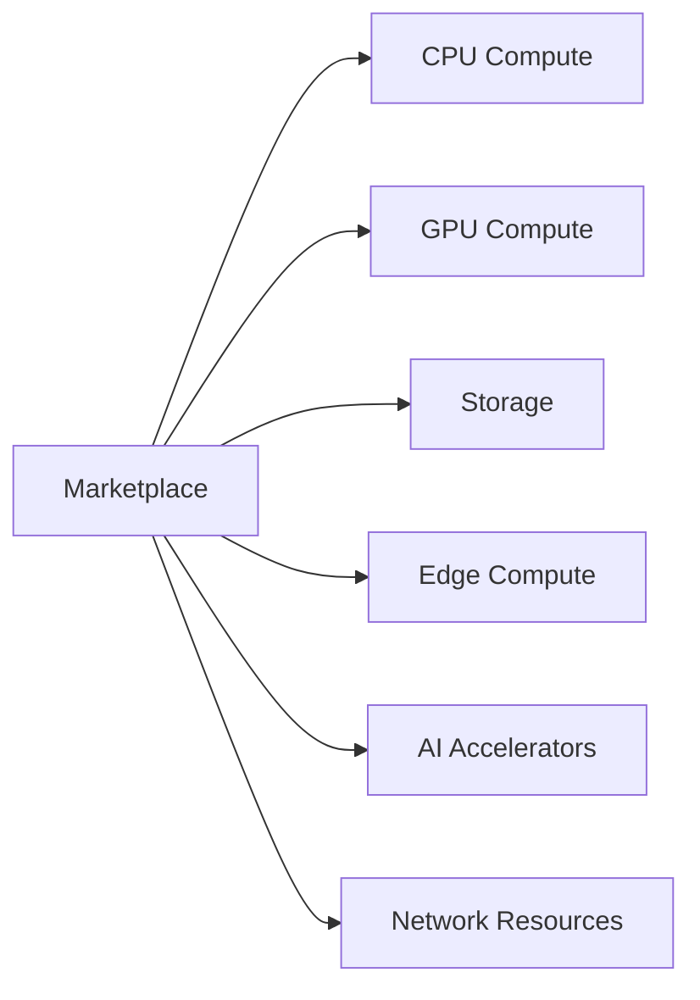

This creates a heterogeneous cloud capable of matching specialized workloads to specialized infrastructure.

---

# Marketplace and Layer 1

The marketplace and Layer 1 have separate responsibilities.

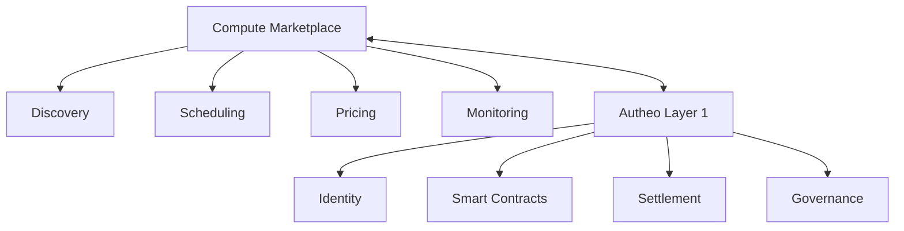

The marketplace uses Layer 1 where decentralized trust and settlement are valuable.

It does not require every scheduling decision to occur on-chain.

---

# Off-Chain Operations

High-frequency operational events should generally remain off-chain.

Examples include:

* Node heartbeats
* CPU utilization
* Network latency
* Scheduling decisions
* Deployment events
* Service health
* Real-time metrics

Putting every operational event directly on a blockchain would create unnecessary latency and scalability constraints.

The blockchain instead provides durable trust and settlement mechanisms where appropriate.

---

# On-Chain Anchoring

Selected marketplace events may be represented through cryptographic proofs or settlement records.

```text
Off-Chain Operations

Node telemetry
      │
      ▼
Marketplace
      │
      ▼
Usage calculation
      │
      ▼
Settlement record
      │
      ▼
Layer 1
```

This provides a balance between distributed trust and operational performance.

---

# Platform Boundaries

The marketplace sits between the developer experience and the infrastructure fabric.

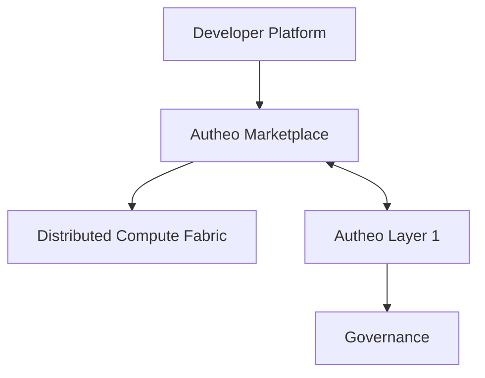

Each boundary is intentional.

The developer platform should not manage individual machines.

The compute nodes should not determine marketplace pricing.

The blockchain should not execute every workload.

Governance should not directly operate infrastructure.

---

# Marketplace as the Cloud Control Plane

The marketplace can therefore be understood as Autheo's distributed cloud control plane.

Its job is to continuously answer five questions:

### 1. What resources exist?

**Resource Discovery**

### 2. What resources are available?

**Capacity Management**

### 3. Where should this workload run?

**Scheduling**

### 4. What should it cost?

**Marketplace & Pricing**

### 5. Can we trust this resource?

**Identity, Reputation & Policy**

Together these capabilities transform a collection of independent machines into a usable cloud platform.

---

# Architectural Model

At a high level:

```text
                    AUTHEO

              Developer Platform
                       │
                       ▼
              ┌─────────────────┐
              │    MARKETPLACE  │
              │                 │
              │ Discovery       │
              │ Scheduling      │
              │ Pricing         │
              │ Policy          │
              │ Reputation      │
              │ Billing         │
              └────────┬────────┘
                       │
          ┌────────────┼────────────┐
          │            │            │

       Edge         Compute      Storage

          │            │            │

       GPU Nodes    Servers      Storage

          └────────────┼────────────┘
                       │
                Distributed Cloud
```

The marketplace is therefore not simply a place to "buy compute."

It is the **coordination system that turns independently operated infrastructure into a programmable distributed cloud.**

```

## Part 2 will go deeper into the marketplace mechanics

The second half of `marketplace/overview.md` should then cover the **actual operating model**:

- Node onboarding and verification
- Resource advertisements
- Workload requirements
- Matching and scoring
- Local → regional → global scheduling
- Dynamic pricing
- Reservations
- Usage metering
- Provider reputation
- SLAs
- Escrow and settlement
- Failover
- Replication
- Enterprise policies
- Public vs private resource markets
- How `$THEO` fits into the economic layer
- How a provider actually earns from a node
- How a developer actually pays for compute
- How the marketplace prevents bad nodes from poisoning the network
- How the marketplace scales without putting every decision on the L1

That will make Part 2 the **"how the marketplace operates"** document, while this first half remains the architectural overview.
```
