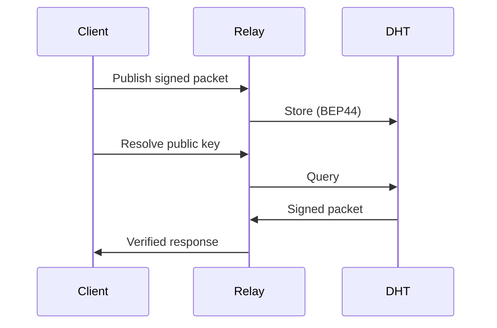

## How It Works

1. **Generate a keypair** — Your public key becomes your domain name
2. **Sign DNS records** — Standard A, AAAA, TXT, CNAME records, self-signed
3. **Publish to the DHT** — Records stored on the [Mainline DHT](https://en.wikipedia.org/wiki/Mainline_DHT) (10M+ nodes)
4. **Resolve anywhere** — Anyone can query and verify your records

### The Network

PKARR uses the [Mainline DHT](https://en.wikipedia.org/wiki/Mainline_DHT), the same peer-to-peer network that powers BitTorrent. Records are stored using [BEP44](https://www.bittorrent.org/beps/bep_0044.html) (mutable items). With 15 years of proven reliability and 10+ million active nodes, there's no need to bootstrap a new network.

### Key Points

- **Records are ephemeral** — The DHT drops records after hours; republish periodically
- **1000-byte limit** — PKARR is for discovery, not storage
- **Caching everywhere** — Clients and relays cache aggressively for performance
- **Relays for browsers** — Web apps use HTTP relays since browsers cannot open UDP sockets

PKARR is the I/O library that reads and writes DNS records to the DHT.
