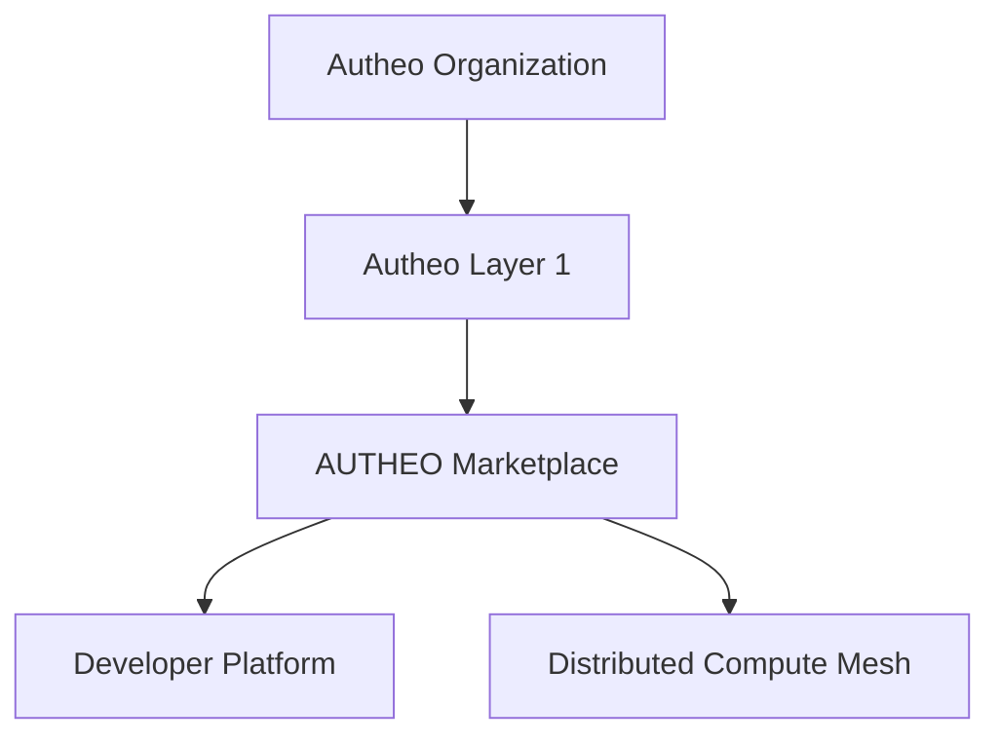
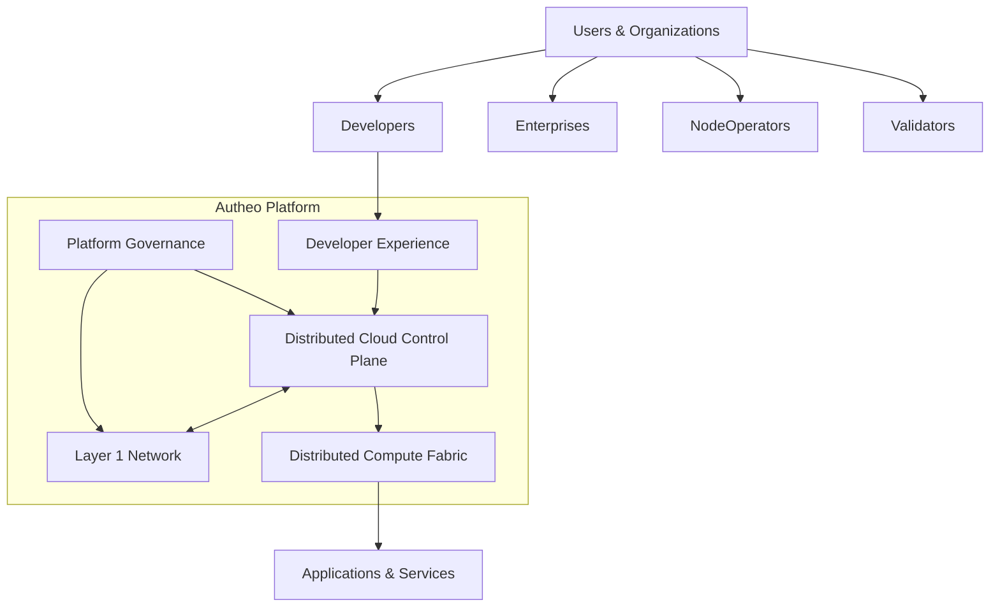
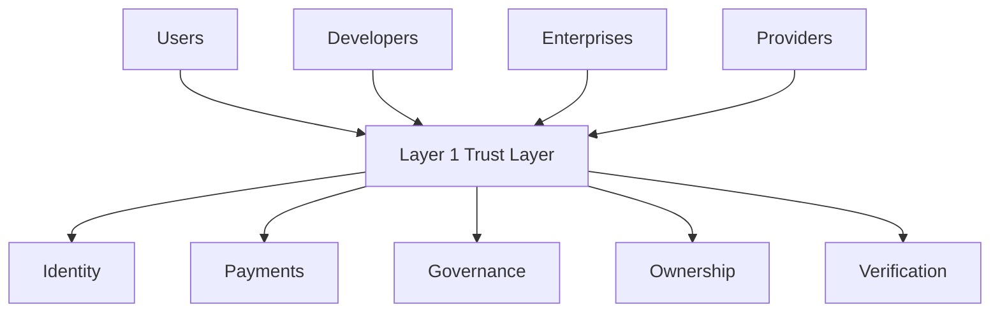
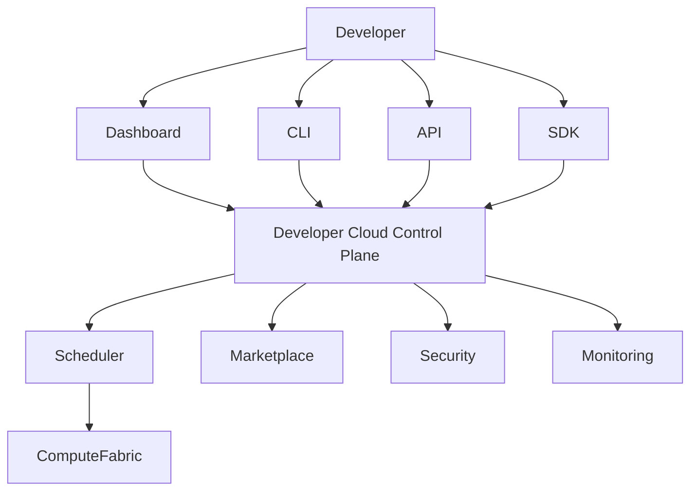
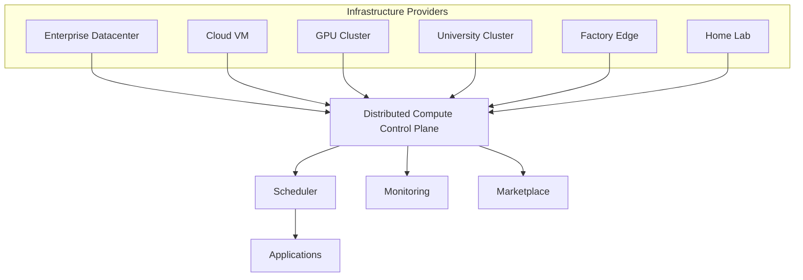
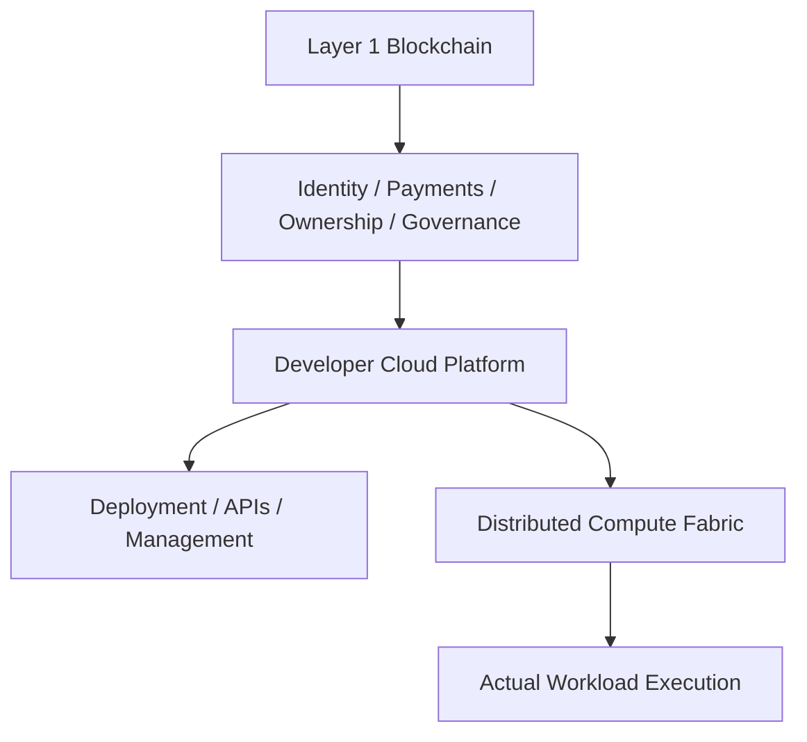
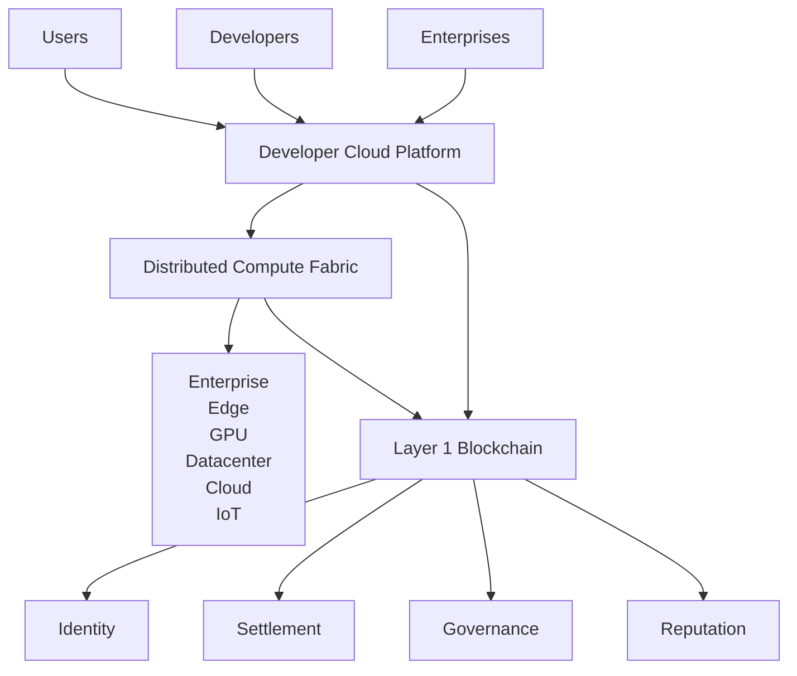

# Platform Overview


> **"What exactly is AUTHEO?"**


# AUTHEO Platform

## Building the Internet's Distributed Cloud

---

# Overview

Traditional cloud platforms are built around centralized infrastructure.

Organizations rent compute, storage, networking, databases, and AI services from large hyperscale data centers operated by a handful of providers.

AUTHEO takes a fundamentally different approach.

Rather than concentrating infrastructure into massive facilities, AUTHEO enables anyone—from individuals and startups to enterprises and cloud providers—to contribute computing resources into a secure global marketplace. Those independently operated resources form a unified distributed cloud capable of running applications, AI workloads, storage services, networking, and edge infrastructure.

The result is a platform that combines the flexibility of public cloud computing with the resilience, ownership, and locality of decentralized infrastructure.

---

# Platform Philosophy

```text
                 Traditional Cloud

Applications

        │

Hyperscaler

        │

Massive Datacenter

        │

Thousands of Servers

──────────────────────────────────────

              AUTHEO

Applications

        │

Developer Platform

        │

Marketplace

        │

Distributed Compute Mesh

        │

Millions of Independent Nodes
```

Instead of asking:

> *Where is the nearest cloud region?*

AUTHEO asks:

> *What resources already exist nearby?*

Every office server.

Every GPU workstation.

Every enterprise datacenter.

Every edge gateway.

Every university cluster.

Every home lab.

Can become part of the distributed cloud.

---

# Multiple Independent Products

The platform is intentionally divided into several independent systems.

Each solves a different problem.



Each product evolves independently while interoperating through stable interfaces.

---

# 1. Autheo Organization

The organization stewards the ecosystem.

Responsibilities include:

* Protocol stewardship
* Long-term roadmap
* Ecosystem grants
* Standards
* Governance
* Community development
* Treasury oversight
* Strategic partnerships

Importantly:

The organization does **not** operate customer infrastructure.

Instead, it develops and maintains the protocols that enable an open ecosystem.

---

# 2. Autheo Layer 1

The blockchain provides trust.

Not compute.

Its responsibilities include:

* Identity
* Smart contracts
* Settlement
* Staking
* Governance
* Auditing
* Payments
* Asset ownership
* Reputation anchoring

Applications are generally **not executed directly on-chain**. Instead, the blockchain acts as the cryptographic trust layer that coordinates economic activity across the platform.

---

# 3. AUTHEO Compute Marketplace

The marketplace serves as the platform's global control plane.

Its responsibilities include:

* Resource discovery
* Workload scheduling
* Marketplace matching
* Capacity planning
* Pricing
* Billing
* Reputation
* Service-level policies
* Monitoring
* Multi-region orchestration

The marketplace determines **where workloads should execute**, but does not execute them itself.

---

# 4. Distributed Compute Mesh

The compute mesh is the execution layer.

It consists of independently operated nodes contributing:

* CPU compute
* GPU compute
* Storage
* Networking
* AI inference
* Serverless functions
* Containers
* Databases
* Object storage
* Content delivery

Rather than relying on a handful of hyperscale regions, workloads execute wherever resources are available and appropriate.

---

# 5. Developer Platform

Developers interact with AUTHEO through a modern cloud-native experience.

Capabilities include:

* CLI
* SDKs
* REST APIs
* Templates
* Deployment pipelines
* Marketplace publishing
* Monitoring
* Logs
* Metrics
* Billing dashboards

From the developer's perspective, deploying to AUTHEO should feel as simple as deploying to Vercel, Fly.io, or AWS—while the platform transparently handles decentralized scheduling and execution.

---

# How Everything Fits Together

```mermaid
flowchart LR

Developer

-->

Developer Platform

-->

Marketplace

-->

Compute Mesh

-->

Users

Marketplace

<-->

Layer 1

Layer 1

<-->

Organization
```

Each layer has a distinct responsibility:

* **Organization** governs the ecosystem.
* **Layer 1** establishes trust and economic coordination.
* **Marketplace** coordinates workloads and resources.
* **Compute Mesh** executes workloads.
* **Developer Platform** provides the user experience.

This separation of concerns allows each component to evolve independently while maintaining a cohesive platform.

---

# Why This Architecture Matters

Most decentralized platforms begin with a blockchain and attempt to build applications around it.

AUTHEO begins with the applications developers want to build—web services, AI inference, storage, databases, multiplayer games, APIs, and enterprise software—and uses decentralized technologies only where they provide clear value.

This architecture offers several advantages:

| Traditional Model                         | AUTHEO Model                                                     |
| ----------------------------------------- | ----------------------------------------------------------------- |
| Centralized infrastructure                | Distributed resource marketplace                                  |
| Fixed cloud regions                       | Global edge-first compute mesh                                    |
| Cloud provider owns infrastructure        | Infrastructure owned by participants                              |
| Applications tied to one provider         | Portable across heterogeneous nodes                               |
| Limited hardware diversity                | CPUs, GPUs, edge devices, servers, home labs, enterprise clusters |
| Blockchain used for application execution | Blockchain used for trust, settlement, and governance             |

---

## One recommendation I'd make


* **Autheo** → Ecosystem

  * **Autheo Layer 1**
  * **AUTHEO Compute Marketplace**
  * **AUTHEO Developer Platform**
  * **AUTHEO Distributed Mesh**
  * Future products...


# Autheo Platform Architecture

## Platform Overview

---

# Building the Distributed Internet Cloud

Autheo is a distributed cloud platform that enables developers, enterprises, infrastructure providers, and communities to collectively build and operate the next generation of Internet infrastructure.

Unlike traditional hyperscalers, which centralize compute into massive regional data centers, Autheo coordinates independently owned infrastructure through open protocols, cryptographic trust, and intelligent workload scheduling.

The result is a cloud platform that combines the scalability of hyperscale computing with the locality, resilience, and ownership benefits of decentralized infrastructure.

The platform is organized into four core platform pillars, each responsible for a distinct aspect of the ecosystem.

---

# Platform Architecture



One platform.

Clearly separated responsibilities.

Loosely coupled systems.

---

# Platform Design Principles

Autheo is designed around a small number of architectural principles that influence every component of the ecosystem.

## Separation of Responsibility

Every subsystem has a clearly defined purpose.

The blockchain establishes trust.

The marketplace coordinates infrastructure.

The mesh executes workloads.

The developer platform provides the deployment experience.

No subsystem attempts to perform every function.

This separation allows each component to evolve independently without disrupting the rest of the platform.

---

## Open Infrastructure

Autheo does not own the Internet.

It enables others to contribute to it.

Infrastructure can be contributed by:

* Enterprises
* Universities
* Cloud providers
* Independent operators
* Home laboratories
* Telecommunications providers
* Edge infrastructure providers
* GPU farms
* Hosting companies

The platform grows by expanding participation rather than constructing centralized infrastructure.

---

## Edge-First Architecture

Applications should execute as close to users as practical.

Instead of routing every request through a distant cloud region, Autheo attempts to utilize nearby resources whenever possible.

```text
Traditional Cloud

User

↓

Regional Datacenter

↓

Application


Autheo

User

↓

Local Edge Cluster

↓

Regional Mesh

↓

Global Mesh (only if needed)
```

Locality improves:

* Latency
* Reliability
* Bandwidth efficiency
* Privacy
* Infrastructure utilization

---

# The Four Platform Pillars

---

# 1. Platform Governance

Platform Governance is responsible for the long-term stewardship of the Autheo ecosystem.

Unlike operational infrastructure, governance does not participate in application execution.

Instead, it defines the policies and standards that enable long-term platform stability.

Responsibilities include:

* Protocol evolution
* Technical standards
* Ecosystem funding
* Community governance
* Strategic partnerships
* Treasury management
* Reference implementations
* Long-term roadmap

Governance establishes direction.

It does not operate customer workloads.

---

I would restructure this section around the **actual platform architecture**, separating **trust**, **developer experience**, and **compute execution**. The key distinction is:

* **Layer 1 = economic + cryptographic coordination layer**
* **Developer Platform = interface and tooling layer developers interact with**
* **Distributed Compute Fabric = physical execution layer where workloads run**

The blockchain should not sound like "the cloud runs on-chain." It should sound like the blockchain provides **coordination, ownership, verification, and incentives** while the compute network provides actual infrastructure.

Here is a more professional architecture-document version:

---

# 2. Layer 1 Network — Decentralized Trust and Coordination Layer

The Layer 1 blockchain provides the foundational trust infrastructure for the distributed cloud ecosystem.

Rather than attempting to replace traditional cloud execution environments, the Layer 1 network serves as the **coordination and settlement layer** that enables independent infrastructure providers, developers, enterprises, and users to participate in a shared compute marketplace.

The blockchain establishes verifiable trust between parties that may not know or directly trust each other.

## Core Responsibilities

The Layer 1 blockchain provides the platform's cryptographic trust layer.


### Decentralized Identity

Establishes cryptographic identities for:

* Infrastructure providers
* Developers
* Applications
* Organizations
* Devices
* Services

Identity enables secure authentication, authorization, ownership verification, and reputation tracking across the network.

Rather than functioning as the primary execution environment, the blockchain establishes shared trust between otherwise independent infrastructure providers.

Core responsibilities include:

* Decentralized identity
* Validator consensus
* Smart contracts
* Settlement
* Staking
* Governance voting
* Marketplace payments
* Immutable audit trails
* Resource ownership

The Layer 1 network is intentionally isolated from application execution.

Its purpose is to establish trust—not to become another hyperscaler.

---

### Validator Consensus

The validator network maintains agreement over:

* Network state
* Resource ownership
* Economic transactions
* Marketplace activity
* Governance decisions

Validators provide decentralized verification without requiring a centralized authority.

---

### Resource Ownership and Registration

The network maintains verifiable ownership records for:

* Compute providers
* Hardware resources
* Service providers
* Digital assets
* Network contributions

---

### Smart Contracts and Automation

Smart contracts coordinate programmable interactions including:

* Resource leasing agreements
* Payment settlement
* Staking mechanisms
* Provider incentives
* Service agreements
* Automated verification

---

### Settlement and Payments

The Layer 1 network provides settlement infrastructure for:

* Compute usage payments
* Marketplace transactions
* Provider rewards
* Developer services
* Enterprise agreements

---

### Governance

Network participants can participate in protocol evolution through:

* Governance voting
* Parameter updates
* Treasury management
* Ecosystem decisions

---

## Layer 1 Design Philosophy

The blockchain is intentionally **not designed to become another centralized cloud provider.**

It does not attempt to execute every workload directly.

Instead:

> The Layer 1 network provides trust, coordination, and settlement while execution happens across the distributed compute infrastructure.



---

# 3. Developer Cloud Platform — Unified Interface for Distributed Computing

The Developer Cloud Platform provides the interface developers use to build, deploy, manage, and scale applications across the distributed infrastructure network.

The goal is to provide a cloud experience similar to modern platforms while removing dependence on a single centralized infrastructure provider.

Developers interact with the platform through familiar cloud-native workflows:

* APIs
* SDKs
* CLI tools
* Web dashboards
* Deployment pipelines
* Infrastructure-as-code workflows

The complexity of discovering hardware, selecting locations, managing providers, and optimizing workloads is abstracted away by the platform.

---

## Developer Platform Responsibilities

The platform provides:

### Application Deployment

Developers can deploy:

* Web applications
* APIs
* Backend services
* AI workloads
* Databases
* Game servers
* Edge applications
* IoT services

---

### Resource Abstraction

Developers interact with logical resources rather than individual machines.

Instead of:

```
Deploy to:
192.168.1.50
GPU Server #382
Provider Node #9271
```

developers define requirements:

```
Need:

4 CPU cores
16GB RAM
GPU acceleration
Low latency region
99.9% availability
```

The platform determines placement.

---

### Cloud-Native Developer Experience

The platform supports concepts familiar from existing cloud providers:

* Containers
* Serverless functions
* Virtual machines
* Kubernetes workloads
* Storage services
* Networking
* APIs

---

### Intelligent Deployment

The platform automatically evaluates:

* Geographic location
* Hardware capability
* Network latency
* Cost
* Availability
* Provider reputation
* Compliance requirements

---

## Developer Platform Architecture



---

# 4. Distributed Compute Fabric — Global Execution Layer

The Distributed Compute Fabric represents the physical infrastructure layer where applications actually execute.

It transforms independently owned computing resources into a unified programmable cloud environment.

The Compute Fabric combines:

* Enterprise infrastructure
* Datacenter capacity
* Edge devices
* GPU clusters
* Private clouds
* Community resources
* Specialized hardware

into a coordinated distributed compute network.

---

# Compute Fabric Responsibilities

The Compute Fabric provides:

## Resource Discovery

Continuously identifies available resources across the network.

Resources may include:

* CPUs
* GPUs
* Storage
* Memory
* Bandwidth
* Specialized accelerators

---

## Intelligent Scheduling

Determines where workloads should execute based on:

* Performance requirements
* Cost
* Geography
* Availability
* Security policies
* Network conditions

---

## Geographic Optimization

Places workloads closer to users and data sources.

Examples:

* Gaming servers near players
* AI inference near devices
* Enterprise workloads within required regions
* Edge applications near sensors

---

## Marketplace Coordination

Matches:

```
Demand

↓

Applications needing compute

↓

Supply

↓

Available infrastructure providers
```

---

## Provider Reputation and Verification

The network evaluates:

* Uptime
* Performance
* Reliability
* Historical behavior
* Hardware verification

---

## Enterprise Policy Enforcement

Organizations can define:

* Approved regions
* Hardware requirements
* Compliance rules
* Security policies
* Data locality requirements

---

# Distributed Compute Fabric Architecture



---

# Separation of Responsibilities



---

# Complete Platform Architecture



---


The Compute Fabric represents the actual Distributed Cloud Platform serves as Autheo's operational control plane.

It continuously evaluates available infrastructure across the network and determines where workloads should execute.

Core capabilities include:

* Resource discovery
* Capacity management
* Intelligent scheduling
* Geographic optimization
* Pricing
* Billing
* Marketplace matching
* Reputation
* Enterprise policy enforcement
* Health monitoring

The control plane coordinates infrastructure without becoming part of the application's data path.

---

It consists of millions of independently owned resources operating together through common protocols.

```mermaid
flowchart LR

Office

---

Factory

---

GPU Cluster

---

Home Lab

---

University

---

Datacenter

---

Cloud VM
```

Every node contributes capabilities.

Some provide:

* CPU compute

Others provide:

* GPUs

Others provide:

* Object storage

Others provide:

* AI inference

Others provide:

* Networking

Together they form one logical cloud.

---

# Developer Experience

Developers should never need to understand the complexity of the underlying infrastructure.

From their perspective deployment should feel familiar.

```text
autheo deploy

↓

Application Built

↓

Resources Selected

↓

Secure Deployment

↓

Global Endpoint Available
```

The complexity remains inside the platform.

Developers interact with a straightforward cloud-native workflow.

---

# Service-Oriented Platform

Rather than exposing infrastructure directly, Autheo exposes services.

Future platform services may include:

```text
Autheo Compute

Autheo Storage

Autheo Databases

Autheo AI

Autheo Functions

Autheo Networking

Autheo Identity

Autheo Secrets

Autheo Messaging

Autheo Containers

Autheo Kubernetes

Autheo CDN

Autheo Edge

Autheo Observability
```

Each service builds upon the common distributed infrastructure while presenting a consistent developer experience.

---

# Platform Dependency Model

One of the defining characteristics of the platform is that dependencies flow in only one direction.

```mermaid
flowchart TD

Governance

↓

Layer 1

↓

Platform Services

↓

Developer Platform

↓

Applications

↓

Users
```

Higher-level services depend on lower layers.

Lower layers remain independent of application logic.

This minimizes coupling and improves maintainability.

---

# A Cloud Platform, Not a Blockchain

One of the most important distinctions is that Autheo is not positioned as a blockchain with additional features.

Instead, it is a distributed cloud platform that incorporates blockchain where cryptographic trust provides value.

```text
Traditional Blockchain

Consensus

↓

Smart Contracts

↓

Applications


Autheo

Trust Layer

↓

Cloud Platform

↓

Marketplace

↓

Compute Fabric

↓

Applications
```

Applications execute on distributed infrastructure.

The blockchain establishes trust between participants.

---

# Long-Term Vision

The long-term objective of Autheo is not simply to create another decentralized network.

It is to establish an open, programmable cloud platform where infrastructure ownership is distributed, application deployment is frictionless, and compute resources can be securely discovered, scheduled, and utilized regardless of physical location or ownership.

Over time, the platform should evolve into a complete distributed alternative to traditional hyperscale cloud providers, supporting compute, storage, networking, artificial intelligence, edge services, identity, and application deployment through a unified developer experience built upon open protocols and cryptographic trust.

---


# Architectural Principle

The platform separates the responsibilities of modern cloud infrastructure:

| Layer                    | Purpose                                  |
| ------------------------ | ---------------------------------------- |
| Layer 1 Blockchain       | Trust, identity, ownership, settlement   |
| Developer Platform       | Developer experience, APIs, deployment   |
| Compute Fabric           | Distributed execution and infrastructure |
| Infrastructure Providers | Physical compute resources               |

This architecture enables a global cloud platform where compute is no longer limited to a small number of hyperscale providers, while maintaining the reliability, security, and developer experience expected from modern cloud environments.


---

## One thing I'd recommend going forward

At this point, I would stop modeling the documentation after blockchain projects and instead study **cloud architecture documentation**. The writing style used by AWS, Google Cloud, Microsoft Azure, Cloudflare, HashiCorp, Kubernetes, and Red Hat is remarkably consistent:

* Start with architecture before implementation.
* Separate concepts from products.
* Explain responsibilities before protocols.
* Use layered diagrams instead of dense network graphs.
* Focus on "what this service does" and "how it interacts with adjacent services."

That style makes the platform feel like a mature cloud ecosystem rather than a collection of decentralized technologies, which aligns well with the vision you've been developing.

