# Autheo Architecture

> **Audience**
>
> Platform architects, enterprise engineers, infrastructure providers, developers, and technical decision makers.
>
> This document describes the architectural organization of the Autheo Platform. It focuses on system responsibilities and interactions rather than implementation details.
>
> Implementation-specific technologies such as QUIC, CRDTs, TLS, ML-KEM, Bluetooth discovery, or storage engines are documented separately.

---

# Table of Contents

- [Architecture Philosophy](#architecture-philosophy)
- [Architectural Principles](#architectural-principles)
- [Platform Overview](#platform-overview)
- [Platform Layers](#platform-layers)
- [Core Platform Responsibilities](#core-platform-responsibilities)
- [System Boundaries](#system-boundaries)
- [Platform Interaction Model](#platform-interaction-model)
- [Deployment Responsibility Flow](#deployment-responsibility-flow)

---

# Architecture Philosophy

Autheo is designed as a distributed cloud platform rather than a centralized cloud provider.

Instead of concentrating compute inside a limited number of hyperscale data centers, Autheo coordinates independently operated infrastructure through open protocols and cryptographic trust.

The architecture intentionally separates:

- Governance
- Trust
- Control
- Execution
- Developer Experience

Each layer performs a single responsibility.

This separation allows each subsystem to evolve independently while maintaining compatibility across the platform.

---

# Architectural Principles

Every major platform component follows five architectural principles.

## Separation of Concerns

Each subsystem performs one primary responsibility.

Examples:

• Governance governs

• Layer 1 establishes trust

• Marketplace coordinates infrastructure

• Compute Mesh executes workloads

• Developer Platform exposes APIs and tooling

Responsibilities are never duplicated across layers.

---

## Modular Evolution

Every platform component should be replaceable without redesigning the platform.

Examples include:

- Scheduling engines
- Cryptographic algorithms
- Networking protocols
- Storage implementations
- Identity providers

Applications remain unaffected as lower platform layers evolve.

---

## Open Participation

Infrastructure ownership remains decentralized.

Any trusted participant may contribute:

- Compute
- Storage
- GPUs
- Networking
- AI accelerators
- Edge infrastructure

The platform coordinates resources rather than owning them.

---

## Locality First

Applications should execute as close to users as practical.

Workload placement favors:

1. Local resources
2. Regional resources
3. Global resources

Reducing latency improves both performance and infrastructure efficiency.

---

## Cryptographic Trust

Trust is established through identity and verification rather than ownership.

Infrastructure operators do not need to trust one another directly.

Instead, trust is established through the platform's cryptographic systems.

---

# Platform Overview

The Autheo Platform is organized into independent architectural layers.

Each layer exposes services to the layer immediately above it while relying on services below it.

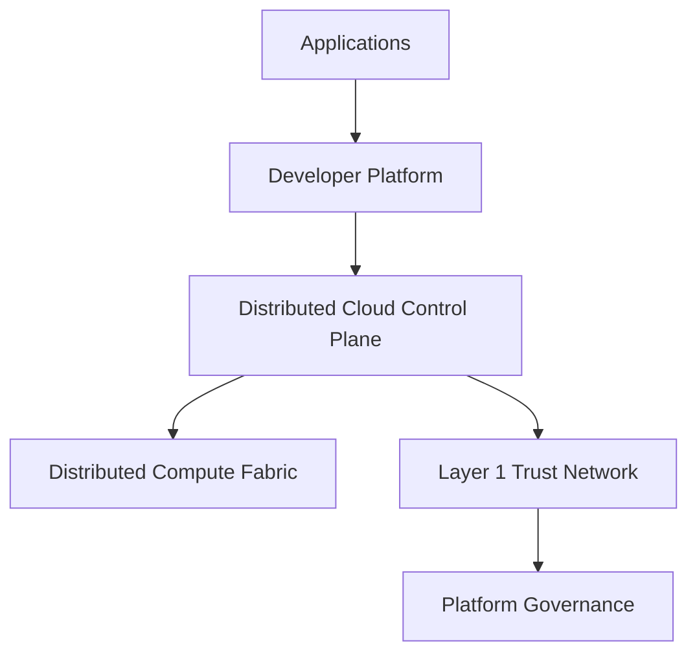

Notice that governance does **not** interact directly with workloads.

Likewise, applications never communicate directly with governance.

Every interaction passes through clearly defined platform boundaries.

---

# Platform Layers

Each layer represents a distinct architectural concern.

```text
┌────────────────────────────────────────────┐
│ Applications                               │
├────────────────────────────────────────────┤
│ Developer Experience                       │
├────────────────────────────────────────────┤
│ Marketplace & Control Plane                │
├────────────────────────────────────────────┤
│ Distributed Compute Fabric                 │
├────────────────────────────────────────────┤
│ Trust, Identity & Settlement               │
├────────────────────────────────────────────┤
│ Governance                                 │
└────────────────────────────────────────────┘
```

Each lower layer provides foundational capabilities for the layers above it.

Higher layers never bypass lower architectural responsibilities.

---

# Core Platform Responsibilities

Rather than describing products, Autheo defines platform responsibilities.

## Governance

Responsible for:

- Protocol stewardship
- Ecosystem direction
- Standards
- Treasury
- Governance processes

Governance is intentionally isolated from operational infrastructure.

---

## Trust Layer

Responsible for:

- Identity
- Consensus
- Settlement
- Ownership
- Smart Contracts
- Governance execution

The Trust Layer establishes cryptographic confidence between participants.

It is not responsible for workload execution.

---

## Control Plane

Responsible for:

- Scheduling
- Resource discovery
- Placement
- Monitoring
- Capacity planning
- Billing
- Marketplace coordination

The Control Plane determines *where* workloads execute.

It never performs application execution.

---

## Compute Fabric

Responsible for executing workloads.

Examples include:

- Containers
- AI inference
- Object storage
- Databases
- Serverless workloads
- Streaming
- Networking

The Compute Fabric represents the operational cloud.

---

## Developer Platform

Responsible for developer interaction.

Including:

- CLI
- APIs
- SDKs
- Templates
- Deployments
- Monitoring
- Documentation

Developers interact almost exclusively with this layer.

---

# System Boundaries

One of the most important architectural concepts is defining what each subsystem owns.

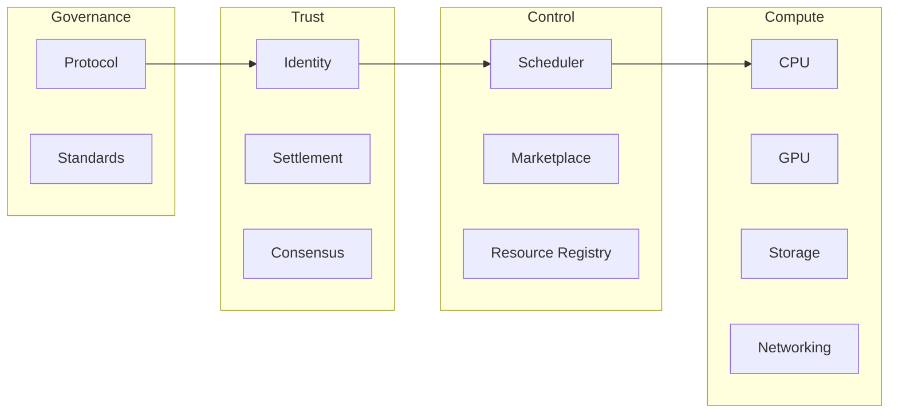

Each subsystem communicates through published interfaces.

Internal implementation details remain encapsulated.

---

# Platform Interaction Model

Every deployment follows the same high-level interaction pattern.

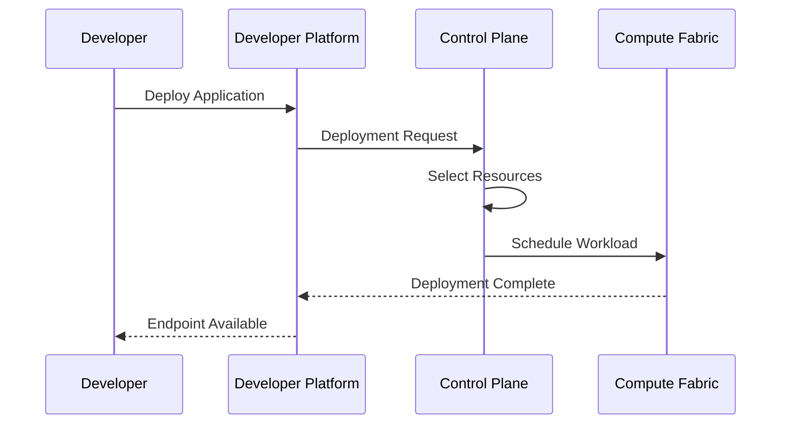

The developer never interacts directly with the compute nodes.

The platform abstracts infrastructure complexity behind a consistent deployment interface.

---

# Deployment Responsibility Flow

Every platform layer adds capabilities without replacing responsibilities below it.

```text
Developer

↓

Developer Platform

↓

Deployment Services

↓

Scheduling

↓

Distributed Infrastructure

↓

Running Workloads

↓

End Users
```

Each layer owns a clearly defined portion of the deployment lifecycle.

No layer assumes responsibilities belonging to another subsystem.

---

# Summary

The Autheo architecture intentionally separates governance, trust, orchestration, execution, and developer experience into independent architectural layers.

This separation provides:

- Clear ownership boundaries
- Independent evolution
- Reduced system coupling
- Improved scalability
- Enterprise maintainability
- Easier protocol upgrades
- Flexible infrastructure integration

Subsequent architecture documents describe each platform layer in greater detail, including workload scheduling, distributed networking, cryptographic trust, enterprise deployment models, and edge-native infrastructure.


# Autheo Architecture

## Part 2 — Distributed System Architecture

---

# Control Plane and Data Plane

Autheo separates infrastructure coordination from workload execution.

This is one of the most important architectural boundaries in the platform.

The **Control Plane** determines what should happen.

The **Data Plane** performs the work.

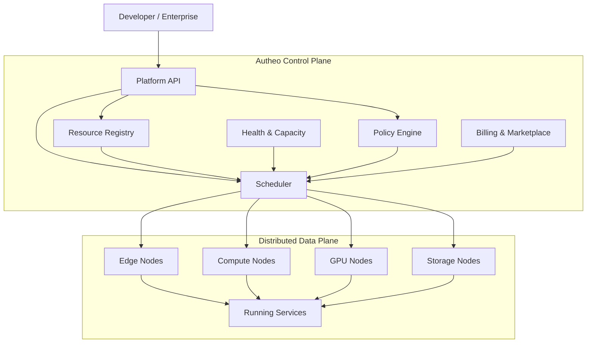

The control plane should remain lightweight relative to the resources it manages.

A single marketplace service should not become a bottleneck for millions of independent nodes.

---

# Control Plane Responsibilities

The control plane maintains the logical state necessary to coordinate the distributed cloud.

Core responsibilities include:

### Resource Discovery

Determine which resources are available.

Examples:

- CPU capacity
- GPU capacity
- Memory
- Storage
- Network bandwidth
- Geographic location
- Availability
- Hardware capabilities

### Scheduling

Determine where workloads should run.

### Policy

Determine which workloads are permitted to use particular infrastructure.

### Marketplace

Match resource providers with customers.

### Billing

Track resource consumption and settlement.

### Health

Continuously evaluate infrastructure availability and performance.

---

# Data Plane Responsibilities

The data plane performs actual work.

A node may execute:

- Containers
- WASM workloads
- Serverless functions
- AI inference
- Databases
- Storage
- Video processing
- Game servers
- APIs
- Background jobs
- Network services

The data plane should remain functional even when the control plane is temporarily unavailable.

---

# Control Plane Failure Isolation

A distributed platform should not fail simply because its management system is temporarily unavailable.

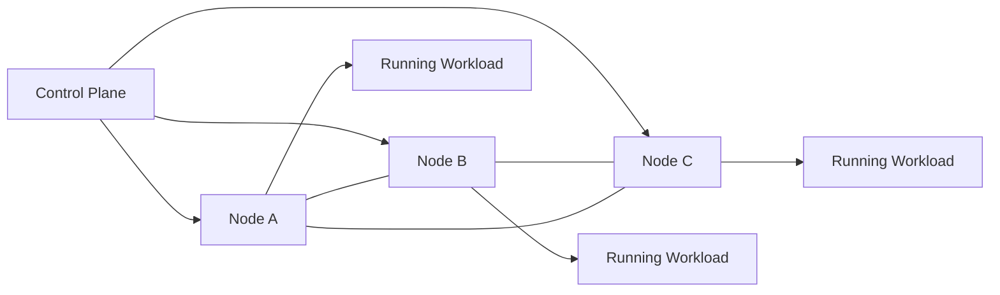

Existing workloads can continue operating using their established configuration and secure connections.

The control plane is responsible for **coordination and changes**, not for keeping every packet flowing.

This distinction is critical for resilience.

---

# Hierarchical Scheduling

A global scheduler should not make every decision for every node.

Instead, scheduling occurs hierarchically.

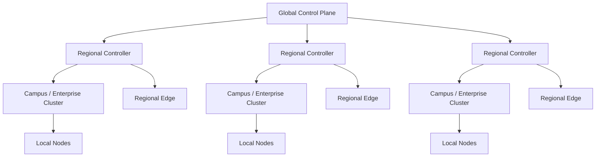

This architecture allows the platform to scale without requiring every decision to traverse the entire global network.

---

# Locality-Aware Scheduling

Workload placement should consider more than available CPU.

A placement decision may evaluate:

- Network latency
- Geographic distance
- Available compute
- GPU model
- Memory
- Storage
- Network bandwidth
- Reliability
- Cost
- Security policy
- Data residency
- Existing workload placement

A simplified decision process is:

```text
                 Workload

                    │

                    ▼

             Policy Evaluation

                    │

                    ▼

             Resource Discovery

                    │

                    ▼

            Candidate Nodes

                    │

        ┌───────────┼───────────┐
        │           │           │

     Local       Regional      Global

        │           │           │

        └───────────┼───────────┘

                    ▼

             Placement Score

                    │

                    ▼

               Selected Node
```

The closest node is not always the best node.

The scheduler chooses the best available resource according to workload requirements and enterprise policy.

---

# Regional Meshes

Autheo does not need to behave as one enormous flat peer-to-peer network.

Instead, nodes naturally form regional clusters.

A region might represent:

- A city
- Enterprise campus
- University
- Datacenter
- Industrial site
- Telecommunications network
- Geographic availability zone

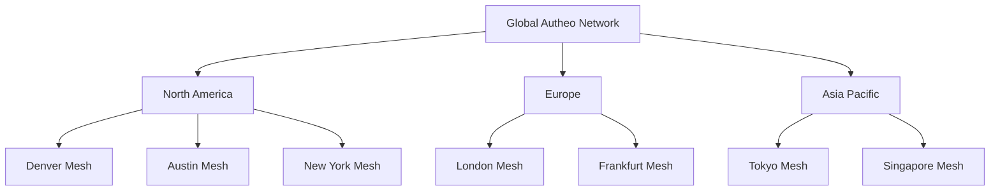

Each regional mesh can contain thousands of nodes.

---

# Enterprise Meshes

Organizations can create private or permissioned resource domains within the broader platform.

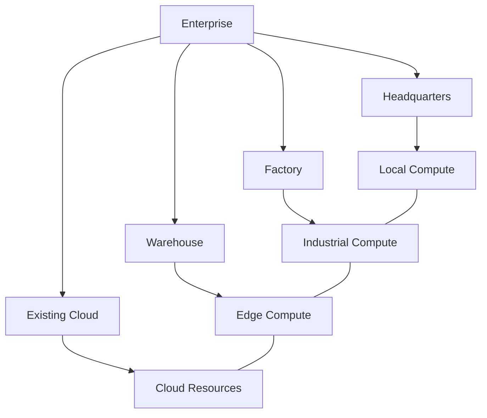

The enterprise can define policies such as:

- Internal workloads remain internal
- Sensitive data cannot leave a region
- Certain workloads require trusted hardware
- GPU workloads may use approved providers
- Public workloads may burst into the global marketplace

---

# Enterprise Local Hyperscaler

An enterprise can effectively construct its own private cloud using its existing infrastructure.

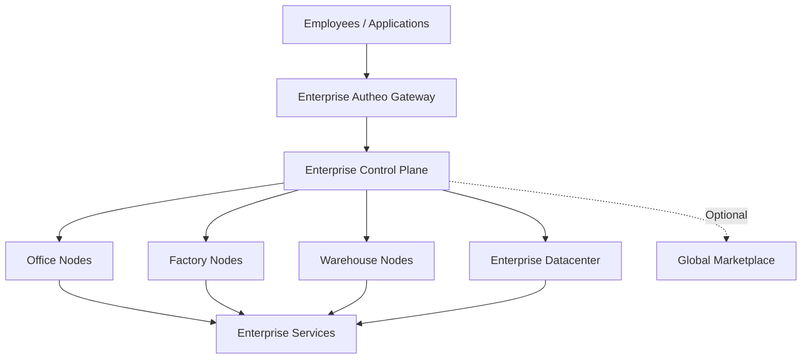

This creates a distributed private cloud while retaining the ability to use external resources when permitted.

---

# Hybrid Cloud

Autheo does not require an organization to abandon existing cloud providers.

Existing infrastructure can become another resource domain.

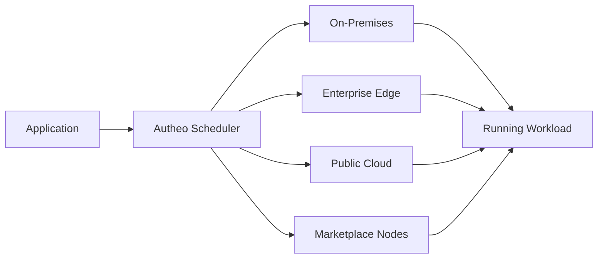

This allows organizations to use:

- Existing AWS infrastructure
- Existing Azure infrastructure
- Existing Google Cloud infrastructure
- Private datacenters
- Colocation
- Edge devices
- Autheo marketplace resources

as one logical resource pool.

---

# Cloud Bursting

Enterprise infrastructure does not need to maintain enough capacity for every possible peak.

Autheo can treat external resources as burst capacity.

```text
Normal Operation

Enterprise Capacity
████████████████░░░░

Peak Demand

Enterprise Capacity
████████████████████

            +

External Capacity
████████████████
```

The scheduler can provision additional capacity when:

- Demand increases
- Internal resources are unavailable
- Specialized GPUs are required
- Geographic locality is needed
- Disaster recovery capacity is required

When demand falls, external capacity can be released.

---

# Workload Placement Domains

Every workload can be assigned a placement policy.

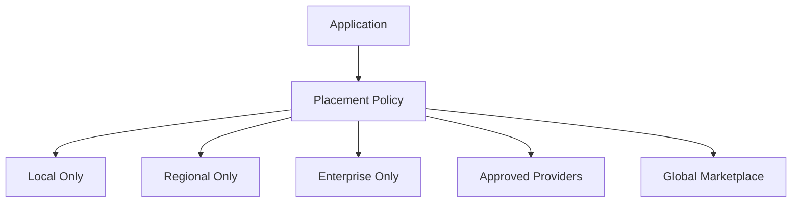

This provides a common mechanism for both consumer and enterprise workloads.

---

# Multi-Tenant Architecture

Autheo must support multiple independent customers using shared infrastructure without allowing workloads to interfere with one another.

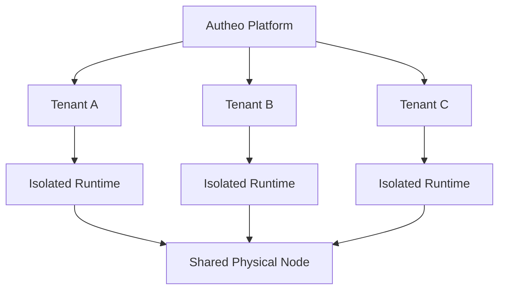

Isolation may be implemented using appropriate combinations of:

- Containers
- Virtual machines
- WASM runtimes
- Kernel isolation
- Hardware virtualization
- Trusted execution environments
- Network segmentation
- Resource quotas

The exact isolation mechanism depends on the workload and security requirements.

---

# Node Architecture

A node is the fundamental resource provider within the compute fabric.

A node may be a:

- Desktop
- Server
- GPU workstation
- Cloud VM
- Edge computer
- Industrial PC
- NAS
- Datacenter server

A typical node contains:

```text
┌──────────────────────────────────────┐
│              Node Agent              │
├──────────────────────────────────────┤
│ Identity                             │
│ Resource Manager                     │
│ Workload Runtime                     │
│ Network Manager                      │
│ Storage Manager                      │
│ Telemetry                            │
│ Security / Attestation               │
└──────────────────────────────────────┘
                  │
┌──────────────────────────────────────┐
│          Host Operating System       │
└──────────────────────────────────────┘
                  │
┌──────────────────────────────────────┐
│       Physical / Virtual Hardware    │
│ CPU │ GPU │ RAM │ SSD │ NIC          │
└──────────────────────────────────────┘
```

The node agent provides the interface between the Autheo platform and the underlying machine.

---

# Node Registration

Before a node can participate in the marketplace, it establishes an identity and reports its capabilities.

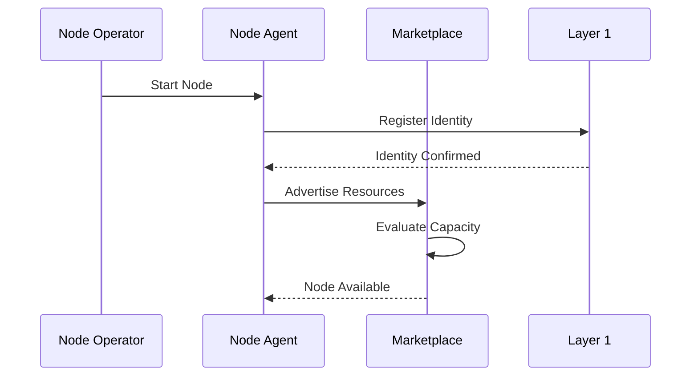

Registration does not mean the node receives unlimited trust.

Trust is continuously evaluated.

---

# Resource Advertisement

Nodes advertise capabilities rather than arbitrary access to the host.

Example:

```json
{
  "cpu": 32,
  "memory": "128GB",
  "gpu": "available",
  "storage": "4TB",
  "bandwidth": "1Gbps",
  "region": "example-region",
  "runtime": ["container", "wasm"]
}
```

The actual production schema should be versioned and cryptographically authenticated.

---

# Node Health

Nodes continuously report operational state.

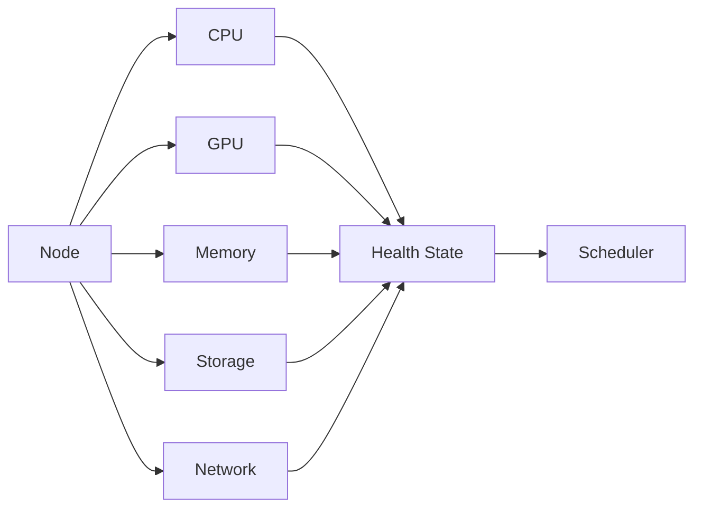

A scheduler should not place critical workloads on resources that no longer satisfy their requirements.

---

# Failure Domains

Distributed infrastructure assumes that failures will occur.

A node can disappear.

A router can fail.

A datacenter can lose power.

An entire region can become unreachable.

The architecture therefore treats infrastructure as a collection of failure domains.

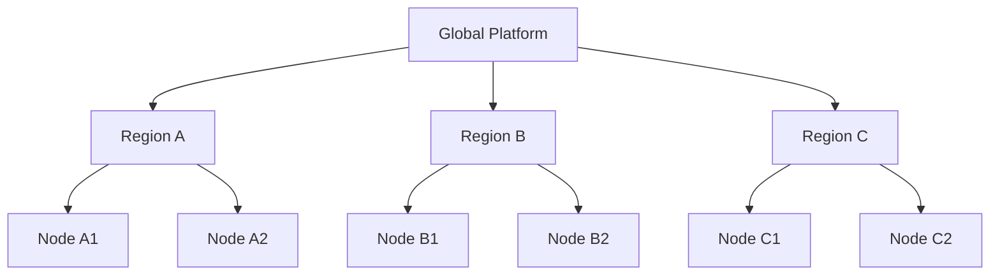

A workload requiring high availability can be replicated across independent failure domains.

---

# Application Replication

Distributed applications can use multiple nodes simultaneously.

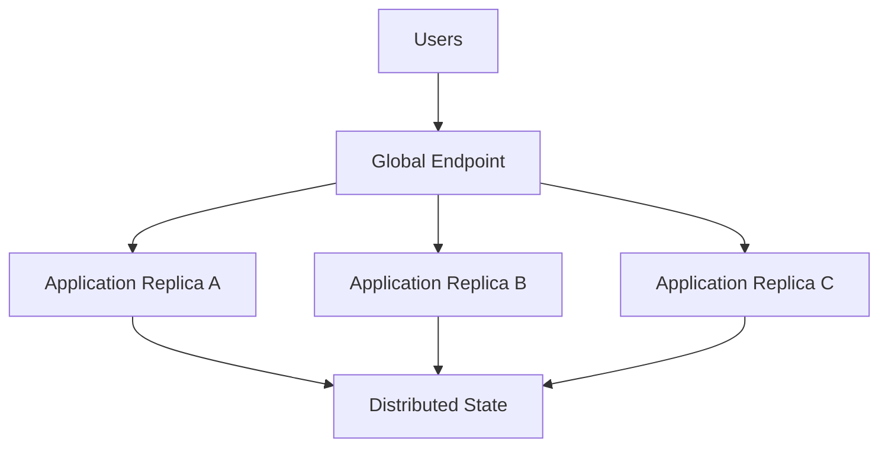

The platform can combine workload replication with distributed data technologies to maintain availability when individual nodes fail.

---

# Distributed State

Compute and state are treated separately.

An application may execute on one node while its state is replicated across several others.

```text
Application

      │

      ▼

Compute Node

      │

      ▼

State Layer

 ┌────┼────┐
 │    │    │

Node  Node  Node
 A     B     C
```

This allows compute resources to be replaced without necessarily losing application state.

Technologies such as CRDTs can provide conflict-free synchronization for workloads that require multi-writer distributed state.

---

# Service Networking

Applications should not need to know the physical location of every node.

Instead, services communicate through logical identities.

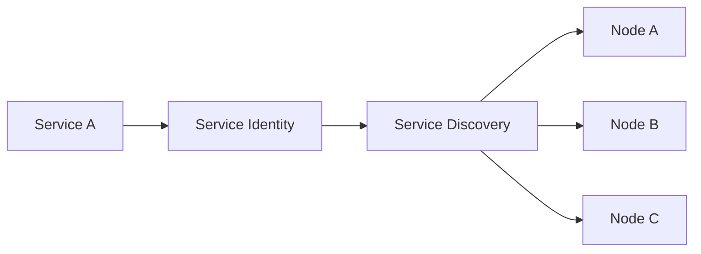

The physical location of the service can change without requiring application configuration to change.

---

# Distributed Networking

Autheo's networking architecture uses multiple discovery and transport mechanisms.

```text
Application

     │

Service Identity

     │

Peer Discovery

 ┌───┼────┬────┐
 │   │    │    │

mDNS Bluetooth Pkarr DHT

     │

     ▼

Secure Transport

     │

QUIC

     │

Peer / Relay
```

The specific networking mechanisms are intentionally abstracted from applications.

This allows the networking layer to evolve independently.

---

# Direct Connections First

The platform should prefer direct connectivity when practical.

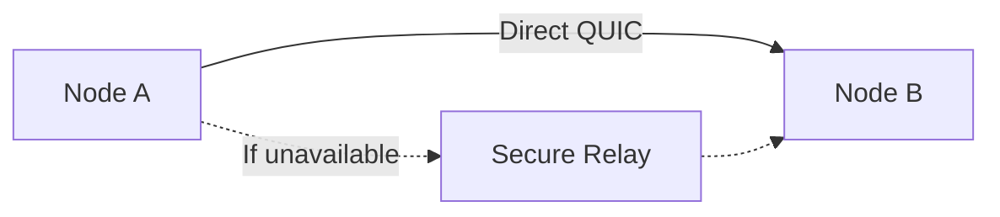

A relay provides connectivity when:

- NAT prevents direct communication
- Corporate firewalls restrict inbound traffic
- Mobile networks change addresses
- Direct routing is unavailable

Application traffic remains encrypted.

---

# Security Boundary

Security is implemented as a layered property rather than one protocol.

```text
┌──────────────────────────────────────┐
│ Application Authorization            │
├──────────────────────────────────────┤
│ Workload Isolation                   │
├──────────────────────────────────────┤
│ Node Identity                        │
├──────────────────────────────────────┤
│ Hardware / Runtime Attestation       │
├──────────────────────────────────────┤
│ TLS 1.3 + PQC Key Establishment     │
├──────────────────────────────────────┤
│ Secure Peer Transport                │
├──────────────────────────────────────┤
│ Physical Infrastructure              │
└──────────────────────────────────────┘
```

No single mechanism is expected to provide complete security.

---

# Cryptographic Agility

Cryptographic algorithms must not become permanent architectural dependencies.

The platform therefore separates cryptographic interfaces from application logic.

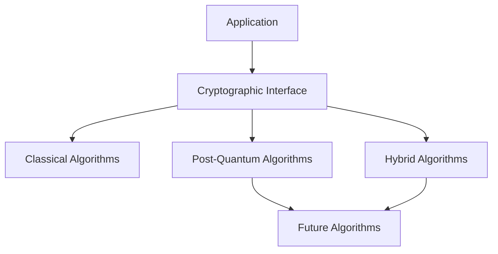

This allows new standards to be introduced without rewriting applications.

ML-KEM and other post-quantum mechanisms are therefore treated as implementations of a broader cryptographic architecture rather than permanently hard-coded platform assumptions.

---

# Economic Coordination

The marketplace connects infrastructure providers with customers.

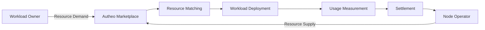

The marketplace provides the economic mechanism that allows independent infrastructure providers to participate.

---

# Layer 1 Settlement

The Layer 1 network provides the trust and settlement mechanisms supporting the marketplace.

```mermaid
flowchart TB

    Marketplace["Marketplace"]

    Marketplace --> Metering["Usage Metering"]

    Metering --> Proof["Usage / Settlement Data"]

    Proof --> Contracts["Smart Contracts"]

    Contracts --> Settlement["Settlement"]

    Settlement --> Provider["Node Operator"]
```

The exact settlement mechanism may evolve independently from workload execution.

This keeps financial coordination separate from application infrastructure.

---

# Developer Deployment Model

The developer experience should abstract the underlying complexity.

```mermaid
sequenceDiagram

participant Dev as Developer
participant CLI as Autheo CLI
participant API as Platform API
participant Market as Marketplace
participant Scheduler as Scheduler
participant Node as Compute Node
participant User as End User

Dev->>CLI: autheo deploy
CLI->>API: Submit Application
API->>Market: Request Resources
Market->>Scheduler: Find Placement
Scheduler->>Node: Deploy Workload
Node-->>Scheduler: Running
Scheduler-->>API: Deployment Ready
API-->>CLI: Endpoint
CLI-->>Dev: Deployment Complete

User->>Node: Application Request
Node-->>User: Response
```

The developer experiences one deployment system.

The platform performs the distributed coordination underneath it.

---

# End-to-End Architecture

The complete system can now be viewed as a set of independent but cooperating planes.

```mermaid
flowchart TB

    Users["Users"]

    subgraph Experience["Developer Experience"]
        CLI["CLI"]
        SDK["SDK"]
        API["APIs"]
        Portal["Developer Portal"]
    end

    subgraph Control["Distributed Cloud Control Plane"]
        Marketplace["Marketplace"]
        Scheduler["Scheduler"]
        Registry["Resource Registry"]
        Policy["Policy Engine"]
        Billing["Billing"]
        Health["Health"]
    end

    subgraph Trust["Trust Plane"]
        Identity["Identity"]
        L1["Autheo Layer 1"]
        Contracts["Smart Contracts"]
    end

    subgraph Data["Distributed Data Plane"]
        Edge["Edge"]
        Compute["Compute"]
        GPU["GPU"]
        Storage["Storage"]
        Network["Network"]
    end

    Users --> Experience

    CLI --> API
    SDK --> API
    Portal --> API

    API --> Marketplace

    Marketplace --> Scheduler
    Marketplace --> Registry
    Marketplace --> Policy
    Marketplace --> Billing
    Marketplace --> Health

    Marketplace <--> Trust

    Scheduler --> Edge
    Scheduler --> Compute
    Scheduler --> GPU
    Scheduler --> Storage

    Edge --- Compute
    Compute --- GPU
    GPU --- Storage
    Storage --- Network

    Identity --> L1
    L1 --> Contracts
```

---

# Architectural Outcome

The resulting architecture is not a blockchain with a cloud attached.

It is a distributed cloud platform with an independent trust and settlement layer.

The distinction is fundamental.

```text
                         AUTHEO

 ┌─────────────────────────────────────────────┐
 │             Developer Experience            │
 │        CLI • SDK • APIs • Portal             │
 └──────────────────────┬──────────────────────┘
                        │
 ┌──────────────────────▼──────────────────────┐
 │              Control Plane                  │
 │ Scheduler • Marketplace • Registry • Policy │
 └──────────────────────┬──────────────────────┘
                        │
 ┌──────────────────────▼──────────────────────┐
 │               Compute Fabric                │
 │ Compute • GPU • Storage • Edge • Networking │
 └─────────────────────────────────────────────┘

                        ▲
                        │
               Trust / Settlement
                        │
 ┌──────────────────────┴──────────────────────┐
 │              Autheo Layer 1                 │
 │ Identity • Consensus • Contracts • Assets   │
 └─────────────────────────────────────────────┘

                        ▲
                        │
                 Platform Governance
```

This architecture allows Autheo to provide the characteristics of a modern hyperscale cloud while distributing the underlying infrastructure across independent operators.

The platform can therefore scale along two independent dimensions:

**Compute capacity**

More nodes, more regions, more specialized infrastructure.

**Protocol capability**

New networking protocols, runtimes, cryptographic algorithms, storage systems, and marketplace mechanisms.

Neither requires rebuilding the entire platform.

---

# Architectural Guarantees

The architecture is designed around several long-term properties.

### Infrastructure Independence

Applications are not tied to a single physical infrastructure provider.

### Cryptographic Agility

Security mechanisms can evolve as standards and threats change.

### Failure Isolation

Individual nodes, clusters, or regions can fail without necessarily affecting the entire platform.

### Locality

Workloads can execute near users and data.

### Cloud Interoperability

Existing public and private infrastructure can participate.

### Economic Participation

Independent infrastructure providers can contribute resources and receive compensation.

### Developer Abstraction

Application developers interact with a unified cloud interface rather than individual machines.

### Modular Evolution

Individual subsystems can evolve without requiring a complete platform redesign.

---

# Where the Detailed Architecture Continues

This architecture document defines the boundaries and interactions of the Autheo platform.

Individual technical domains should be documented independently.

```text
architecture/
│
├── architecture.md
│
├── networking.md
├── compute.md
├── storage.md
├── marketplace.md
├── scheduling.md
├── developer-platform.md
├── blockchain.md
├── identity.md
├── security.md
├── pqc.md
├── enterprise.md
└── edge.md
```

Each document should answer a narrower question.

For example:

**`networking.md`**

> How do nodes discover, authenticate, connect, route, and communicate?

**`compute.md`**

> How are workloads packaged, scheduled, isolated, executed, and migrated?

**`marketplace.md`**

> How are resources discovered, priced, matched, measured, and settled?

**`blockchain.md`**

> How does Layer 1 establish trust, identity, ownership, and settlement?

**`security.md`**

> How does Autheo protect identities, workloads, data, communications, and infrastructure?

The architecture document should remain the map that connects all of these systems together.
