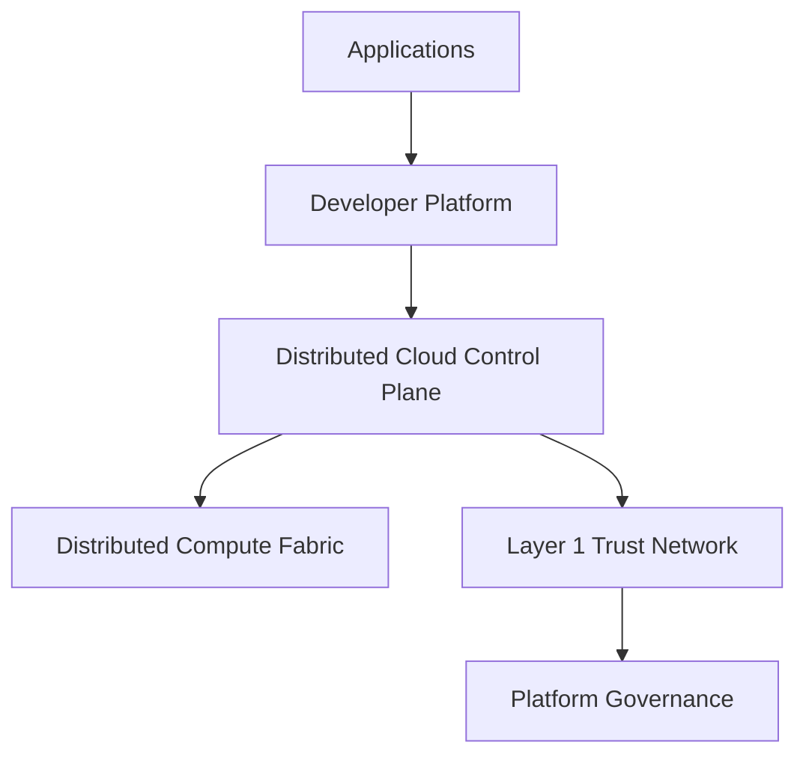
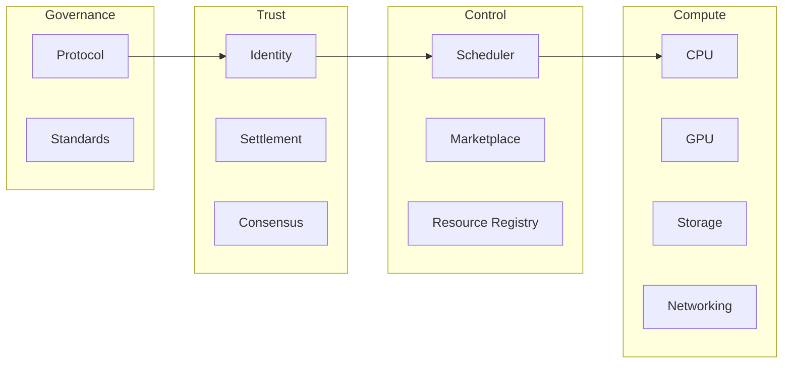
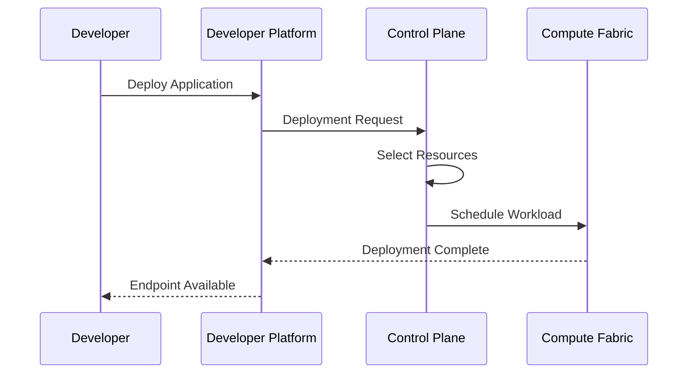

# Autheo Architecture

> **Audience**
>
> Platform architects, enterprise engineers, infrastructure providers, developers, and technical decision makers.
>
> This document describes the architectural organization of the Autheo Platform. It focuses on system responsibilities and interactions rather than implementation details.
>
> Implementation-specific technologies such as QUIC, CRDTs, TLS, ML-KEM, Bluetooth discovery, or storage engines are documented separately.

---

# Table of Contents

- [Architecture Philosophy](#architecture-philosophy)
- [Architectural Principles](#architectural-principles)
- [Platform Overview](#platform-overview)
- [Platform Layers](#platform-layers)
- [Core Platform Responsibilities](#core-platform-responsibilities)
- [System Boundaries](#system-boundaries)
- [Platform Interaction Model](#platform-interaction-model)
- [Deployment Responsibility Flow](#deployment-responsibility-flow)

---

# Architecture Philosophy

Autheo is designed as a distributed cloud platform rather than a centralized cloud provider.

Instead of concentrating compute inside a limited number of hyperscale data centers, Autheo coordinates independently operated infrastructure through open protocols and cryptographic trust.

The architecture intentionally separates:

- Governance
- Trust
- Control
- Execution
- Developer Experience

Each layer performs a single responsibility.

This separation allows each subsystem to evolve independently while maintaining compatibility across the platform.

---

# Architectural Principles

Every major platform component follows five architectural principles.

## Separation of Concerns

Each subsystem performs one primary responsibility.

Examples:

• Governance governs

• Layer 1 establishes trust

• Marketplace coordinates infrastructure

• Compute Mesh executes workloads

• Developer Platform exposes APIs and tooling

Responsibilities are never duplicated across layers.

---

## Modular Evolution

Every platform component should be replaceable without redesigning the platform.

Examples include:

- Scheduling engines
- Cryptographic algorithms
- Networking protocols
- Storage implementations
- Identity providers

Applications remain unaffected as lower platform layers evolve.

---

## Open Participation

Infrastructure ownership remains decentralized.

Any trusted participant may contribute:

- Compute
- Storage
- GPUs
- Networking
- AI accelerators
- Edge infrastructure

The platform coordinates resources rather than owning them.

---

## Locality First

Applications should execute as close to users as practical.

Workload placement favors:

1. Local resources
2. Regional resources
3. Global resources

Reducing latency improves both performance and infrastructure efficiency.

---

## Cryptographic Trust

Trust is established through identity and verification rather than ownership.

Infrastructure operators do not need to trust one another directly.

Instead, trust is established through the platform's cryptographic systems.

---

# Platform Overview

The Autheo Platform is organized into independent architectural layers.

Each layer exposes services to the layer immediately above it while relying on services below it.



Notice that governance does **not** interact directly with workloads.

Likewise, applications never communicate directly with governance.

Every interaction passes through clearly defined platform boundaries.

---

# Platform Layers

Each layer represents a distinct architectural concern.

```text
┌────────────────────────────────────────────┐
│ Applications                               │
├────────────────────────────────────────────┤
│ Developer Experience                       │
├────────────────────────────────────────────┤
│ Marketplace & Control Plane                │
├────────────────────────────────────────────┤
│ Distributed Compute Fabric                 │
├────────────────────────────────────────────┤
│ Trust, Identity & Settlement               │
├────────────────────────────────────────────┤
│ Governance                                 │
└────────────────────────────────────────────┘
```

Each lower layer provides foundational capabilities for the layers above it.

Higher layers never bypass lower architectural responsibilities.

---

# Core Platform Responsibilities

Rather than describing products, Autheo defines platform responsibilities.

## Governance

Responsible for:

- Protocol stewardship
- Ecosystem direction
- Standards
- Treasury
- Governance processes

Governance is intentionally isolated from operational infrastructure.

---

## Trust Layer

Responsible for:

- Identity
- Consensus
- Settlement
- Ownership
- Smart Contracts
- Governance execution

The Trust Layer establishes cryptographic confidence between participants.

It is not responsible for workload execution.

---

## Control Plane

Responsible for:

- Scheduling
- Resource discovery
- Placement
- Monitoring
- Capacity planning
- Billing
- Marketplace coordination

The Control Plane determines *where* workloads execute.

It never performs application execution.

---

## Compute Fabric

Responsible for executing workloads.

Examples include:

- Containers
- AI inference
- Object storage
- Databases
- Serverless workloads
- Streaming
- Networking

The Compute Fabric represents the operational cloud.

---

## Developer Platform

Responsible for developer interaction.

Including:

- CLI
- APIs
- SDKs
- Templates
- Deployments
- Monitoring
- Documentation

Developers interact almost exclusively with this layer.

---

# System Boundaries

One of the most important architectural concepts is defining what each subsystem owns.



Each subsystem communicates through published interfaces.

Internal implementation details remain encapsulated.

---

# Platform Interaction Model

Every deployment follows the same high-level interaction pattern.



The developer never interacts directly with the compute nodes.

The platform abstracts infrastructure complexity behind a consistent deployment interface.

---

# Deployment Responsibility Flow

Every platform layer adds capabilities without replacing responsibilities below it.

```text
Developer

↓

Developer Platform

↓

Deployment Services

↓

Scheduling

↓

Distributed Infrastructure

↓

Running Workloads

↓

End Users
```

Each layer owns a clearly defined portion of the deployment lifecycle.

No layer assumes responsibilities belonging to another subsystem.

---

# Summary

The Autheo architecture intentionally separates governance, trust, orchestration, execution, and developer experience into independent architectural layers.

This separation provides:

- Clear ownership boundaries
- Independent evolution
- Reduced system coupling
- Improved scalability
- Enterprise maintainability
- Easier protocol upgrades
- Flexible infrastructure integration

Subsequent architecture documents describe each platform layer in greater detail, including workload scheduling, distributed networking, cryptographic trust, enterprise deployment models, and edge-native infrastructure.
