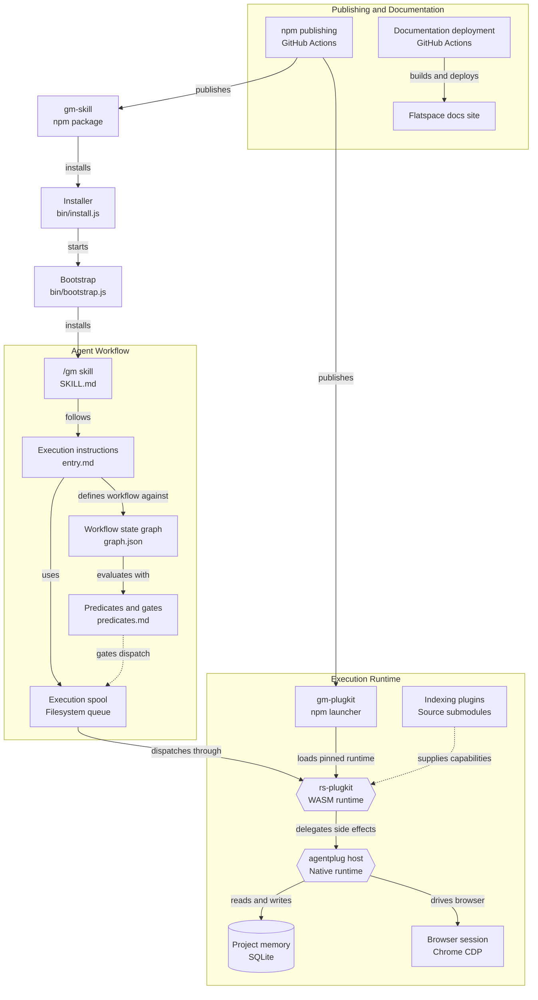

# AnEntrypoint/gm — Architecture and Execution Model

> **Repository:** `AnEntrypoint/gm`
> **Project:** `glootius maximus (gm)`
> **Primary purpose:** Deterministic, state-driven execution for coding agents
> **Core idea:** Increase the signal-to-noise ratio of AI coding agents by replacing loosely controlled agent behavior with explicit workflows, bounded execution, witnessed tool use, verification, and persistent project context.

---

## 1. Overview

`gm`, short for **glootius maximus**, is an opinionated agent skill and execution framework designed to make coding agents behave more like deterministic workflow engines.

The project is built around a simple problem:

> AI coding agents can produce useful work, but they can also guess, forget decisions, stop prematurely, create placeholders, narrate instead of executing, or claim completion without sufficient verification.

`gm` attempts to reduce this behavior by imposing a structured execution model around the agent.

The central workflow is:

```text
PLAN
  ↓
EXECUTE
  ↓
EMIT
  ↓
VERIFY
  ↓
CONSOLIDATE
  ↓
COMPLETE
```

The important distinction is that `gm` is not simply another AI model or coding assistant. It is an **orchestration and behavioral control layer** around an agent.

The agent remains responsible for reasoning about the work, but `gm` provides a structured environment in which that reasoning is translated into explicit execution.

The repository describes this as improving the agent's **signal-to-noise ratio (SNR)**: reducing wasted output, unverified assumptions, premature completion, and repeated work while increasing the amount of actual progress produced per token and per execution step.

The project is deliberately opinionated. Its design favors explicit state transitions, bounded execution, verification, and completion over unrestricted agent autonomy.

---

# 2. High-Level Architecture

The system can be understood as five interconnected layers:

1. **Agent Workflow**
2. **Execution Runtime**
3. **Project Memory and Environment**
4. **Plugin and Development Capabilities**
5. **Publishing and Documentation**

Together, these layers create a pipeline from:

```text
User / Agent
     │
     ▼
gm Skill
     │
     ▼
Execution Instructions
     │
     ▼
Workflow State Machine
     │
     ▼
Predicates and Policy Gates
     │
     ▼
Execution Spool
     │
     ▼
WASM Runtime
     │
     ▼
Native Host
     │
     ├── Project Memory
     ├── Browser / Chrome CDP
     └── Development Plugins
```

The repository also contains a distribution layer:

```text
Source Repository
       │
       ├── GitHub Actions
       │
       ├── npm Publishing
       │
       └── Documentation Deployment
                    │
                    ▼
             Flatspace Docs Site
```

The key architectural separation is between **what the agent is instructed to do** and **what the runtime is allowed to execute**.

The workflow layer defines intent and state.

The runtime layer performs and witnesses execution.

---

# 3. Complete System Flow

The overall system can be represented as follows:



This architecture separates the system into distinct responsibilities.

The **workflow layer** determines what should happen.

The **runtime layer** determines how execution actually occurs.

The **native host** performs operations that require access to the real operating environment.

The **memory layer** preserves project-specific state.

The **publishing layer** makes the system reproducible and distributable.

---

# 4. The `gm-skill` Package

The primary user-facing product is the `gm-skill` npm package.

The package should not be confused with the unrelated `gm` npm package associated with GraphicsMagick.

The repository explicitly identifies the published package as:

```text
gm-skill
```

Installation is performed using:

```bash
npx gm-skill install
```

or:

```bash
npx gm-skill install --yes
```

A project-local installation can be created with:

```bash
npx gm-skill install --project
```

The skill is installed as:

```text
/gm
```

within the Claude Code skill system.

The important conceptual point is:

```text
gm-skill
   │
   ▼
Installs /gm
   │
   ▼
Agent gains structured execution protocol
```

The package therefore acts as the distribution mechanism for the agent workflow itself.

The repository describes the package as essentially shipping the repository's root structure directly rather than relying on a large build pipeline or generated artifact.

This makes the repository itself closely aligned with the published package.

---

# 5. Installation Layer

The installation process is represented by two primary components:

```text
bin/install.js
bin/bootstrap.js
```

These perform different roles.

## 5.1 Installer

The installer is responsible for setting up the agent-facing skill.

Conceptually:

```text
User
 │
 │ npx gm-skill install
 ▼
install.js
 │
 ├── Installs /gm skill
 ├── Configures agent settings
 └── Seeds required memory/configuration
```

The repository's installation flow can also configure Claude Code settings related to:

* automatic compaction
* context-window behavior
* effort level
* thinking configuration

The purpose is to configure the agent for the execution model expected by `gm`.

The installer also seeds an instruction encouraging the agent to use the `gm` skill consistently and to fan out work to subagents.

---

## 5.2 Bootstrap

The bootstrap layer is responsible for initializing the runtime components required for execution.

Conceptually:

```text
gm-skill
   │
   ▼
bootstrap.js
   │
   ▼
Runtime initialization
   │
   ├── Runtime version/pin
   ├── WASM execution layer
   └── Native agentplug host
```

This is important because `gm` is not merely a collection of Markdown instructions.

The instructions are backed by an execution system.

The bootstrap process connects the high-level agent workflow to that lower-level execution infrastructure.

---

# 6. The `/gm` Skill

The central agent-facing component is:

```text
skills/gm/SKILL.md
```

This file represents the entry point into the `gm` workflow.

Conceptually:

```text
Agent
  │
  ▼
/gm
  │
  ▼
SKILL.md
  │
  ▼
Execution protocol
```

The skill acts as the behavioral contract between the coding agent and the rest of the system.

Instead of allowing the agent to freely improvise every operation, the skill tells the agent how it is expected to operate.

The skill therefore sits above the execution runtime.

It does not itself perform all operations.

Instead, it establishes the rules under which execution occurs.

---

# 7. Execution Instructions

The workflow instructions are located under:

```text
.gm/instructions/
```

with the primary entry point represented by:

```text
.gm/instructions/entry.md
```

This layer provides the detailed execution protocol.

The relationship is:

```text
SKILL.md
   │
   ▼
entry.md
   │
   ├── Execution rules
   ├── Workflow behavior
   ├── State transitions
   └── Runtime interaction
```

This creates a separation between:

* the **skill entry point**
* the **actual execution protocol**
* the **state machine**
* the **policy gates**

That separation is valuable because the skill can remain relatively high-level while the execution protocol defines the exact operational behavior.

---

# 8. Workflow State Machine

The state machine is represented by:

```text
.gm/instructions/fsm/graph.json
```

This defines the workflow as a graph of states and transitions.

The conceptual lifecycle is:

```text
PLAN
  │
  ▼
EXECUTE
  │
  ▼
EMIT
  │
  ▼
VERIFY
  │
  ▼
CONSOLIDATE
  │
  ▼
COMPLETE
```

Each state represents a different stage in the lifecycle of an agent task.

---

## 8.1 PLAN

The agent determines:

* what needs to be accomplished
* what the current state is
* what information is missing
* what actions are required
* what success looks like

The goal is to avoid immediately acting on an unverified assumption.

---

## 8.2 EXECUTE

The agent performs the actual work.

This can include:

* modifying source code
* inspecting files
* interacting with development tools
* querying project state
* using browser automation
* running bounded commands
* invoking plugins

Execution is constrained by the runtime and policy system.

---

## 8.3 EMIT

The agent produces concrete artifacts or outputs.

Examples include:

* source code changes
* generated files
* configuration changes
* structured execution results
* commits
* other project artifacts

The distinction between execution and emission helps separate the act of performing work from producing the resulting artifact.

---

## 8.4 VERIFY

The system checks whether the work actually succeeded.

Verification is one of the most important concepts in `gm`.

The agent should not simply state:

```text
"It works."
```

Instead, it should gather evidence.

For example:

```text
Hypothesis:
The feature works.

Action:
Run the application.

Observation:
Application starts successfully.

Action:
Exercise the feature.

Observation:
Expected output is produced.

Conclusion:
Feature is verified.
```

The repository's philosophy is that reasoning should increasingly become **witnessed execution**.

Instead of spending large amounts of output describing what might be true, the agent should perform bounded tests and inspect actual results.

---

## 8.5 CONSOLIDATE

Once work is verified, the system consolidates the resulting state.

This can involve:

* updating project memory
* preserving decisions
* recording relevant execution state
* consolidating artifacts
* preparing the repository for completion

The purpose is to ensure that useful context does not disappear when the immediate task ends.

---

## 8.6 COMPLETE

The workflow reaches completion only after the required conditions have been satisfied.

The intended behavior is:

```text
No premature completion.
No placeholder completion.
No "follow-up" used as a substitute for unfinished work.
```

Completion therefore represents a validated terminal state rather than simply the agent deciding it is done.

---

# 9. Predicates and Policy Gates

The state machine is supported by:

```text
.gm/instructions/fsm/predicates.md
```

Predicates act as rules or conditions that determine whether transitions or operations are allowed.

Conceptually:

```text
Current State
      │
      ▼
Evaluate Predicate
      │
      ├── PASS ──► Continue
      │
      └── FAIL ──► Block / Redirect / Retry
```

This creates a gate between agent intent and execution.

For example:

```text
Agent wants to execute
        │
        ▼
Policy evaluation
        │
        ├── Is operation bounded?
        ├── Is timeout explicit?
        ├── Is required state valid?
        ├── Is execution permitted?
        └── Has required verification occurred?
        │
        ▼
Dispatch
```

The result is that the workflow is not simply:

```text
Agent → Tool
```

It becomes:

```text
Agent
  │
  ▼
Workflow
  │
  ▼
State
  │
  ▼
Predicate
  │
  ▼
Policy Gate
  │
  ▼
Runtime
```

This is a fundamental part of the architecture.

---

# 10. The Execution Spool

The execution spool is represented as a filesystem-based queue.

Conceptually:

```text
Workflow
    │
    ▼
Execution Spool
    │
    ├── Pending work
    ├── Dispatched work
    ├── Results
    └── Execution state
```

The spool creates an intermediate layer between the workflow instructions and the runtime.

This means that agent intent does not necessarily become immediate, uncontrolled side effects.

Instead:

```text
Instruction
   │
   ▼
Queue / Spool
   │
   ▼
Policy Evaluation
   │
   ▼
Dispatch
```

This provides a mechanism for controlling execution and making the workflow more observable.

---

# 11. The `gm-plugkit` Runtime Layer

`gm-plugkit` is a separate npm package within the repository architecture.

The repository describes it as a thin launcher and bootstrap layer that downloads and delegates to the native `agentplug` runner.

The intended architecture is:

```text
gm-plugkit
    │
    ▼
Pinned Runtime Artifact
    │
    ▼
Native agentplug runner
```

This is important because `gm-plugkit` is not the entire execution runtime.

It acts as the bridge between the JavaScript/Node distribution environment and the native runtime.

The repository explicitly describes the design as having a single loader rather than falling back to a JavaScript wrapper implementation.

---

# 12. WASM Runtime

The lower execution layer is represented by:

```text
rs-plugkit
```

which provides the Rust/WASM execution environment.

Conceptually:

```text
Workflow
    │
    ▼
Execution Spool
    │
    ▼
WASM Runtime
    │
    ▼
Native Host
```

The purpose of this layer is to provide a controlled execution environment between high-level agent behavior and real-world side effects.

WASM provides a useful architectural boundary because it allows execution logic to be packaged into a portable runtime while still delegating privileged or environment-specific operations to a host.

---

# 13. Native `agentplug` Host

The native host represents the boundary where execution reaches the actual operating environment.

Conceptually:

```text
WASM
 │
 ▼
agentplug Native Host
 │
 ├── Filesystem
 ├── Database
 ├── Browser
 ├── Development tools
 └── Other host capabilities
```

This creates a clear separation between:

```text
Decision / Workflow
```

and:

```text
Side Effects
```

The agent can determine that something should happen, but the runtime is responsible for carrying that operation into the real environment.

This architecture is particularly important for agent systems because side effects are where uncontrolled behavior becomes dangerous or difficult to audit.

---

# 14. Project Memory

The runtime connects to project memory, represented in the architecture as:

```text
SQLite Database
```

The conceptual flow is:

```text
Agent
  │
  ▼
Runtime
  │
  ▼
Project Memory
  │
  ├── Read previous context
  ├── Store decisions
  ├── Preserve project state
  └── Support future execution
```

This allows the system to distinguish between:

```text
Current conversation context
```

and:

```text
Persistent project knowledge
```

That distinction is essential for long-running agentic software development.

Without persistent memory, an agent may repeatedly rediscover the same information or forget decisions made during previous sessions.

With project memory, the workflow can become cumulative.

The intended model is:

```text
Session 1
   │
   ▼
Decision
   │
   ▼
Persist
   │
   ▼
Session 2
   │
   ▼
Retrieve
   │
   ▼
Continue
```

Memory therefore becomes part of the execution architecture rather than merely a convenience feature.

---

# 15. Browser Automation Boundary

The architecture includes browser session configuration and browser automation through Chrome DevTools Protocol (CDP).

Conceptually:

```text
Agent Workflow
      │
      ▼
Runtime
      │
      ▼
Native Host
      │
      ▼
Browser Boundary
      │
      ▼
Chrome / Browser Session
```

The browser boundary allows the agent to interact with web applications while keeping browser execution as a distinct runtime capability.

This is particularly useful for workflows that require:

* website interaction
* UI verification
* browser-based testing
* authenticated web sessions
* inspecting application behavior

The architecture therefore treats the browser as an execution environment rather than simply another text-based tool.

---

# 16. Indexing and Development Plugins

The repository contains several related plugin and submodule components, including:

```text
agentplug
agentplug-bert
agentplug-libsql
agentplug-treesitter
rs-codeinsight
rs-plugkit
rs-search
```

These components represent a broader development capability layer.

The conceptual model is:

```text
Project
   │
   ├── Source Code
   │
   ├── Indexes
   │
   ├── Search
   │
   ├── AST / Tree-sitter Analysis
   │
   └── Code Intelligence
            │
            ▼
        Agent Runtime
```

The purpose is to give the execution environment richer awareness of the codebase.

Instead of treating a repository as an unstructured collection of files, indexing and code-intelligence capabilities can provide more structured access to:

* source relationships
* symbols
* syntax trees
* searchable project content
* code structure

This is especially important for large repositories where blindly scanning files is inefficient.

---

# 17. Repository Structure

The repository currently contains the following major architectural areas:

```text
gm/
│
├── .github/
│   └── workflows/
│
├── .gm/
│   ├── instructions/
│   └── browser configuration
│
├── agentplug/
│
├── agentplug-bert/
│
├── agentplug-libsql/
│
├── agentplug-treesitter/
│
├── bin/
│   ├── install.js
│   └── bootstrap.js
│
├── docs/
│
├── gm-plugkit/
│
├── rs-codeinsight/
│
├── rs-plugkit/
│
├── rs-search/
│
├── scripts/
│
├── site/
│
├── skills/
│   └── gm/
│       └── SKILL.md
│
├── AGENTS.md
├── CHANGELOG.md
├── CLAUDE.md
├── SKILLS.md
├── flatspace.config.mjs
├── gm.json
├── package.json
└── package-lock.json
```

The repository is unusual in that it contains both the high-level agent skill and significant portions of the lower-level runtime infrastructure.

This makes the repository more than a simple prompt or instruction collection.

It is an integrated system consisting of:

```text
Agent Skill
+
Workflow Definition
+
State Machine
+
Policy System
+
Execution Runtime
+
Native Host
+
Memory
+
Development Plugins
+
Distribution
+
Documentation
```

---

# 18. Publishing Architecture

The publishing system is managed through GitHub Actions.

Conceptually:

```text
Git Push
   │
   ▼
GitHub Actions
   │
   ├── Build / Prepare
   │
   ├── Publish gm-skill
   │
   └── Publish gm-plugkit
```

The repository's publishing workflow allows the runtime components and agent-facing package to be distributed independently while remaining part of the same source project.

The package architecture can therefore be viewed as:

```text
AnEntrypoint/gm
       │
       ├── gm-skill
       │     └── Agent workflow
       │
       └── gm-plugkit
             └── Runtime launcher
```

This separation allows the skill and runtime to have different release responsibilities.

---

# 19. Documentation Architecture

Documentation is deployed through a separate GitHub Actions workflow.

The flow is:

```text
Markdown / Documentation Source
          │
          ▼
GitHub Actions
          │
          ▼
Static Site Build
          │
          ▼
Flatspace Documentation Site
```

The repository therefore treats documentation as a first-class artifact.

The documentation system includes:

* long-form technical material
* crate documentation
* skill documentation
* distribution documentation
* static site content

This provides multiple layers of documentation for different audiences.

---

# 20. Why the Architecture Is Layered

The system is deliberately divided into layers because each layer solves a different problem.

## Layer 1 — Agent Behavior

```text
SKILL.md
```

Answers:

> How should the agent behave?

---

## Layer 2 — Workflow Protocol

```text
entry.md
```

Answers:

> How should the agent execute the task?

---

## Layer 3 — State Machine

```text
graph.json
```

Answers:

> What state is the workflow in, and what transitions are possible?

---

## Layer 4 — Policy

```text
predicates.md
```

Answers:

> Is this action or transition allowed?

---

## Layer 5 — Execution Queue

```text
Filesystem spool
```

Answers:

> What work is waiting to be executed?

---

## Layer 6 — Runtime

```text
WASM / rs-plugkit
```

Answers:

> How is execution performed in a controlled runtime?

---

## Layer 7 — Native Host

```text
agentplug
```

Answers:

> How do controlled operations interact with the real machine?

---

## Layer 8 — Persistent State

```text
SQLite
```

Answers:

> What does the project need to remember?

---

## Layer 9 — External Environments

```text
Browser
Development plugins
Code intelligence
```

Answers:

> What external capabilities can the agent operate?

---

## Layer 10 — Distribution

```text
npm
GitHub Actions
Documentation site
```

Answers:

> How is the system delivered and maintained?

---

# 21. The Core Design Philosophy

The central design philosophy of `gm` can be summarized as:

```text
Less narration
      +
More execution
      +
More verification
      +
Persistent state
      +
Bounded operations
      =
Higher agent signal-to-noise ratio
```

The system is designed around the idea that an agent should not receive credit for merely producing plausible text.

The agent should produce evidence.

The preferred execution loop is therefore:

```text
Hypothesis
    │
    ▼
Execute
    │
    ▼
Observe
    │
    ▼
Compare Against Expected Result
    │
    ├── Incorrect ──► Revise
    │
    └── Correct ────► Continue
```

This makes the workflow resemble an engineering control loop.

The agent proposes an action.

The runtime executes it.

The system observes the result.

The workflow evaluates the result.

The next state is determined from evidence.

---

# 22. `gm` as a Deterministic Agent Operating Layer

A useful way to conceptualize `gm` is as an **operating layer for AI-driven software development**.

Traditional coding agent:

```text
User
  │
  ▼
LLM
  │
  ▼
Tools
  │
  ▼
Filesystem / Browser / Shell
```

The `gm` architecture adds several control layers:

```text
User
  │
  ▼
Agent
  │
  ▼
/gm Skill
  │
  ▼
Execution Protocol
  │
  ▼
State Machine
  │
  ▼
Predicates / Policy
  │
  ▼
Execution Spool
  │
  ▼
WASM Runtime
  │
  ▼
Native Host
  │
  ├── Filesystem
  ├── Browser
  ├── Memory
  └── Development Tools
```

This transforms the agent from a simple:

```text
Prompt → Tool Call
```

system into:

```text
Intent
  ↓
Plan
  ↓
State
  ↓
Policy
  ↓
Dispatch
  ↓
Execution
  ↓
Observation
  ↓
Verification
  ↓
Memory
  ↓
Next State
```

That is the fundamental architectural contribution of the project.

---

# 23. Example End-to-End Execution

Consider a user asking an agent:

> Add a new authentication feature to this application.

A simplified `gm` execution flow would be:

```text
USER REQUEST
     │
     ▼
PLAN
     │
     ├── Inspect repository
     ├── Understand existing auth
     └── Define required changes
     │
     ▼
EXECUTE
     │
     ├── Read source
     ├── Modify implementation
     └── Update configuration
     │
     ▼
EMIT
     │
     └── Produce code changes
     │
     ▼
VERIFY
     │
     ├── Run tests
     ├── Start application
     ├── Exercise authentication
     └── Inspect results
     │
     ▼
CONSOLIDATE
     │
     ├── Record decisions
     ├── Persist useful project state
     └── Prepare final artifact
     │
     ▼
COMPLETE
```

The runtime architecture underneath this process is:

```text
Agent
 │
 ▼
/gm
 │
 ▼
Workflow Instructions
 │
 ▼
FSM
 │
 ▼
Predicates
 │
 ▼
Spool
 │
 ▼
WASM
 │
 ▼
agentplug
 │
 ├── Project files
 ├── SQLite memory
 ├── Browser
 └── Code intelligence
```

The important property is that completion is tied to the workflow rather than simply the agent's assertion that it has finished.

---

# 24. Security and Control Boundaries

The architecture also creates useful control boundaries.

The highest-level layer is the agent:

```text
Agent
```

The agent has intent.

The workflow layer provides rules:

```text
Skill
Instructions
FSM
Predicates
```

The runtime provides execution:

```text
WASM
```

The native host provides actual system interaction:

```text
agentplug
```

The system boundary therefore looks like:

```text
                TRUST / CONTROL
                     │
                     ▼

       ┌───────────────────────────┐
       │       Agent Intent        │
       └─────────────┬─────────────┘
                     │
       ┌─────────────▼─────────────┐
       │   Workflow & State Logic  │
       └─────────────┬─────────────┘
                     │
       ┌─────────────▼─────────────┐
       │     Policy / Predicates   │
       └─────────────┬─────────────┘
                     │
       ┌─────────────▼─────────────┐
       │      Execution Spool      │
       └─────────────┬─────────────┘
                     │
       ┌─────────────▼─────────────┐
       │        WASM Runtime       │
       └─────────────┬─────────────┘
                     │
       ┌─────────────▼─────────────┐
       │       Native Host         │
       └─────────────┬─────────────┘
                     │
          REAL-WORLD SIDE EFFECTS
```

This is an important distinction.

The architecture does not attempt to eliminate agent autonomy.

Instead, it attempts to **structure autonomy**.

The agent can reason and act, but execution is placed inside a defined system of states, policies, runtime boundaries, and verification.

---

# 25. The Role of GitHub

GitHub is the source-control and distribution center for the project.

The repository contains:

```text
Source Code
Workflow Definitions
Agent Skills
Runtime Components
Submodules
Documentation
CI/CD
Publishing
```

GitHub Actions connects development to distribution:

```text
Commit
  │
  ▼
GitHub
  │
  ├── CI/CD
  │
  ├── npm Publishing
  │
  └── Documentation Deployment
```

This means the repository functions simultaneously as:

1. **Source code repository**
2. **Agent skill distribution source**
3. **Runtime source**
4. **Package publishing source**
5. **Documentation source**
6. **CI/CD control plane**

The repository therefore acts as the central coordination point for the entire `gm` system.

---

# 26. Final Architecture Summary

At the highest level, `AnEntrypoint/gm` can be understood as a layered execution architecture for AI coding agents.

```text
                         USER
                           │
                           ▼
                    AI CODING AGENT
                           │
                           ▼
                      /gm SKILL
                           │
                           ▼
                 EXECUTION PROTOCOL
                           │
                           ▼
                  WORKFLOW STATE GRAPH
                           │
                           ▼
                 PREDICATES / POLICIES
                           │
                           ▼
                   EXECUTION SPOOL
                           │
                           ▼
                   WASM RUNTIME LAYER
                           │
                           ▼
                   NATIVE AGENT HOST
                           │
          ┌────────────────┼────────────────┐
          │                │                │
          ▼                ▼                ▼
     PROJECT MEMORY     BROWSER       DEV PLUGINS
       SQLite             CDP         CODE INDEXING
          │                │                │
          └────────────────┼────────────────┘
                           │
                           ▼
                  VERIFIED PROJECT STATE
                           │
                           ▼
                      CONSOLIDATE
                           │
                           ▼
                       COMPLETE
```

The core concept is that an AI coding agent should not be treated as a free-form text generator that happens to have access to tools.

Instead, `gm` treats the agent as part of a larger execution machine.

The agent provides intelligence.

The workflow provides structure.

The state machine provides determinism.

The predicates provide control.

The spool provides dispatch.

The WASM runtime provides execution boundaries.

The native host provides real-world capabilities.

The memory system provides continuity.

The verification phase provides evidence.

The publishing system provides reproducibility.

Together, these components form an architecture designed around one central objective:

> **Make the agent spend less effort producing noise and more effort producing verified, persistent, completed work.**

---

# 27. Repository Reference Map

| Component                            | Role                                              |
| ------------------------------------ | ------------------------------------------------- |
| `skills/gm/SKILL.md`                 | Main `/gm` agent skill entry point                |
| `.gm/instructions/entry.md`          | Execution protocol and workflow instructions      |
| `.gm/instructions/fsm/graph.json`    | Workflow state graph                              |
| `.gm/instructions/fsm/predicates.md` | Workflow predicates and policy conditions         |
| `bin/install.js`                     | User-facing installation process                  |
| `bin/bootstrap.js`                   | Runtime/bootstrap initialization                  |
| `gm-plugkit/`                        | Separate npm runtime launcher/bootstrap package   |
| `rs-plugkit/`                        | Rust/WASM runtime component                       |
| `agentplug/`                         | Native host/runtime layer                         |
| `agentplug-libsql/`                  | Database-related runtime capability               |
| `agentplug-treesitter/`              | Source parsing / code intelligence capability     |
| `rs-codeinsight/`                    | Code intelligence infrastructure                  |
| `rs-search/`                         | Search capability                                 |
| `.gm/browser-config.json`            | Browser session configuration                     |
| `scripts/`                           | Publishing and development helper scripts         |
| `.github/workflows/`                 | CI/CD and publishing automation                   |
| `docs/`                              | Long-form project documentation                   |
| `site/`                              | Static documentation site source                  |
| `gm.json`                            | Version and runtime pin information               |
| `package.json`                       | npm package metadata and publishing configuration |
| `AGENTS.md`                          | Architectural and agent-facing repository rules   |
| `CHANGELOG.md`                       | Release history                                   |
| `CLAUDE.md`                          | Claude-oriented project instructions              |
| `SKILLS.md`                          | Skill-related documentation                       |

---

# 28. One-Sentence Definition

**`AnEntrypoint/gm` is an opinionated, state-driven execution framework that wraps AI coding agents in a structured workflow of planning, bounded execution, policy enforcement, witnessed verification, persistent memory, and controlled completion.**

---

# 29. Architectural Takeaway

The most important way to understand `gm` is not as a single package.

It is better understood as a **stack**:

```text
┌─────────────────────────────────────────────┐
│             AI AGENT / REASONING            │
├─────────────────────────────────────────────┤
│                /gm SKILL                    │
├─────────────────────────────────────────────┤
│          EXECUTION INSTRUCTIONS             │
├─────────────────────────────────────────────┤
│           STATE MACHINE / FSM               │
├─────────────────────────────────────────────┤
│          PREDICATES / POLICY                │
├─────────────────────────────────────────────┤
│            EXECUTION SPOOL                  │
├─────────────────────────────────────────────┤
│             WASM RUNTIME                    │
├─────────────────────────────────────────────┤
│             NATIVE HOST                     │
├─────────────────────────────────────────────┤
│  MEMORY │ BROWSER │ SEARCH │ CODE INSIGHT   │
├─────────────────────────────────────────────┤
│          PROJECT / REAL WORLD               │
└─────────────────────────────────────────────┘
```

The value of the architecture comes from the combination of these layers.

The `gm` skill tells the agent **how to operate**.

The workflow defines **what stage the operation is in**.

The predicates determine **whether an action is permitted**.

The runtime determines **how execution occurs**.

The native host determines **how execution reaches the real environment**.

The memory system determines **what survives across sessions**.

The verification cycle determines **whether the result is actually correct**.

The publishing system determines **how the entire stack is distributed and updated**.

In that sense, `gm` is best viewed as an **agent execution operating system**: a control and orchestration layer designed to transform probabilistic, language-driven agent behavior into a more deterministic, observable, stateful, and verifiable software-development process.
