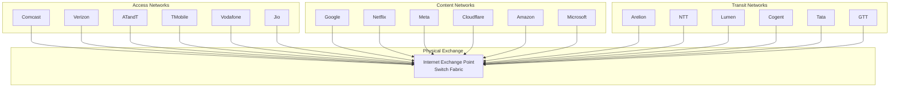
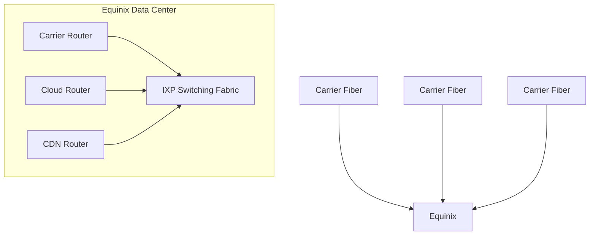
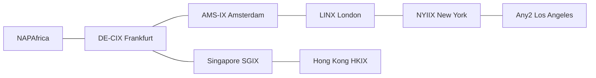
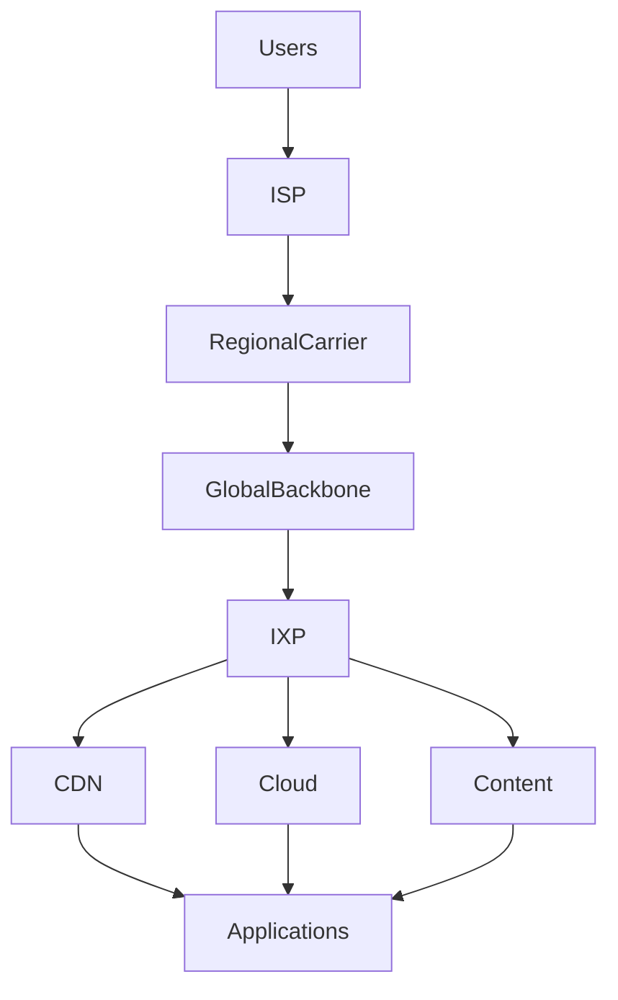

# Physical Internet Exchanges (IXP) Architecture

## What Is An Internet Exchange Point?

An Internet Exchange Point (IXP) is a physical location where networks interconnect and exchange traffic directly.

Without IXPs:

```text
ISP → Transit Provider → Transit Provider → Destination
```

With IXPs:

```text
ISP → IXP → Destination Network
```

Result:

* Lower latency
* Lower transit costs
* Faster routing
* More resilient connectivity

---

# How Physical Internet Exchanges Work



---

# Physical Location of an Exchange

Most IXPs are hosted inside carrier hotels or colocation facilities.



---

# Global Internet Exchange Ecosystem



---

# Where IXPs Fit in the Internet



This is one of the most important concepts for developers to understand:

**The Internet is not a giant cloud.**

It is a massive collection of physical fiber routes, towers, satellites, carrier networks, exchange facilities, and data centers that all converge at Internet Exchange Points where networks agree to exchange traffic. IXPs are the physical crossroads of the global Internet and form one of the central hubs of the entire ecosystem.
