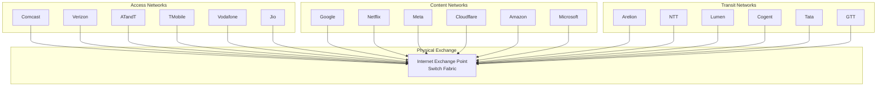
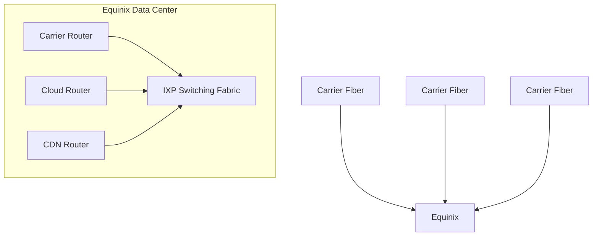
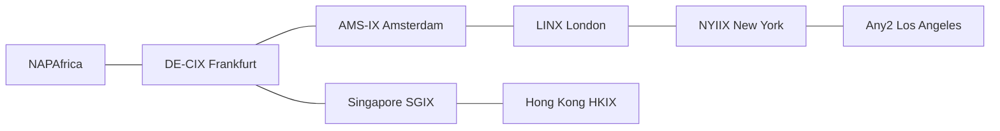
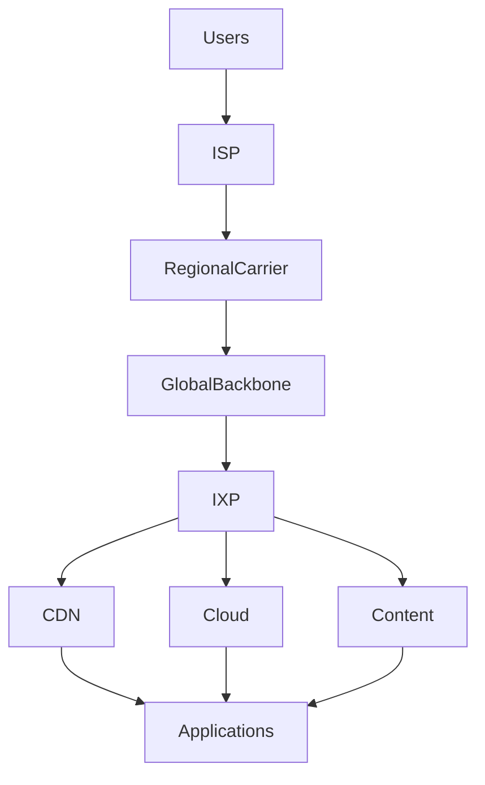

# Additional Infrastructure Organizations for the Global Internet Map

These organizations often sit beneath cloud providers, CDNs, and application platforms. They represent the physical, carrier, colocation, tower, and satellite infrastructure that keeps the Internet operating.

---

# Colocation & Data Center Operators

These companies own the facilities where networks physically interconnect.

## Equinix

Classification:

```text
Global Colocation Provider
Internet Exchange Operator
Interconnection Platform
Digital Infrastructure Provider
```

The most important colocation company on Earth. Hosts thousands of carriers, cloud providers, CDNs, and enterprises in the same facilities.

---

## Digital Realty

Classification:

```text
Global Data Center Operator
Colocation Provider
Digital Infrastructure REIT
```

One of the largest data center operators globally. Owns facilities across North America, Europe, Asia, and Africa.

---

## CoreSite

Classification:

```text
Colocation Provider
Interconnection Hub
Enterprise Connectivity Platform
```

Major US interconnection and carrier hotel operator.

---

## Telehouse

Classification:

```text
Carrier Hotel Operator
Colocation Provider
Internet Exchange Host
```

Hosts many major carrier interconnection points globally.

---

## CyrusOne

Classification:

```text
Hyperscale Data Center Operator
Enterprise Colocation Provider
```

Large provider of hyperscale cloud facilities.

---

## QTS

Classification:

```text
Hyperscale Data Center Provider
Colocation Operator
```

Major North American infrastructure provider.

---

# Tower Infrastructure

These companies own towers used by mobile operators.

## American Tower

Classification:

```text
Cell Tower Operator
Wireless Infrastructure Provider
Digital Infrastructure REIT
```

Owns hundreds of thousands of wireless sites globally.

---

## Crown Castle

Classification:

```text
Tower Operator
Fiber Infrastructure Provider
Small Cell Network Operator
```

Critical to US mobile and fiber infrastructure.

---

## SBA Communications

Classification:

```text
Tower Operator
Wireless Infrastructure Provider
```

One of the largest independent tower companies globally.

---

# Fiber Infrastructure Providers

These companies often own the actual glass carrying traffic.

## Zayo

Classification:

```text
Long-Haul Fiber Operator
Metro Fiber Provider
Wholesale Carrier
```

Provides extensive North American and European fiber connectivity.

---

## Crown Castle Fiber

Classification:

```text
Metro Fiber Operator
Mobile Backhaul Provider
```

Supports mobile carriers and enterprise connectivity.

---

## Lumen Fiber

Classification:

```text
Long-Haul Fiber Operator
Backbone Infrastructure Provider
```

One of the largest terrestrial fiber networks.

---

## Colt

Classification:

```text
Enterprise Fiber Provider
Data Center Interconnection Operator
```

Known for high-capacity metro and international fiber.

---

# Cable & Broadband Operators

## Xfinity (Comcast)

Classification:

```text
Residential ISP
Cable Operator
Enterprise Connectivity Provider
```

One of North America's largest broadband providers.

---

## Cox Communications

Classification:

```text
Cable Operator
Residential ISP
Business Connectivity Provider
```

Large regional broadband operator.

---

## Charter Spectrum

Classification:

```text
Cable Operator
Residential ISP
Regional Carrier
```

Major broadband access provider.

---

# Mobile Network Operators

## T-Mobile

Classification:

```text
Mobile Operator
National Carrier
5G Infrastructure Provider
```

One of the largest wireless operators in North America.

---

## Verizon

Classification:

```text
Mobile Operator
National Carrier
Enterprise Network Provider
```

Large US wireless and fiber operator.

---

## AT&T

Classification:

```text
National Carrier
Mobile Operator
Fiber Infrastructure Provider
```

Operates extensive wireless, enterprise, and fiber networks.

---

# Satellite Operators

These networks still ultimately connect into terrestrial fiber infrastructure.

## Starlink

Classification:

```text
LEO Satellite Operator
Global Broadband Provider
Space-Based Network Operator
```

Uses thousands of low-earth-orbit satellites connected through terrestrial gateway stations.

---

## OneWeb

Classification:

```text
LEO Satellite Operator
Enterprise Connectivity Provider
```

Focused heavily on enterprise and government connectivity.

---

## Viasat

Classification:

```text
Satellite Internet Provider
Geostationary Satellite Operator
```

Provides broadband through GEO satellite systems.

---

## SES

Classification:

```text
Global Satellite Operator
Enterprise Connectivity Provider
```

Major operator serving governments, carriers, and broadcasters.

---

## Eutelsat

Classification:

```text
Satellite Communications Provider
Global Connectivity Operator
```

One of the world's largest satellite communications companies.

---

# Internet Exchange Operators

These organizations host the physical meeting points of the Internet.

## DE-CIX

Classification:

```text
Internet Exchange Operator
Global Interconnection Provider
```

Operates the world's largest Internet exchange ecosystem.

---

## AMS-IX

Classification:

```text
Internet Exchange Operator
Global Traffic Exchange Platform
```

One of the largest Internet exchanges globally.

---

## LINX

Classification:

```text
Internet Exchange Operator
Peering Platform
```

Major European Internet exchange organization.

---

## Equinix Internet Exchange

Classification:

```text
Internet Exchange Operator
Private Peering Platform
```

Operates exchange fabrics across many Equinix facilities.

---

# Physical Internet Exchanges (IXP) Architecture

## What Is An Internet Exchange Point?

An Internet Exchange Point (IXP) is a physical location where networks interconnect and exchange traffic directly.

Without IXPs:

```text
ISP → Transit Provider → Transit Provider → Destination
```

With IXPs:

```text
ISP → IXP → Destination Network
```

Result:

* Lower latency
* Lower transit costs
* Faster routing
* More resilient connectivity

---

# How Physical Internet Exchanges Work



---

# Physical Location of an Exchange

Most IXPs are hosted inside carrier hotels or colocation facilities.



---

# Global Internet Exchange Ecosystem



---

# Where IXPs Fit in the Internet



This is one of the most important concepts for developers to understand:

**The Internet is not a giant cloud.**

It is a massive collection of physical fiber routes, towers, satellites, carrier networks, exchange facilities, and data centers that all converge at Internet Exchange Points where networks agree to exchange traffic. IXPs are the physical crossroads of the global Internet and form one of the central hubs of the entire ecosystem.
