# The OSI Model: Complete Deep Dive

### Understanding How Data Moves Across Modern Networks

---

# Introduction

The **Open Systems Interconnection (OSI) Model** is one of the most important concepts in computer networking.

Developed by the **International Organization for Standardization (ISO)**, the OSI model provides a universal framework for understanding how data travels between devices across local networks, the Internet, satellites, fiber optics, cellular networks, cloud providers, and modern distributed systems.

The OSI model does **not** represent a specific protocol stack.

Instead, it is a **conceptual model** that breaks networking into **seven abstraction layers**, allowing engineers to understand where technologies, protocols, hardware, and software operate.

Every website, cloud service, video stream, VPN, API request, multiplayer game, IoT device, blockchain node, CDN, and distributed system can be mapped to these layers.

---

# Why the OSI Model Exists

Without layers, networking would become extremely difficult.

Imagine building a web browser that had to directly understand:

* Fiber optic signaling
* Ethernet switching
* IP routing
* TCP reliability
* TLS encryption
* HTTP requests
* Web applications

Every application would need to reinvent the entire network stack.

The OSI model separates responsibilities.

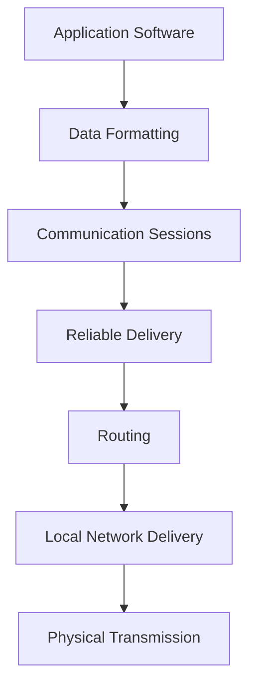

Each layer solves a specific problem.

---

# The Complete OSI Stack

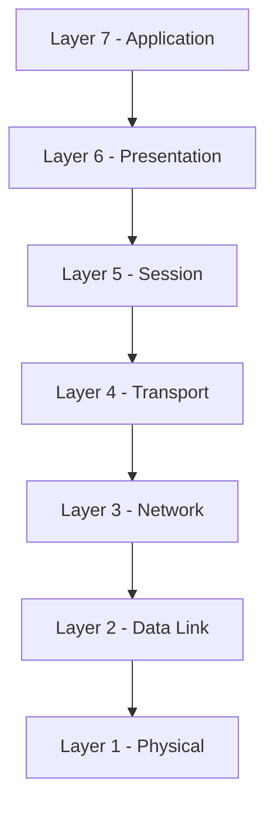

---

# Layer 1 — Physical Layer

## Purpose

The Physical Layer moves raw bits across a medium.

It deals with:

* Electricity
* Light
* Radio waves
* Voltage levels
* Signal timing
* Connectors
* Physical cabling

The Physical Layer knows nothing about:

* IP addresses
* Packets
* Websites
* Encryption

Its only job is:

> Turn bits into signals and transmit them.

---

## Physical Layer Technologies

### Copper

* Ethernet
* DSL
* Serial connections

### Fiber Optics

* Single Mode Fiber
* Multi Mode Fiber
* DWDM

### Wireless

* WiFi
* Bluetooth
* Cellular
* LoRa
* Satellite

---

## Physical Layer Diagram

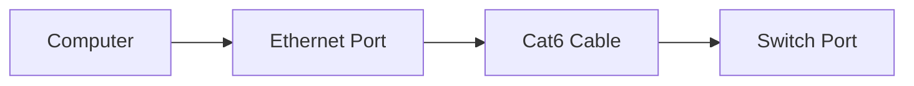

---

## Physical Layer Devices

| Device      | Function                      |
| ----------- | ----------------------------- |
| Cable       | Carries signal                |
| Fiber       | Carries light                 |
| Antenna     | Radiates RF                   |
| Repeater    | Amplifies signal              |
| Transceiver | Converts electrical ↔ optical |

---

# Layer 2 — Data Link Layer

## Purpose

The Data Link Layer allows devices on the same local network to communicate.

It introduces:

* Frames
* MAC Addresses
* Error Detection
* Switching

---

## MAC Addresses

Every network interface has a unique hardware address.

Example:

```text
00:1A:2B:3C:4D:5E
```

Unlike IP addresses:

* MAC = local identity
* IP = network identity

---

## Ethernet Frame

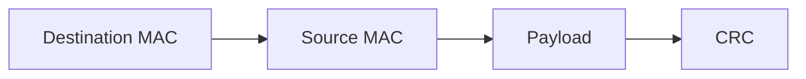

---

## Data Link Devices

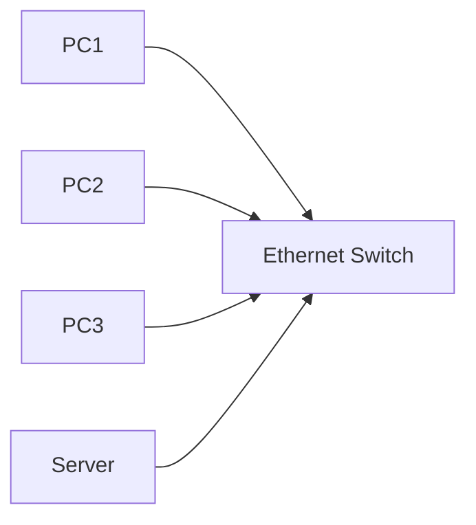

Switches operate primarily at Layer 2.

---

## Layer 2 Protocols

* Ethernet
* VLANs
* PPP
* Frame Relay
* ATM
* ARP
* STP

---

# Layer 3 — Network Layer

## Purpose

The Network Layer enables communication between different networks.

This is where routing happens.

---

## Main Responsibilities

* IP Addressing
* Routing
* Path Selection
* Packet Forwarding

---

## Layer 3 Example

A packet leaves New York.

Its destination is Tokyo.

Many routers determine the path.


---

## Layer 3 Protocols

### IPv4

```text
192.168.1.10
```

### IPv6

```text
2001:db8::1
```

### ICMP

Used for:

* Ping
* Traceroute
* Diagnostics

---

## Routers

Routers operate primarily at Layer 3.

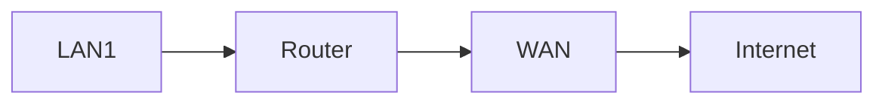

---

# Layer 4 — Transport Layer

## Purpose

The Transport Layer ensures end-to-end communication.

This layer introduces:

* Ports
* Reliability
* Retransmission
* Flow Control

---

# TCP

Transmission Control Protocol

Features:

* Reliable
* Ordered
* Error checked

---

## TCP Handshake

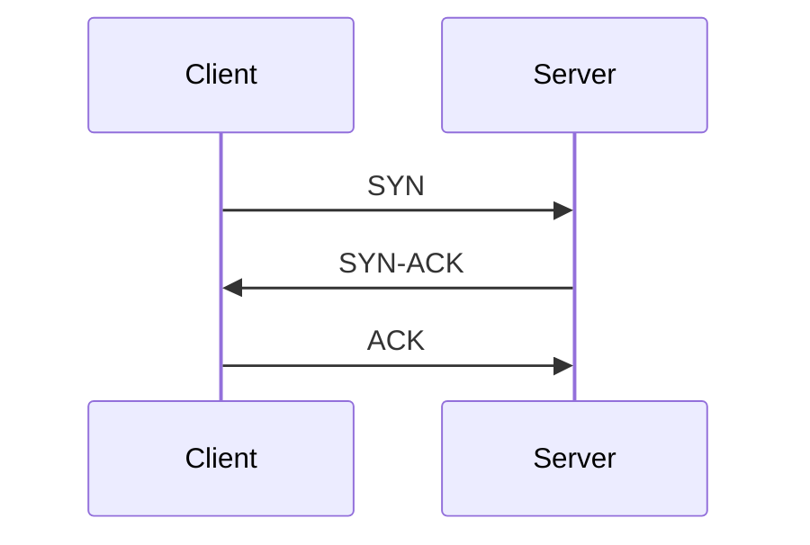

Connection established.

---

## TCP Example

Used by:

* HTTPS
* SSH
* Email
* Databases

---

# UDP

User Datagram Protocol

Characteristics:

* Fast
* No retransmission
* Low latency

Used by:

* Gaming
* VoIP
* Streaming
* DNS

---

## TCP vs UDP

| Feature     | TCP      | UDP       |
| ----------- | -------- | --------- |
| Reliable    | Yes      | No        |
| Ordered     | Yes      | No        |
| Fast        | Moderate | Very Fast |
| Retransmits | Yes      | No        |

---

# QUIC

Modern transport protocol.

Used by:

* HTTP/3
* Google Services
* Modern CDNs

QUIC combines:

* UDP
* TLS
* Multiplexing

into one protocol.

---

# Layer 5 — Session Layer

## Purpose

Manages communication sessions.

Responsibilities:

* Session establishment
* Session maintenance
* Session termination

---

## Example

Video conference:

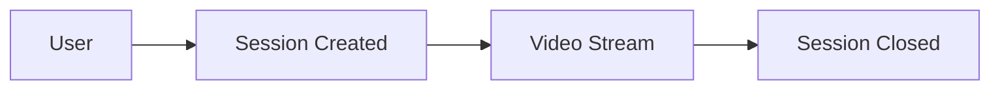

---

## Layer 5 Technologies

* NetBIOS
* RPC
* PPTP
* SOCKS
* SIP Sessions

---

# Layer 6 — Presentation Layer

## Purpose

Translates data between applications.

This layer handles:

* Encryption
* Compression
* Encoding
* Serialization

---

## Example

Browser requests page.

Presentation layer:

```text
Compress
Encrypt
Encode
```

Before sending.

---

## TLS

One of the most important Presentation Layer technologies.

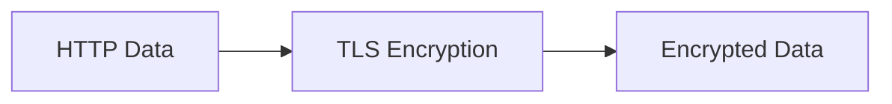

---

## Common Technologies

* TLS
* SSL
* MIME
* ASN.1
* JPEG
* PNG
* UTF-8

---

# Layer 7 — Application Layer

## Purpose

The Application Layer is where users interact with the network.

Examples:

* Web Browsers
* APIs
* Email Clients
* SSH Clients

---

## Common Protocols

| Protocol | Purpose         |
| -------- | --------------- |
| HTTP     | Websites        |
| HTTPS    | Secure Websites |
| DNS      | Name Resolution |
| FTP      | File Transfer   |
| SMTP     | Email Sending   |
| SSH      | Remote Access   |
| DHCP     | IP Assignment   |
| NTP      | Time Sync       |

---

## Example Web Request

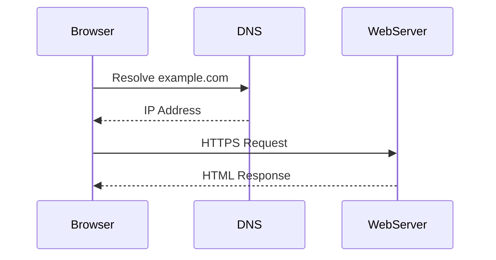

---

# Encapsulation

As data travels downward, each layer adds headers.

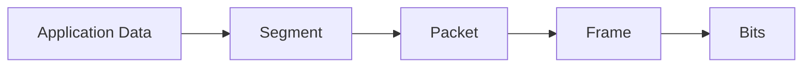

---

## Header Growth

```text
Application Data

TCP Header
+ Data

IP Header
+ TCP Header
+ Data

Ethernet Header
+ IP Header
+ TCP Header
+ Data
```

---

# Decapsulation

Receiving host removes headers.

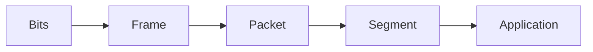

---

# Complete Packet Journey

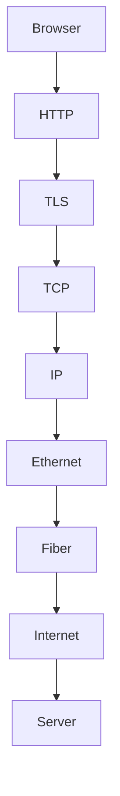

---

# OSI vs TCP/IP

Modern Internet networks generally follow TCP/IP.

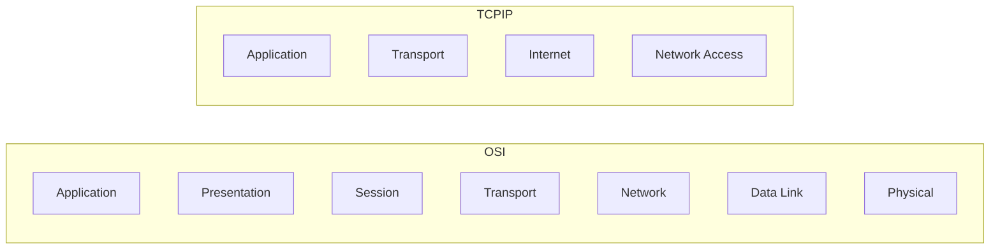

---

# Where Modern Technologies Fit

| Technology   | OSI Layer |
| ------------ | --------- |
| Fiber Optics | 1         |
| Ethernet     | 2         |
| VLAN         | 2         |
| MPLS         | 2.5       |
| IPv4         | 3         |
| IPv6         | 3         |
| BGP          | 3         |
| OSPF         | 3         |
| TCP          | 4         |
| UDP          | 4         |
| QUIC         | 4         |
| TLS          | 6         |
| HTTP         | 7         |
| DNS          | 7         |
| SSH          | 7         |
| MQTT         | 7         |
| WebSockets   | 7         |

---

# OSI in Modern Cloud Infrastructure

A request to a website may traverse:

```mermaid
flowchart LR

User

--> WiFi
--> Router
--> ISP
--> BGP
--> Internet Backbone
--> CDN Edge
--> Load Balancer
--> Kubernetes Cluster
--> API Service
--> Database
```

Each component relies on multiple OSI layers simultaneously.

---

# OSI Applied to Modern Distributed Systems

For platforms like:

* Cloudflare
* Vercel
* Fastly
* AWS
* Azure
* Google Cloud
* Distributed Mesh Networks
* CDN Platforms
* Edge Computing Systems

The stack becomes:

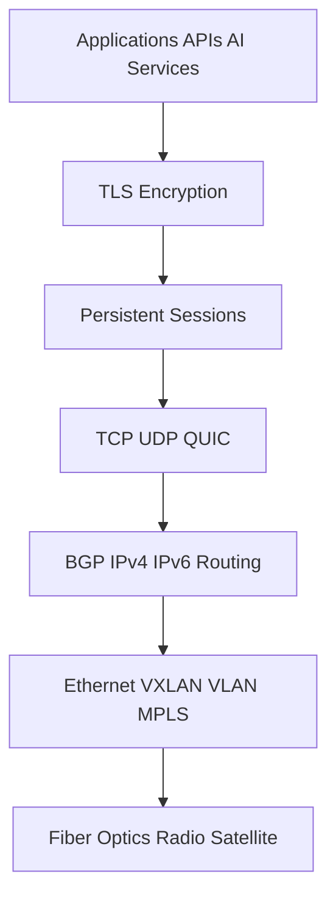

---

# Key Takeaways

The OSI model remains one of the most powerful frameworks in networking because it separates a massive problem into understandable layers.

Every modern system—from a simple web browser to global CDNs, distributed compute platforms, blockchain networks, hyperscalers, satellite constellations, AI infrastructure, and edge computing architectures—ultimately depends on these seven layers working together.

Understanding OSI means understanding the foundation upon which the modern Internet is built.
