# Points of Presence (PoPs)

## The Foundation of Global Internet Infrastructure

When users access a website, API, game server, AI service, or cloud application, their traffic does not magically travel directly to a distant data center.

Instead, it first enters a nearby **Point of Presence (PoP)**.

PoPs are one of the most important building blocks of modern networking and cloud infrastructure. Every major platform—including CDNs, cloud providers, telecommunications carriers, and edge computing networks—relies on a globally distributed network of PoPs to deliver low-latency, highly available services.

Without PoPs, technologies such as:

* CDNs
* BGP Anycast
* Edge Computing
* GeoDNS
* Distributed Cloud Platforms
* Global APIs
* Multiplayer Gaming Networks

would be significantly slower and less reliable.

---

# What Is a Point of Presence?

A **Point of Presence (PoP)** is a physical network location where traffic enters or exits a provider's network.

Think of a PoP as a regional gateway between users and a larger global infrastructure platform.

A PoP typically contains:

* Routers
* Network switches
* Fiber interconnects
* DDoS protection systems
* Load balancers
* CDN cache servers
* Edge compute nodes
* Monitoring systems
* Peering connections

These systems allow traffic to be processed locally before traveling deeper into the platform.

---

# Simple Analogy

Imagine a global shipping company.

Without regional warehouses:

```text
Customer
    |
    v
Single Warehouse
    |
    v
Package Delivery
```

Every package must travel from one location.

With regional warehouses:

```text
Customer
    |
    v
Nearest Warehouse
    |
    v
Regional Distribution
    |
    v
Package Delivery
```

A PoP functions like a regional distribution center for Internet traffic.

---

# PoPs in Internet Architecture

Modern networks consist of many interconnected PoPs.

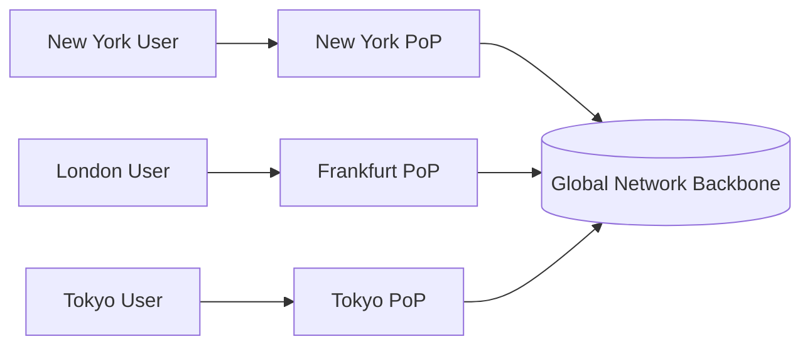

Each user enters the network through the closest PoP.

This dramatically reduces latency and improves performance.

---

# Anatomy of a Modern PoP

A modern PoP is far more than a rack of routers.

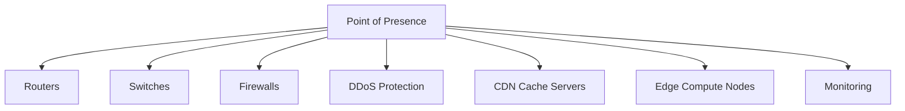

A large cloud provider may deploy hundreds of these locations globally.

---

# Where PoPs Are Located

PoPs are usually placed in strategic network locations such as:

* Major metropolitan areas
* Internet Exchange Points (IXPs)
* Carrier hotels
* Colocation facilities
* Regional data centers
* Telecommunications hubs

Examples:

```text
New York
Chicago
Dallas
Los Angeles
London
Frankfurt
Amsterdam
Singapore
Tokyo
Sydney
São Paulo
```

These locations sit near major Internet traffic routes.

---

# Relationship to Internet Exchange Points (IXPs)

PoPs often connect directly to Internet Exchange Points.

An IXP is a facility where multiple networks exchange traffic directly.

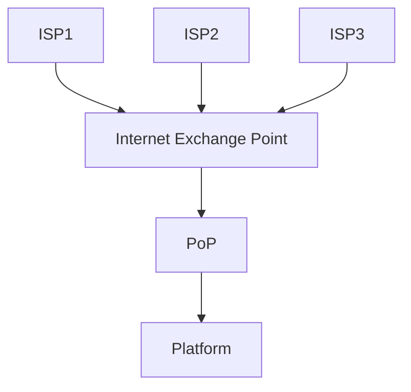

Benefits include:

* Lower latency
* Reduced transit costs
* Faster routing
* Greater redundancy

---

# PoPs and BGP Anycast

Anycast relies heavily on PoPs.

Every PoP advertises the same IP address.

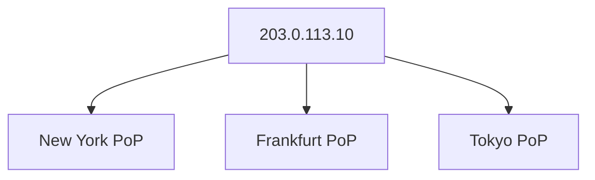

Internet routers automatically direct users toward the closest available PoP.

For example:

```text
German User
     |
     v
Frankfurt PoP

US User
     |
     v
New York PoP

Japanese User
     |
     v
Tokyo PoP
```

The user never knows which physical server handled the request.

---

# PoPs and GeoDNS

GeoDNS and PoPs work together.


GeoDNS determines:

> Which region should receive traffic?

The PoP then becomes the user's entry point into that region.

---

# PoPs and CDNs

Content Delivery Networks are built on top of PoPs.

Each PoP may contain local cache servers.

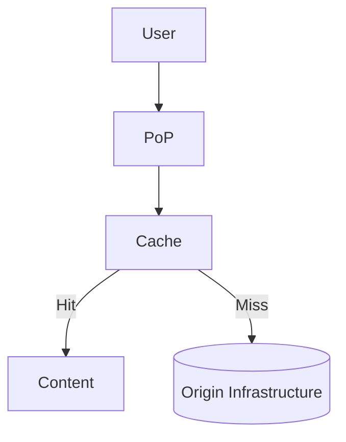

When content is already cached:

* No origin request is required
* Response times improve dramatically
* Bandwidth costs decrease

---

# PoPs and Edge Computing

Modern platforms increasingly place compute resources inside PoPs.

Instead of only serving cached files, PoPs can execute application logic.

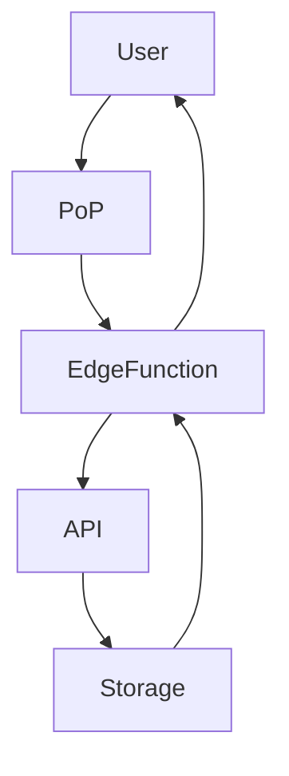

Examples include:

* Authentication
* API routing
* Rate limiting
* AI inference
* Image processing
* Serverless functions
* WebAssembly workloads

---

# Traditional Data Center Model

Historically, applications were deployed into a single region.

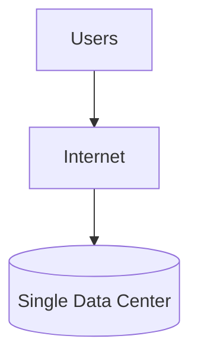

Problems:

* High latency
* Single points of failure
* Expensive scaling
* Long network paths

---

# Modern PoP-Based Architecture

Today's platforms distribute infrastructure globally.

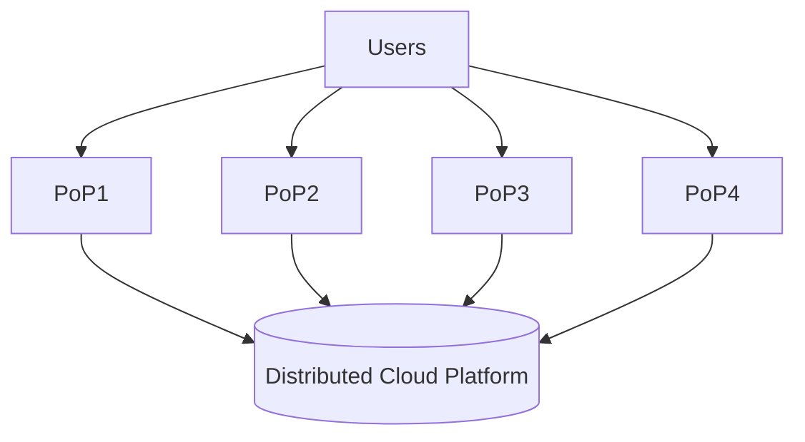

This allows applications to operate closer to users.

---

# Example Request Flow

A request might follow this path:

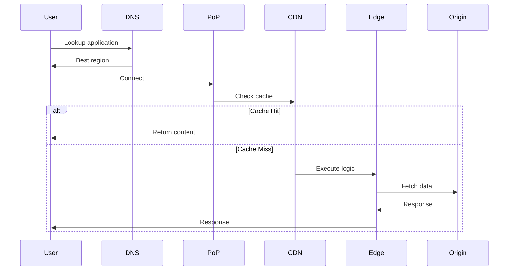

The PoP becomes the first physical infrastructure layer that handles the request.

---

# PoPs in a Developer Platform

For a modern distributed developer platform, PoPs become the global edge layer.

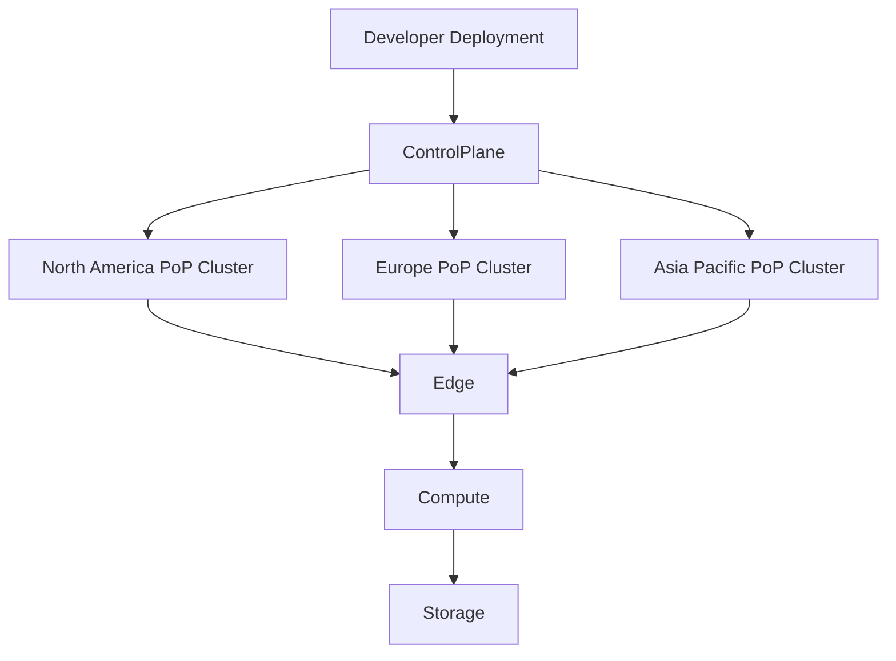

Developers deploy once.

The platform distributes workloads across many PoPs automatically.

---

# Why PoPs Matter

Without PoPs:

```text
User -> Distant Data Center
```

With PoPs:

```text
User -> Nearby PoP -> Platform
```

Benefits:

* Lower latency
* Faster application response times
* Better CDN performance
* Improved resilience
* Reduced backbone congestion
* Better DDoS mitigation
* Regional failover capabilities
* Improved user experience

---

# PoPs in Next-Generation Infrastructure

As cloud platforms evolve, PoPs are becoming miniature cloud regions rather than simple network gateways.

Modern PoPs increasingly contain:

* CDN infrastructure
* Edge compute
* AI inference nodes
* Distributed storage
* Security services
* Real-time networking services

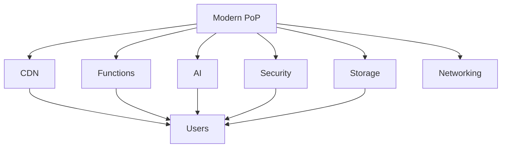

This transformation is enabling a shift from centralized cloud computing toward globally distributed application execution.

---

# Key Takeaways

| Component                     | Purpose                                  |
| ----------------------------- | ---------------------------------------- |
| Point of Presence (PoP)       | Physical entry point into a network      |
| Internet Exchange Point (IXP) | Location where networks exchange traffic |
| CDN                           | Delivers cached content from PoPs        |
| BGP Anycast                   | Routes users to the nearest PoP          |
| GeoDNS                        | Selects the optimal region               |
| Edge Compute                  | Runs code inside PoPs                    |
| Distributed Platform          | Coordinates workloads globally           |

---

# The Future of PoPs

The next generation of Internet infrastructure is increasingly built around dense networks of intelligent PoPs distributed worldwide.

Rather than forcing users to travel to centralized cloud regions, applications, content, AI services, and compute workloads are moving closer to users.

In this model, the PoP is no longer just a network gateway.

It becomes the local execution environment for the global Internet—combining networking, caching, compute, security, and storage into a single distributed edge platform.
