# Blockchain Layer Architecture Deep Dive

## Understanding Layer 0, Layer 1, Layer 2, and the Future of Modular Blockchain Infrastructure

---

# Introduction

Most people think of a blockchain as a single network like Bitcoin or Ethereum.

In reality, modern blockchain ecosystems are built from multiple layers, each solving different problems:

* Connectivity
* Consensus
* Security
* Settlement
* Execution
* Scaling
* Data Availability
* Interoperability

Just as the Internet uses the OSI Model to separate networking functions into layers, blockchain systems have evolved into layered architectures.

Modern ecosystems such as:

* Ethereum
* Bitcoin
* Cosmos
* Polkadot
* Avalanche
* Arbitrum
* Optimism

are increasingly becoming parts of a much larger blockchain stack.

---

# The Blockchain Layer Stack

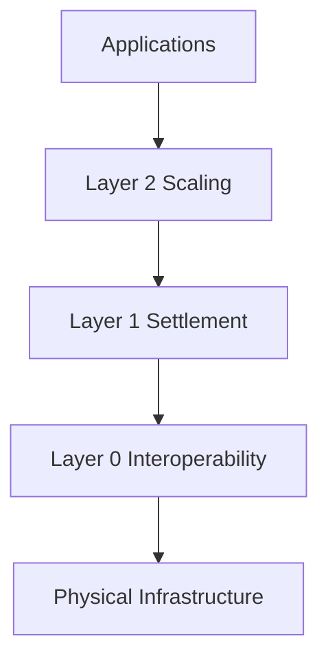

---

# The Big Picture

Think of blockchains like nations.

| Layer        | Analogy                              |
| ------------ | ------------------------------------ |
| Layer 0      | Roads and international trade routes |
| Layer 1      | Countries                            |
| Layer 2      | High-speed cities built on top       |
| Applications | Businesses and citizens              |

---

# Why Blockchain Layers Exist

The original blockchain model was simple:

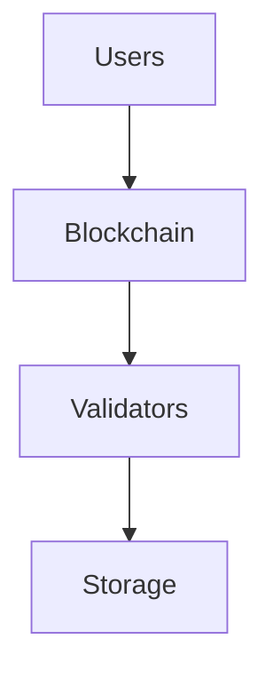

As adoption increased, problems emerged:

* High fees
* Slow transactions
* Congestion
* Limited interoperability
* Resource duplication

The solution was specialization.

Instead of one blockchain doing everything:

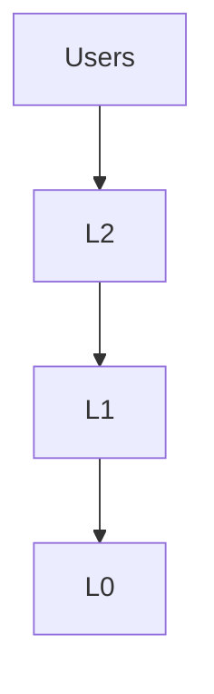

Each layer now focuses on specific responsibilities.

---

# Layer 0 — Blockchain Infrastructure Layer

## What Is Layer 0?

Layer 0 provides the infrastructure that allows multiple blockchains to exist and communicate.

Traditional blockchains operate independently.

Layer 0 creates a shared ecosystem.

---

# Layer 0 Responsibilities

* Chain creation
* Cross-chain communication
* Validator coordination
* Shared security
* Interoperability
* Consensus frameworks
* Networking

---

# Layer 0 Architecture

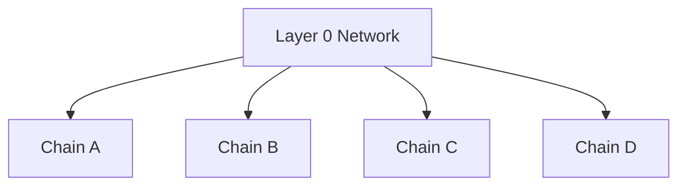

Instead of isolated chains:

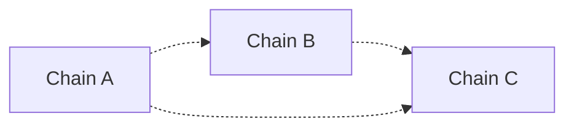

Layer 0 creates a unified network.

---

# Cosmos Architecture

### Internet of Blockchains

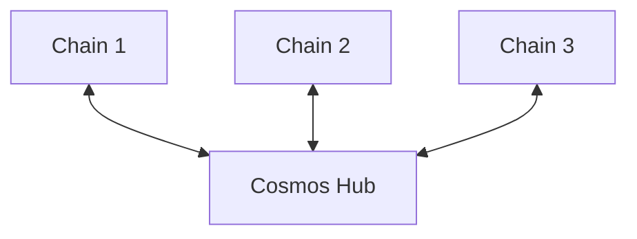

Cosmos uses:

* Tendermint
* IBC (Inter-Blockchain Communication)
* Sovereign chains

Each blockchain remains independent while communicating through IBC.

---

# Polkadot Architecture

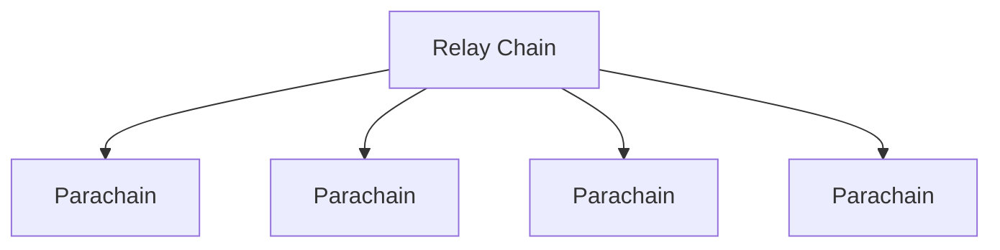

Polkadot introduces:

* Shared security
* Relay chain
* Parachains
* Cross-chain messaging

---

# Avalanche Architecture

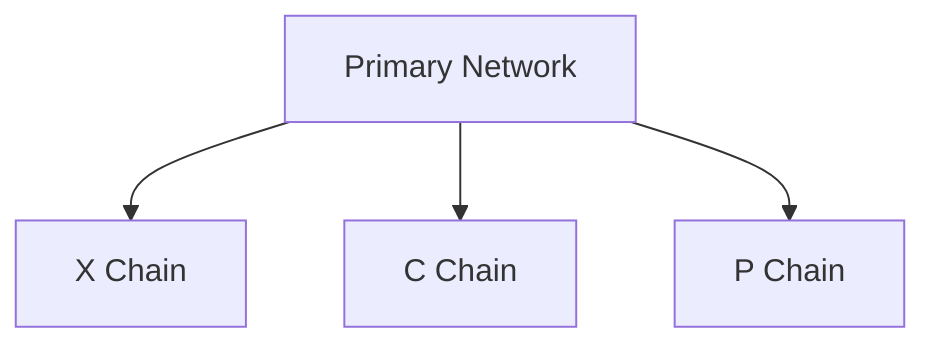

Avalanche enables:

* Custom subnets
* Specialized chains
* Shared infrastructure

---

# Layer 0 Advantages

### Interoperability

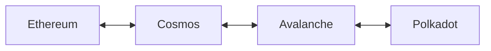

---

### Shared Security

Validators can secure many chains.

---

### Chain Sovereignty

Developers launch custom chains without building an ecosystem from scratch.

---

# Layer 1 — Settlement Layer

## What Is Layer 1?

Layer 1 blockchains are the foundational blockchains.

They provide:

* Consensus
* Security
* Data storage
* Transaction settlement

Every Layer 2 ultimately relies on Layer 1.

---

# Layer 1 Responsibilities

```mermaid
flowchart TD

Consensus
--> Security

Security
--> Settlement

Settlement
--> State Storage
```

---

# Layer 1 Components

## Consensus

Agreement on network state.

Examples:

* Proof of Work
* Proof of Stake
* Avalanche Consensus

---

## Validators

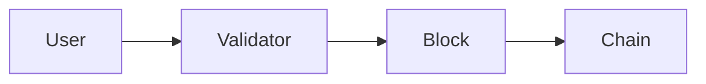

---

## State Storage

Layer 1 stores:

* Balances
* Smart contracts
* Tokens
* Ownership records

---

# Bitcoin

The first Layer 1 blockchain.

```mermaid
flowchart LR

Transactions
--> Miners
--> Blocks
--> Bitcoin Chain
```

Primary objective:

> Secure decentralized money.

---

# Ethereum

Ethereum expanded Layer 1 functionality.

```mermaid
flowchart TD

Users
--> Smart Contracts

Smart Contracts
--> Validators

Validators
--> Ethereum
```

Ethereum introduced:

* Smart contracts
* Tokens
* NFTs
* DAOs
* DeFi

---

# The Blockchain Trilemma

Coined by Vitalik Buterin.

A blockchain struggles to maximize:

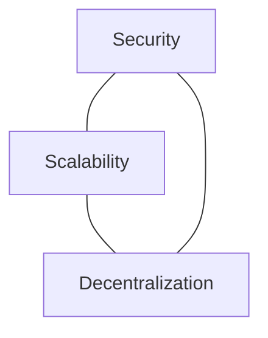

Improving one often impacts another.

---

# Layer 1 Limitations

## Bitcoin

* ~7 TPS

## Ethereum

* ~15–30 TPS

Compared to:

* Visa: thousands TPS
* Modern databases: tens of thousands TPS

---

# Why Layer 2 Exists

Layer 1 becomes expensive when usage increases.

```mermaid
flowchart TD

More Users
--> More Transactions

More Transactions
--> Congestion

Congestion
--> Higher Fees
```

---

# Layer 2 — Scaling Layer

## What Is Layer 2?

Layer 2 networks process transactions outside the Layer 1 chain while inheriting Layer 1 security.

Think of Layer 1 as a court system.

Layer 2 handles most activity and only reports final outcomes.

---

# Layer 2 Architecture

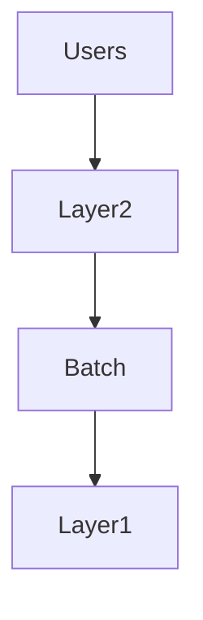

Thousands of transactions become one settlement transaction.

---

# Layer 2 Benefits

* Lower fees
* Faster confirmation
* Higher throughput
* Reduced congestion

---

# Rollup Model

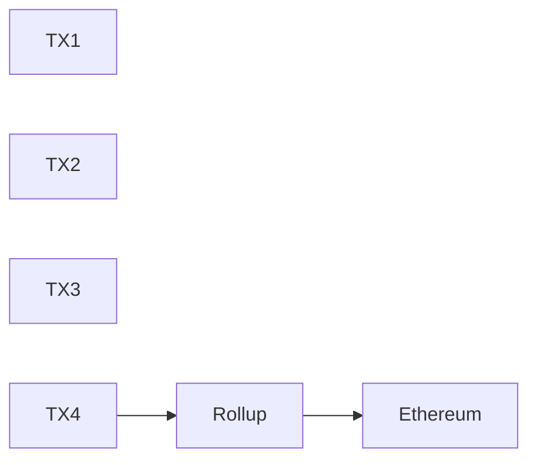

---

# Optimistic Rollups

Examples:

* Optimism
* Arbitrum

Process transactions optimistically.

Assume validity unless challenged.

```mermaid
flowchart TD

Transactions
--> Rollup

Rollup
--> Ethereum

Ethereum
--> Challenge Window
```

---

# ZK Rollups

Examples:

* zkSync
* Starknet

Use cryptographic proofs.

```mermaid
flowchart TD

Transactions
--> Prover

Prover
--> ZK Proof

ZK Proof
--> Ethereum
```

Advantages:

* Faster finality
* Strong cryptographic verification

---

# Bitcoin Lightning Network

Lightning is a Layer 2 for Bitcoin.

Instead of recording every payment on-chain:

```mermaid
flowchart LR

Alice
<--> Payment Channel
<--> Bob
```

Only channel opening and closing touch Bitcoin.

---

# Layer 2 Security Model

```mermaid
flowchart TD

Users
--> Layer2

Layer2
--> Ethereum

Ethereum
--> Validators
```

Security ultimately derives from Layer 1.

---

# Layer 3 — Application and Specialized Execution

Many modern ecosystems now discuss Layer 3.

Layer 3 focuses on:

* Specialized execution
* Application chains
* Privacy systems
* Gaming networks

---

# Layer 3 Example

```mermaid
flowchart TD

GamingChain

--> Arbitrum

--> Ethereum
```

Or:

```mermaid
flowchart TD

PrivacyNetwork

--> zkRollup

--> Ethereum
```

---

# The Modular Blockchain Future

Traditional blockchains:

```mermaid
flowchart TD

Execution
Consensus
Settlement
DataAvailability

all-in-one
```

Modern blockchains separate responsibilities.

---

# Modular Architecture

```mermaid
flowchart TB

Apps

--> Execution Layer

Execution Layer

--> Settlement Layer

Settlement Layer

--> Data Availability

Data Availability

--> Consensus Layer
```

---

# Monolithic vs Modular

## Monolithic

```mermaid
flowchart TD

EthereumOld[
Execution
Consensus
Settlement
Storage
]
```

Everything in one system.

---

## Modular

```mermaid
flowchart TB

Execution

--> Settlement

Settlement

--> DA

DA

--> Consensus
```

Each component can scale independently.

---

# Modern Blockchain Ecosystem

```mermaid
flowchart TB

subgraph Applications
DEX
Games
AI
Payments
NFTs
end

subgraph Layer2
Arbitrum
Optimism
Lightning
zkSync
end

subgraph Layer1
Ethereum
Bitcoin
Solana
Avalanche
end

subgraph Layer0
Cosmos
Polkadot
IBC
end

Applications --> Layer2
Layer2 --> Layer1
Layer1 --> Layer0
```

---

# Blockchain vs Internet Layers

| Internet     | Blockchain              |
| ------------ | ----------------------- |
| Physical     | Physical Infrastructure |
| Data Link    | Peer Networking         |
| Network      | Layer 0                 |
| Transport    | Consensus               |
| Session      | Settlement              |
| Presentation | Execution               |
| Application  | dApps                   |

The mapping is not exact, but both use layered abstractions to simplify complexity.

---

# Real World Example

A user swaps tokens on Arbitrum.

```mermaid
sequenceDiagram

User->>Arbitrum: Submit Transaction
Arbitrum->>Sequencer: Process TX
Sequencer->>Batch: Aggregate TXs
Batch->>Ethereum: Publish State
Ethereum->>Validators: Final Settlement
Validators-->>User: Secured Result
```

The user experiences:

* Low fees
* Fast confirmation

While Ethereum provides:

* Security
* Settlement
* Finality

---

# The Emerging Blockchain Stack

```mermaid
flowchart TB

A[Applications]

B[Layer 3 Specialized Networks]

C[Layer 2 Rollups]

D[Layer 1 Settlement]

E[Layer 0 Interoperability]

F[Physical Infrastructure]

A --> B
B --> C
C --> D
D --> E
E --> F
```

---

# Key Takeaways

Layer 0 creates interoperable ecosystems and enables chains to communicate.

Layer 1 provides consensus, security, settlement, and decentralized state storage.

Layer 2 scales Layer 1 by processing transactions more efficiently while inheriting security.

Layer 3 introduces specialized execution environments optimized for specific applications.

The industry is steadily moving from isolated monolithic blockchains toward a modular stack where networking, consensus, settlement, execution, and applications are increasingly separated into specialized layers—much like the evolution of the Internet itself.
