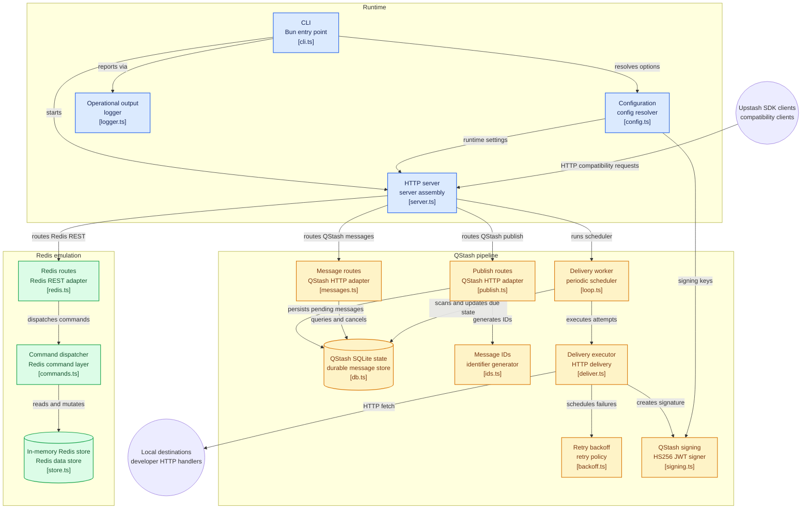

# Downstash Architecture

> A local-first development server that emulates **Upstash QStash** and **Upstash Redis**, allowing applications to use the official Upstash SDKs entirely offline without changing application code.

---

# Overview

Downstash is designed as a **drop-in local replacement** for the two core Upstash services used during development:

- **QStash** – Durable HTTP message delivery
- **Redis REST API** – HTTP-accessible Redis database

Rather than mocking SDKs or rewriting application logic, Downstash recreates the public HTTP interfaces exposed by Upstash. Applications continue using the official `@upstash/qstash` and `@upstash/redis` clients exactly as they would against production.

The result is a lightweight development server that supports:

- Offline development
- Local webhook delivery
- Integration testing
- Continuous Integration (CI)
- Faster feedback loops
- Deterministic testing
- Zero cloud dependencies

Instead of depending upon remote infrastructure, developers simply start Downstash locally and point their environment variables at `http://localhost:8080`.

---

# Architecture Overview

Downstash is composed of three major subsystems:

1. **Runtime**
2. **QStash Compatibility Layer**
3. **Redis Compatibility Layer**

The Runtime hosts the HTTP server and configuration system.

The QStash layer implements durable asynchronous message delivery using SQLite.

The Redis layer provides an in-memory implementation of the Upstash Redis REST API.

Together these components reproduce enough of the production Upstash ecosystem for local development while remaining lightweight enough to run as a single Bun process.

---

# System Architecture



---

# Runtime

The Runtime is responsible for constructing and hosting the entire Downstash application.

It consists of four primary components:

| Component | Responsibility |
|-----------|----------------|
| **CLI** | Starts the application and parses runtime flags |
| **Configuration** | Resolves configuration from CLI arguments, environment variables and defaults |
| **HTTP Server** | Exposes the QStash and Redis APIs |
| **Logger** | Provides structured operational logging |

The Runtime itself contains very little business logic.

Instead, it assembles the services that perform message delivery and Redis emulation.

Startup follows a straightforward sequence:

```
CLI

↓

Configuration

↓

HTTP Server

↓

Register Routes

↓

Start Scheduler

↓

Ready
```

---

# QStash Compatibility Layer

The QStash subsystem reproduces the public behavior of the hosted Upstash QStash service.

Rather than immediately forwarding requests, every published message enters a durable pipeline backed by SQLite.

Publishing a message performs four primary operations:

1. Generate a unique message identifier.
2. Persist the message to SQLite.
3. Return success to the client.
4. Allow the worker to deliver asynchronously.

This closely mirrors production behavior where publishing is asynchronous rather than blocking on the destination server.

---

# Durable Message Storage

Unlike the Redis subsystem, QStash messages are durable.

Every accepted publish request is written into SQLite before the API responds.

SQLite stores information such as:

- Message ID
- Destination URL
- HTTP method
- Request body
- Headers
- Delivery schedule
- Retry count
- Current delivery state

Because the queue is durable, restarting Downstash does not lose pending deliveries.

When the application starts, the worker simply resumes scanning the database.

---

# Delivery Scheduler

Message delivery is handled by a background worker.

Rather than processing requests immediately inside the HTTP handler, the scheduler periodically scans SQLite for messages whose scheduled delivery time has arrived.

The workflow looks like:

```
Publish

↓

SQLite

↓

Scheduler

↓

Delivery

↓

Success
     │
     └── Failure
             │
             ▼
        Retry Queue
```

By separating publishing from execution, Downstash behaves similarly to production queueing systems.

---

# HTTP Delivery

Once a message becomes due, the Delivery Executor constructs an outbound HTTP request to the destination URL.

Before dispatching the request it generates an authenticated `Upstash-Signature` JWT.

This allows downstream applications to use the official `Receiver` implementation from `@upstash/qstash` without modification.

From the perspective of the receiving application, the request is indistinguishable from one delivered by the hosted Upstash platform.

---

# Retry Pipeline

Failed deliveries are automatically retried.

Rather than immediately abandoning failed requests, the worker computes a future retry time using exponential backoff and updates the SQLite record.

Each subsequent failure increases the delay until either:

- The message succeeds.
- The retry limit is reached.
- The message enters a permanent failed state.

This approach prevents aggressive retry loops while preserving delivery reliability.

---

# Redis Compatibility Layer

The Redis subsystem implements the REST interface exposed by Upstash Redis.

Unlike QStash, Redis commands execute synchronously.

Incoming HTTP requests are translated into Redis operations by the command dispatcher before being executed against an in-memory datastore.

The architecture is intentionally modular:

```
HTTP Request

↓

Redis Route

↓

Command Dispatcher

↓

Memory Store

↓

HTTP Response
```

This separation allows routing, command parsing and storage to evolve independently.

---

# In-Memory Data Store

Redis data is intentionally ephemeral.

All keys, values and collections exist only in memory.

Restarting Downstash clears the database.

This design prioritizes development speed and low latency over persistence, matching the requirements of local integration testing.

Meanwhile, QStash messages continue to be stored durably in SQLite, reflecting their fundamentally different responsibilities.

---

# SDK Compatibility

A core design goal of Downstash is complete compatibility with the official Upstash SDKs.

Applications continue using:

- `@upstash/qstash`
- `@upstash/redis`

without modification.

Only environment variables change.

Instead of communicating with cloud endpoints, SDK requests are directed to the local Downstash server.

This dramatically simplifies development and testing while avoiding custom client implementations.

---

# Authentication and Signing

Downstash reproduces the authentication model expected by the Upstash SDKs.

For QStash, outbound deliveries are signed using an HS256 JWT placed in the `Upstash-Signature` header.

The token includes metadata such as:

- Message identifier
- Destination URL
- Issue time
- Expiration
- SHA-256 hash of the request body

Applications using the official `Receiver` class validate these signatures exactly as they would in production.

For Redis, requests authenticate using a configurable bearer token, providing compatibility with the REST authentication model while remaining lightweight for local development.

---

# Design Philosophy

Downstash is intentionally **not** a complete clone of the Upstash cloud platform.

Instead, it focuses on reproducing the interfaces that application developers interact with every day.

Its architecture emphasizes:

- Local-first development
- API compatibility
- Deterministic testing
- Minimal configuration
- Lightweight deployment
- Fast startup
- Offline operation

This philosophy keeps the implementation small while maximizing compatibility with existing applications.

---

# Summary

Downstash serves as a local compatibility layer for the Upstash ecosystem, enabling developers to run production-compatible messaging and Redis workflows entirely on their own machine.

Its architecture cleanly separates runtime infrastructure, asynchronous QStash processing, and Redis emulation into independent subsystems connected through a shared HTTP server.

By combining durable SQLite-backed message queues, authenticated webhook delivery, in-memory Redis emulation, and compatibility with the official Upstash SDKs, Downstash provides an efficient development environment that removes cloud dependencies without requiring changes to application code.

The result is a fast, deterministic, and portable platform that supports offline development, integration testing, and continuous integration while preserving the same programming model used in production.
