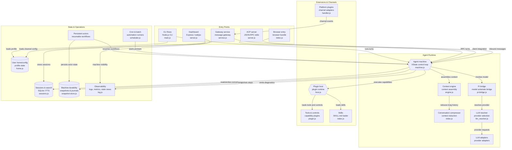

# AnEntrypoint/freddie — Architecture and Agent Runtime Model

> **Repository:** `AnEntrypoint/freddie`
> **Project:** `freddie`
> **Primary purpose:** A modular, persistent, multi-interface agent runtime for executing AI-driven workflows across models, tools, skills, channels, sessions, and durable state.
> **Core idea:** Provide a complete runtime substrate in which an AI agent can receive requests, assemble context, invoke models, execute capabilities, maintain conversation state, persist workflows, operate through multiple channels, and resume work over time.

---

# 1. Overview

`freddie` is an agent runtime designed to provide the infrastructure required to operate an AI agent as a persistent software system rather than as a single request/response loop.

At the simplest level, an AI agent can be represented as:

```text
User
  │
  ▼
Prompt
  │
  ▼
LLM
  │
  ▼
Response
```

A real production agent is considerably more complicated.

It must be able to:

* receive input from different interfaces
* maintain conversation history
* assemble relevant context
* compress long conversations
* select an appropriate LLM provider
* communicate with different model APIs
* execute tools
* load skills
* interact with external platforms
* persist state
* resume interrupted workflows
* run scheduled tasks
* operate through messaging channels
* expose dashboards
* provide observability
* survive process restarts

`freddie` addresses this larger problem.

The system can therefore be understood as:

```text
Input
  │
  ▼
Agent Runtime
  │
  ├── Context
  ├── Memory
  ├── Model
  ├── Tools
  ├── Skills
  ├── Channels
  ├── Persistence
  ├── Automation
  └── Observability
  │
  ▼
Output / Action
```

The central architectural idea is that the **agent itself is a stateful runtime**.

It is not simply a model.

The LLM is one component inside the runtime.

---

# 2. High-Level Architecture

The architecture can be divided into four major layers:

1. **Entry Points**
2. **Agent Runtime**
3. **Extensions and Channels**
4. **State and Operations**

These layers surround a central agent control loop.

```text
┌──────────────────────────────────────────────┐
│                 ENTRY POINTS                 │
│                                              │
│ CLI │ ACP │ Browser │ Dashboard │ Gateway    │
└──────────────────────┬───────────────────────┘
                       │
                       ▼
┌──────────────────────────────────────────────┐
│              AGENT RUNTIME                   │
│                                              │
│ Agent Machine                               │
│ Context Engine                              │
│ Compression                                 │
│ Pi Bridge                                   │
│ LLM Resolver                                │
│ Provider Adapters                           │
└──────────────────────┬───────────────────────┘
                       │
             ┌─────────┴─────────┐
             ▼                   ▼
┌───────────────────────┐ ┌────────────────────┐
│ EXTENSIONS & CHANNELS │ │ STATE & OPERATIONS │
│                       │ │                    │
│ Plugin Host           │ │ Sessions           │
│ Tools                 │ │ Machine State      │
│ Skills                │ │ Persistent Actors  │
│ Platform Plugins      │ │ Cron / Batch       │
│                       │ │ Observability      │
│                       │ │ User State         │
└───────────────────────┘ └────────────────────┘
```

The architecture is intentionally modular.

The agent's core control loop does not need to know every possible tool, platform, model provider, or interface.

Instead, these capabilities are attached through dedicated boundaries.

---

# 3. Complete System Flow

The full system can be represented by the following flow:



The system can be reduced to one primary execution cycle:

```text
REQUEST
   │
   ▼
ENTRY POINT
   │
   ▼
AGENT MACHINE
   │
   ├── LOAD SESSION
   │
   ├── ASSEMBLE CONTEXT
   │
   ├── COMPRESS IF NECESSARY
   │
   ├── INVOKE MODEL
   │
   ├── RESOLVE PROVIDER
   │
   ├── EXECUTE TOOLS
   │
   ├── LOAD SKILLS
   │
   ├── UPDATE STATE
   │
   └── EMIT OBSERVABILITY
   │
   ▼
RESPONSE / ACTION
```

---

# 4. Entry Points

The entry-point layer provides multiple ways to interact with the same underlying agent runtime.

The primary entry points are:

```text
CLI
ACP
Browser
Dashboard
Gateway
```

This creates an important architectural property:

> Different interfaces can drive the same agent machine.

Instead of building a separate agent for every interface, `freddie` provides a common runtime.

```text
CLI ───────────┐
               │
ACP ───────────┤
               │
Browser ───────┤
               ▼
          Agent Machine
               ▲
               │
Gateway ────────┘
```

This allows the runtime to remain interface-independent.

---

# 5. CLI Entry Point

The CLI is represented by:

```text
src/cli/main.js
```

The CLI provides a direct local interface to the agent.

Conceptually:

```text
Terminal
   │
   ▼
CLI
   │
   ▼
Agent Machine
```

The CLI can initiate agent turns, load user profile state, and provide a direct development-oriented interaction model.

This is likely the simplest way to conceptualize the system:

```text
User
  │
  ▼
Terminal
  │
  ▼
freddie CLI
  │
  ▼
Agent
```

The important architectural point is that the CLI does not implement the agent's reasoning logic itself.

It invokes the central agent runtime.

This means that the same agent behavior can potentially be accessed through other interfaces.

---

# 6. ACP Server

The ACP entry point is:

```text
src/acp/server.js
```

ACP provides a machine-to-machine interface using JSON-RPC over standard input/output.

Conceptually:

```text
External Client
      │
      ▼
JSON-RPC
      │
      ▼
ACP Server
      │
      ▼
Agent Machine
```

This makes the agent accessible to other software systems.

The architecture therefore supports:

```text
Human → CLI
Application → ACP
Browser → Browser Entry
Message → Gateway
Dashboard → State
```

The ACP layer effectively turns `freddie` into a programmable agent service.

Rather than requiring every client to understand the internal agent architecture, clients can communicate through the ACP boundary.

---

# 7. Browser Entry

The browser entry point is:

```text
src/browser/index.js
```

This provides client-side integration with the agent runtime.

Conceptually:

```text
Web Application
      │
      ▼
Browser Client
      │
      ▼
Agent Runtime
```

The browser layer provides a different interaction environment from the CLI.

The important architectural distinction is:

```text
Browser
  ≠
Agent Core
```

The browser is a client or entry surface.

The actual reasoning and execution still occur through the central agent machine.

---

# 8. Dashboard

The dashboard is represented by:

```text
src/web/server.js
```

Unlike the CLI and ACP server, the dashboard is primarily a visibility and management interface.

Conceptually:

```text
Agent Runtime
      │
      ├── Sessions
      ├── Machine State
      ├── Diagnostics
      └── Observability
      │
      ▼
Dashboard
```

The dashboard provides visibility into the system rather than replacing the agent runtime.

This creates an architecture similar to:

```text
              AGENT MACHINE
                    │
        ┌───────────┴───────────┐
        │                       │
        ▼                       ▼
   Execution                 Observation
        │                       │
        ▼                       ▼
     Runtime                 Dashboard
```

This distinction becomes important as the system becomes persistent.

A stateless chatbot only needs a response.

A persistent agent system needs operators to understand:

* what is running
* what has happened
* what sessions exist
* what state machines are doing
* what diagnostics have been emitted

The dashboard provides that operational surface.

---

# 9. Gateway Service

The gateway is represented by:

```text
src/gateway/service.js
```

The gateway acts as the bridge between external messaging systems and the agent runtime.

Conceptually:

```text
External Message
      │
      ▼
Platform Plugin
      │
      ▼
Gateway
      │
      ▼
Agent Machine
```

This separates channel-specific concerns from agent logic.

For example:

```text
Telegram
Discord
Slack
Other Platform
      │
      ▼
Platform Adapter
      │
      ▼
Gateway
      │
      ▼
Agent
```

The agent therefore does not need to know how every messaging platform works.

The platform plugin translates the external event into a normalized message.

The gateway routes that event into the agent runtime.

---

# 10. Agent Machine

The central component is:

```text
src/agent/machine.js
```

This is the heart of `freddie`.

The architecture identifies it as an:

```text
XState control loop
```

Conceptually:

```text
              ┌───────────────┐
              │  AGENT MACHINE│
              └───────┬───────┘
                      │
          ┌───────────┼───────────┐
          ▼           ▼           ▼
       Context       Model       Tools
          │           │           │
          └───────────┼───────────┘
                      │
                      ▼
                  State Update
                      │
                      ▼
                  Next Cycle
```

The agent machine coordinates the lifecycle of a turn.

It acts as the control plane for:

* context construction
* model invocation
* tool execution
* state transitions
* persistence
* diagnostics

The machine therefore sits at the center of the architecture.

---

# 11. XState Control Loop

Using a state-machine architecture is significant.

A conventional agent may look like:

```text
while (true) {
    promptModel()
    executeTool()
}
```

A state-machine agent instead explicitly models the lifecycle.

Conceptually:

```text
IDLE
  │
  ▼
RECEIVE INPUT
  │
  ▼
ASSEMBLE CONTEXT
  │
  ▼
INVOKE MODEL
  │
  ├── Text response ────────► COMPLETE
  │
  └── Tool request
          │
          ▼
      EXECUTE TOOL
          │
          ▼
      UPDATE STATE
          │
          ▼
      INVOKE MODEL
```

This provides a formal representation of agent execution.

The machine can therefore support:

* deterministic transitions
* persistence
* recovery
* snapshots
* resumability
* observability

The agent is no longer simply a function.

It becomes a durable stateful process.

---

# 12. Context Engine

The context engine is:

```text
src/context/engine.js
```

The context engine determines what information should be presented to the model.

The model does not necessarily receive every piece of available information.

Instead:

```text
Project State
Conversation
User State
Skills
Tool Results
System Instructions
       │
       ▼
Context Engine
       │
       ▼
Model Context
```

This is one of the most important parts of a production agent architecture.

The model's intelligence is constrained by the quality of the context it receives.

The context engine therefore acts as an information-selection layer.

---

# 13. Context Assembly

The conceptual process is:

```text
INPUT
  │
  ├── Current user message
  ├── Conversation history
  ├── Relevant session data
  ├── User profile
  ├── Active skills
  ├── Tool results
  └── System instructions
  │
  ▼
CONTEXT ENGINE
  │
  ▼
MODEL-READY CONTEXT
```

This creates a distinction between:

```text
Everything the system knows
```

and:

```text
What the model needs right now
```

That distinction is essential for efficiency and accuracy.

---

# 14. Conversation Compression

The conversation compressor is:

```text
src/agent/compress/index.js
```

Long-running agents eventually encounter a fundamental limitation:

```text
Context Window
```

As conversations grow:

```text
Message 1
Message 2
Message 3
...
Message 500
```

the full conversation may become too large or too expensive to send to the model.

The compressor addresses this.

Conceptually:

```text
Long Conversation
      │
      ▼
Compression
      │
      ├── Preserve important facts
      ├── Preserve decisions
      ├── Preserve active goals
      └── Remove redundant detail
      │
      ▼
Reduced Context
```

The goal is not simply to shorten text.

The goal is to preserve the information necessary for continued reasoning.

This allows `freddie` to support longer-lived interactions.

---

# 15. Pi Bridge

The Pi bridge is:

```text
src/agent/pi-bridge.js
```

The bridge acts as the connection between the agent control system and the underlying model substrate.

Conceptually:

```text
Agent Machine
      │
      ▼
Pi Bridge
      │
      ▼
Model Substrate
```

This creates an abstraction boundary between the agent's execution logic and the model execution layer.

The agent machine should not need to directly implement every detail of every model provider.

Instead:

```text
Agent
  │
  ▼
Pi Bridge
  │
  ▼
LLM Resolver
  │
  ▼
Provider Adapter
  │
  ▼
Model API
```

This makes the architecture provider-independent.

---

# 16. LLM Resolver

The resolver is:

```text
src/agent/llm_resolver.js
```

Its responsibility is provider selection.

Conceptually:

```text
Agent Request
      │
      ▼
LLM Resolver
      │
      ├── Provider A
      ├── Provider B
      ├── Provider C
      └── Other Provider
      │
      ▼
Selected Adapter
```

This means the agent runtime can separate:

```text
What the agent wants
```

from:

```text
Which provider executes it
```

That is an important architectural abstraction.

The agent may request:

```text
Generate a response
```

without needing to know whether the request is ultimately handled by:

* Anthropic
* OpenAI
* another provider
* a local model
* a future provider

The resolver handles that decision.

---

# 17. LLM Adapters

Provider adapters are the final layer between the runtime and individual model APIs.

Conceptually:

```text
LLM Resolver
      │
      ▼
Provider Adapter
      │
      ▼
External LLM API
```

An adapter normalizes provider-specific differences.

The architecture therefore looks like:

```text
                Agent
                  │
                  ▼
             LLM Resolver
                  │
       ┌──────────┼──────────┐
       ▼          ▼          ▼
   Adapter A  Adapter B  Adapter C
       │          │          │
       ▼          ▼          ▼
   Provider A  Provider B  Provider C
```

This is what allows the agent runtime to be multi-provider.

---

# 18. Plugin Host

The plugin host is:

```text
src/host/host.js
```

It provides the extension runtime for capabilities that are not part of the agent's central logic.

Conceptually:

```text
Agent Machine
      │
      ▼
Plugin Host
      │
      ├── Tools
      ├── Controls
      └── Skills
```

The plugin host is therefore a capability boundary.

The agent can reason about what it wants to accomplish.

The plugin system provides mechanisms for accomplishing it.

---

# 19. Tools and Controls

Tools are represented by plugin implementations such as:

```text
plugins/tools/files/plugin.js
```

A tool can be thought of as:

```text
Model Intent
      │
      ▼
Tool Call
      │
      ▼
Plugin
      │
      ▼
External Side Effect
```

Examples could include:

* reading files
* writing files
* manipulating project data
* executing controlled operations
* interacting with external services

The important architectural principle is that tools are capabilities.

The model does not directly have unrestricted access to the environment.

Instead:

```text
LLM
 │
 ▼
Tool Request
 │
 ▼
Plugin Host
 │
 ▼
Capability Plugin
 │
 ▼
Execution
```

This provides a cleaner boundary between reasoning and action.

---

# 20. Skills

Skills are loaded through:

```text
src/skills/index.js
```

The architecture identifies skills as `SKILL.md`-based components.

Conceptually:

```text
Skill
  │
  ▼
SKILL.md
  │
  ▼
Agent Instructions / Capability
```

Skills provide reusable domain-specific behavior.

A skill can be viewed as a package of knowledge and operational instructions that the agent can load when needed.

The architecture therefore distinguishes:

```text
Tool
```

from:

```text
Skill
```

A tool primarily provides an executable capability.

A skill primarily provides instructions, context, or procedural knowledge.

The two can work together:

```text
Skill
  │
  │ tells agent how to accomplish something
  ▼
Agent
  │
  │ invokes capability
  ▼
Tool
```

This is an important compositional pattern.

---

# 21. Platform Plugins

Platform plugins are represented by channel adapters such as:

```text
plugins/platform/platform-telegram/handler.js
```

These plugins connect external communication platforms to the gateway.

Conceptually:

```text
External Platform
      │
      ▼
Platform Plugin
      │
      ▼
Gateway
      │
      ▼
Agent Machine
```

The platform plugin handles channel-specific concerns.

For example, the external platform may provide:

```text
Message
Sender
Conversation
Attachments
Metadata
```

The plugin converts this into an event that the gateway and agent runtime can understand.

This creates a channel abstraction:

```text
Telegram ─────┐
Discord ──────┤
Slack ────────┤
Web ──────────┤
Other ────────┘
       │
       ▼
    Gateway
       │
       ▼
     Agent
```

The agent therefore becomes channel-independent.

---

# 22. Sessions and Search

Session persistence is represented by:

```text
src/sessions.js
```

The architecture uses SQLite and full-text search.

Conceptually:

```text
Agent
  │
  ▼
Session Store
  │
  ├── Conversation history
  ├── Session metadata
  └── Search index
```

This allows the runtime to maintain conversations over time.

The system can therefore support:

```text
Session A
Session B
Session C
...
```

while still allowing the agent to retrieve relevant historical information.

The addition of FTS is especially important because persistent agents eventually accumulate large amounts of historical context.

The architecture becomes:

```text
Current Request
      │
      ▼
Session Search
      │
      ▼
Relevant History
      │
      ▼
Context Engine
```

This creates a retrieval-oriented memory model.

---

# 23. Machine Durability

Machine durability is represented by:

```text
src/machines/snapshot-store.js
```

This is distinct from conversation memory.

A conversation answers:

> What did the user and agent say?

Machine durability answers:

> What state was the agent execution process in?

Conceptually:

```text
Agent Machine
      │
      ▼
Snapshot
      │
      ▼
Persistent Storage
```

If execution is interrupted, the system can potentially restore the machine to a previous state.

This is a fundamental requirement for long-running workflows.

Without durability:

```text
Process crashes
   │
   ▼
State disappears
```

With durability:

```text
Process crashes
   │
   ▼
Load snapshot
   │
   ▼
Resume execution
```

---

# 24. Persistent Actors

Persistent actors are represented by:

```text
src/machines/persistent-actor.js
```

An actor can be conceptualized as a long-lived execution process.

Instead of:

```text
Request
  │
  ▼
Response
  │
  ▼
Done
```

a persistent actor can continue existing:

```text
Actor
  │
  ├── Receives event
  ├── Updates state
  ├── Executes work
  ├── Persists state
  ├── Waits
  └── Resumes later
```

This makes the runtime suitable for workflows that extend beyond one interaction.

Examples conceptually include:

```text
Scheduled research task
Long-running coding task
Background monitoring
Multi-step automation
Persistent assistant
```

The architecture becomes:

```text
Persistent Actor
      │
      ▼
Machine State
      │
      ▼
Snapshot / Journal
      │
      ▼
Resume
      │
      ▼
Agent Machine
```

---

# 25. Cron and Batch Automation

Automation is represented by:

```text
src/cron/scheduler.js
```

This provides a mechanism for starting agent work without a human initiating each turn.

Conceptually:

```text
Schedule
   │
   ▼
Scheduler
   │
   ▼
Prompt / Event
   │
   ▼
Agent Machine
```

This allows the agent to become an active system.

Instead of:

```text
User → Agent
```

the system can support:

```text
Time
  │
  ▼
Scheduler
  │
  ▼
Agent
```

This enables recurring or batch workflows.

Examples might include:

```text
Daily task
Hourly monitoring
Scheduled report
Batch processing
Periodic maintenance
```

The important architectural property is that automation feeds into the same agent runtime.

The scheduler does not need to implement a separate agent.

It starts the existing machine.

---

# 26. Observability

Observability is represented by:

```text
src/observability/log.js
```

The system emits diagnostics that can be consumed by operational interfaces.

Conceptually:

```text
Agent Machine
      │
      ▼
Observability
      │
      ├── Logs
      ├── Metrics
      ├── State
      └── Diagnostics
      │
      ▼
Dashboard / Operators
```

This is essential because a persistent agent system is difficult to operate without visibility.

The system needs to answer questions such as:

```text
What is the agent doing?

What state is it in?

Which model is being used?

What tool was invoked?

What session is active?

Did the workflow fail?

Can the workflow resume?

```

Observability turns the runtime from a black box into an inspectable system.

---

# 27. User Home and Configuration

User-level state is represented by:

```text
src/home.js
```

This provides the configuration boundary for the user's environment.

Conceptually:

```text
User
  │
  ▼
Home / Configuration
  │
  ├── Profile
  ├── Preferences
  ├── Credentials / Config
  └── Runtime Settings
```

The CLI loads this state when starting.

The gateway also loads channel configuration.

This creates a distinction between:

```text
Project State
```

and:

```text
User State
```

A useful conceptual model is:

```text
User Home
   │
   ├── Identity
   ├── Preferences
   └── Configuration

Project
   │
   ├── Sessions
   ├── Memory
   └── Workflow State
```

The two can be combined by the runtime when constructing context.

---

# 28. The Agent Turn

A complete agent turn can be represented as:

```text
USER INPUT
    │
    ▼
ENTRY POINT
    │
    ▼
AGENT MACHINE
    │
    ▼
LOAD SESSION
    │
    ▼
SEARCH RELEVANT HISTORY
    │
    ▼
ASSEMBLE CONTEXT
    │
    ▼
COMPRESS IF REQUIRED
    │
    ▼
INVOKE MODEL
    │
    ▼
RESOLVE LLM PROVIDER
    │
    ▼
SEND REQUEST
    │
    ▼
MODEL RESPONSE
    │
    ├───────────────┐
    │               │
    ▼               ▼
TEXT             TOOL CALL
    │               │
    │               ▼
    │          PLUGIN HOST
    │               │
    │               ▼
    │          TOOL / CONTROL
    │               │
    │               ▼
    │          TOOL RESULT
    │               │
    │               └───────┐
    │                       │
    └───────────────────────┘
                │
                ▼
          UPDATE MACHINE
                │
                ▼
          PERSIST STATE
                │
                ▼
          EMIT OBSERVABILITY
                │
                ▼
             RESPONSE
```

This is the central lifecycle of `freddie`.

---

# 29. Multi-Interface Agent Architecture

One of the strongest architectural properties of `freddie` is that multiple interfaces can converge on the same agent.

```text
                    ┌─────────────┐
                    │     CLI     │
                    └──────┬──────┘
                           │
                    ┌──────▼──────┐
                    │     ACP     │
                    └──────┬──────┘
                           │
                    ┌──────▼──────┐
                    │   Browser   │
                    └──────┬──────┘
                           │
                    ┌──────▼──────┐
                    │   Gateway   │
                    └──────┬──────┘
                           │
                           ▼
                   ┌───────────────┐
                   │ Agent Machine │
                   └───────────────┘
```

This means the runtime can be deployed in multiple modes without duplicating the core agent implementation.

The interface changes.

The agent remains the same.

---

# 30. Multi-Channel Architecture

The gateway and platform plugin architecture provides a normalized messaging system.

```text
                 External Channels
                       │
       ┌───────────────┼───────────────┐
       ▼               ▼               ▼
   Telegram         Web App          Other
       │               │               │
       ▼               ▼               ▼
Platform Plugin   Platform Plugin   Platform Plugin
       │               │               │
       └───────────────┼───────────────┘
                       ▼
                    Gateway
                       │
                       ▼
                 Agent Machine
```

This allows new channels to be added without changing the central agent logic.

A new platform primarily requires:

```text
New Handler
     │
     ▼
Normalized Event
     │
     ▼
Gateway
```

This is a scalable plugin architecture.

---

# 31. Model Abstraction Architecture

The model stack is similarly modular.

```text
                    Agent
                      │
                      ▼
                  Pi Bridge
                      │
                      ▼
                 LLM Resolver
                      │
          ┌───────────┼───────────┐
          ▼           ▼           ▼
       Adapter A   Adapter B   Adapter C
          │           │           │
          ▼           ▼           ▼
      Provider A  Provider B  Provider C
```

The key abstraction is:

```text
Agent logic
    ≠
Model provider
```

This prevents the entire agent runtime from becoming tightly coupled to one model API.

---

# 32. Capability Architecture

The plugin host creates a capability-oriented architecture.

The agent can reason:

```text
"I need to read this file."
```

But the actual operation occurs through:

```text
Agent
  │
  ▼
Tool Request
  │
  ▼
Plugin Host
  │
  ▼
File Tool
  │
  ▼
Filesystem
```

Similarly:

```text
"I need to use a specialized workflow."
  │
  ▼
Skill Loader
  │
  ▼
SKILL.md
  │
  ▼
Agent gains procedural knowledge
```

This produces two complementary extension mechanisms:

```text
TOOLS
Executable capabilities

SKILLS
Behavioral / procedural knowledge
```

Together:

```text
Skill
  │
  │ instructs
  ▼
Agent
  │
  │ executes
  ▼
Tool
```

---

# 33. State Architecture

The system maintains multiple kinds of state.

These should not be treated as one database.

Conceptually:

```text
                 STATE
                   │
      ┌────────────┼────────────┐
      ▼            ▼            ▼
Conversation    Machine      User
   State         State       State
      │            │            │
      ▼            ▼            ▼
 SQLite / FTS   Snapshots    Home Config
```

Additionally:

```text
Persistent Actors
       │
       ▼
Long-lived Workflow State
```

This separation is architecturally important.

The agent needs to distinguish:

```text
What was said?
```

from:

```text
What was happening?
```

and:

```text
Who is the user?
```

---

# 34. Durable Agent Architecture

Traditional chatbot:

```text
Request
   │
   ▼
LLM
   │
   ▼
Response
```

`freddie`:

```text
Request
   │
   ▼
Session
   │
   ▼
Agent Machine
   │
   ├── Context
   ├── Model
   ├── Tools
   ├── Skills
   ├── State
   └── Observability
   │
   ▼
Snapshot
   │
   ▼
Persist
   │
   ▼
Resume Later
```

This makes `freddie` better understood as a **durable agent runtime** rather than simply an LLM wrapper.

---

# 35. Automation Architecture

The addition of scheduling changes the system from reactive to proactive.

Reactive:

```text
User
  │
  ▼
Agent
```

Proactive:

```text
Clock
  │
  ▼
Scheduler
  │
  ▼
Agent
```

Combined:

```text
                 INPUT SOURCES
                      │
        ┌─────────────┼─────────────┐
        ▼             ▼             ▼
      User        Platform       Scheduler
        │             │             │
        ▼             ▼             ▼
       CLI         Gateway        Cron
        │             │             │
        └─────────────┼─────────────┘
                      ▼
                Agent Machine
```

This is the architecture of an autonomous runtime.

---

# 36. Observability and Operations

A persistent agent system requires an operational plane.

The architecture can therefore be viewed as:

```text
                    Agent Runtime
                         │
          ┌──────────────┼──────────────┐
          │              │              │
          ▼              ▼              ▼
       State          Logs          Metrics
          │              │              │
          └──────────────┼──────────────┘
                         ▼
                    Observability
                         │
                         ▼
                     Dashboard
```

This enables operators to inspect the agent while it is running.

The dashboard therefore becomes the human-facing control surface for the runtime.

---

# 37. `freddie` as an Agent Operating System

A useful conceptual model is to think of `freddie` as an operating system for agents.

Traditional operating system:

```text
Application
    │
    ▼
Process
    │
    ▼
Scheduler
    │
    ▼
Memory
    │
    ▼
Filesystem
    │
    ▼
Hardware
```

`freddie`:

```text
Agent
    │
    ▼
Agent Machine
    │
    ▼
Scheduler
    │
    ▼
Context / Sessions
    │
    ▼
Plugin Host
    │
    ▼
Tools / Platforms
    │
    ▼
External World
```

The analogy is not exact, but it illustrates the architecture.

The agent is the application.

The XState machine is the process controller.

The scheduler starts work.

Sessions provide persistent memory.

Plugins provide capabilities.

Channels provide I/O.

Observability provides operational visibility.

---

# 38. Relationship to `gm`

The most interesting architectural relationship is between `freddie` and `gm`.

They can be understood as complementary layers.

```text
                    AI SYSTEM
                       │
        ┌──────────────┴──────────────┐
        │                             │
        ▼                             ▼
       GM                          FREDDIE
Execution discipline             Agent runtime
        │                             │
        ├── Workflow                  ├── Model
        ├── State                     ├── Context
        ├── Policies                  ├── Tools
        ├── Verification              ├── Skills
        └── Completion                ├── Channels
                                      ├── Sessions
                                      ├── Actors
                                      ├── Automation
                                      └── Observability
```

A simplified combined architecture is:

```text
USER
 │
 ▼
FREDDIE ENTRY POINT
 │
 ▼
FREDDIE AGENT MACHINE
 │
 ▼
GM EXECUTION DISCIPLINE
 │
 ├── PLAN
 ├── EXECUTE
 ├── EMIT
 ├── VERIFY
 ├── CONSOLIDATE
 └── COMPLETE
 │
 ▼
FREDDIE RUNTIME
 │
 ├── LLM
 ├── TOOLS
 ├── SKILLS
 ├── BROWSER
 ├── MEMORY
 └── PLUGINS
 │
 ▼
PERSISTENT STATE
```

In this conceptual model:

> **`freddie` provides the agent's body. `gm` provides the execution discipline.**

`freddie` answers:

> How does the agent run?

`gm` answers:

> How should the agent work?

This separation is powerful because the runtime can support many workflows, while `gm` can impose a specific execution methodology.

---

# 39. Example End-to-End Coding Task

Consider:

> Add authentication to my application, test it, and tell me when it is complete.

The request might enter through:

```text
CLI
```

or:

```text
ACP
```

or:

```text
Browser
```

or:

```text
Messaging Platform
```

The flow becomes:

```text
USER
 │
 ▼
ENTRY POINT
 │
 ▼
AGENT MACHINE
 │
 ▼
LOAD SESSION
 │
 ▼
CONTEXT ENGINE
 │
 ▼
MODEL
 │
 ▼
AGENT REASONING
 │
 ▼
TOOL REQUEST
 │
 ▼
PLUGIN HOST
 │
 ▼
FILE / CODE TOOL
 │
 ▼
CODE CHANGE
 │
 ▼
MODEL
 │
 ▼
TEST TOOL
 │
 ▼
TEST RESULT
 │
 ▼
CONTEXT ENGINE
 │
 ▼
MODEL
 │
 ▼
VERIFICATION
 │
 ▼
SESSION UPDATE
 │
 ▼
PERSIST MACHINE STATE
 │
 ▼
OBSERVABILITY
 │
 ▼
FINAL RESPONSE
```

If `gm` is incorporated into the workflow, the same task becomes:

```text
PLAN
  │
  ▼
EXECUTE
  │
  ▼
EMIT
  │
  ▼
VERIFY
  │
  ▼
CONSOLIDATE
  │
  ▼
COMPLETE
```

The runtime and workflow layers therefore complement one another.

---

# 40. Failure Recovery

One of the most significant consequences of the architecture is the possibility of recovery.

A simple agent:

```text
Agent
  │
  ▼
Crash
  │
▼
Start Over
```

A durable agent:

```text
Agent
  │
  ▼
State Transition
  │
  ▼
Snapshot
  │
  ▼
Crash
  │
  ▼
Load Snapshot
  │
  ▼
Resume Actor
  │
  ▼
Continue Workflow
```

This becomes increasingly important as agents move from short conversations into long-running autonomous workflows.

---

# 41. Architecture of a Long-Running Agent

A persistent agent could conceptually look like:

```text
                    PERSISTENT ACTOR
                           │
                           ▼
                    AGENT MACHINE
                           │
              ┌────────────┼────────────┐
              ▼            ▼            ▼
          Context        Model         Tools
              │            │            │
              └────────────┼────────────┘
                           │
                           ▼
                     Machine State
                           │
                           ▼
                        Snapshot
                           │
                           ▼
                       SQLite / Disk
                           │
                           ▼
                         Resume
```

The actor does not disappear simply because one interaction has ended.

It can:

* wait
* receive an event
* continue
* persist
* pause
* resume

This is the foundation for agentic workflows that operate over hours, days, or longer.

---

# 42. Full Architectural Stack

The complete `freddie` architecture can be summarized as:

```text
┌──────────────────────────────────────────────────────┐
│                     USER / SYSTEM                    │
├──────────────────────────────────────────────────────┤
│                    ENTRY POINTS                      │
│                                                      │
│  CLI │ ACP │ Browser │ Dashboard │ Gateway           │
├──────────────────────────────────────────────────────┤
│                    AGENT MACHINE                     │
│                                                      │
│  XState Control Loop                                 │
├──────────────────────────────────────────────────────┤
│                  CONTEXT SYSTEM                      │
│                                                      │
│  Context Engine │ Compression │ Session Retrieval    │
├──────────────────────────────────────────────────────┤
│                    MODEL LAYER                       │
│                                                      │
│  Pi Bridge │ LLM Resolver │ Provider Adapters       │
├──────────────────────────────────────────────────────┤
│                  CAPABILITY LAYER                     │
│                                                      │
│  Plugin Host │ Tools │ Controls │ Skills             │
├──────────────────────────────────────────────────────┤
│                  CHANNEL LAYER                        │
│                                                      │
│  Platform Plugins │ Gateway                          │
├──────────────────────────────────────────────────────┤
│                    STATE LAYER                       │
│                                                      │
│  Sessions │ SQLite │ FTS │ Snapshots │ Journals      │
├──────────────────────────────────────────────────────┤
│                  ACTOR LAYER                          │
│                                                      │
│  Persistent Actors │ Resumable Workflows             │
├──────────────────────────────────────────────────────┤
│                  AUTOMATION                          │
│                                                      │
│  Cron │ Batch │ Scheduled Agent Runs                 │
├──────────────────────────────────────────────────────┤
│                  OBSERVABILITY                       │
│                                                      │
│  Logs │ Metrics │ Diagnostics │ Dashboard             │
├──────────────────────────────────────────────────────┤
│                    USER STATE                        │
│                                                      │
│  Home │ Profile │ Configuration                      │
└──────────────────────────────────────────────────────┘
```

---

# 43. Architectural Takeaway

The most important way to understand `freddie` is as a **general-purpose runtime for persistent AI agents**.

It combines:

```text
Multi-Interface Input
        +
Stateful Agent Control
        +
Context Engineering
        +
Multi-Model Support
        +
Tool Execution
        +
Skill Loading
        +
Platform Integration
        +
Persistent Sessions
        +
Durable State
        +
Persistent Actors
        +
Scheduled Automation
        +
Observability
```

The system therefore moves beyond the traditional chatbot model.

A traditional chatbot is:

```text
Prompt → Model → Response
```

`freddie` is:

```text
Input
  ↓
Interface
  ↓
Agent Machine
  ↓
Context
  ↓
Model
  ↓
Tools / Skills
  ↓
State
  ↓
Persistence
  ↓
Observation
  ↓
Resume / Continue
```

The agent is therefore treated as a **long-lived computational process**.

---

# 44. One-Sentence Definition

**`AnEntrypoint/freddie` is a modular, stateful agent runtime that connects AI models to tools, skills, communication channels, persistent sessions, durable state machines, scheduled automation, and operational observability through a unified XState-driven control loop.**

---

# 45. Final Mental Model

The simplest way to remember the architecture is:

```text
                    FREDDIE
                       │
                       ▼
             "How does the agent run?"
                       │
          ┌────────────┼────────────┐
          ▼            ▼            ▼
       INPUT          BRAIN        ACTION
          │            │            │
          ▼            ▼            ▼
     CLI / ACP      LLMs         Tools
     Browser        Context      Skills
     Gateway        Memory       Plugins
     Channels       Sessions     Platforms
          │            │            │
          └────────────┼────────────┘
                       ▼
                    STATE
                       │
          ┌────────────┼────────────┐
          ▼            ▼            ▼
       Sessions     Actors       Snapshots
          │            │            │
          └────────────┼────────────┘
                       ▼
                  PERSISTENCE
                       │
                       ▼
                 RESUME / CONTINUE
                       │
                       ▼
                 OBSERVABILITY
```

And when combined with `gm`:

```text
                         USER
                           │
                           ▼
                    FREDDIE RUNTIME
                           │
                    "Run the agent"
                           │
                           ▼
                      GM WORKFLOW
                           │
                    "Work correctly"
                           │
                           ▼
                 PLAN → EXECUTE → EMIT
                           │
                           ▼
                    VERIFY → CONSOLIDATE
                           │
                           ▼
                        COMPLETE
                           │
                           ▼
                   FREDDIE PERSISTENCE
                           │
                           ▼
                     REMEMBER STATE
                           │
                           ▼
                    RESUME WHEN NEEDED
```

The resulting architecture can be viewed as a complete agent platform:

> **`freddie` provides the runtime substrate for an agent to exist, communicate, reason, act, remember, persist, and resume. `gm` provides a disciplined execution methodology for that agent to perform complex work in a structured and verifiable way.**

Together, the two projects suggest a larger architecture in which an AI agent is no longer just an LLM connected to a handful of tools.

Instead, the agent becomes a **persistent software entity** with:

* a control loop
* a memory system
* a context engine
* a model abstraction
* a capability system
* a skill system
* communication channels
* durable state
* persistent actors
* scheduled execution
* observability
* and an explicit methodology for completing work.
