Below is a much more modern version that ties together **GeoDNS, BGP Anycast, CDNs, Edge Computing, and Distributed Compute** into one coherent architecture instead of explaining them as isolated technologies.

The biggest improvement is that it presents the request lifecycle exactly how developers think about it:

> DNS → Network → CDN → Edge Compute → Origin/Distributed Platform

It also uses **Mermaid diagrams** so GitHub renders them automatically instead of ASCII diagrams.

---

# Global Traffic Routing, CDN & Edge Networking

## Building a Modern Distributed Developer Platform

Today's cloud applications are expected to feel local no matter where users are located. Whether someone connects from New York, Frankfurt, Sydney, or Tokyo, they expect low latency, high availability, and instant application responses.

Achieving this requires much more than deploying servers in multiple regions. Modern platforms combine several networking technologies that work together:

* **GeoDNS** chooses the best geographic region.
* **BGP Anycast** routes traffic across the Internet to the nearest edge.
* **CDNs** cache and deliver static assets close to users.
* **Edge Compute** executes application logic at the edge.
* **Distributed Compute** synchronizes workloads across the global platform.

Each layer solves a different part of the networking problem, creating a platform that is faster, more resilient, and globally scalable.

---

# The Global Request Lifecycle

Every request follows approximately the same path through the platform.

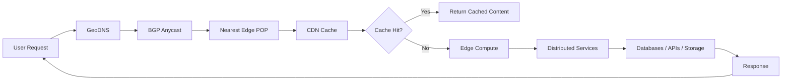

Every networking layer contributes to reducing latency before an application request ever reaches the backend.

---

# Traditional Cloud Architecture

Most applications historically looked like this.

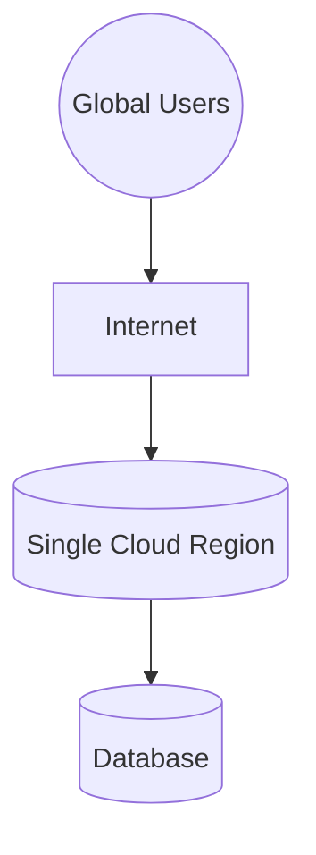

While simple, centralized deployments introduce several limitations:

* Long network paths
* Higher latency for distant users
* Large failure domains
* Increased origin load
* Poor global scalability

Every request must travel to the same location regardless of where the user is.

---

# Modern Global Platform

Modern infrastructure distributes every layer of the application.

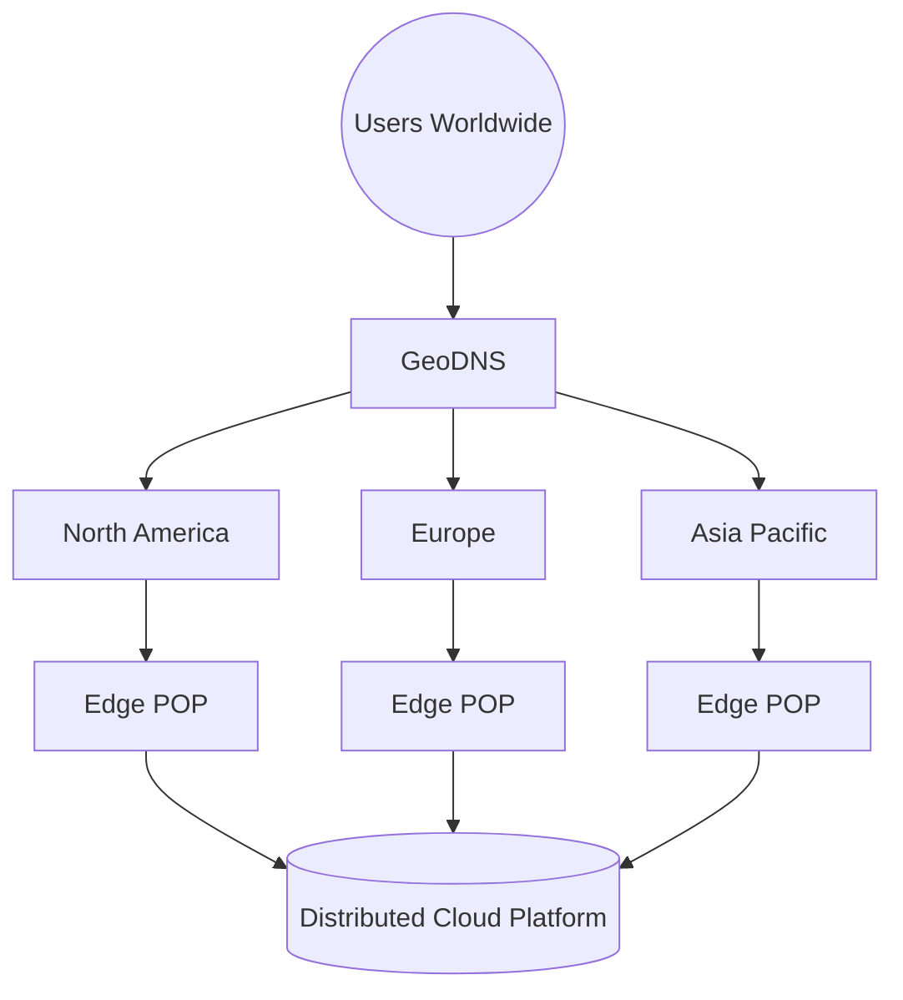

Users automatically connect to infrastructure located closest to them.

---

# The Networking Stack

A modern developer platform is built from several independent technologies.

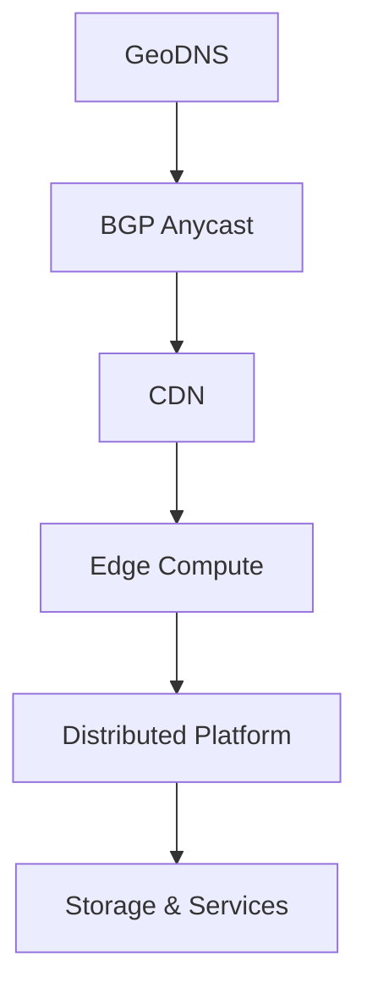

Each layer has a different responsibility.

| Layer                | Responsibility                           |
| -------------------- | ---------------------------------------- |
| GeoDNS               | Select the best deployment region        |
| BGP Anycast          | Route traffic across the Internet        |
| CDN                  | Deliver static assets near users         |
| Edge Compute         | Execute application logic close to users |
| Distributed Platform | Synchronize workloads globally           |

---

# GeoDNS

## Geographic Traffic Steering

GeoDNS is an intelligent DNS routing layer that decides which geographic deployment should receive a request.

Instead of always returning one IP address, GeoDNS evaluates several factors:

* User location
* Network latency
* Regional health
* Capacity
* Availability
* Routing policies

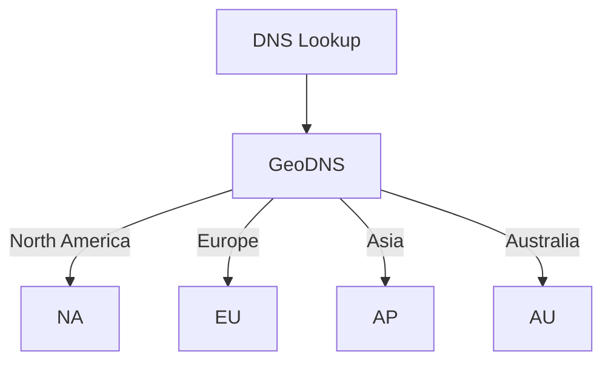

GeoDNS answers the question:

> **Which region should handle this request?**

---

# BGP Anycast

## Internet-Level Routing

Once GeoDNS selects a region, Internet routing takes over.

Multiple edge locations advertise the same IP address.

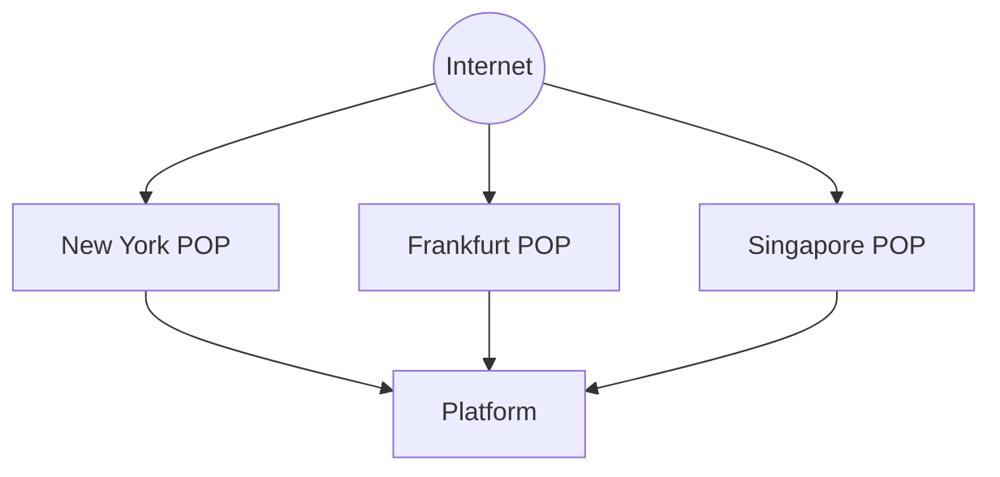

Internet routers automatically select the shortest available path.

Developers never need to manually route users between edge locations.

Anycast answers:

> **Which edge location provides the fastest network path?**

---

# CDN Layer

## Bringing Content Closer to Users

A Content Delivery Network (CDN) stores frequently accessed content at edge locations around the world.

Rather than downloading every file from the origin server, users retrieve cached assets directly from nearby edge nodes.

Typical CDN content includes:

* Images
* CSS
* JavaScript
* Fonts
* Videos
* Documentation
* Downloads
* Static websites

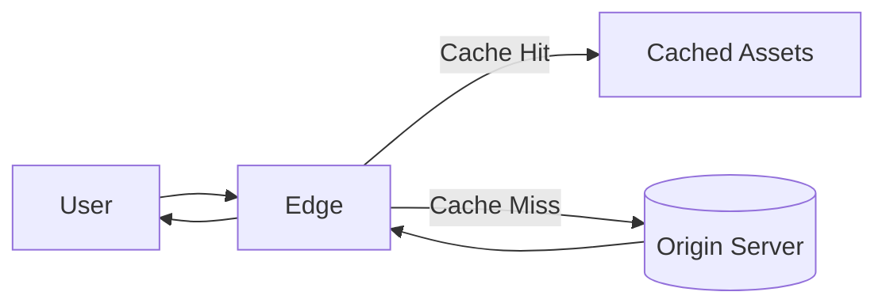

Benefits include:

* Lower origin load
* Faster page loads
* Reduced bandwidth costs
* Lower latency
* Improved scalability

---

# Edge Compute

Unlike a traditional CDN, edge platforms execute code instead of only serving files.

Applications can run directly at the network edge.

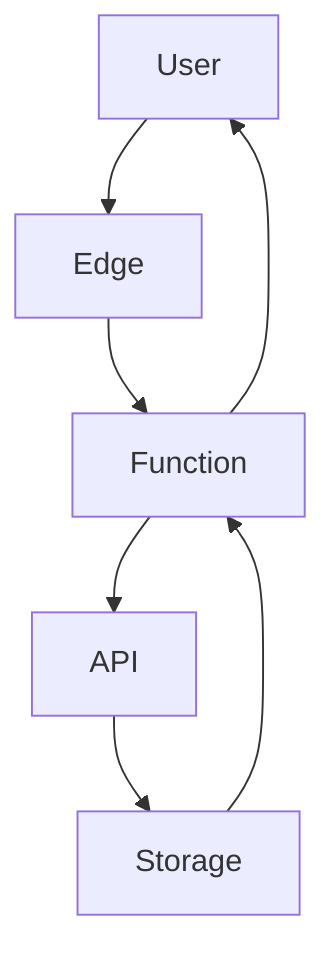

Examples include:

* Authentication
* API gateways
* Rate limiting
* Image optimization
* AI inference
* Request validation
* Personalization
* WebAssembly workloads

---

# Distributed Compute

Edge computing handles local execution, while distributed compute coordinates workloads globally.

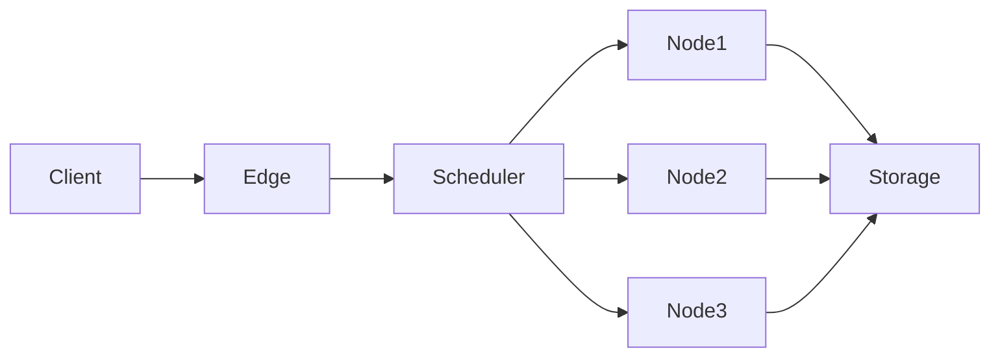

This enables applications to scale horizontally across many regions without relying on a single centralized backend.

---

# How the Layers Work Together

Each technology addresses a different part of the request lifecycle.

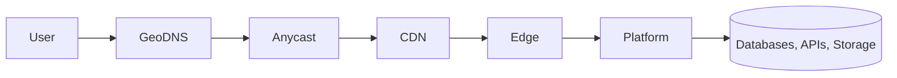

| Technology           | Solves                                  |
| -------------------- | --------------------------------------- |
| GeoDNS               | Which region should receive traffic?    |
| BGP Anycast          | Which network path is fastest?          |
| CDN                  | Can content be served locally?          |
| Edge Compute         | Can application logic execute locally?  |
| Distributed Platform | How are workloads coordinated globally? |

---

# Complete Global Platform Architecture

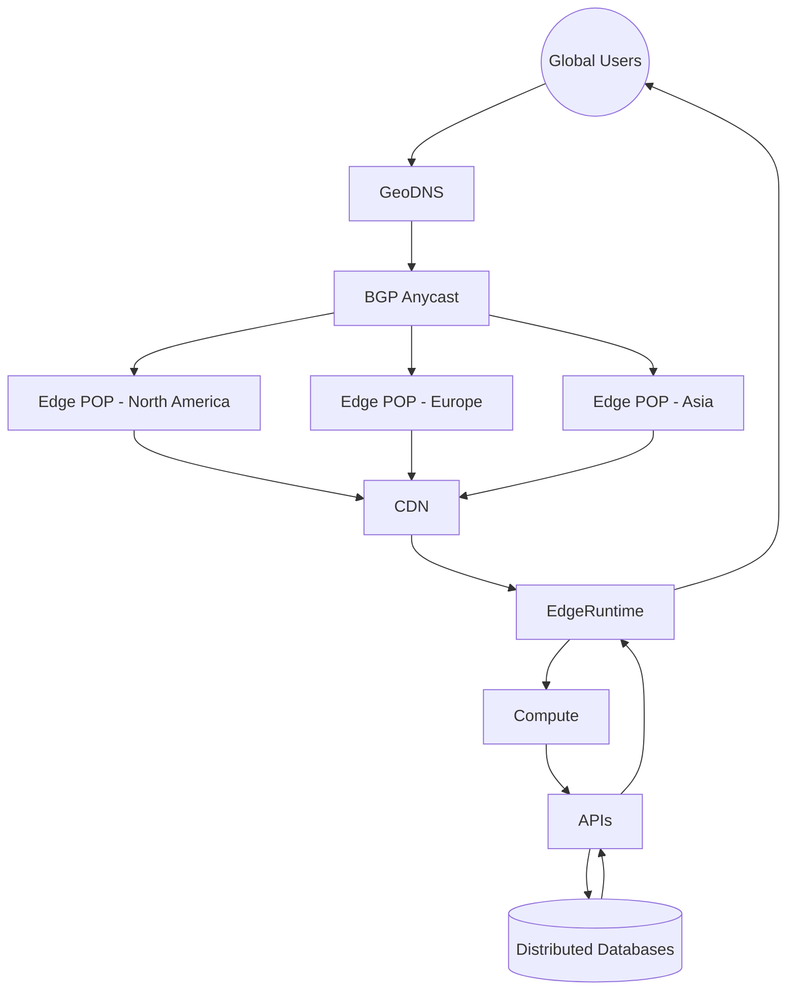

---

# Platform Benefits

| Capability          | Benefit                                                                         |
| ------------------- | ------------------------------------------------------------------------------- |
| GeoDNS              | Routes users to the optimal region based on geography and health                |
| BGP Anycast         | Automatically selects the shortest network path across the Internet             |
| CDN                 | Delivers static assets from edge locations, reducing latency and origin traffic |
| Edge Compute        | Executes application logic close to users for faster responses                  |
| Distributed Compute | Scales workloads across multiple regions while improving resilience             |
| Global Storage      | Replicates and synchronizes data across the platform                            |
| Regional Failover   | Redirects traffic during outages with minimal disruption                        |
| Horizontal Scaling  | Expands capacity by adding edge locations instead of scaling a single server    |

---

# Bringing It All Together

A modern developer platform is built as a layered global system rather than a single cloud deployment.

1. **GeoDNS** determines the most appropriate geographic region.
2. **BGP Anycast** guides traffic to the nearest edge point of presence.
3. The **CDN** serves cached assets whenever possible.
4. **Edge Compute** executes application logic close to the user.
5. **Distributed Compute** coordinates workloads across the platform.
6. **Global storage and services** provide durable, synchronized backend infrastructure.

This layered architecture minimizes latency, improves resilience, reduces origin load, and enables developers to deploy applications that feel local to users anywhere in the world. It is the foundation used by modern global platforms to deliver websites, APIs, AI workloads, serverless functions, multiplayer game services, and distributed applications at Internet scale.
