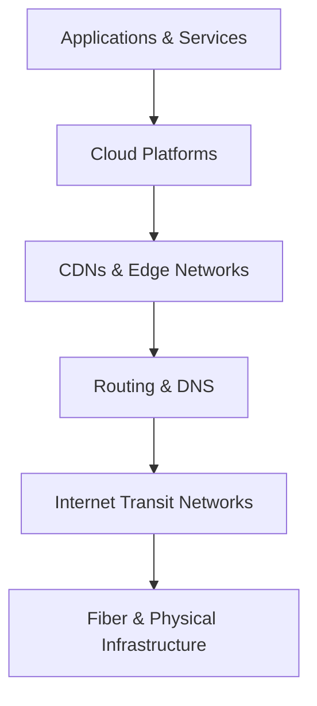
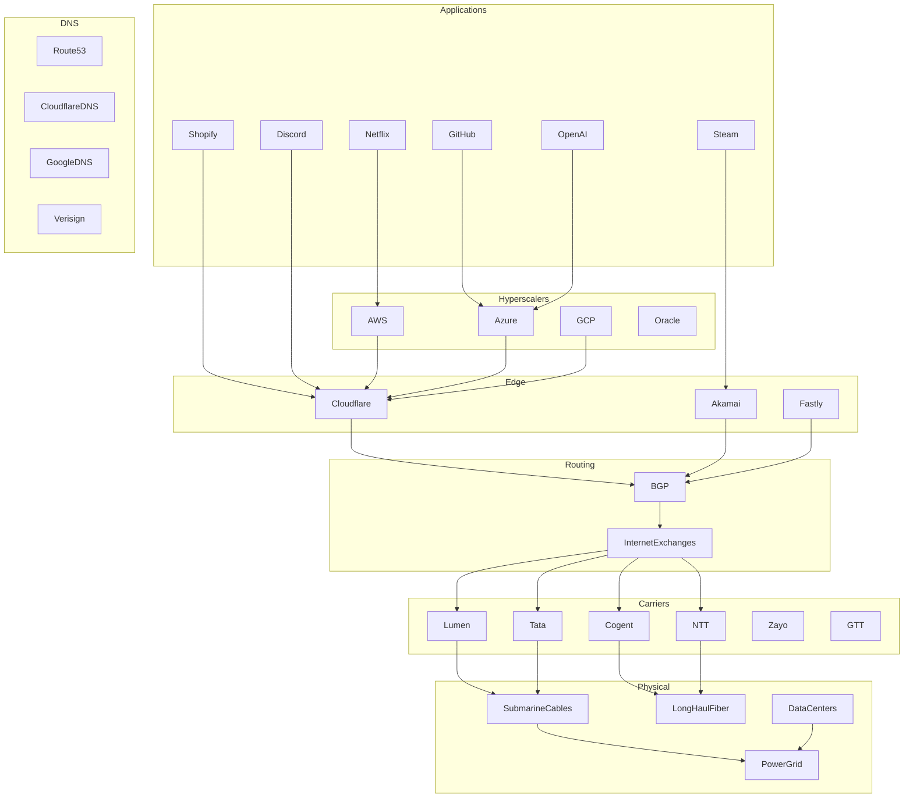
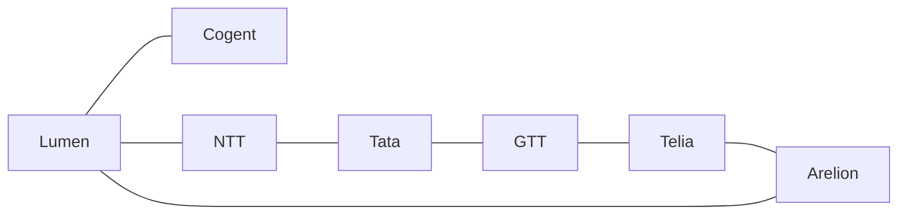
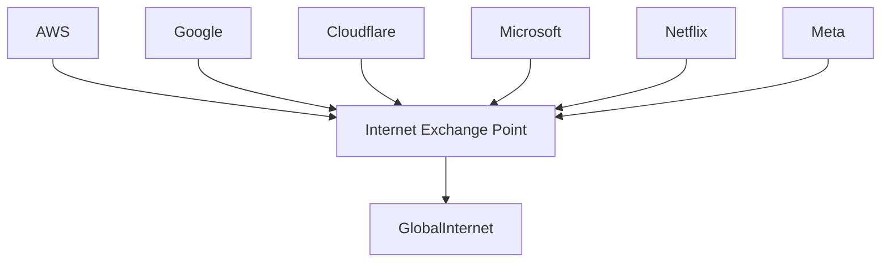
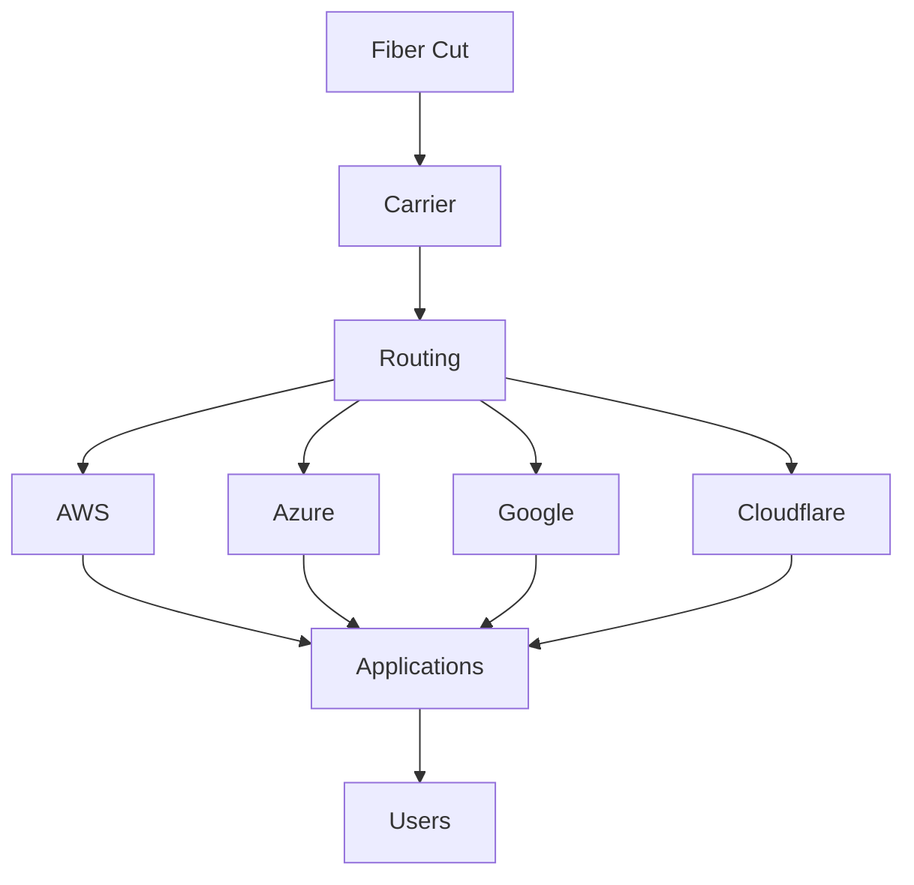
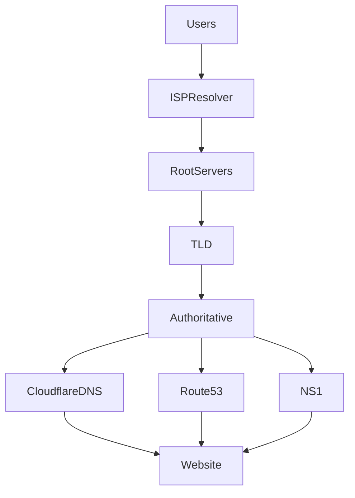
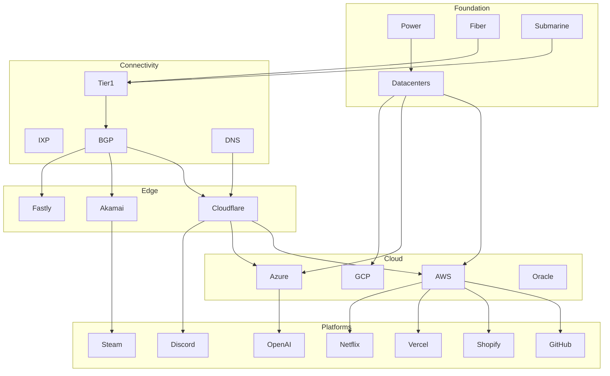
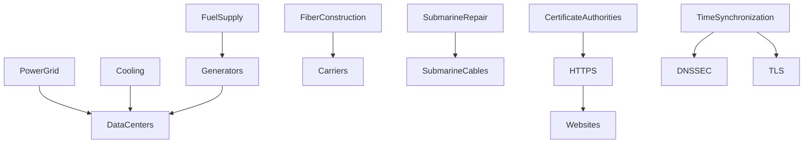

---

# Diagram 1 — The Internet Dependency Pyramid

This is the highest-level view.

Every layer depends on the one below it.

A cloud outage is bad.

A routing outage is worse.

A fiber outage can impact entire continents.

---

# Diagram 2 — What The Internet Actually Runs On

Most people never think below AWS.

This is where developers start realizing how deep the stack goes.

---

# Diagram 3 — Tier 1 Internet Providers

Most developers don't know these companies exist.

Yet they are among the most important companies on Earth.

These networks form much of the global Internet backbone.

They move traffic between countries, continents, and major exchanges.

Without them:

* AWS fails
* Cloudflare fails
* Google fails
* Microsoft fails

---

# Diagram 4 — Internet Exchange Points (IXPs)

One of the most overlooked parts of the Internet.

Examples:

* DE-CIX Frankfurt
* AMS-IX Amsterdam
* LINX London
* Equinix exchanges

These are where giant networks meet and exchange traffic.

Think of them as Internet highways and intersections.

---

# Diagram 5 — Why Outages Cascade

This diagram is extremely valuable.

A single failure deep in the stack can impact thousands of services.

Examples:

* BGP leaks
* DNS outages
* Carrier failures
* Fiber cuts
* Power failures

This is why Internet outages often appear unrelated at first.

---

# Diagram 6 — DNS Dependency Graph

Many people think DNS is simple.

It is one of the most critical systems on Earth.

If DNS fails:

* websites disappear
* APIs disappear
* cloud services disappear

even though the servers themselves may still be running.

---

# Diagram 7 — The Modern Service Dependency Graph

---

# Diagram 8 — The "Nobody Thinks About These" Layer

These are the hidden dependencies that quietly keep the Internet running.

This is where things get fascinating.

Most engineers think the Internet stack ends at AWS.

In reality, some of the most critical dependencies are:

* Electric utilities
* Generator fuel logistics
* Undersea cable repair ships
* Certificate authorities
* GPS/NTP time systems
* Long-haul fiber operators
* Internet exchanges
* Tier 1 transit providers

Those are often the true foundational layers beneath everything else.
