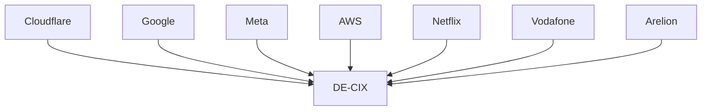

# Additional Infrastructure Organizations for the Global Internet Map

These organizations often sit beneath cloud providers, CDNs, and application platforms. They represent the physical, carrier, colocation, tower, and satellite infrastructure that keeps the Internet operating.

---

# Colocation & Data Center Operators

These companies own the facilities where networks physically interconnect.

## Equinix

Classification:

```text
Global Colocation Provider
Internet Exchange Operator
Interconnection Platform
Digital Infrastructure Provider
```

The most important colocation company on Earth. Hosts thousands of carriers, cloud providers, CDNs, and enterprises in the same facilities.

---

## Digital Realty

Classification:

```text
Global Data Center Operator
Colocation Provider
Digital Infrastructure REIT
```

One of the largest data center operators globally. Owns facilities across North America, Europe, Asia, and Africa.

---

## CoreSite

Classification:

```text
Colocation Provider
Interconnection Hub
Enterprise Connectivity Platform
```

Major US interconnection and carrier hotel operator.

---

## Telehouse

Classification:

```text
Carrier Hotel Operator
Colocation Provider
Internet Exchange Host
```

Hosts many major carrier interconnection points globally.

---

## CyrusOne

Classification:

```text
Hyperscale Data Center Operator
Enterprise Colocation Provider
```

Large provider of hyperscale cloud facilities.

---

## QTS

Classification:

```text
Hyperscale Data Center Provider
Colocation Operator
```

Major North American infrastructure provider.

---

# Tower Infrastructure

These companies own towers used by mobile operators.

## American Tower

Classification:

```text
Cell Tower Operator
Wireless Infrastructure Provider
Digital Infrastructure REIT
```

Owns hundreds of thousands of wireless sites globally.

---

## Crown Castle

Classification:

```text
Tower Operator
Fiber Infrastructure Provider
Small Cell Network Operator
```

Critical to US mobile and fiber infrastructure.

---

## SBA Communications

Classification:

```text
Tower Operator
Wireless Infrastructure Provider
```

One of the largest independent tower companies globally.

---

# Fiber Infrastructure Providers

These companies often own the actual glass carrying traffic.

## Zayo

Classification:

```text
Long-Haul Fiber Operator
Metro Fiber Provider
Wholesale Carrier
```

Provides extensive North American and European fiber connectivity.

---

## Crown Castle Fiber

Classification:

```text
Metro Fiber Operator
Mobile Backhaul Provider
```

Supports mobile carriers and enterprise connectivity.

---

## Lumen Fiber

Classification:

```text
Long-Haul Fiber Operator
Backbone Infrastructure Provider
```

One of the largest terrestrial fiber networks.

---

## Colt

Classification:

```text
Enterprise Fiber Provider
Data Center Interconnection Operator
```

Known for high-capacity metro and international fiber.

---

# Cable & Broadband Operators

## Xfinity (Comcast)

Classification:

```text
Residential ISP
Cable Operator
Enterprise Connectivity Provider
```

One of North America's largest broadband providers.

---

## Cox Communications

Classification:

```text
Cable Operator
Residential ISP
Business Connectivity Provider
```

Large regional broadband operator.

---

## Charter Spectrum

Classification:

```text
Cable Operator
Residential ISP
Regional Carrier
```

Major broadband access provider.

---

# Mobile Network Operators

## T-Mobile

Classification:

```text
Mobile Operator
National Carrier
5G Infrastructure Provider
```

One of the largest wireless operators in North America.

---

## Verizon

Classification:

```text
Mobile Operator
National Carrier
Enterprise Network Provider
```

Large US wireless and fiber operator.

---

## AT&T

Classification:

```text
National Carrier
Mobile Operator
Fiber Infrastructure Provider
```

Operates extensive wireless, enterprise, and fiber networks.

---

# Satellite Operators

These networks still ultimately connect into terrestrial fiber infrastructure.

## Starlink

Classification:

```text
LEO Satellite Operator
Global Broadband Provider
Space-Based Network Operator
```

Uses thousands of low-earth-orbit satellites connected through terrestrial gateway stations.

---

## OneWeb

Classification:

```text
LEO Satellite Operator
Enterprise Connectivity Provider
```

Focused heavily on enterprise and government connectivity.

---

## Viasat

Classification:

```text
Satellite Internet Provider
Geostationary Satellite Operator
```

Provides broadband through GEO satellite systems.

---

## SES

Classification:

```text
Global Satellite Operator
Enterprise Connectivity Provider
```

Major operator serving governments, carriers, and broadcasters.

---

## Eutelsat

Classification:

```text
Satellite Communications Provider
Global Connectivity Operator
```

One of the world's largest satellite communications companies.

---

# Internet Exchange Operators

These organizations host the physical meeting points of the Internet.

## DE-CIX

Classification:

```text
Internet Exchange Operator
Global Interconnection Provider
```

Operates the world's largest Internet exchange ecosystem.

---

## AMS-IX

Classification:

```text
Internet Exchange Operator
Global Traffic Exchange Platform
```

One of the largest Internet exchanges globally.

---

## LINX

Classification:

```text
Internet Exchange Operator
Peering Platform
```

Major European Internet exchange organization.

---

## Equinix Internet Exchange

Classification:

```text
Internet Exchange Operator
Private Peering Platform
```

Operates exchange fabrics across many Equinix facilities.

---


Yes — and this is one of the most important realizations when mapping the Internet.

The fiber used by:

* Cellular networks
* ISPs
* Cloud providers
* CDNs
* Governments
* Enterprises
* Satellite ground stations

is often the exact same physical fiber infrastructure.

People imagine separate networks:

```text
Mobile Network
Internet Network
Cloud Network
Satellite Network
```

Reality is closer to:

```text
                Fiber Infrastructure

                        |

    +---------+---------+---------+---------+

    |         |         |         |         |

 Cellular    ISP      Cloud      CDN    Satellite

 Networks   Access   Providers  Networks  Ground Stations
```

A Verizon cell tower might use fiber from:

* Zayo
* Lumen
* Crown Castle Fiber
* AT&T
* Local fiber providers

A Starlink ground station may connect into:

* Equinix
* Zayo
* Lumen
* Arelion

An AWS region may connect into:

* Arelion
* NTT
* Lumen
* Tata

Everyone is sharing pieces of the same global physical infrastructure.

---

# NORTH AMERICA

## AT&T

Classification:

```text
National Carrier
Mobile Operator
Fiber Provider
Global Network Operator
```

One of the largest US telecommunications networks with extensive fiber, wireless, enterprise, and international infrastructure.

---

## Verizon

Classification:

```text
National Carrier
Mobile Operator
Fiber Provider
Enterprise Network Operator
```

Operates one of the world's largest mobile networks and extensive enterprise connectivity services.

---

## Lumen

Classification:

```text
Global Backbone Provider
Tier 1 Network
Transit Carrier
Fiber Infrastructure Operator
```

One of the largest long-haul fiber and Internet backbone operators in the world.

---

## Cogent

Classification:

```text
Tier 1 Network
Transit Provider
Internet Backbone Operator
```

Major global transit network carrying enormous amounts of Internet traffic.

---

## Zayo

Classification:

```text
Fiber Infrastructure Provider
Wholesale Carrier
Backbone Operator
```

Owns extensive metro and long-haul fiber infrastructure throughout North America and Europe.

---

## Comcast

Classification:

```text
Cable Operator
Residential ISP
Enterprise Network Operator
Content Network
```

One of the largest broadband providers in North America.

---

## Charter

Classification:

```text
Cable Operator
Residential ISP
Regional Carrier
```

Large US broadband provider operating under the Spectrum brand.

---

## T-Mobile

Classification:

```text
Mobile Operator
National Carrier
5G Infrastructure Provider
```

Major US wireless network operator.

---

## US Cellular

Classification:

```text
Regional Mobile Operator
Wireless Carrier
```

Regional cellular provider focused on underserved markets.

---

## Frontier

Classification:

```text
Residential Fiber Provider
Regional ISP
Enterprise Connectivity Provider
```

Primarily focused on broadband and fiber access.

---

# EUROPE

## Arelion

Classification:

```text
Tier 1 Network
Global Backbone Provider
Transit Carrier
```

Formerly Telia Carrier. One of the largest global Internet backbone operators.

---

## BT

Classification:

```text
National Carrier
International Telecom Operator
Enterprise Connectivity Provider
```

Major UK telecom and global enterprise network provider.

---

## Vodafone

Classification:

```text
Mobile Operator
International Carrier
Enterprise Connectivity Provider
```

One of the world's largest multinational telecom operators.

---

## Orange

Classification:

```text
National Carrier
International Telecom Operator
Subsea Cable Investor
```

Large European and African telecommunications provider.

---

## Telefónica

Classification:

```text
International Telecom Operator
Mobile Operator
Regional Backbone Provider
```

Major operator across Europe and Latin America.

---

## Deutsche Telekom

Classification:

```text
National Carrier
Mobile Operator
International Backbone Operator
```

Germany's dominant telecom provider and owner of T-Mobile.

---

## Swisscom

Classification:

```text
National Carrier
Mobile Operator
Enterprise Network Provider
```

Switzerland's primary telecommunications provider.

---

## Telia

Classification:

```text
Regional Telecom Operator
Nordic Carrier
Enterprise Connectivity Provider
```

Major telecommunications provider throughout Northern Europe.

---

## Colt

Classification:

```text
Enterprise Fiber Operator
Wholesale Carrier
Data Center Interconnection Provider
```

Known for high-capacity enterprise and data-center networking.

---

# MIDDLE EAST

## stc Group

Classification:

```text
National Carrier
Regional Backbone Provider
Mobile Operator
Subsea Cable Investor
```

Saudi Arabia's largest telecom company.

---

## e& (Etisalat)

Classification:

```text
International Telecom Operator
Mobile Operator
Regional Connectivity Provider
```

One of the Middle East's largest telecom groups.

---

## Ooredoo

Classification:

```text
Mobile Operator
Regional Telecom Provider
International Carrier
```

Major operator throughout the Middle East and Asia.

---

## Zain

Classification:

```text
Mobile Operator
Regional Carrier
Digital Services Provider
```

Large multi-country operator in the Middle East and Africa.

---

## du

Classification:

```text
National Carrier
Mobile Operator
Enterprise Connectivity Provider
```

One of the UAE's major telecom providers.

---

## Omantel

Classification:

```text
National Carrier
Subsea Cable Landing Operator
International Carrier
```

Important because Oman sits on major intercontinental cable routes.

---

# AFRICA

## WIOCC

Classification:

```text
Pan-African Backbone Provider
Wholesale Carrier
Infrastructure Operator
```

One of Africa's most important wholesale connectivity providers.

---

## MTN Group

Classification:

```text
Mobile Operator
Regional Carrier
Digital Services Provider
```

Largest telecommunications group across much of Africa.

---

## Liquid Intelligent Technologies

Classification:

```text
Pan-African Fiber Operator
Backbone Provider
Enterprise Connectivity Provider
```

Owns one of Africa's largest terrestrial fiber networks.

---

## Safaricom

Classification:

```text
Mobile Operator
National Carrier
Digital Services Provider
```

Kenya's dominant telecommunications provider.

---

## Orange Africa

Classification:

```text
Regional Telecom Operator
Mobile Operator
Infrastructure Investor
```

Orange's extensive African operations.

---

## Vodacom

Classification:

```text
Mobile Operator
Regional Carrier
Enterprise Connectivity Provider
```

Major operator throughout Southern Africa.

---

## Telecom Egypt

Classification:

```text
National Carrier
Subsea Cable Landing Operator
International Transit Provider
```

Extremely important globally because many Europe–Asia–Africa cable systems pass through Egypt.

---

# ASIA

## China Mobile

Classification:

```text
National Carrier
Global Backbone Operator
Mobile Operator
Subsea Cable Investor
```

Largest mobile network operator in the world.

---

## China Telecom

Classification:

```text
National Carrier
International Carrier
Backbone Operator
```

Major international connectivity provider.

---

## China Unicom

Classification:

```text
National Carrier
International Carrier
Global Network Operator
```

One of China's three major telecom operators.

---

## NTT

Classification:

```text
Tier 1 Network
Global Backbone Provider
Data Center Operator
```

One of the largest Internet backbone operators globally.

---

## SoftBank

Classification:

```text
Mobile Operator
National Carrier
International Telecom Investor
```

Major Japanese telecom and infrastructure operator.

---

## KDDI

Classification:

```text
National Carrier
International Carrier
Subsea Cable Investor
```

One of Japan's largest telecom providers.

---

## Singtel

Classification:

```text
Regional Carrier
Mobile Operator
International Connectivity Provider
```

One of Southeast Asia's most important telecom companies.

---

## Airtel

Classification:

```text
Mobile Operator
Regional Carrier
International Connectivity Provider
```

One of the largest operators in India and Africa.

---

## Jio

Classification:

```text
Mobile Operator
National Carrier
Digital Platform Provider
```

India's largest mobile network.

---

## KT

Classification:

```text
National Carrier
Mobile Operator
International Connectivity Provider
```

One of South Korea's primary telecom operators.

---

## SK Telecom

Classification:

```text
Mobile Operator
National Carrier
5G Infrastructure Provider
```

South Korea's largest wireless provider.

---

# GLOBAL BACKBONE / TRANSIT PLAYERS

These are the companies that sit closest to the "core" of the Internet.

## Lumen

```text
Tier 1 Network
Global Backbone Provider
Fiber Infrastructure Operator
```

## Cogent

```text
Tier 1 Network
Transit Provider
Global Backbone Operator
```

## Arelion

```text
Tier 1 Network
Global Backbone Provider
Transit Carrier
```

## NTT

```text
Tier 1 Network
Global Backbone Provider
Data Center Operator
```

## Tata Communications

```text
Global Backbone Provider
International Carrier
Subsea Cable Operator
```

## GTT

```text
Global Transit Provider
Backbone Operator
Enterprise Carrier
```

## PCCW Global

```text
International Carrier
Asian Backbone Provider
Subsea Cable Investor
```

## Sparkle

```text
Global Carrier
Mediterranean Backbone Operator
Subsea Cable Operator
```

(Owned by Telecom Italia.)

## Telia

```text
Regional Carrier
International Connectivity Provider
Enterprise Network Operator
```

## Zayo

```text
Fiber Infrastructure Provider
Wholesale Carrier
Long-Haul Network Operator
```


This is where the Internet gets messy because the "Tier 1 / Tier 2 / Tier 3" model was mostly a North American simplification from the 1990s-2000s. Today many networks are hybrid.

A better way to think about these companies is:

| Type                    | Role                                                               |
| ----------------------- | ------------------------------------------------------------------ |
| Tier 1                  | Global backbone, no paid transit needed                            |
| Global Tier 2           | Large regional/global carrier, buys some transit and peers heavily |
| National Carrier        | Dominates a country or region                                      |
| Access ISP              | Last-mile connectivity                                             |
| Mobile Operator         | Cellular access network                                            |
| Infrastructure Provider | Towers, fiber, subsea cables                                       |
| Content Network         | CDN, hyperscaler, large content provider                           |

---

# Where Your Listed Companies Fit

## Telefónica

Spain / Europe / Latin America

Owns:

* Movistar
* O2 UK
* Various LATAM operations

Classification:

```text
Large International Carrier
Major Mobile Operator
Tier 2-ish Global Network
```

Not a true Tier 1 backbone today.

More like:

```text
Regional/National Networks
      ↓
Telefónica
      ↓
Global Transit & Peering
```

---

## Frontier

US

Classification:

```text
Tier 3 Access ISP
Regional Fiber Provider
```

Provides:

* Residential fiber
* Business fiber

Generally purchases upstream connectivity.

---

## China Mobile

This one is huge.

Classification:

```text
National Carrier
Global Backbone Operator
Mobile Operator
Near Tier-1 Scale
```

Largest mobile carrier on Earth.

Owns:

* Massive domestic backbone
* International subsea investments
* Global PoPs

China Mobile is closer to a global carrier than a traditional ISP.

---

## China Telecom

Classification:

```text
National Carrier
International Backbone
Tier 2/Global Carrier
```

Major international presence.

Has:

* Subsea cable ownership
* International transit
* IX presence worldwide

---

## China Unicom

Classification:

```text
National Carrier
Global Carrier
```

Another major Chinese backbone.

---

## stc Group (Saudi Telecom Company)

Classification:

```text
National Telecom
Regional Backbone
Middle East Carrier
```

Increasingly important because of:

* Red Sea cable routes
* Middle East interconnection
* Regional cloud investments

---

## MTN Group

Africa

Classification:

```text
Mobile Operator
Regional Carrier
```

One of Africa's most important telecom operators.

Operates across:

* Nigeria
* South Africa
* Ghana
* Uganda
* Many others

---

## WIOCC

This one is very interesting.

Classification:

```text
Pan-African Backbone Provider
Wholesale Carrier
Infrastructure Operator
```

WIOCC is basically:

```text
Africa's Interconnection Layer
```

They operate:

* Fiber
* Subsea capacity
* Carrier interconnects

Not typically customer-facing.

---

# Players Missing By Region

## North America

Major carriers:

```text
AT&T
Verizon
Lumen
Cogent
Zayo
Comcast
Charter
T-Mobile
US Cellular
Frontier
```

---

## Europe

```text
Arelion
BT
Vodafone
Orange
Telefónica
Deutsche Telekom
Swisscom
Telia
Colt
```

Arelion is especially important.

Formerly:

```text
Telia Carrier
```

One of the largest backbone networks globally.

---

## Middle East

```text
stc
e&
Ooredoo
Zain
du
Omantel
```

---

## Africa

```text
WIOCC
MTN
Liquid Intelligent Technologies
Safaricom
Orange Africa
Vodacom
```

Liquid is another huge one you're missing.

---

## Asia

```text
China Mobile
China Telecom
China Unicom
NTT
SoftBank
KDDI
Singtel
Airtel
Jio
KT
SK Telecom
```

NTT remains one of the largest global networks.

---

# Major Global Transit Networks

If I were making a backbone section, I'd separate these:

```text
Lumen
Cogent
Arelion
NTT
Tata Communications
GTT
PCCW Global
Sparkle
Telia
Zayo
```

These companies move enormous portions of Internet traffic.

---

# The IXP Layer You're Missing

Your current map has carriers but not enough exchanges.

Think of IXPs as:

```text
Internet Airports
```

Networks meet here.

---

## Global Mega IXPs

```text
DE-CIX Frankfurt
AMS-IX Amsterdam
LINX London
Equinix Internet Exchange
```

These are among the most important places on Earth for Internet traffic.

Diagram:



---

## Regional IXPs

### North America

```text
Any2
NYIIX
SIX
Equinix IX
```

### Europe

```text
DE-CIX
AMS-IX
LINX
France-IX
MIX
```

### Africa

```text
NAPAfrica
KIXP
JINX
RINEX
```

### Asia

```text
HKIX
JPIX
SGIX
MyIX
```

### Middle East

```text
UAE-IX
SAIX
QIXP
```

---

# The Missing Subsea Cable Operators

Another section worth adding:

```text
Google
Meta
Microsoft
Amazon
Orange Marine
ASN
SubCom
Alcatel Submarine Networks
NEC
PCCW
China Telecom
China Mobile
```

These companies own or build the physical links between continents.

---

# What the "Internet Core" Really Looks Like

If you zoom into the center of your diagram, the most connected entities are probably:

```text
Arelion
NTT
Lumen
Cogent
Tata
Cloudflare
Google
AWS
Microsoft
Meta
Equinix
DE-CIX
AMS-IX
LINX
```

Those nodes sit near the center of the modern Internet graph because they connect to enormous numbers of other networks.

One useful expansion would be creating a dedicated **"Global Connectivity Core"** section in the middle of your diagram:

```text
Access Networks
     ↓
National Carriers
     ↓
Regional Carriers
     ↓
Global Backbones
     ↓
IXPs
     ↓
Cloud / CDN / Content Networks
     ↓
Applications
```

That would help visually separate *who provides access* (Frontier, Comcast, MTN, Jio) from *who provides global connectivity* (Arelion, NTT, Tata, Lumen, Cogent) and *where they actually interconnect* (DE-CIX, AMS-IX, LINX, Equinix IX, NAPAfrica, SGIX).


