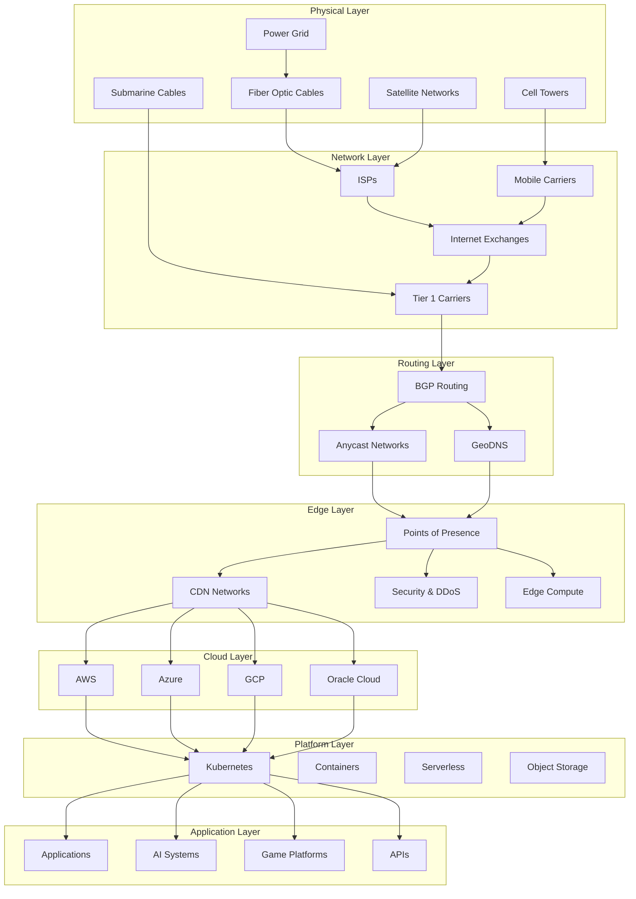
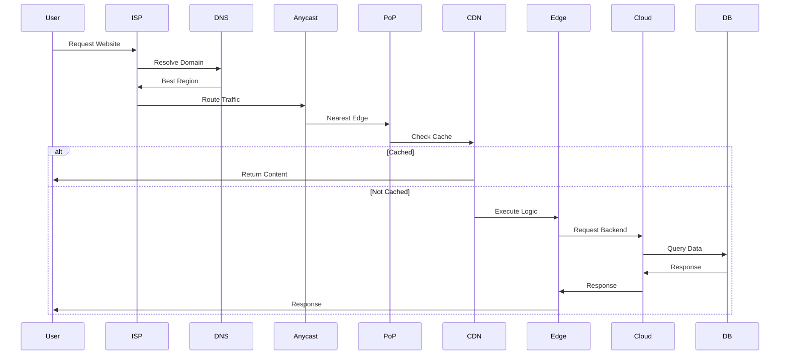
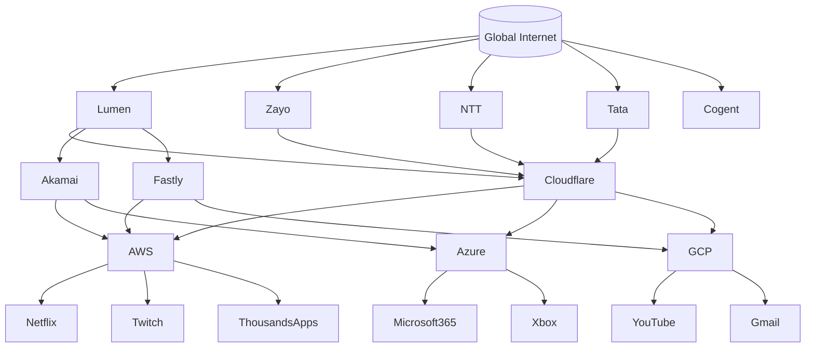
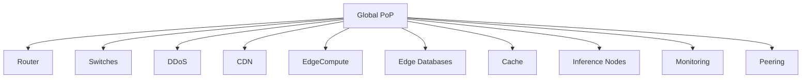
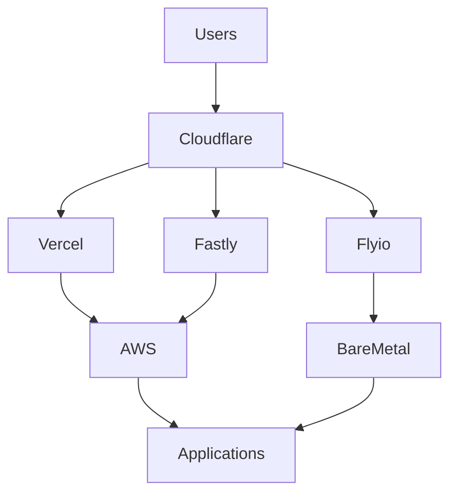
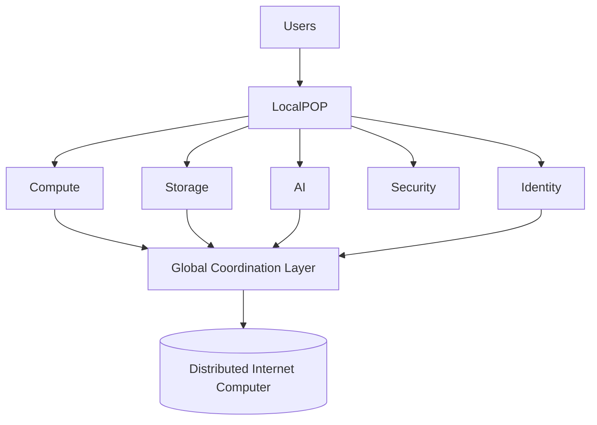
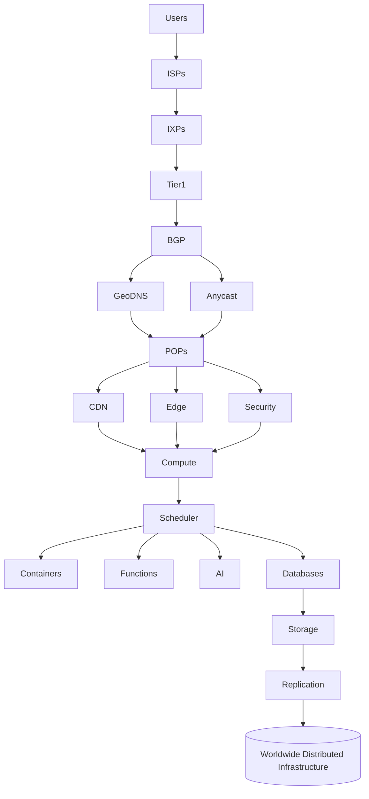

This is where most infrastructure documentation stops too early.

Diagram #4 should evolve into a **full Internet dependency map**. The biggest realization developers eventually have is:

> AWS is not the Internet.
>
> Cloudflare is not the Internet.
>
> Kubernetes is not the Internet.
>
> They are all layers sitting on top of lower layers.

What you really want is a giant diagram showing **what depends on what**.

---

# The Modern Internet Stack (2026)

This is the first diagram I would add.



---

# What Actually Happens When You Open A Website

Most developers think:

```text
Browser
 ↓
Server
```

Reality:



This is arguably the most useful diagram for developers.

---

# The Global Cloud Dependency Graph

This is where things get interesting.

Almost every major cloud company depends on the same lower layers.



This helps explain:

* why outages cascade
* why routing issues affect many companies
* why the Internet is highly interconnected

---

# The Modern PoP

Most people imagine a PoP as:

```text
Router
```

Reality:



Modern PoPs are becoming mini cloud regions.

---

# How Cloudflare, Vercel, Fly.io and Fastly Fit Together

Many developers struggle with this.



Notice:

* Cloudflare sits at the network edge
* Vercel sits at the deployment layer
* AWS sits at the compute layer

They solve different problems.

---

# The Future Internet Architecture

This is likely where the next decade is headed.



The major shift is:

**Today**

```text
Users
 ↓
Internet
 ↓
Cloud Region
 ↓
Application
```

**Tomorrow**

```text
Users
 ↓
Local PoP
 ↓
Local Compute
 ↓
Global Mesh
 ↓
Distributed Platform
```

---

# The Ultimate Big Picture Diagram

If you're building documentation for a distributed compute platform, this is probably the single most important diagram to create.



This starts to resemble an actual map of the Internet rather than a cloud architecture diagram. It shows how every layer—from undersea cables all the way up to AI services and applications—depends on the layers beneath it. That's the level of abstraction most developers never see, but it's the level where CDNs, PoPs, Anycast, hyperscalers, and distributed compute all fit together coherently.
