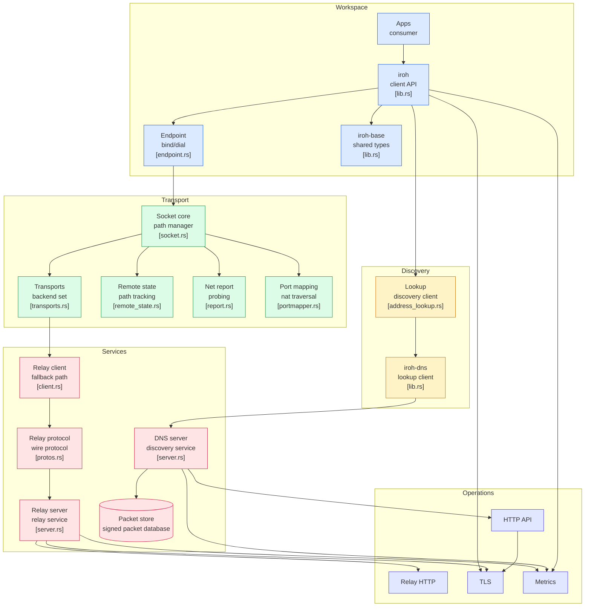

# Iroh

> **Dial public keys instead of IP addresses.**  
> Iroh is a modern peer-to-peer networking framework that automatically establishes the fastest secure connection between devices using **QUIC**, **NAT traversal**, **hole punching**, **relay fallback**, and **cryptographic identities**—allowing developers to build globally connected applications without worrying about networking complexity.

**Repository:** https://github.com/n0-computer/iroh

---

# Overview

Traditional networking requires applications to know an IP address before communication can begin.

Unfortunately IP addresses constantly change:

- Mobile devices switch between Wi-Fi and cellular
- Home routers use NAT
- Firewalls block inbound traffic
- Cloud instances migrate
- Users roam between networks

Every application ends up solving these problems differently.

Iroh abstracts all of this away.

Instead of connecting to an IP address, applications simply connect to a **public cryptographic key (Endpoint ID)**.

The Iroh networking stack automatically:

- Finds the remote endpoint
- Performs NAT traversal
- Hole punches whenever possible
- Continuously measures available paths
- Selects the fastest transport
- Falls back to relay servers if direct connectivity fails
- Encrypts all traffic
- Maintains connections as network conditions change

To an application developer, networking becomes as simple as:

```
Connect to Endpoint ABC123...
```

instead of:

```
Connect to 192.168.0.10
Connect to 73.42.110.15
Reconnect...
Retry...
Detect NAT...
Use TURN...
Reconnect...
```

---

# Core Philosophy

Instead of applications managing networking...

```
Application
        ↓
IP Address
        ↓
Router
        ↓
Internet
```

Iroh introduces an intelligent connectivity layer.

```
Application
        ↓
Iroh Endpoint
        ↓
Discovery
        ↓
Connection Manager
        ↓
QUIC Transport
        ↓
Internet
```

The application never needs to know how packets actually reach another machine.

---

# High-Level Architecture

```text
                Applications
                     │
                     ▼
             Iroh Client API
                     │
          Endpoint / Connection API
                     │
        ┌────────────┴─────────────┐
        │                          │
 Discovery Layer           Transport Layer
        │                          │
 DNS / PKARR              QUIC + Hole Punch
        │                          │
        └────────────┬─────────────┘
                     │
          Relay (Fallback Path)
                     │
                Remote Endpoint
```

---

# Major Components

## 1. Endpoint API

The Endpoint is the primary interface developers interact with.

It manages:

- Identity
- Listening sockets
- Incoming connections
- Outgoing connections
- Stream multiplexing
- Connection lifecycle

Instead of manually managing sockets, developers simply create an endpoint.

```rust
let endpoint = Endpoint::bind().await?;
```

Everything else is handled automatically.

---

## 2. Identity-Based Networking

Instead of addressing machines using IP addresses:

```
192.168.1.20
```

Iroh addresses them using public keys.

```
EndpointID

9zT2...
```

Benefits include:

- Stable identity
- Cryptographic authentication
- Device portability
- Secure discovery
- No dependency on static IP addresses

---

## 3. Discovery

Applications need a way to discover where another endpoint currently exists.

Iroh provides a discovery layer using:

- DNS
- PKARR
- Signed endpoint advertisements

Instead of remembering an IP address, discovery maps:

```
Endpoint ID
      ↓
Current reachable addresses
```

This allows devices to roam between networks while remaining reachable.

---

## 4. QUIC Transport

Iroh is built on top of QUIC.

QUIC provides:

- TLS encryption by default
- Stream multiplexing
- Reliable streams
- Unreliable datagrams
- Low latency
- Connection migration
- Congestion control

Applications automatically gain all QUIC benefits without implementing transport logic.

---

## 5. NAT Traversal

Most devices sit behind NAT.

Normally this prevents direct inbound connections.

Iroh performs automatic:

- NAT detection
- STUN-like probing
- Hole punching
- Port mapping
- Connectivity testing

Developers never need to configure routers manually.

---

## 6. Hole Punching

Whenever possible Iroh establishes a direct connection.

```
Device A
     │
     │
 Internet
     │
Device B
```

Advantages:

- Lowest latency
- Highest throughput
- No relay costs
- End-to-end communication

---

## 7. Relay Network

Sometimes direct connectivity is impossible.

Corporate firewalls

Carrier NAT

Symmetric NAT

Restricted environments

In those situations Iroh transparently routes traffic through relay servers.

```
Device A
      │
      ▼
 Relay Server
      │
      ▼
Device B
```

Applications continue functioning without modification.

---

## 8. Continuous Path Optimization

Networking conditions constantly change.

Wi-Fi

Ethernet

Cellular

VPN

Satellite

Iroh continuously measures:

- Latency
- Packet loss
- Reachability
- Connection quality

It dynamically switches to the fastest available route.

---

## 9. Secure Transport

Every connection is authenticated.

Security includes:

- TLS
- QUIC encryption
- Endpoint identities
- Signed discovery packets
- Secure relay communication

No plaintext communication exists between endpoints.

---

## 10. Built-in Observability

The networking stack exports metrics including:

- Active peers
- Relay usage
- Hole punch success
- RTT
- Packet statistics
- Connection health

Useful for monitoring distributed systems.

---

# Repository Layout

| Component | Purpose |
|-----------|----------|
| **iroh** | Core networking library |
| **iroh-base** | Shared types and identifiers |
| **iroh-relay** | Relay client and server |
| **iroh-dns** | Discovery client |
| **iroh-dns-server** | Discovery service |
| **metrics** | Telemetry and monitoring |
| **tls** | Encryption layer |

---

# Connection Lifecycle

```
Application

      │

Create Endpoint

      │

Resolve Endpoint ID

      │

Discover Addresses

      │

Attempt Hole Punch

      │

Success?
   │         │
 YES        NO
 │          │
 ▼          ▼
Direct    Relay

      │

Secure QUIC Connection

      │

Bidirectional Streams

      │

Application Data
```

---

# Protocol Stack

```text
Application Protocol

        │

Bidirectional Streams

        │

QUIC

        │

TLS

        │

UDP

        │

Internet
```

---

# Supported Networking Features

- Endpoint identities
- QUIC transport
- Multiplexed streams
- Datagram transport
- Automatic reconnection
- NAT traversal
- Hole punching
- Relay fallback
- DNS discovery
- PKARR discovery
- TLS encryption
- Metrics collection
- Connection migration

---

# Companion Projects

The Iroh ecosystem includes several higher-level protocols built on the networking layer.

### iroh-blobs

Content-addressed file transfer using BLAKE3.

Suitable for:

- File synchronization
- Large asset transfer
- Distributed storage

---

### iroh-gossip

Publish/subscribe networking.

Suitable for:

- Chat
- Multiplayer games
- Event broadcasting
- Distributed messaging

---

### iroh-docs

Eventually consistent key-value store.

Suitable for:

- Offline-first applications
- Shared documents
- Synchronization
- Collaborative editing

---

# Typical Workflow

```
Application

     │

Create Endpoint

     │

Publish Identity

     │

Discover Remote Peer

     │

Establish QUIC Connection

     │

Open Streams

     │

Exchange Data

     │

Maintain Fastest Path

     │

Reconnect Automatically
```

---

# Architecture Flowchart



---

# Why Developers Choose Iroh

- No manual NAT traversal
- No TURN/STUN management
- Stable cryptographic identities
- Automatic relay fallback
- QUIC by default
- Built-in encryption
- Works across changing networks
- High-performance peer-to-peer communication
- Modular Rust architecture
- Production-ready networking primitives
- Foundation for distributed applications, decentralized systems, multiplayer games, synchronization services, mesh networks, and edge computing

---

# License

Iroh is dual licensed under:

- Apache License 2.0
- MIT License

Developers may choose either license when integrating Iroh into their own projects.
