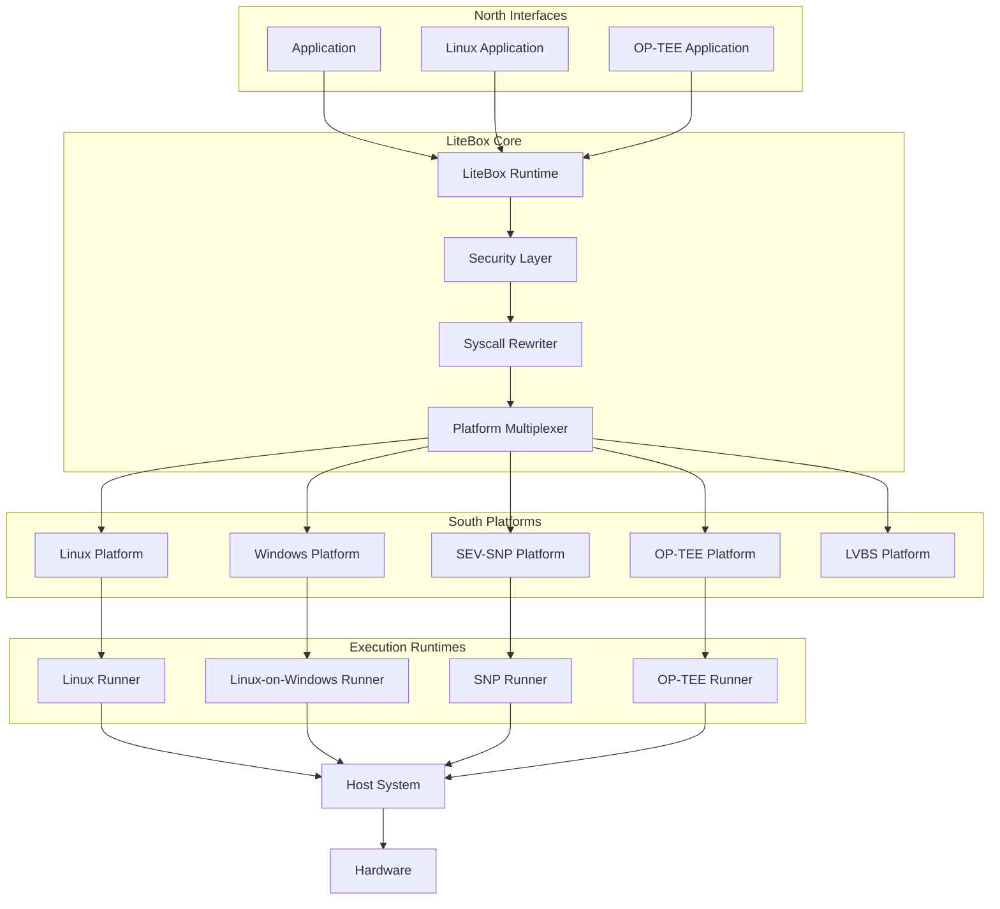

# LiteBox

> **A Security-Focused Library OS for Application Isolation, Portability, and Trusted Execution.**
>
> LiteBox is Microsoft's experimental **Library Operating System (LibOS)** designed to dramatically reduce application attack surfaces by minimizing interactions with the host operating system. Instead of exposing an application to an entire OS kernel and system API surface, LiteBox provides a controlled compatibility layer that sits between applications and multiple execution platforms.

**Repository:** https://github.com/microsoft/litebox

---

# What is LiteBox?

Traditional applications run directly on top of an operating system.

```text
Application
      │
Operating System
      │
Hardware
```

This model provides convenience but exposes applications to:

- Large attack surfaces
- Complex kernel interfaces
- Shared system resources
- Host OS vulnerabilities
- Privilege escalation opportunities

LiteBox takes a different approach.

It acts as a **Library Operating System (LibOS)** that provides only the functionality an application actually needs.

```text
Application
      │
 LiteBox
      │
Platform Adapter
      │
Host System
      │
Hardware
```

By reducing the exposed interface, LiteBox significantly decreases the amount of code and system functionality that must be trusted.

---

# Core Design Philosophy

LiteBox follows a simple principle:

> **Expose the minimum possible host interface while maintaining compatibility.**

Instead of applications directly interacting with:

- Linux syscalls
- Windows APIs
- Kernel resources
- Filesystems
- Networking stacks

they interact with LiteBox's controlled runtime environment.

---

# North and South Architecture

LiteBox is built around a modular architecture consisting of:

## North Interfaces

The application-facing layer.

Provides:

- POSIX-like APIs
- Linux compatibility
- Process abstractions
- Filesystem access
- Networking interfaces
- Runtime services

Applications interact only with this layer.

---

## South Platforms

The execution-facing layer.

Provides:

- Linux execution
- Windows execution
- Hypervisors
- Trusted execution environments
- Secure enclaves
- Specialized runtimes

The same application can run on multiple southbound platforms without modification.

---

# High-Level Architecture

```text
                Applications
                       │
                       ▼
              LiteBox North API
                       │
           ┌───────────┼───────────┐
           │           │           │
           ▼           ▼           ▼
      Linux App   OP-TEE App   Legacy App
                       │
                       ▼
                 LiteBox Core
                       │
        ┌──────────────┼──────────────┐
        │              │              │
        ▼              ▼              ▼
      Linux         Windows         SNP
     Platform       Platform      Platform
        │              │              │
        └──────────────┼──────────────┘
                       │
                    Hardware
```

---

# Why LiteBox Exists

Modern software often needs:

- Sandboxing
- Portability
- Confidential computing
- Cross-platform execution
- Trusted execution environments
- Reduced attack surfaces

Traditionally these are solved independently.

LiteBox combines them into a single architecture.

---

# Security Model

Traditional execution:

```text
Application
      │
Thousands of Syscalls
      │
Kernel
      │
Hardware
```

LiteBox execution:

```text
Application
      │
LiteBox Runtime
      │
Minimal Platform Interface
      │
Host System
```

Benefits include:

- Smaller trusted computing base (TCB)
- Reduced syscall exposure
- Easier auditing
- Better sandboxing
- Improved isolation

---

# Key Capabilities

## 1. Linux on Windows

One of LiteBox's most interesting capabilities is executing Linux applications on Windows.

```text
Linux Application
         │
      LiteBox
         │
Windows Userland
         │
Windows Kernel
```

This provides:

- Cross-platform compatibility
- Reduced virtualization overhead
- Better integration than full VMs
- Simplified deployment

---

## 2. Linux Sandboxing

LiteBox can isolate Linux applications from the host system.

```text
Linux App
      │
LiteBox Sandbox
      │
Linux Host
```

This dramatically reduces exposure to:

- Host filesystems
- Kernel attack surface
- Sensitive resources

---

## 3. Confidential Computing

LiteBox supports modern trusted execution environments.

Examples include:

- AMD SEV-SNP
- Trusted Execution Environments
- Secure Virtual Machines
- Hardware-isolated workloads

---

## 4. OP-TEE Integration

LiteBox can execute OP-TEE applications.

```text
Application
      │
LiteBox
      │
OP-TEE Runtime
      │
Trusted Hardware
```

Useful for:

- Embedded security
- Trusted services
- Secure key storage
- Cryptographic workloads

---

## 5. LVBS Support

LiteBox includes support for LVBS environments.

This allows:

- Stronger workload isolation
- Virtualized execution
- Enhanced security boundaries

---

# Major Components

---

## LiteBox Core

The central library OS runtime.

Responsibilities:

- Process abstraction
- Resource management
- Runtime coordination
- Security enforcement

---

## Platform Layer

Provides southbound integrations.

Examples:

- Linux Kernel
- Linux Userland
- Windows Userland
- SEV-SNP
- OP-TEE
- LVBS

---

## Shim Layer

Compatibility components that translate application behavior into LiteBox runtime operations.

Examples:

- Linux Shim
- OP-TEE Shim

---

## Runner Layer

Execution environments responsible for launching workloads.

Examples:

- Linux Runner
- Windows Runner
- SNP Runner
- OP-TEE Runner

---

## Syscall Rewriter

One of the most interesting components.

Responsible for:

```text
Application Syscalls
          │
          ▼
   Syscall Rewriter
          │
          ▼
 LiteBox Runtime APIs
```

This allows applications to run without directly exposing the host kernel.

---

# Repository Structure

| Component | Purpose |
|------------|----------|
| litebox | Core Library OS |
| litebox_shim_linux | Linux compatibility shim |
| litebox_shim_optee | OP-TEE compatibility shim |
| litebox_runner_linux_userland | Linux runtime |
| litebox_runner_linux_on_windows_userland | Linux-on-Windows runtime |
| litebox_runner_snp | SEV-SNP execution |
| litebox_runner_optee_on_linux_userland | OP-TEE runtime |
| litebox_platform_linux_kernel | Linux kernel platform |
| litebox_platform_linux_userland | Linux userland platform |
| litebox_platform_windows_userland | Windows userland platform |
| litebox_platform_lvbs | LVBS platform |
| litebox_platform_multiplex | Multi-platform routing |
| litebox_syscall_rewriter | Syscall translation layer |
| litebox_packager | Packaging and deployment tooling |
| litebox_service_heki | Security service layer |

---

# LiteBox Execution Flow

```text
Application

      │

North Interface

      │

LiteBox Runtime

      │

Security Enforcement

      │

Syscall Translation

      │

Platform Adapter

      │

Execution Environment

      │

Host System

      │

Hardware
```

---

# Trusted Execution Flow

```text
Application

      │

LiteBox

      │

SNP / OP-TEE / LVBS

      │

Hardware Security

      │

Protected Execution
```

---

# Sandboxing Flow

```text
Application
      │
      ▼
 LiteBox Runtime
      │
      ▼
 Policy Enforcement
      │
      ▼
 Resource Access Control
      │
      ▼
 Host Platform
```

---

# Architecture Flowchart



---

# Comparison with Traditional Approaches

| Capability | Containers | Virtual Machines | LiteBox |
|------------|------------|------------------|----------|
| Lightweight | ✅ | ❌ | ✅ |
| Strong Isolation | ⚠️ | ✅ | ✅ |
| Cross-Platform Execution | ❌ | ⚠️ | ✅ |
| Confidential Computing | ⚠️ | ✅ | ✅ |
| Minimal Attack Surface | ❌ | ❌ | ✅ |
| Library OS Architecture | ❌ | ❌ | ✅ |
| Syscall Translation | ❌ | ❌ | ✅ |

---

# Real-World Use Cases

## Secure AI Inference

```text
AI Model
    │
LiteBox
    │
SEV-SNP
    │
Protected Memory
```

---

## Multi-Tenant SaaS Isolation

```text
Customer Workload
        │
     LiteBox
        │
 Sandbox
        │
 Shared Host
```

---

## Running Linux Applications on Windows

```text
Linux Binary
       │
    LiteBox
       │
Windows Runtime
       │
Windows Host
```

---

## Edge Computing

```text
Edge Service
      │
   LiteBox
      │
Minimal Runtime
      │
Edge Device
```

---

# Why LiteBox Matters

LiteBox represents a shift away from traditional operating-system-centric computing toward application-centric execution.

Instead of trusting:

- Entire kernels
- Massive API surfaces
- Complex host environments

applications only trust:

- LiteBox runtime
- Platform adapter
- Minimal execution layer

This dramatically improves:

- Security
- Portability
- Isolation
- Confidential computing support
- Cross-platform execution

As confidential computing, AI workloads, edge deployments, and multi-tenant infrastructure continue growing, architectures like LiteBox may become a foundational building block for next-generation secure application platforms.

---

# License

**MIT License**

Copyright Microsoft Corporation.
