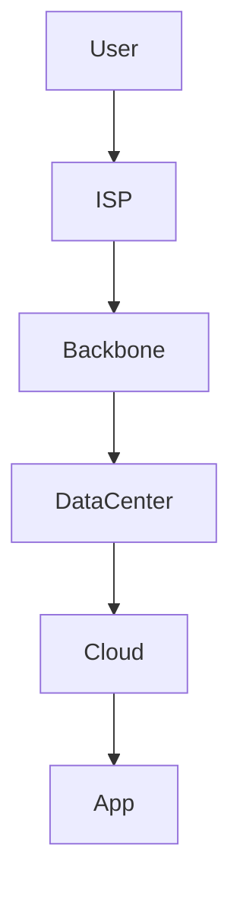
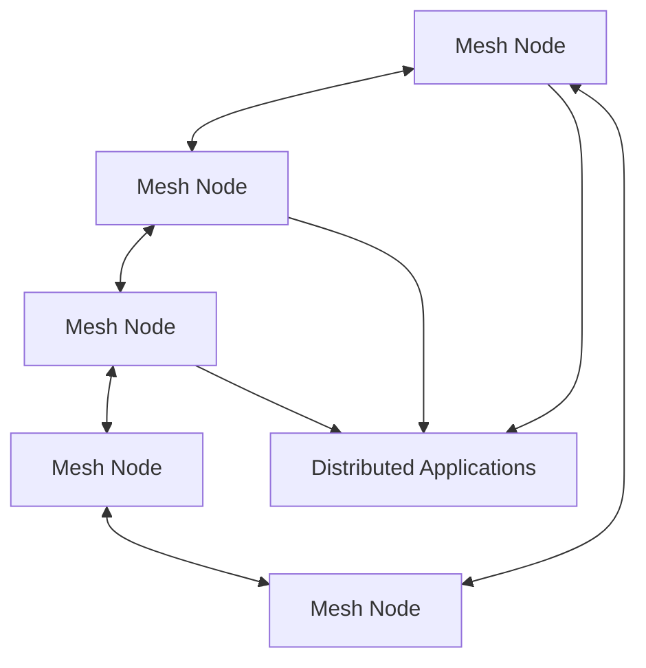
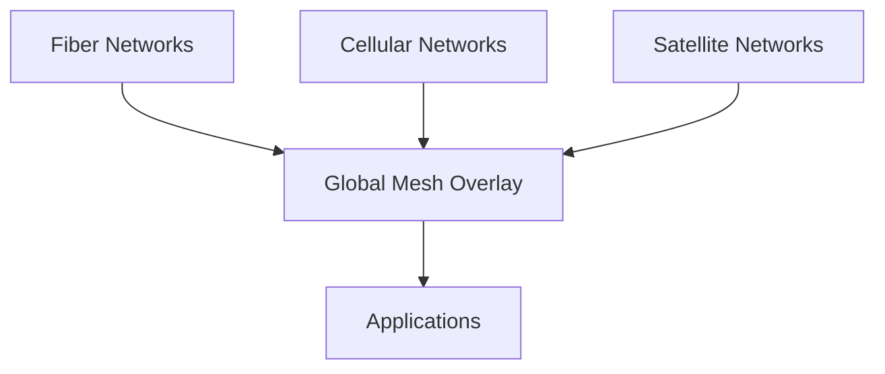
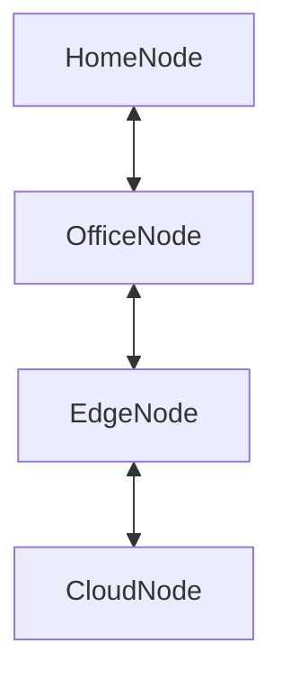
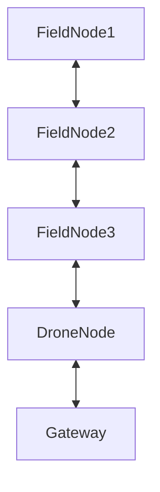
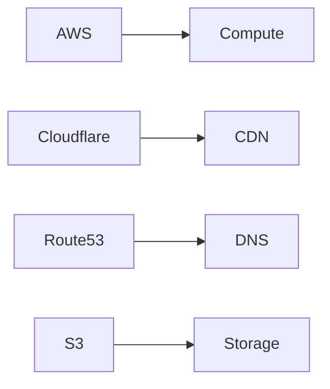
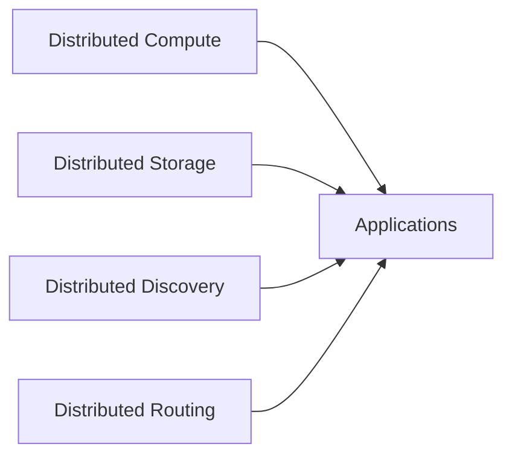
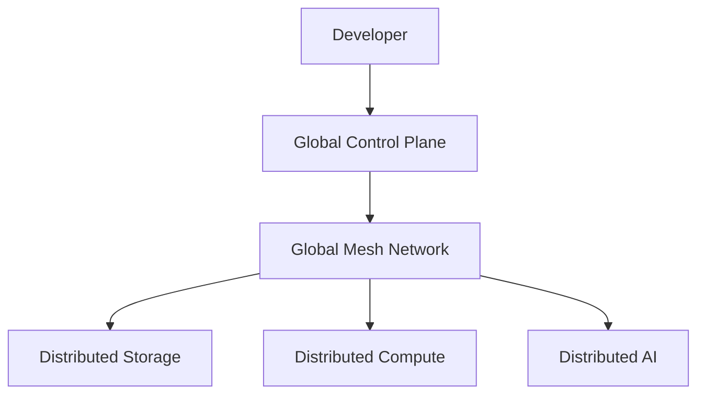
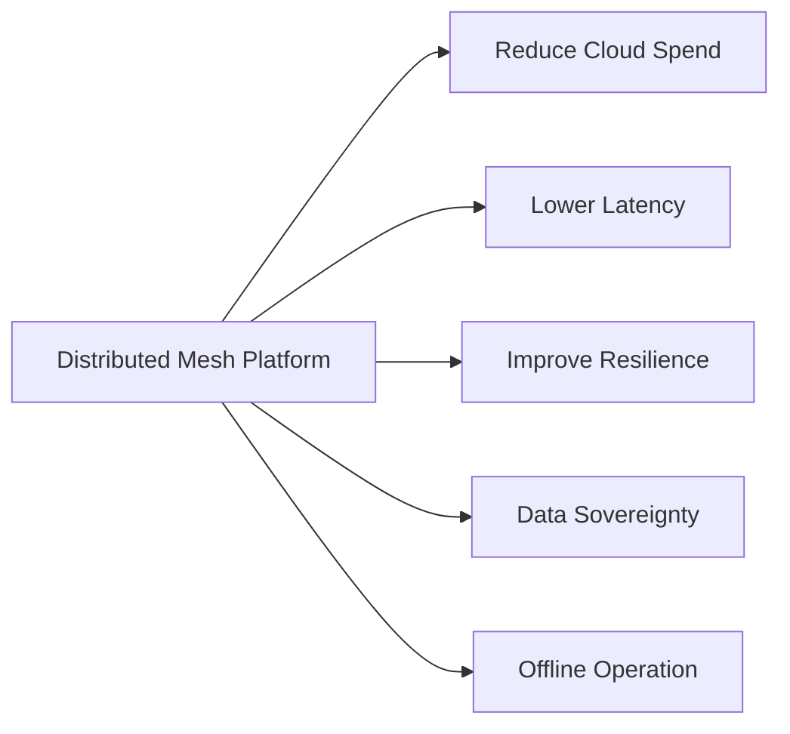
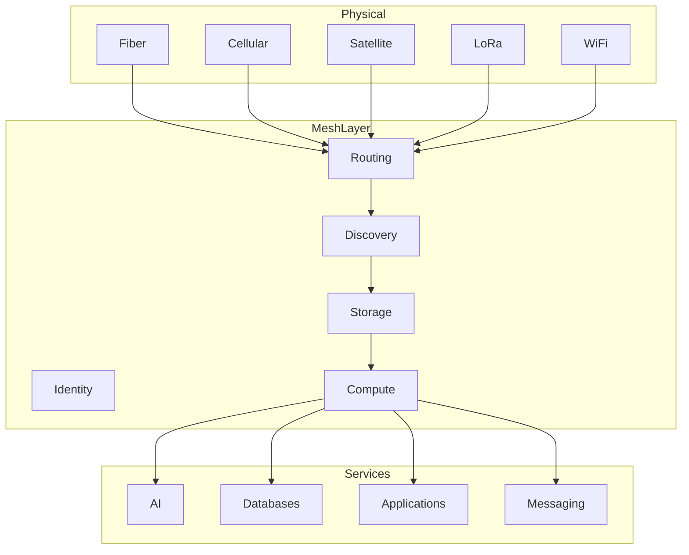

This is where your project becomes interesting because you're no longer competing with:

```text
AWS
Azure
Google
Cloudflare
```

You're competing with the *architecture itself*.

The current Internet evolved around centralized assumptions:

```text
Users
   ↓
ISP
   ↓
Backbone
   ↓
Data Center
   ↓
Hyperscaler
   ↓
Application
```

Every layer assumes large centralized infrastructure.

A decentralized mesh platform flips the model:

```text
Users
Devices
Servers
Edge Nodes
Vehicles
Gateways

      ↓

Distributed Mesh

      ↓

Shared Compute
Shared Storage
Shared Networking

      ↓

Applications
```

The key enterprise message is **not**:

> "We replace AWS."

That immediately sounds unrealistic.

The message is:

> "We reduce dependence on centralized infrastructure while extending compute to places traditional cloud cannot reach."

---

# Current Internet Model



Characteristics:

* Centralized
* Data-center dependent
* Long network paths
* Expensive edge expansion
* Regional outages impact many users

---

# Distributed Mesh Model



Characteristics:

* No single point of failure
* Self-healing
* Compute near users
* Infrastructure owned by participants

---

# Enterprise Evolution Story

Don't sell:

```text
Replace Cloud
```

Sell:

```text
Cloud

↓

Edge Cloud

↓

Distributed Cloud

↓

Mesh Cloud
```

This feels evolutionary rather than revolutionary.

---

# The Global Mesh Layer

In your architecture I would position mesh above physical networks.



This is important.

The mesh doesn't initially replace fiber.

It rides on top of fiber.

---

# Internet-Connected Mesh

Most deployments start here.



Benefits:

* Lower cloud costs
* Better resilience
* Geographic distribution

---

# Off-Grid Mesh

The more interesting long-term vision.



No Internet required.

Useful for:

* Defense
* Disaster recovery
* Remote industry
* Mining
* Agriculture

---

# The Mesh Replacement View

Current:



Mesh Equivalent:



Now you are replacing *functions*, not companies.

---

# Global Developer Platform Architecture

This feels close to your earlier SHADW/Simplify concepts.



---

# Enterprise Value Diagram

This is what executives care about.



---

# Ultimate Vision

The most compelling framing is not "decentralized cloud."

It's:

## Global Distributed Infrastructure Fabric



That's a much stronger enterprise narrative because you're not asking customers to abandon the Internet.

You're creating a **global infrastructure fabric** that can:

* run on the Internet
* run across private networks
* run across cellular
* run across satellite
* run across local radio meshes
* continue operating when some of those disappear

In other words, the Internet becomes just one transport among many. The mesh becomes the platform. That conceptual shift is probably the strongest "next-generation infrastructure" story you can tell.
