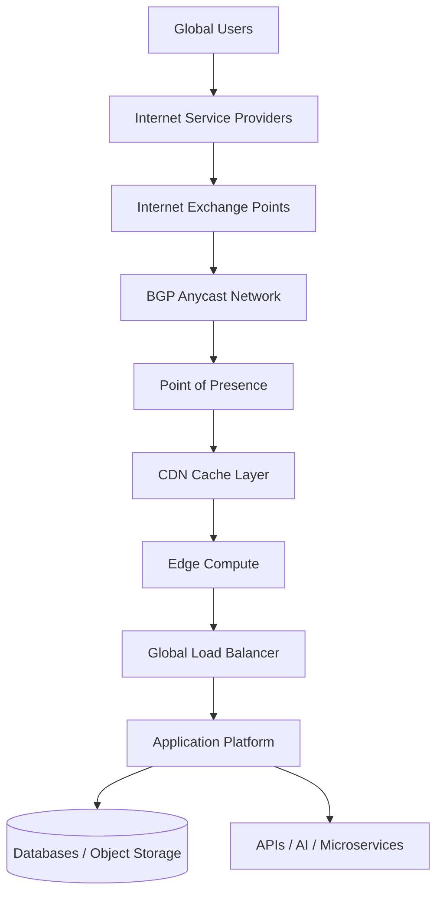
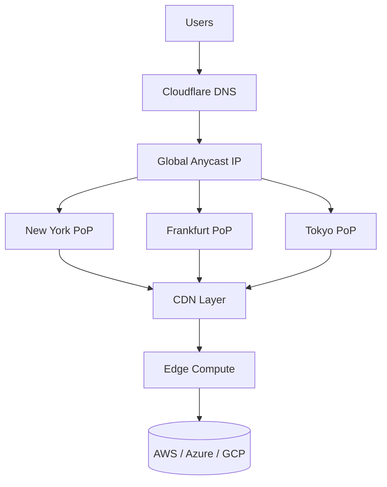
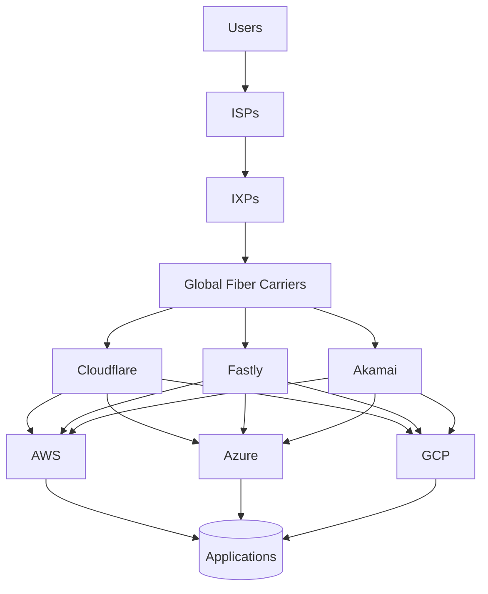
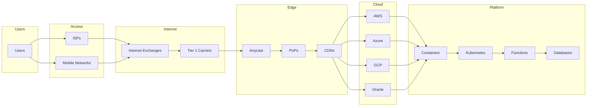
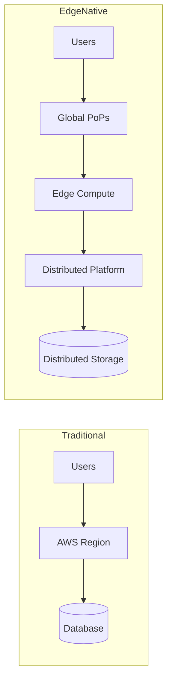
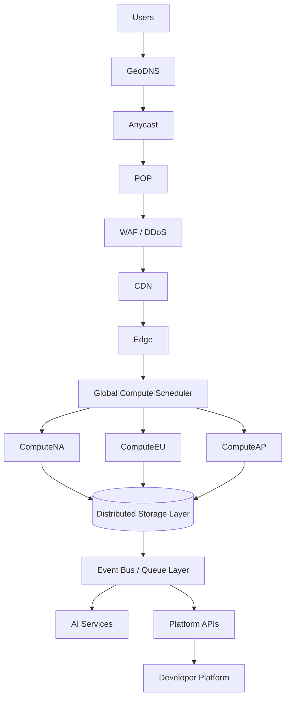
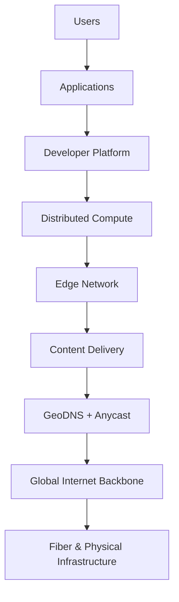

This is exactly the right direction. Most documentation explains **GeoDNS**, **CDNs**, **Anycast**, and **Cloud Providers** separately, but developers and architects need to understand the **dependency graph of the modern Internet**.

Instead of dozens of tiny diagrams, I'd create **5-10 giant architecture diagrams** that progressively zoom out from an application all the way to the global Internet.

---

# Diagram 1 — The Modern Internet Delivery Stack

This shows how almost every website, API, SaaS platform, game backend, or AI service actually reaches users.



### Key Insight

The Internet is no longer:

```text
User → Server
```

It is:

```text
User
 ↓
ISP
 ↓
IXP
 ↓
Anycast
 ↓
PoP
 ↓
CDN
 ↓
Edge
 ↓
Application
```

---

# Diagram 2 — How Cloudflare Actually Works

This is the easiest way to explain modern edge platforms.



### What Cloudflare Really Is

Cloudflare is not a cloud provider.

Cloudflare is:

* DNS
* Anycast
* CDN
* Edge Compute
* Security
* Network Optimization

sitting in front of traditional cloud infrastructure.

---

# Diagram 3 — The Hyperscaler Dependency Graph

Most people think AWS, Azure, and Google are the Internet.

They are not.

They sit inside a larger ecosystem.



### Critical Insight

The hyperscalers themselves rely on:

* Fiber carriers
* Transit providers
* IXPs
* Peering networks
* CDNs
* Edge providers

Nobody operates independently.

---

# Diagram 4 — Global Cloud Dependency Map

This is the "big picture" diagram.



This diagram starts to show:

**The Cloud depends on the Internet.**

Not the other way around.

---

# Diagram 5 — Traditional Cloud vs Global Edge Cloud

The diagram every developer should understand.



Traditional model:

```text
Everything runs in one region
```

Edge-native model:

```text
Everything runs everywhere
```

---

# Diagram 6 — Complete Next Generation Platform



---

# Diagram 7 — The Internet as a Layer Cake

This is the highest-level architecture view.



### The Most Important Lesson

Most developers think:

```text
App
 ↓
Server
```

The reality is:

```text
Users
 ↓
ISPs
 ↓
IXPs
 ↓
Carriers
 ↓
GeoDNS
 ↓
Anycast
 ↓
PoPs
 ↓
CDNs
 ↓
Edge Compute
 ↓
Cloud Providers
 ↓
Containers
 ↓
Databases
```

Once developers understand this dependency chain, concepts like Cloudflare, Fastly, Akamai, AWS Global Accelerator, Vercel Edge, Fly.io, and distributed compute platforms all suddenly make sense because they are simply different layers of the same global delivery system.
