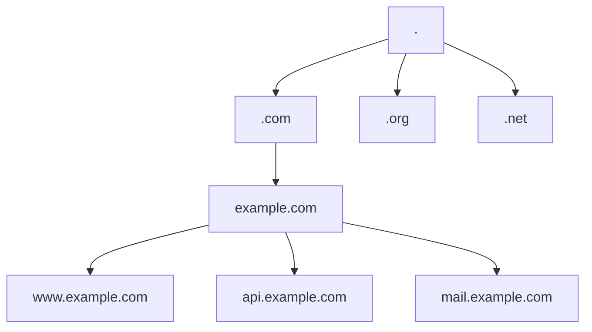
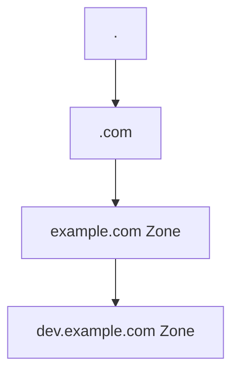
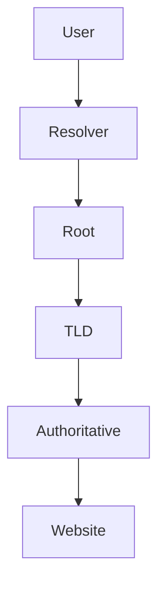
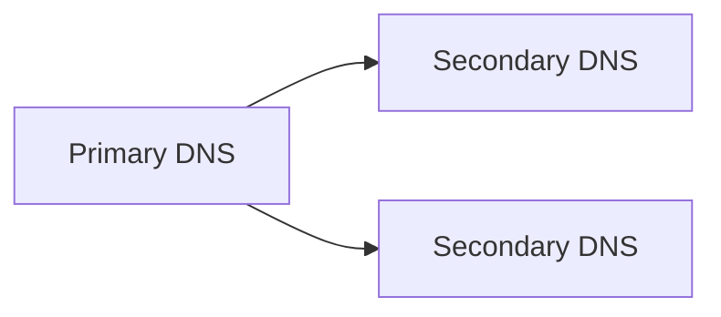
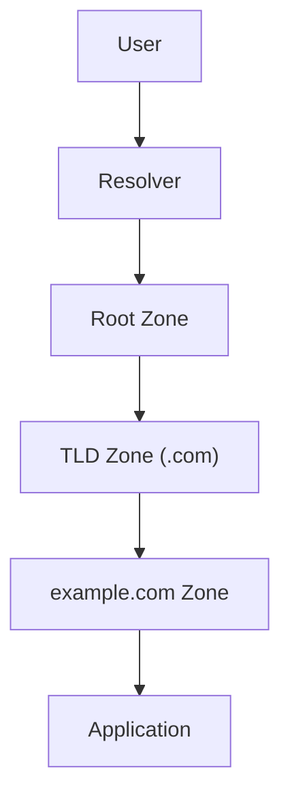

# DNS Zones Explained

## Understanding DNS Zones, Namespaces, Delegation, and Authority

DNS zones are one of the most important concepts in Internet infrastructure, yet they are often misunderstood.

Most people think DNS is simply:

```text
example.com
    ↓
IP Address
```

In reality, DNS is a globally distributed database organized into administrative boundaries called **zones**.

Zones allow ownership, delegation, management, and scaling of the Internet's naming system.

Without DNS zones, the modern Internet could not exist.

---

# What Is a DNS Zone?

A DNS zone is a portion of the DNS namespace managed by a specific organization or administrator.

Think of DNS as a giant tree.

```text
.
│
├── com
├── org
├── net
├── gov
└── edu
```

Each branch can be delegated to different organizations.

A DNS zone represents the part of that tree that a particular authority controls.

Example:

```text
.
│
└── com
     │
     └── example.com
          │
          ├── www
          ├── api
          ├── mail
          └── blog
```

The organization that owns `example.com` controls the DNS records inside that zone.

---

# DNS Namespace

The Internet DNS system is organized as a hierarchical namespace.



Every domain ultimately exists beneath the root namespace.

---

# DNS Hierarchy

The DNS hierarchy is divided into layers.

```text
Root Zone
    │
    ├── Top Level Domains
    │      ├── .com
    │      ├── .org
    │      ├── .net
    │      └── .io
    │
    ├── Second Level Domains
    │      ├── google.com
    │      ├── cloudflare.com
    │      └── example.com
    │
    └── Subdomains
           ├── www.example.com
           ├── api.example.com
           └── docs.example.com
```

Each level may become its own zone.

---

# Domains vs Zones

These terms are often confused.

A domain is a namespace.

A zone is an administrative boundary.

Example:

```text
example.com
```

is a domain.

But the zone might only include:

```text
example.com
www.example.com
api.example.com
mail.example.com
```

while another administrator manages:

```text
dev.example.com
```

as a separate zone.

---

# Zone Delegation

One of the most powerful features of DNS is delegation.

A parent zone can hand authority to another zone.

Example:

```text
example.com
│
├── www.example.com
├── api.example.com
│
└── dev.example.com
```

The organization may decide:

```text
example.com
```

is managed by Operations

while

```text
dev.example.com
```

is managed by Engineering.

---

## Delegation Diagram



Authority changes at the delegation point.

---

# Authoritative Nameservers

Every DNS zone has authoritative nameservers.

These servers contain the official records for the zone.

Example:

```text
example.com
```

may use:

```text
ns1.cloudflare.com
ns2.cloudflare.com
```

When a resolver needs information about the zone, it asks the authoritative servers.

---

## DNS Authority Flow



The authoritative server provides the final answer.

---

# Zone Files

Historically DNS zones are stored in zone files.

A zone file contains all DNS records for a zone.

Example:

```dns
$ORIGIN example.com.

@       IN SOA  ns1.example.com. admin.example.com.

@       IN NS   ns1.example.com.
@       IN NS   ns2.example.com.

www     IN A    203.0.113.10
api     IN A    203.0.113.20

mail    IN MX   10 mail.example.com.
```

This file defines the contents of the zone.

---

# Start of Authority (SOA)

Every DNS zone begins with an SOA record.

The SOA identifies:

- Primary authoritative server
- Zone administrator
- Serial number
- Refresh timers
- Retry timers
- Expiration values

Example:

```text
example.com
    │
    └── SOA
```

The SOA acts as the zone's identity record.

---

# DNS Records Inside a Zone

A zone can contain many record types.

---

## A Record

Maps a hostname to IPv4.

```text
www.example.com

203.0.113.10
```

---

## AAAA Record

Maps a hostname to IPv6.

```text
www.example.com

2001:db8::1
```

---

## CNAME Record

Creates an alias.

```text
blog.example.com
        │
        ▼
pages.example.net
```

---

## MX Record

Mail routing.

```text
example.com
      │
      ▼
mail.example.com
```

---

## TXT Record

Stores arbitrary metadata.

Used for:

- SPF
- DKIM
- Verification records

---

## NS Record

Defines authoritative nameservers.

```text
example.com

ns1.example.com
ns2.example.com
```

---

# DNS Zone Transfers

Authoritative servers must synchronize.

Example:



Zone transfers keep servers synchronized.

---

## AXFR

Full zone transfer.

Copies the entire zone.

```text
Primary
   ↓
Entire Zone
   ↓
Secondary
```

---

## IXFR

Incremental transfer.

Only sends changes.

```text
Primary
   ↓
Changed Records
   ↓
Secondary
```

Much more efficient.

---

# Public DNS Providers

Many organizations outsource DNS management.

Examples:

| Provider | Function |
|-----------|------------|
| Cloudflare DNS | Managed authoritative DNS |
| Route53 | AWS DNS platform |
| NS1 | Enterprise DNS |
| Akamai DNS | Global DNS platform |
| Google Cloud DNS | Managed DNS |
| Azure DNS | Managed DNS |

These systems still manage zones underneath.

---

# DNS Zone Boundaries

Zones define administrative ownership.

Example:

```text
example.com
│
├── www
├── api
├── mail
│
└── dev.example.com
```

If delegated:

```text
Zone A

example.com
│
├── www
├── api
└── mail
```

```text
Zone B

dev.example.com
│
├── app1
├── app2
└── app3
```

Two zones.

One namespace.

---

# DNS Zones in Cloud Platforms

Modern cloud systems create zones automatically.

Examples:

```text
AWS Route53
Cloudflare
Azure DNS
Google Cloud DNS
```

When you create:

```text
example.com
```

the provider generates:

- Zone ID
- SOA record
- NS records
- Replication configuration

behind the scenes.

---

# How DNS Zones Fit Into The Internet



Each zone provides authority for the next level.

---

# DNS as a Distributed Database

DNS is effectively one of the largest distributed databases ever created.

Properties:

- Hierarchical
- Distributed
- Fault tolerant
- Globally replicated
- Delegated administration

Every DNS zone acts like a managed partition within that database.

---

# Why DNS Zones Matter

DNS zones provide:

- Administrative control
- Scalability
- Delegation
- Redundancy
- Ownership boundaries
- Global distribution

Without zones:

- Registrars could not delegate domains
- Organizations could not manage subdomains independently
- DNS could not scale to billions of records

Zones are one of the fundamental building blocks that allow the Internet's naming system to function at global scale.

---

# Key Takeaways

| Concept | Purpose |
|-----------|------------|
| DNS Namespace | Global naming hierarchy |
| Domain | Named portion of namespace |
| Zone | Administrative portion of namespace |
| SOA | Zone identity record |
| NS | Defines authoritative servers |
| Zone File | Stores records |
| Delegation | Transfers authority |
| AXFR | Full zone transfer |
| IXFR | Incremental transfer |
| Authoritative Server | Source of truth for a zone |

DNS zones are the mechanism that transforms the Internet's global namespace into manageable administrative units, allowing millions of organizations to independently control their portion of the world's naming system.
