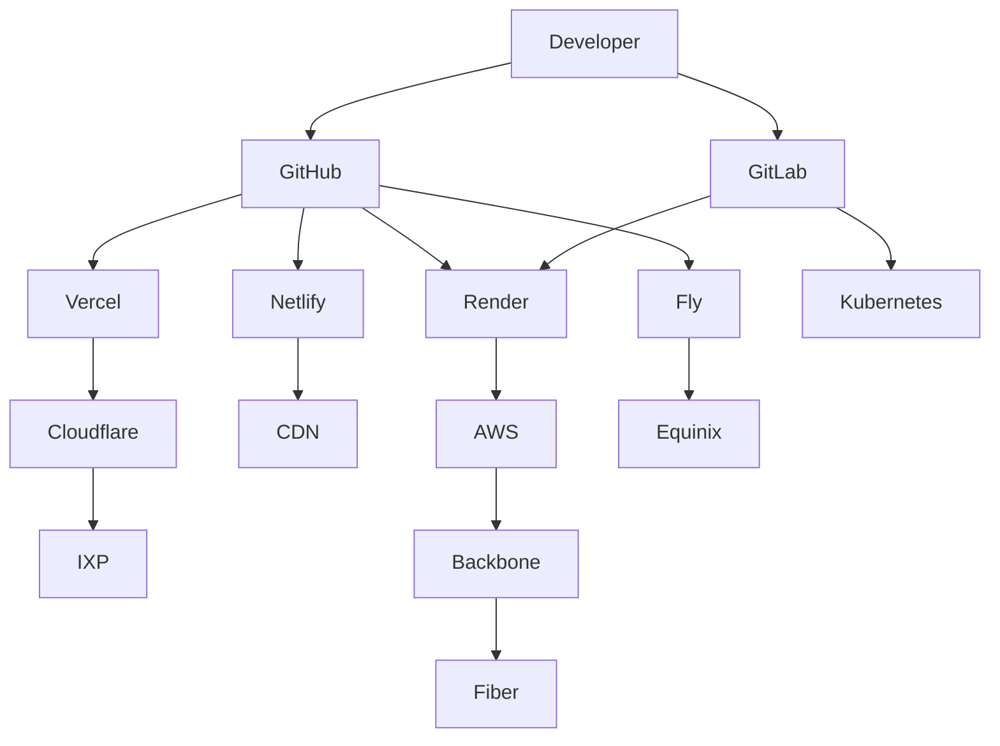
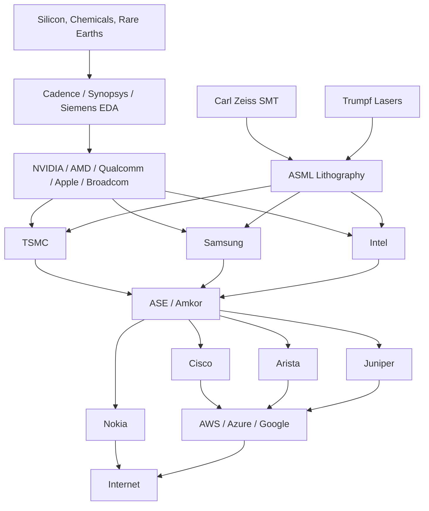
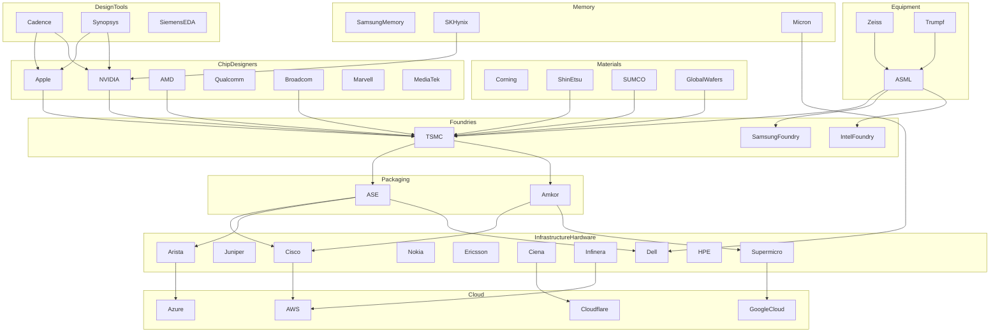
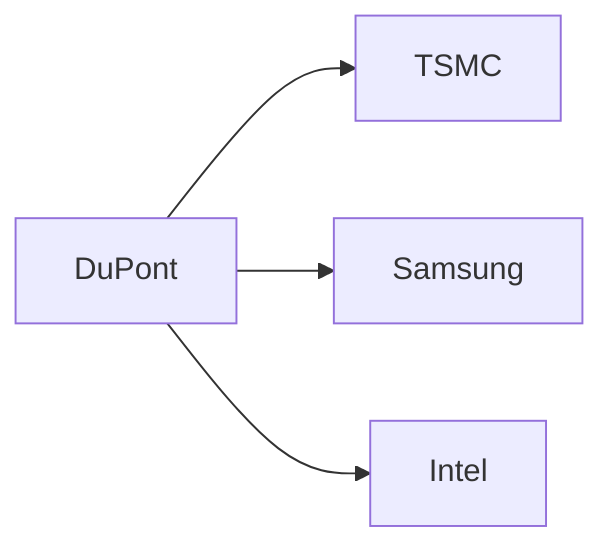
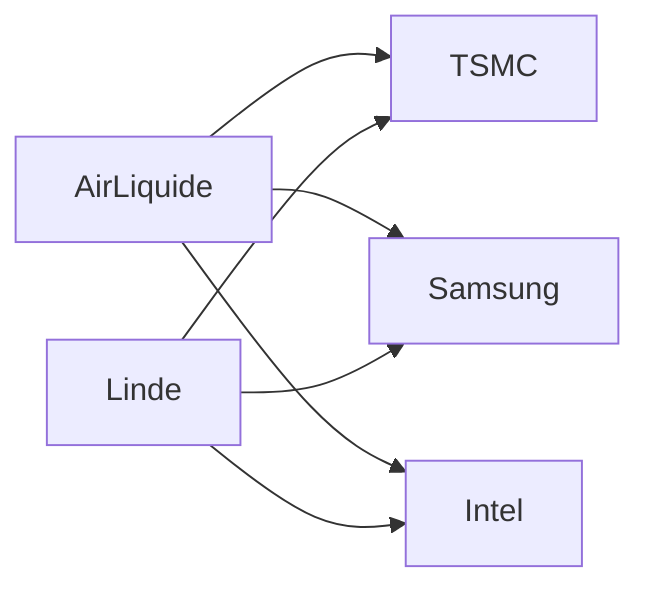
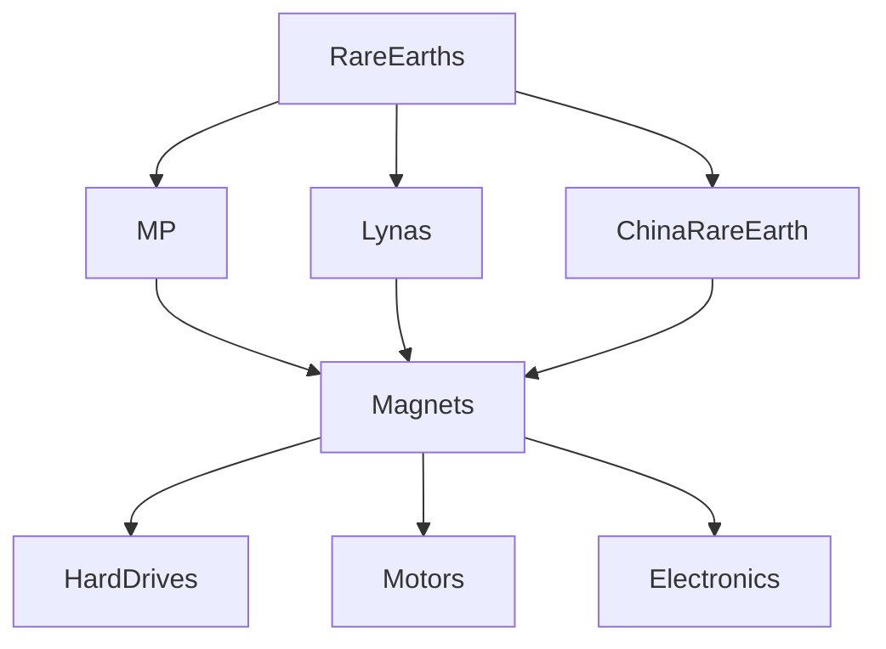
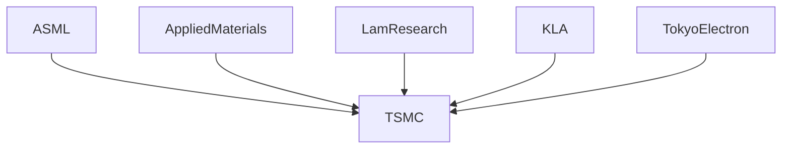
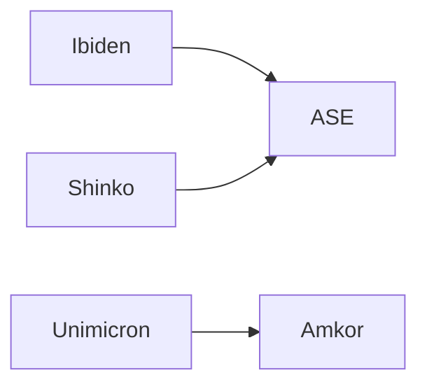
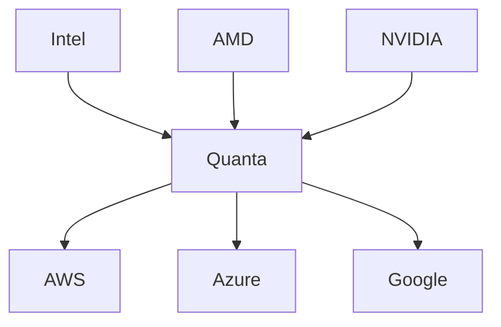
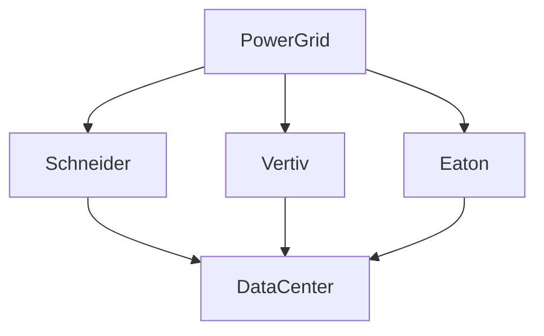

 **Global Digital Infrastructure Dependency Graph**.
 answers questions like:

* *What keeps the Internet running?*
* *What companies would cause cascading failures if they disappeared?*
* *What does every modern web application ultimately depend on?*
* *Where are the single points of failure?*

I'd actually split it into **8 major layers**, because otherwise the diagram becomes impossible to read.

```text
Layer 8  Applications

Layer 7  Developer Platforms

Layer 6  Cloud / AI / CDN / DNS

Layer 5  Data Centers & IXPs

Layer 4  Networks

Layer 3  Fiber / Subsea / Wireless

Layer 2  Hardware

Layer 1  Semiconductor Supply Chain
```

That becomes your master document.

---

# PART 1 — Additional Internet Service Companies

---

# Atlassian

Classification:

```text
Developer Collaboration Platform
Enterprise Productivity Platform
Software Development Ecosystem
```

Provides:

* Jira
* Confluence
* Bitbucket
* Trello
* Opsgenie

Dependencies:

```text
Cloud Infrastructure
DNS
CDNs
Git Providers
Identity Providers
```

Who depends on Atlassian?

```text
Millions of software teams
Enterprise IT
DevOps organizations
```

---

# GitHub

Classification:

```text
Source Control Platform
Software Supply Chain Provider
Developer Collaboration Platform
```

Provides:

* Git repositories
* Actions (CI/CD)
* Packages
* Codespaces

Depends on:

```text
Azure
CDNs
DNS
Global Backbone Networks
```

Who depends on GitHub?

```text
Nearly every modern software company
Open-source ecosystem
CI/CD pipelines
```

---

# GitLab

Classification:

```text
Source Control Platform
DevOps Platform
CI/CD Provider
```

Provides:

* Git hosting
* CI/CD
* Container Registry
* Security scanning

Depends on:

```text
Cloud providers
DNS
CDNs
Storage
```

---

# Netlify

Classification:

```text
Frontend Cloud Platform
Edge Deployment Platform
Static Site Hosting Provider
```

Provides:

* Static hosting
* Edge Functions
* Build pipelines

Depends on:

```text
Cloud providers
CDNs
DNS
GitHub
GitLab
```

Who depends on Netlify?

```text
Frontend developers
Marketing sites
Jamstack applications
```

---

# Render

Classification:

```text
Application Hosting Platform
Cloud Platform
Developer Infrastructure Provider
```

Provides:

* Web services
* Databases
* Background workers

Depends on:

```text
Hyperscale cloud
DNS
Global networking
```

---

# Fly.io

Classification:

```text
Edge Compute Platform
Application Deployment Network
Developer Infrastructure Provider
```

Runs applications near users using globally distributed virtual machines.

Depends on:

```text
Data centers
Backbone providers
IXPs
DNS
```

---

# Hugging Face

Classification:

```text
Machine Learning Platform
AI Model Repository
Developer Ecosystem
```

Provides:

* Model Hub
* Datasets
* Spaces
* Transformers

Depends on:

```text
Cloud GPUs
Object storage
CDNs
Git infrastructure
```

Who depends on Hugging Face?

```text
Researchers
AI startups
ML engineers
```

---

# Cohere

Classification:

```text
Enterprise AI Platform
Foundation Model Provider
Inference Platform
```

Depends on:

```text
GPU clusters
Cloud providers
Networking
```

---

# xAI

Classification:

```text
Foundation Model Provider
AI Infrastructure Platform
Developer API Provider
```

Provides:

* Grok
* Enterprise APIs

Depends on:

```text
Massive GPU clusters
Cloud-scale networking
DNS
Data centers
```

---

# Electronic Frontier Foundation (EFF)

Classification:

```text
Digital Rights Organization
Internet Policy Organization
Privacy Advocacy Group
```

Unlike the others, EFF is **not infrastructure**. It influences the legal, policy, and privacy framework of the Internet rather than operating its technical backbone.

---

# How These Platforms Fit



---

# Software Dependency Pyramid

```text
Applications

↑

GitHub
GitLab
Atlassian
Vercel
Netlify
Render
Fly

↑

AWS
Azure
Google Cloud

↑

Cloudflare
Akamai
Fastly

↑

IXPs

↑

Fiber Networks
```

Notice something interesting:

GitHub depends on Azure.

Vercel depends heavily on AWS and Cloudflare.

Netlify depends on Git providers.

Render depends on cloud providers.

Everyone eventually depends on:

* DNS
* Fiber
* IXPs
* Power

---

# PART 2 — The Foundation Hardware Layer

This is where your map becomes really unique because very few people connect the Internet back to semiconductor manufacturing.

I'd organize it like this:

```text
Raw Materials

↓

Chip Design

↓

EDA Software

↓

Semiconductor Equipment

↓

Wafer Fabrication

↓

Packaging

↓

Hardware Manufacturers

↓

Network Equipment

↓

Cloud Infrastructure

↓

Internet
```

---

# Semiconductor Equipment

## ASML

Classification:

```text
Semiconductor Equipment Manufacturer
EUV Lithography Leader
Critical Manufacturing Technology Provider
```

Produces:

* EUV lithography systems
* DUV lithography systems

Why it's important:

ASML is the only company in the world that manufactures production EUV lithography machines, which are required to fabricate the most advanced semiconductor nodes (e.g., 5 nm, 3 nm, and beyond).

Depends on:

```text
Carl Zeiss SMT
Trumpf
High-precision optics
Ultra-clean manufacturing
```

Who depends on ASML?

```text
TSMC
Samsung
Intel
```

---

## Carl Zeiss SMT

Classification:

```text
Precision Optics Manufacturer
Semiconductor Optics Supplier
```

Produces:

* Mirrors
* Projection optics
* Ultra-high precision lenses

Without Zeiss:

```text
No EUV machines

↓

No leading-edge chips
```

---

## Trumpf

Classification:

```text
Industrial Laser Manufacturer
Semiconductor Equipment Supplier
```

Produces:

* High-power lasers

Used inside:

```text
ASML EUV systems
```

---

# Semiconductor Foundries

## TSMC

Classification:

```text
Semiconductor Foundry
Advanced Chip Manufacturer
Critical Global Infrastructure
```

Manufactures chips for:

* Apple
* AMD
* NVIDIA
* Qualcomm
* Broadcom
* Many others

---

## Samsung Foundry

Classification:

```text
Semiconductor Foundry
Memory Manufacturer
Advanced Logic Manufacturer
```

---

## Intel Foundry

Classification:

```text
Integrated Device Manufacturer
Semiconductor Foundry
CPU Manufacturer
```

---

# Chip Designers

## NVIDIA

Classification:

```text
GPU Designer
AI Accelerator Provider
Networking Hardware Company
```

Produces:

* AI GPUs
* Networking (through Mellanox)
* Supercomputing platforms

---

## AMD

Classification:

```text
CPU Designer
GPU Designer
Data Center Processor Manufacturer
```

---

## Qualcomm

Classification:

```text
Mobile SoC Designer
Wireless Technology Provider
```

---

## Broadcom

Classification:

```text
Networking Silicon Provider
Switch ASIC Manufacturer
Infrastructure Semiconductor Company
```

Produces many of the chips inside modern Ethernet switches and routers.

---

## Arm

Classification:

```text
CPU Architecture Designer
Semiconductor IP Provider
```

Licenses CPU architectures used by:

* Apple
* Qualcomm
* AWS Graviton
* Ampere
* MediaTek

---

# Networking Hardware

## Cisco

Classification:

```text
Networking Equipment Manufacturer
Enterprise Infrastructure Provider
```

Produces:

* Routers
* Switches
* Firewalls

---

## Juniper Networks

Classification:

```text
Carrier Networking Vendor
Data Center Networking Provider
```

Major supplier to ISPs and cloud providers.

---

## Arista Networks

Classification:

```text
Cloud Networking Equipment Manufacturer
Data Center Switching Provider
```

One of the dominant vendors inside hyperscale data centers.

---

## Nokia

Classification:

```text
Telecommunications Equipment Manufacturer
Optical Networking Provider
```

Provides carrier-grade mobile and optical networking equipment.

---

## Ericsson

Classification:

```text
5G Infrastructure Provider
Radio Access Network Manufacturer
```

Builds much of the world's cellular infrastructure.

---

## Ciena

Classification:

```text
Optical Transport Equipment Manufacturer
Coherent Optical Networking Provider
```

Critical supplier for long-haul fiber and submarine cable systems.

---

# The Semiconductor Supply Chain




 The **Internet service layer** looks huge because we use it every day, but once you start mapping the hardware and semiconductor side, you discover the dependency graph is actually much deeper and often more concentrated.

For example:

```text
GitHub
  ↓
Azure
  ↓
Servers
  ↓
CPUs
  ↓
TSMC
  ↓
ASML
  ↓
Zeiss
```

A surprising amount of the world's digital economy eventually traces back to a handful of companies.

---

# EDA (Electronic Design Automation)

These companies build the software used to design chips.

Without them:

```text
No chip designs

↓

No CPUs

↓

No GPUs

↓

No Internet
```

---

## Cadence

Classification:

```text
EDA Software Provider
Chip Design Platform
Semiconductor Engineering Software
```

Produces:

* Chip design software
* PCB design tools
* Verification systems

Used by:

```text
NVIDIA
AMD
Intel
Apple
Qualcomm
Broadcom
Marvell
```

Cadence is one of the three companies that effectively make modern chip design possible.

---

## Synopsys

Classification:

```text
EDA Software Provider
Semiconductor IP Provider
Chip Verification Platform
```

Produces:

* Design tools
* Verification tools
* Semiconductor IP blocks

Used by virtually every major chip company.

Many modern chips contain Synopsys IP.

---

## Siemens EDA

Classification:

```text
EDA Software Provider
Electronic Engineering Platform
Verification Technology Provider
```

Formerly:

```text
Mentor Graphics
```

Provides:

* Simulation
* PCB design
* Verification

Third member of the "EDA Big Three".

---

# Semiconductor Packaging

These companies take finished wafers and turn them into usable chips.

---

## ASE Technology

Classification:

```text
Semiconductor Packaging Provider
Chip Assembly Company
Advanced Packaging Leader
```

Produces:

* Chip packaging
* Chip testing
* Advanced chiplet packaging

One of the largest semiconductor packaging companies in the world.

Without ASE:

```text
TSMC wafers

↓

Cannot become usable processors
```

---

## Amkor

Classification:

```text
Semiconductor Packaging Provider
Chip Testing Company
Advanced Packaging Supplier
```

Major supplier to:

```text
Apple
Qualcomm
AMD
NVIDIA
```

One of the most important companies most people have never heard of.

---

# Semiconductor Materials

---

## Shin-Etsu

Classification:

```text
Silicon Wafer Manufacturer
Semiconductor Materials Supplier
```

Produces:

* Silicon wafers

Used by:

```text
TSMC
Samsung
Intel
```

---

## SUMCO

Classification:

```text
Silicon Wafer Manufacturer
Semiconductor Materials Supplier
```

One of the world's largest wafer suppliers.

---

## GlobalWafers

Classification:

```text
Semiconductor Wafer Manufacturer
Silicon Materials Supplier
```

Critical upstream supplier.

---

# Chip Designers

---

## Apple

Classification:

```text
Consumer Electronics Company
Chip Designer
Platform Provider
```

Produces:

* M-series processors
* A-series processors

Depends on:

```text
TSMC
ARM
Cadence
Synopsys
ASE
Amkor
```

Apple designs some of the world's most advanced processors but manufactures none of them.

---

## NVIDIA

Classification:

```text
GPU Designer
AI Infrastructure Provider
Networking Company
```

Produces:

* H100
* B100
* AI accelerators
* Mellanox networking

Depends heavily on:

```text
TSMC
ASE
Cadence
Synopsys
```

---

## Broadcom

Classification:

```text
Infrastructure Semiconductor Company
Networking Silicon Provider
```

Produces chips used in:

```text
Routers
Switches
Storage systems
WiFi
Fiber infrastructure
```

Many Internet routers contain Broadcom silicon.

---

## Marvell

Classification:

```text
Infrastructure Semiconductor Company
Networking Silicon Provider
```

Produces:

* Ethernet chips
* Optical networking silicon
* Data center processors

Extremely important in modern cloud infrastructure.

---

## MediaTek

Classification:

```text
Mobile Chip Designer
Consumer Semiconductor Provider
```

Powers huge numbers of phones and IoT devices globally.

---

# IBM

IBM deserves its own category.

---

## IBM

Classification:

```text
Enterprise Technology Company
Research Organization
Semiconductor Innovator
```

Produces:

* Mainframes
* Enterprise software
* Research technologies

Important contributions:

```text
FinFET research
Chip manufacturing advances
AI systems
Quantum computing
```

IBM is less important as a chip manufacturer today but remains hugely important as a research and standards organization.

---

# Memory Manufacturers

Without memory, no server works.

---

## Samsung Memory

Classification:

```text
Memory Manufacturer
DRAM Provider
Flash Storage Provider
```

Largest memory producer in the world.

---

## SK Hynix

Classification:

```text
Memory Manufacturer
HBM Supplier
AI Memory Provider
```

Critical supplier for AI GPUs.

---

## Micron

Classification:

```text
Memory Manufacturer
Storage Technology Provider
```

Major US memory producer.

---

# Storage Infrastructure

---

## Western Digital

Classification:

```text
Storage Manufacturer
Data Infrastructure Provider
```

Produces:

* HDDs
* SSDs
* Enterprise storage

---

## Seagate

Classification:

```text
Storage Manufacturer
Enterprise Data Infrastructure Provider
```

One of the largest hard drive manufacturers.

---

# Server Manufacturers

---

## Dell Technologies

Classification:

```text
Server Manufacturer
Enterprise Infrastructure Provider
```

Builds:

* Data center servers
* Storage arrays

Used heavily by enterprises and cloud providers.

---

## HPE

Classification:

```text
Enterprise Server Provider
Infrastructure Platform Provider
```

Major server and supercomputing vendor.

---

## Supermicro

Classification:

```text
Server Manufacturer
AI Infrastructure Supplier
```

Huge supplier of GPU servers.

---

# Optical & Fiber Hardware

---

## Ciena

Classification:

```text
Optical Networking Provider
Long-Haul Fiber Infrastructure Supplier
```

Provides equipment that moves traffic across continents.

---

## Infinera

Classification:

```text
Optical Transport Provider
Fiber Infrastructure Equipment Vendor
```

Major backbone networking supplier.

---

## Corning

Classification:

```text
Fiber Optics Manufacturer
Materials Science Company
```

Produces:

```text
Optical fiber
Fiber cable components
```

Large portions of global fiber ultimately trace back to companies like Corning.

---

# Hardware Dependency Graph



---

# Additional Critical Organizations You're Still Missing

For a truly comprehensive map, I'd add these next:

### Semiconductor IP

* ARM
* Imagination Technologies
* Rambus
* CEVA

### Manufacturing Equipment

* Applied Materials
* Lam Research
* KLA
* Tokyo Electron

### Materials & Chemicals

* Corning
* JSR
* Merck Electronics
* DuPont Electronics
* Air Liquide
* Linde

### Memory

* Samsung
* SK Hynix
* Micron
* Kioxia

### Server / Compute

* Dell
* HPE
* Supermicro
* Lenovo

### Optical

* Ciena
* Infinera
* Nokia Optical
* Fujitsu Optical

### Research / Standards

* IBM
* IEEE
* IETF
* W3C
* Linux Foundation


I would actually dedicate an entire section of your documentation to **"The Semiconductor Dependency Graph"**. It complements your Internet map perfectly by showing that every website, cloud provider, AI model, CDN, and mobile network ultimately traces back to a surprisingly small number of companies responsible for chip design, lithography, fabrication, networking hardware, and advanced manufacturing. That "bottom layer" is what makes every layer above it possible.


Your diagram is actually getting close to the point where adding *more logos* becomes less useful than adding the **missing flows** between layers.

Looking at what you have, the biggest missing pieces are:

```text
RAW MATERIALS
     ↓
CHEMICALS
     ↓
FAB EQUIPMENT
     ↓
FOUNDRY
     ↓
PACKAGING
     ↓
COMPONENTS
     ↓
SYSTEMS
     ↓
DATACENTERS
```

Right now some organizations are floating without their actual dependencies shown.

---

# Where DuPont Actually Fits

Most people think DuPont is a semiconductor company.

It isn't.

It is a **materials company**.

Classification:

```text
Electronic Materials Supplier
Advanced Polymer Manufacturer
Semiconductor Chemical Provider
```

Produces:

```text
Photoresist Materials
Circuit Board Materials
Advanced Polymers
Interconnect Materials
```

Diagram:



Think:

```text
DuPont

↓

Materials used during manufacturing
```

not

```text
DuPont

↓

Chips
```

---

# Where Air Liquide & Linde Fit

This is a missing connection.

Your gases should connect directly into fabrication.

Classification:

```text
Industrial Gas Suppliers
Semiconductor Process Infrastructure
```

Provide:

```text
Nitrogen
Argon
Helium
Hydrogen
Neon
```

Used in:

```text
Etching
Deposition
Cleaning
Lithography
```

Diagram:



Without these companies:

```text
Fab shuts down immediately
```

---

# Missing Rare Earth Layer

You have a "Rare Earths" box but no companies.

Add:

## MP Materials

Classification:

```text
Rare Earth Producer
Strategic Materials Supplier
```

---

## Lynas

Classification:

```text
Rare Earth Refiner
Critical Minerals Producer
```

---

## China Northern Rare Earth

Classification:

```text
Rare Earth Mining Company
Strategic Materials Supplier
```

Diagram:



---

# Missing Manufacturing Equipment Layer

This is one of the largest gaps.

Right now ASML is getting too much credit.

Reality:

```text
TSMC Fab

ASML
Applied Materials
Lam Research
KLA
Tokyo Electron

ALL REQUIRED
```

Diagram:



A useful note:

```text
ASML = Prints transistor patterns

Applied Materials = Deposits materials

Lam = Etches materials

KLA = Inspects materials

TEL = Cleans and processes materials
```

---

# Missing PCB Layer

Almost every device has PCBs.

Add:

## TTM Technologies

Classification:

```text
PCB Manufacturer
Electronics Manufacturing Supplier
```

---

## Unimicron

Classification:

```text
Advanced PCB Manufacturer
Semiconductor Substrate Supplier
```

Diagram:


---

# Missing Substrate Layer

This is actually one of the most important missing sections.

Modern AI chips depend heavily on advanced packaging substrates.

Add:

## Ibiden

Classification:

```text
Semiconductor Substrate Supplier
Advanced Packaging Manufacturer
```

---

## Shinko Electric

Classification:

```text
Chip Packaging Substrate Supplier
```

---

## Unimicron

Classification:

```text
IC Substrate Manufacturer
```

Diagram:



---

# Missing Contract Manufacturing

Many companies don't build their own servers.

Add:

## Foxconn

Classification:

```text
Electronics Manufacturer
Contract Manufacturing Giant
```

Builds:

```text
Servers
Phones
Networking Equipment
```

---

## Wistron

Classification:

```text
Contract Manufacturer
Server Builder
```

---

## Quanta

Classification:

```text
Cloud Server Manufacturer
ODM Provider
```

This one is huge.

Many cloud servers are actually made by Quanta.

Diagram:



---

# Missing AI Infrastructure Layer

A new section beneath cloud.

Add:

## CoreWeave

Classification:

```text
GPU Cloud Provider
AI Infrastructure Provider
```

---

## Crusoe

Classification:

```text
AI Data Center Operator
GPU Infrastructure Provider
```

---

## Lambda Labs

Classification:

```text
AI Compute Provider
GPU Cloud Platform
```

These sit between:

```text
NVIDIA

↓

AI Clouds

↓

OpenAI
Anthropic
xAI
```

---

# Missing Power Layer (Extremely Important)

Every diagram misses this.

Nothing works without:

```text
Utilities

↓

Substations

↓

Data Centers

↓

Cloud
```

Add:

## Schneider Electric

Classification:

```text
Data Center Power Infrastructure
Electrical Systems Provider
```

---

## Eaton

Classification:

```text
Power Management Company
UPS Provider
```

---

## Vertiv

Classification:

```text
Data Center Cooling Provider
Power Infrastructure Provider
```

Diagram:



---

# Most Important Missing Companies

If I were continuing your map, these would be my highest-priority additions:

```text
MATERIALS
---------
DuPont
JSR
Merck
Air Liquide
Linde
Shin-Etsu
SUMCO

EQUIPMENT
---------
Applied Materials
Lam Research
KLA
Tokyo Electron

SUBSTRATES
----------
Ibiden
Shinko
Unimicron

PACKAGING
---------
ASE
Amkor

CONTRACT MANUFACTURING
----------------------
Foxconn
Quanta
Wistron

POWER
-----
Schneider Electric
Vertiv
Eaton

AI INFRASTRUCTURE
-----------------
CoreWeave
Crusoe
Lambda

RARE EARTHS
-----------
MP Materials
Lynas
China Northern Rare Earth

OPTICS
-------
Coherent
Lumentum
Hamamatsu
```

 **"How a Server Is Born"** diagram:

```text
Sand
 ↓
Silicon Wafer
 ↓
TSMC
 ↓
ASE / Amkor
 ↓
CPU / GPU
 ↓
Foxconn / Quanta
 ↓
Dell / HPE / Supermicro
 ↓
AWS / Azure / Google
 ↓
Cloudflare
 ↓
GitHub / Netflix / OpenAI
 ↓
User
```

That single flow explains more of the modern Internet than most 100-page reports.

