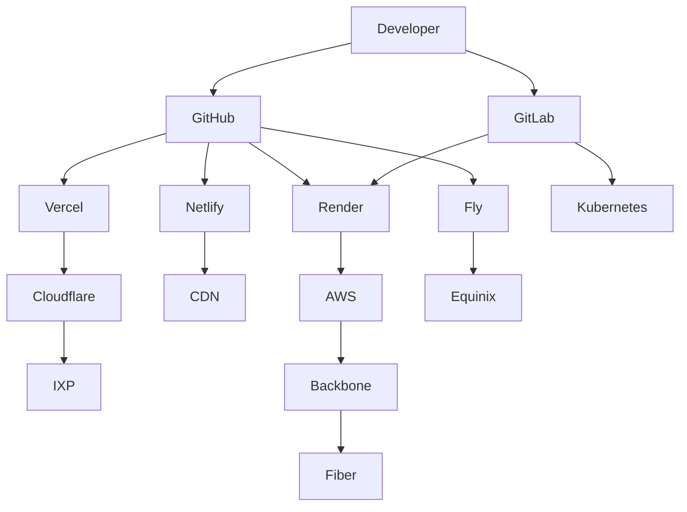
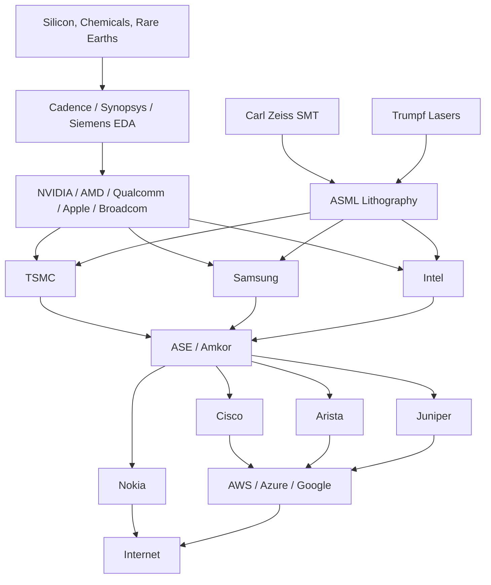

I think you're heading toward something much larger than an Internet map—you're really building a **Global Digital Infrastructure Dependency Graph**. If done well, it answers questions like:

* *What keeps the Internet running?*
* *What companies would cause cascading failures if they disappeared?*
* *What does every modern web application ultimately depend on?*
* *Where are the single points of failure?*

I'd actually split it into **8 major layers**, because otherwise the diagram becomes impossible to read.

```text
Layer 8  Applications

Layer 7  Developer Platforms

Layer 6  Cloud / AI / CDN / DNS

Layer 5  Data Centers & IXPs

Layer 4  Networks

Layer 3  Fiber / Subsea / Wireless

Layer 2  Hardware

Layer 1  Semiconductor Supply Chain
```

That becomes your master document.

---

# PART 1 — Additional Internet Service Companies

---

# Atlassian

Classification:

```text
Developer Collaboration Platform
Enterprise Productivity Platform
Software Development Ecosystem
```

Provides:

* Jira
* Confluence
* Bitbucket
* Trello
* Opsgenie

Dependencies:

```text
Cloud Infrastructure
DNS
CDNs
Git Providers
Identity Providers
```

Who depends on Atlassian?

```text
Millions of software teams
Enterprise IT
DevOps organizations
```

---

# GitHub

Classification:

```text
Source Control Platform
Software Supply Chain Provider
Developer Collaboration Platform
```

Provides:

* Git repositories
* Actions (CI/CD)
* Packages
* Codespaces

Depends on:

```text
Azure
CDNs
DNS
Global Backbone Networks
```

Who depends on GitHub?

```text
Nearly every modern software company
Open-source ecosystem
CI/CD pipelines
```

---

# GitLab

Classification:

```text
Source Control Platform
DevOps Platform
CI/CD Provider
```

Provides:

* Git hosting
* CI/CD
* Container Registry
* Security scanning

Depends on:

```text
Cloud providers
DNS
CDNs
Storage
```

---

# Netlify

Classification:

```text
Frontend Cloud Platform
Edge Deployment Platform
Static Site Hosting Provider
```

Provides:

* Static hosting
* Edge Functions
* Build pipelines

Depends on:

```text
Cloud providers
CDNs
DNS
GitHub
GitLab
```

Who depends on Netlify?

```text
Frontend developers
Marketing sites
Jamstack applications
```

---

# Render

Classification:

```text
Application Hosting Platform
Cloud Platform
Developer Infrastructure Provider
```

Provides:

* Web services
* Databases
* Background workers

Depends on:

```text
Hyperscale cloud
DNS
Global networking
```

---

# Fly.io

Classification:

```text
Edge Compute Platform
Application Deployment Network
Developer Infrastructure Provider
```

Runs applications near users using globally distributed virtual machines.

Depends on:

```text
Data centers
Backbone providers
IXPs
DNS
```

---

# Hugging Face

Classification:

```text
Machine Learning Platform
AI Model Repository
Developer Ecosystem
```

Provides:

* Model Hub
* Datasets
* Spaces
* Transformers

Depends on:

```text
Cloud GPUs
Object storage
CDNs
Git infrastructure
```

Who depends on Hugging Face?

```text
Researchers
AI startups
ML engineers
```

---

# Cohere

Classification:

```text
Enterprise AI Platform
Foundation Model Provider
Inference Platform
```

Depends on:

```text
GPU clusters
Cloud providers
Networking
```

---

# xAI

Classification:

```text
Foundation Model Provider
AI Infrastructure Platform
Developer API Provider
```

Provides:

* Grok
* Enterprise APIs

Depends on:

```text
Massive GPU clusters
Cloud-scale networking
DNS
Data centers
```

---

# Electronic Frontier Foundation (EFF)

Classification:

```text
Digital Rights Organization
Internet Policy Organization
Privacy Advocacy Group
```

Unlike the others, EFF is **not infrastructure**. It influences the legal, policy, and privacy framework of the Internet rather than operating its technical backbone.

---

# How These Platforms Fit



---

# Software Dependency Pyramid

```text
Applications

↑

GitHub
GitLab
Atlassian
Vercel
Netlify
Render
Fly

↑

AWS
Azure
Google Cloud

↑

Cloudflare
Akamai
Fastly

↑

IXPs

↑

Fiber Networks
```

Notice something interesting:

GitHub depends on Azure.

Vercel depends heavily on AWS and Cloudflare.

Netlify depends on Git providers.

Render depends on cloud providers.

Everyone eventually depends on:

* DNS
* Fiber
* IXPs
* Power

---

# PART 2 — The Foundation Hardware Layer

This is where your map becomes really unique because very few people connect the Internet back to semiconductor manufacturing.

I'd organize it like this:

```text
Raw Materials

↓

Chip Design

↓

EDA Software

↓

Semiconductor Equipment

↓

Wafer Fabrication

↓

Packaging

↓

Hardware Manufacturers

↓

Network Equipment

↓

Cloud Infrastructure

↓

Internet
```

---

# Semiconductor Equipment

## ASML

Classification:

```text
Semiconductor Equipment Manufacturer
EUV Lithography Leader
Critical Manufacturing Technology Provider
```

Produces:

* EUV lithography systems
* DUV lithography systems

Why it's important:

ASML is the only company in the world that manufactures production EUV lithography machines, which are required to fabricate the most advanced semiconductor nodes (e.g., 5 nm, 3 nm, and beyond).

Depends on:

```text
Carl Zeiss SMT
Trumpf
High-precision optics
Ultra-clean manufacturing
```

Who depends on ASML?

```text
TSMC
Samsung
Intel
```

---

## Carl Zeiss SMT

Classification:

```text
Precision Optics Manufacturer
Semiconductor Optics Supplier
```

Produces:

* Mirrors
* Projection optics
* Ultra-high precision lenses

Without Zeiss:

```text
No EUV machines

↓

No leading-edge chips
```

---

## Trumpf

Classification:

```text
Industrial Laser Manufacturer
Semiconductor Equipment Supplier
```

Produces:

* High-power lasers

Used inside:

```text
ASML EUV systems
```

---

# Semiconductor Foundries

## TSMC

Classification:

```text
Semiconductor Foundry
Advanced Chip Manufacturer
Critical Global Infrastructure
```

Manufactures chips for:

* Apple
* AMD
* NVIDIA
* Qualcomm
* Broadcom
* Many others

---

## Samsung Foundry

Classification:

```text
Semiconductor Foundry
Memory Manufacturer
Advanced Logic Manufacturer
```

---

## Intel Foundry

Classification:

```text
Integrated Device Manufacturer
Semiconductor Foundry
CPU Manufacturer
```

---

# Chip Designers

## NVIDIA

Classification:

```text
GPU Designer
AI Accelerator Provider
Networking Hardware Company
```

Produces:

* AI GPUs
* Networking (through Mellanox)
* Supercomputing platforms

---

## AMD

Classification:

```text
CPU Designer
GPU Designer
Data Center Processor Manufacturer
```

---

## Qualcomm

Classification:

```text
Mobile SoC Designer
Wireless Technology Provider
```

---

## Broadcom

Classification:

```text
Networking Silicon Provider
Switch ASIC Manufacturer
Infrastructure Semiconductor Company
```

Produces many of the chips inside modern Ethernet switches and routers.

---

## Arm

Classification:

```text
CPU Architecture Designer
Semiconductor IP Provider
```

Licenses CPU architectures used by:

* Apple
* Qualcomm
* AWS Graviton
* Ampere
* MediaTek

---

# Networking Hardware

## Cisco

Classification:

```text
Networking Equipment Manufacturer
Enterprise Infrastructure Provider
```

Produces:

* Routers
* Switches
* Firewalls

---

## Juniper Networks

Classification:

```text
Carrier Networking Vendor
Data Center Networking Provider
```

Major supplier to ISPs and cloud providers.

---

## Arista Networks

Classification:

```text
Cloud Networking Equipment Manufacturer
Data Center Switching Provider
```

One of the dominant vendors inside hyperscale data centers.

---

## Nokia

Classification:

```text
Telecommunications Equipment Manufacturer
Optical Networking Provider
```

Provides carrier-grade mobile and optical networking equipment.

---

## Ericsson

Classification:

```text
5G Infrastructure Provider
Radio Access Network Manufacturer
```

Builds much of the world's cellular infrastructure.

---

## Ciena

Classification:

```text
Optical Transport Equipment Manufacturer
Coherent Optical Networking Provider
```

Critical supplier for long-haul fiber and submarine cable systems.

---

# The Semiconductor Supply Chain



I would actually dedicate an entire section of your documentation to **"The Semiconductor Dependency Graph"**. It complements your Internet map perfectly by showing that every website, cloud provider, AI model, CDN, and mobile network ultimately traces back to a surprisingly small number of companies responsible for chip design, lithography, fabrication, networking hardware, and advanced manufacturing. That "bottom layer" is what makes every layer above it possible.
