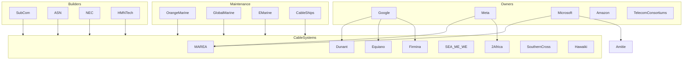

Absolutely. Once you start mapping submarine cables, you realize that the Internet isn't just:

```text
USA <-> Europe <-> Asia
```

It's actually a dense web of:

* Transatlantic systems
* Transpacific systems
* Africa-Europe systems
* Middle East transit corridors
* South America systems
* Arctic routes (emerging)
* Regional coastal systems

And many of the "Internet hubs" exist because cables land there.

---

# How South America Connects To The Internet

Many people assume South America routes through North America.

Historically this was often true.

Today:

```text
Brazil
  |
  +---- USA
  |
  +---- Europe
  |
  +---- Africa
```

---

## Major South American Hubs

```text
Fortaleza, Brazil
São Paulo, Brazil
Rio de Janeiro, Brazil
Santos, Brazil

Valparaíso, Chile

Buenos Aires, Argentina

Cartagena, Colombia
```

Fortaleza is especially important because many transatlantic cables land there.

---

# Major Modern Submarine Cable Systems

## MAREA

Classification:

```text
Transatlantic Cable
Hyperscaler-Owned Infrastructure
High-Capacity System
```

Owners:

* Microsoft
* Meta
* Telxius

Route:

```text
Virginia Beach
      |
      |
Spain (Bilbao)
```

---

## Dunant

Classification:

```text
Transatlantic Cable
Private Hyperscaler System
```

Owner:

* Google

Route:

```text
Virginia Beach
      |
      |
France
```

---

## Equiano

Classification:

```text
Africa-Europe Cable
Hyperscaler-Owned Infrastructure
```

Owner:

* Google

Route:

```text
Portugal
   |
West Africa
   |
South Africa
```

---

## 2Africa

Classification:

```text
Pan-African Cable System
Global Connectivity Platform
```

Owners include:

* Meta
* China Mobile
* Orange
* Vodafone
* MTN
* Others

Route:

```text
Europe
  |
Africa
  |
Middle East
```

One of the largest cable projects ever built.

---

## SEA-ME-WE Systems

Classification:

```text
Intercontinental Cable System
Europe-Asia Backbone
```

SEA-ME-WE stands for:

```text
South East Asia
Middle East
Western Europe
```

Critical for Europe ↔ Asia traffic.

---

# Additional Major Systems You're Missing

## Amitié

Classification:

```text
Transatlantic Cable
Hyperscaler Infrastructure
```

Owners:

* Meta
* Microsoft
* Vodafone

Route:

```text
USA
 |
UK
 |
France
```

---

## Grace Hopper

Classification:

```text
Transatlantic Cable
Hyperscaler-Owned System
```

Owner:

* Google

Route:

```text
USA
 |
UK
 |
Spain
```

---

## Firmina

Classification:

```text
Transatlantic / South America Cable
Hyperscaler-Owned Infrastructure
```

Owner:

* Google

Route:

```text
USA
 |
Brazil
 |
Argentina
 |
Uruguay
```

Very important for South America.

---

## Curie

Classification:

```text
Pacific Cable System
Hyperscaler Infrastructure
```

Owner:

* Google

Route:

```text
California
 |
Chile
```

Direct Pacific connection to South America.

---

## JUNO

Classification:

```text
Pacific Cable System
Japan-Americas Connectivity
```

Connects:

```text
Japan
 |
United States
```

---

## FASTER

Classification:

```text
Transpacific Cable
Hyperscaler Consortium System
```

Connects:

```text
USA
 |
Japan
```

---

## Southern Cross

Classification:

```text
Pacific Backbone System
Oceania Connectivity Platform
```

Connects:

```text
USA
Australia
New Zealand
Fiji
```

One of the most important Pacific systems.

---

## Hawaiki

Classification:

```text
Pacific Cable System
Oceania Backbone
```

Connects:

```text
USA
Hawaii
Australia
New Zealand
```

---

# Global Cable Geography

If I were making a map I'd divide it like this.

---

## North Atlantic

```text
MAREA
Dunant
Grace Hopper
Amitié
AEConnect
Apollo
```

Connects:

```text
USA
UK
France
Spain
Ireland
Germany
Netherlands
```

---

## South Atlantic

```text
Ellalink
SACS
Firmina
```

Connects:

```text
Brazil
Portugal
Africa
```

Ellalink is especially important because it provides:

```text
Brazil
   |
Portugal

WITHOUT
routing through North America
```

---

## Pacific

```text
FASTER
JUNO
Southern Cross
Hawaiki
Curie
```

Connects:

```text
USA
Japan
Australia
New Zealand
Chile
```

---

## Europe → Middle East → Asia

```text
SEA-ME-WE
AAE-1
IMEWE
```

These carry enormous volumes of traffic.

---

## Africa

```text
2Africa
Equiano
EASSy
WACS
SAT-3
SEACOM
```

These systems transformed African connectivity.

---

# Major Cable Operators

These deserve their own section.

---

## SubCom

Classification:

```text
Submarine Cable Builder
Marine Engineering Contractor
Cable Maintenance Operator
```

One of the largest cable construction companies in the world.

---

## Alcatel Submarine Networks (ASN)

Classification:

```text
Submarine Cable Builder
Marine Infrastructure Operator
```

Built many of the world's largest cable systems.

---

## NEC

Classification:

```text
Submarine Cable Builder
Marine Network Contractor
```

Particularly strong in Asia-Pacific projects.

---

## HMN Tech

Classification:

```text
Submarine Cable Builder
Global Marine Infrastructure Provider
```

Formerly Huawei Marine.

---

# Cable Repair & Maintenance Organizations

These are often forgotten despite being critical.

---

## Global Marine Group

Classification:

```text
Cable Repair Operator
Marine Engineering Provider
Subsea Infrastructure Contractor
```

Operates specialized repair ships.

---

## Orange Marine

Classification:

```text
Cable Repair Operator
Subsea Engineering Provider
Cable Installation Contractor
```

One of the most important cable maintenance operators globally.

---

## E-Marine

Classification:

```text
Cable Repair Operator
Marine Infrastructure Contractor
Middle East Cable Specialist
```

Major player in Europe-Middle East-Asia routes.

---

# Specialized Cable Ships

These vessels are literally part of the Internet.

Examples:

```text
CS Pierre de Fermat
CS René Descartes
CS Leon Thévenin
CS Cable Innovator
CS Durable
```

Classification:

```text
Submarine Cable Repair Vessel
Marine Infrastructure Asset
```

---

# Submarine Cable Ecosystem Diagram



One thing you'll notice when you finish your global map: **Egypt, Portugal, Singapore, Marseille, Fortaleza, Virginia Beach, Tokyo, Hong Kong, and Dubai keep appearing over and over.** Those aren't just cities—they are some of the most important cable landing and interconnection hubs in the world, and much of the Internet's global traffic flows through them.
